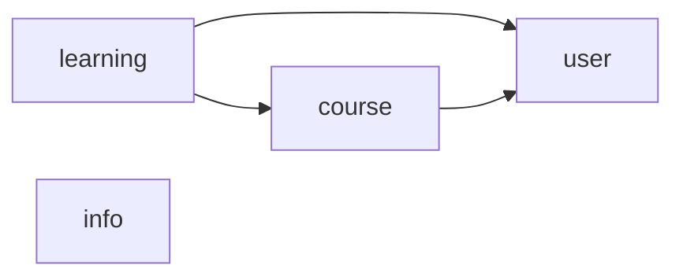

# Tài liệu thiết kế hệ thống E-Learning

Thiết kế backend dựng từ `docs/srs.pdf`. Mỗi thư mục module có 3 file:

- `use-case.md`: kịch bản use case (luồng chính, ngoại lệ) và test case.
- `api.md`: bảng endpoint và biểu đồ tuần tự.
- `lopthucthe.md`: entity, enum, DTO và biểu đồ lớp.

File này gom phần dùng chung cho cả 5 module: quy ước, cách hiểu những chỗ SRS mập mờ hoặc mâu thuẫn, và các lỗi đã biết
trong SRS. Khi tài liệu module khác với SRS, làm theo mục [3. Cách hiểu SRS](#3-cách-hiểu-srs).

## 1. Module

| Thư mục | Use case | Package code |
|---|---|---|
| `auth-profile/` | UC001 Đăng nhập, UC002 Thay đổi mật khẩu, UC003 Thiết lập lại mật khẩu, UC004 Đăng ký, UC005 Cập nhật thông tin cá nhân | `com.elearning.user` |
| `user-management/` | UC006 Tìm kiếm giảng viên, học viên; UC008 Quản lý giảng viên; UC010 Quản lý học viên | `com.elearning.user` |
| `course-management/` | UC007 (tìm khóa học, bài giảng, thể loại); UC009 Quản lý khóa học; UC011 Quản lý bài giảng; UC015 Quản lý thể loại khóa học | `com.elearning.course` |
| `learning/` | UC007 (tìm lịch sử khóa học); UC014 Xem lịch sử khóa học và thông tin học viên; UC016 Sử dụng chức năng hệ thống của học viên | `com.elearning.learning` |
| `info-management/` | UC007 (tìm tin tức, FAQ); UC012 Quản lý tin tức; UC013 Quản lý câu hỏi thường gặp | `com.elearning.info` |

Chiều phụ thuộc giữa các package, không có vòng (rule 2.2):

- Module gọi nhau qua interface `<Domain>Service`, không import repository hay entity của module khác.
- Mọi kiểm tra "học viên đã ghi danh chưa" nằm ở `learning`. Vì vậy các endpoint học viên dùng để học bài thuộc `learning`;
  `course` chỉ phục vụ giảng viên quản lý nội dung và Khách, học viên xem khóa học công khai.

## 2. Quy ước chung

### 2.1 URL và response

- Không có tiền tố `/api/v1`: `application.yaml` chưa cấu hình context-path và `SecurityConfig` mở thẳng `/auth/...`.
  Ví dụ: `POST /auth/login`.
- Thành công: `ApiResponse<T>` dạng `{success, data, msg}`. Lỗi: `ErrorResponse` dạng
  `{success: false, error: {code, message, fields, detail}}`, do `GlobalExceptionHandler` tạo.
- Danh sách phân trang: `data = {items, meta: {page, page_size, total_items, total_pages}}`, kiểu Java
  `PageResponse<T>(List<T> items, PageMeta meta)` (sẽ tạo ở `common/response/`, cạnh `PageMeta`). Query param theo
  `PageRequestParams`: `page` (mặc định 1), `page_size` (mặc định 20, tối đa 100), `sort_by`, `sort_order` (`asc` hoặc
  `desc`, mặc định `desc`).
- JSON body và query param dùng `snake_case`; code Java dùng `camelCase` (Jackson tự chuyển).
- Danh sách rỗng vẫn trả 200 với `items: []`. Các thông báo "không có bản ghi nào" của SRS (luồng 2a, 5a, 6a) do client hiển thị.
- Xóa thành công trả 200 với `data: null`.

### 2.2 Định danh và thời gian

- Mọi id là `UUID` (`AssignedIdEntity`). SRS ghi id là số nguyên (Bảng 2-22 đến 2-25) nhưng hệ thống dùng UUID.
- `createdAt`, `updatedAt`, `deletedAt` kiểu `Instant`. Các ngày (ngày sinh, ngày bắt đầu, ngày kết thúc) kiểu `LocalDate`,
  JSON dạng `yyyy-MM-dd`.

### 2.3 Vai trò và phân quyền

| Role | Tác nhân trong SRS |
|---|---|
| `ADMIN` | Quản trị viên (QTV) |
| `TEACHER` | Giảng viên (GV) |
| `STUDENT` | Học viên (HV) |
| (không có token) | Khách |

- Chặn theo vai trò tại controller bằng `@PreAuthorize("hasRole('...')")`. Sai vai trò → 403 `FORBIDDEN`.
- Quyền sở hữu kiểm tra ở service bằng truy vấn kép (`findByIdAndTeacherId`, `findByIdAndUserId`...). Không phải chủ sở hữu
  → 404 `NOT_FOUND`, để không lộ dữ liệu của người khác (rule 2.9).
- Đăng ký (UC004) luôn tạo `STUDENT`. `TEACHER` do QTV tạo (UC008). `ADMIN` được tạo bằng dữ liệu khởi tạo, SRS không có
  chức năng tạo QTV.

### 2.4 Enum dùng chung

Mọi enum trong entity dùng `@Enumerated(EnumType.STRING)`.

| Enum | Giá trị | Dùng ở |
|---|---|---|
| `Role` | `ADMIN`, `TEACHER`, `STUDENT` | `User.role` |
| `Gender` | `MALE`, `FEMALE`, `OTHER` | `User.gender` |
| `UserStatus` | `ACTIVE`, `LOCKED` | `User.status` |
| `CourseStatus` | `PUBLIC`, `PRIVATE` | `Course.status` |
| `SubmissionStatus` | `DRAFT`, `SUBMITTED` | `Submission.status` |

### 2.5 Xóa mềm

- Mọi thao tác "Xóa" trong SRS là xóa mềm: gán `deletedAt = now`, không xóa bản ghi.
- Entity có xóa mềm: `User`, `Category`, `Course`, `Lecture`, `Exercise`, `Question`, `Answer`, `News`, `Faq`, `Comment`.
  Mỗi entity gắn `@SQLRestriction("deleted_at IS NULL")` để mọi truy vấn JPA tự bỏ qua bản ghi đã xóa.
- Ràng buộc unique chỉ tính trên bản ghi chưa xóa (unique index có điều kiện `WHERE deleted_at IS NULL`). Ví dụ: email của
  tài khoản đã xóa được dùng để đăng ký lại.
- Bảng ghi nhận không xóa mềm: `Enrollment`, `LectureCompletion`, `Submission`, `SubmissionAnswer`, `PasswordResetToken`.
- Dữ liệu tham chiếu tới bản ghi đã xóa được giữ nguyên. Khóa học của giảng viên đã xóa vẫn còn và QTV vẫn xem được ở lịch
  sử khóa học. Ghi danh, bài làm, bình luận của học viên đã xóa vẫn còn. Khi cần hiển thị tên của người đã xóa, `UserService`
  đọc bằng native query để bỏ qua `@SQLRestriction`.

### 2.6 Upload ảnh

- Ảnh đi qua endpoint riêng, `multipart/form-data`, field `file`: `PUT /users/me/avatar`, `PUT /admin/teachers/{id}/avatar`,
  `PUT /courses/{id}/image`.
- Chỉ nhận png, gif, jpg, jpeg; kiểm tra cả đuôi file lẫn content type. Sai định dạng → 400 `FILE_TYPE_NOT_SUPPORTED`.
- Giới hạn dung lượng cấu hình qua `spring.servlet.multipart.max-file-size`.
- File lưu qua `FileStorageService` (sẽ tạo ở `common/storage/`), thư mục lưu cấu hình bằng `@ConfigurationProperties`
  prefix `app.storage`. Entity chỉ lưu URL trả về (`avatarUrl`, `imageUrl`).

### 2.7 Mã lỗi

Lỗi nghiệp vụ ném `BusinessException(ErrorCode)` (rule 2.12), không dùng exception của Spring hay exception không có
`ErrorCode`.

Mã có sẵn trong `ErrorCode`, dùng chung:

| Mã | HTTP | Khi nào |
|---|---|---|
| `VALIDATION_ERROR` | 400 | Bean Validation trượt (kèm `fields`) hoặc dữ liệu sai quy tắc nghiệp vụ đơn giản |
| `UNAUTHENTICATED` | 401 | Thiếu token |
| `TOKEN_EXPIRED`, `TOKEN_INVALID` | 401 | Token hết hạn hoặc không hợp lệ |
| `AUTH_ACCOUNT_BLOCKED` | 403 | Tài khoản bị khóa hoặc đã xóa trong lúc token còn hạn (`BlacklistedUserModel`) |
| `FORBIDDEN` | 403 | Sai vai trò (`@PreAuthorize`) |
| `NOT_FOUND` | 404 | Không tồn tại, đã xóa, hoặc không thuộc quyền sở hữu; ghi đè câu thông báo theo ngữ cảnh |

Mã mới, cần thêm vào `ErrorCode` khi code:

| Mã | HTTP | Module |
|---|---|---|
| `FILE_TYPE_NOT_SUPPORTED` | 400 | dùng chung |
| `AUTH_PASSWORD_CONFIRM_MISMATCH` | 400 | auth-profile |
| `COURSE_CATEGORY_NAME_EXISTS` | 409 | course-management |
| `COURSE_CATEGORY_IN_USE` | 409 | course-management |
| `COURSE_DATE_RANGE_INVALID` | 400 | course-management |
| `EXERCISE_ANSWER_INVALID` | 400 | course-management |
| `ENROLLMENT_ALREADY_EXISTS` | 409 | learning |
| `ENROLLMENT_REQUIRED` | 403 | learning |
| `COURSE_NOT_STARTED` | 403 | learning |
| `SUBMISSION_INCOMPLETE` | 400 | learning |
| `SUBMISSION_ALREADY_SUBMITTED` | 409 | learning |

## 3. Cách hiểu SRS

Những chỗ SRS chưa quy định, mập mờ hoặc tự mâu thuẫn, và cách thiết kế này hiểu.

| # | Chỗ SRS | Cách hiểu |
|---|---|---|
| QĐ1 | Trạng thái Private của khóa học (Bảng 2-19, hậu điều kiện UC009) | `PRIVATE` là ẩn với Khách và học viên: không hiện khi tìm kiếm hay xem chi tiết, không đăng ký được. Học viên đã ghi danh cũng không vào học được tới khi khóa học `PUBLIC` lại. Giảng viên chủ khóa học và QTV vẫn thấy |
| QĐ2 | Ai được xem tin tức, FAQ (UC012, UC013) | Theo SRS: chỉ QTV đã đăng nhập. Không có trang tin tức, FAQ công khai |
| QĐ3 | Xóa khi còn dữ liệu phụ thuộc (UC008, UC009, UC010, UC011, UC012, UC013) | Xóa mềm, giữ nguyên dữ liệu liên quan (mục 2.5). Riêng thể loại vẫn theo SRS: chỉ xóa được khi không còn khóa học nào |
| QĐ4 | Ảnh định dạng png, gif, jpg, jpeg (Bảng 2-8, 2-17, 2-19) | Upload multipart ở endpoint riêng (mục 2.6) |
| A1 | Bảng 2-19 không có thể loại, giá, mã khóa học, trong khi UC015 và Bảng 2-13 cần các trường này | Khóa học có `categoryId` (bắt buộc), `price` (≥ 0, VND, tùy chọn, mặc định 0) và `code` do hệ thống sinh dạng `CO` + 6 chữ số, không trùng |
| A2 | Bảng 2-22 không có trường "thuộc khóa học nào"; "Id bài giảng" lại là trường nhập | `courseId` lấy từ URL. Mọi id do hệ thống sinh |
| A3 | Bảng 2-17 có "Kiểu người dùng: 1 Admin, 2 Giảng viên" trong UC quản lý giảng viên | QTV chỉ tạo được role `TEACHER`; request không có trường kiểu người dùng |
| A4 | Bảng 2-17 bắt buộc mật khẩu cho cả thêm và sửa | Bắt buộc khi thêm, tùy chọn khi sửa (bỏ trống thì giữ mật khẩu cũ) |
| A5 | Ghi chú UC002: QTV, GV đổi mật khẩu trong form cập nhật thông tin, nhưng Bảng 2-8 không có trường mật khẩu | `ProfileUpdateRequest` có `password`, `confirmPassword` tùy chọn, chỉ `ADMIN`, `TEACHER` được gửi. `STUDENT` đổi qua `PUT /users/me/password`, phải nhập mật khẩu cũ |
| A6 | UC003 thiếu bước đặt mật khẩu mới; luồng 5a chép từ UC002 | Thêm bước đặt mật khẩu mới bằng token trong link (hạn 60 phút, dùng một lần). Luồng 5a hiểu là "email sai định dạng hoặc không tồn tại" |
| A7 | Khóa/mở khóa giảng viên, học viên và Public/Private khóa học chỉ có ở hậu điều kiện, không có luồng | Là thao tác sửa trạng thái: giảng viên qua `TeacherUpdateRequest.status`, học viên qua `PUT /admin/students/{id}/status`, khóa học qua `CourseUpdateRequest.status` |
| A8 | Mô tả UC010 ghi "thêm, sửa, xóa, tìm kiếm tài khoản giảng viên" | Theo các luồng: UC010 chỉ có tìm, xem, xóa và khóa/mở khóa học viên |
| A9 | UC007 chỉ ghi tác nhân QTV, GV; UC015 trỏ sang UC007 nhưng UC007 không có bảng tìm thể loại | Khách và học viên được tìm khóa học (Bảng 2-13, trừ trường trạng thái). Thể loại được tìm theo tên |
| A10 | UC016 có tiền điều kiện "đã đăng nhập" nhưng gồm cả Đăng nhập, Quên mật khẩu; luồng thay thế số 3 thực ra là bước thành công | UC016 không gồm Đăng nhập, Đổi và Đặt lại mật khẩu (đã có ở UC001–UC003). Thêm ngoại lệ "đã ghi danh khóa này" |
| A11 | Giới tính: Bảng 2-10 ghi `Male/Female/Nothing`, Bảng 2-8 và 2-17 ghi `Male/Female/Other` | `Gender` = `MALE`, `FEMALE`, `OTHER` |

Các quy ước thiết kế khác ở những chỗ SRS không nói:

- Mỗi câu hỏi có đúng 4 đáp án và đúng 1 đáp án đúng (Bảng 2-25).
- Mỗi bài tập học viên nộp một lần; sau khi nộp không sửa được đáp án.
- Bài giảng chỉ mở cho học viên từ ngày bắt đầu của khóa học (UC016 luồng 4a).
- Bình luận được trả lời một cấp.
- Tiến độ khóa học = số bài giảng đã xác nhận hoàn thành / tổng số bài giảng hiện có, tính khi đọc.

## 4. Lỗi đã biết trong SRS

Lỗi chép nhầm hoặc đánh máy, không ảnh hưởng thiết kế. Đọc theo cột "Đúng ra".

| Vị trí | SRS ghi | Đúng ra |
|---|---|---|
| UC013 (tr.37–39) | Sự kiện kích hoạt, 4 luồng và hậu điều kiện ghi "tin tức", "Create News", "menu News" (chép từ UC012) | Câu hỏi thường gặp (FAQ) |
| UC016 (tr.42) | "Cập nhật thông tin cá nhân: UC006" | UC005 |
| Bảng 2-32 (tr.41) | Tiêu đề "Dữ liệu câu hỏi thường gặp" | Dữ liệu thể loại khóa học |
| UC009 tìm kiếm, bước 5 và 5a (tr.28) | "thông tin những người dùng" | khóa học |
| UC009 sửa, bước 1 (tr.29) | "Chọn một chức năng" | Chọn một khóa học |
| UC011 xóa bài giảng, bước 3 (tr.33) | "Xác nhận xoá khóa học" | Xác nhận xóa bài giảng |
| UC010 xóa, bước 2 (tr.31) | "quản trị viên, giảng viên xác nhận" | Chỉ QTV |
| UC001 (tr.19), UC004 (tr.22) | Số hiệu luồng thay thế lệch một bước (6a ứng với bước kiểm tra số 5...) | 5a, 6a... |
| UC008, UC009, UC012, bước xác nhận xóa | Tác nhân ghi "Người dùng" | QTV hoặc GV |
| Rải rác | "Passwork", "ký tứ", "đings"; trang bìa còn `<Tên Đề Tài>`, `<author>`, `<date created>` | — |
