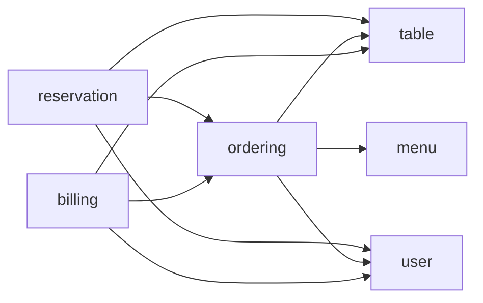
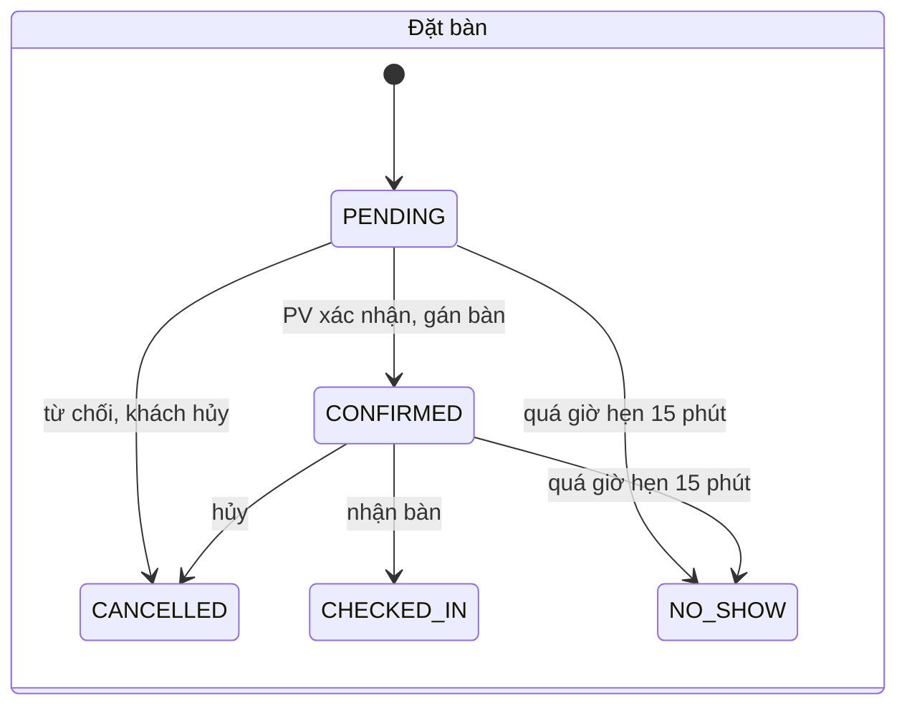
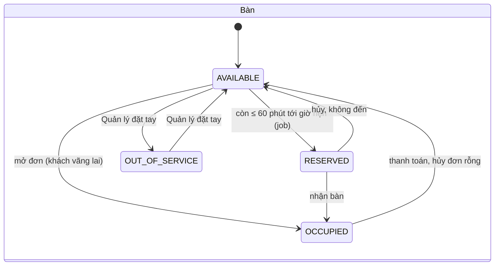
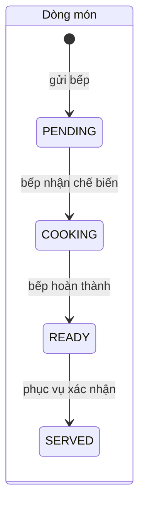
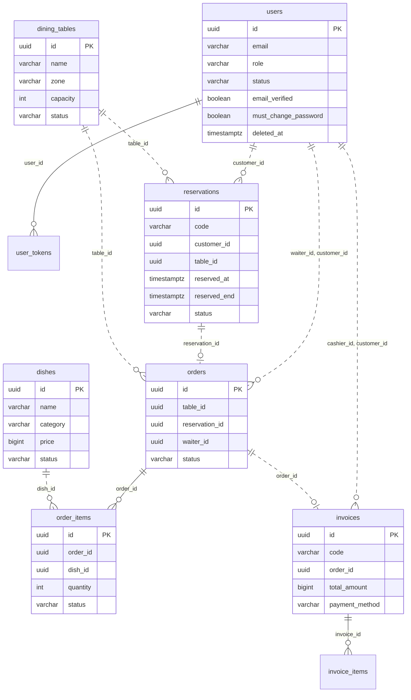

# Tài liệu thiết kế hệ thống quản lý nhà hàng

Thiết kế backend dựng từ `docs/srs-restaurant.md`. Mỗi thư mục module có 3 file:

- `use-case.md`: kịch bản use case (luồng chính, ngoại lệ) và test case.
- `api.md`: bảng endpoint và biểu đồ tuần tự.
- `lopthucthe.md`: entity, enum, DTO và biểu đồ lớp.

File này gom phần dùng chung cho cả 7 module: module và chiều phụ thuộc, quy ước, vai trò và phân quyền, enum, mã lỗi, cấu
hình, CSDL tổng thể, cách hiểu những chỗ SRS mập mờ và các lỗi đã biết trong SRS. Khi tài liệu module khác với SRS, làm theo
mục [3. Cách hiểu SRS](#3-cách-hiểu-srs).

## 1. Module

Các module nghiệp vụ nằm dưới `com.restaurant.modules.<module>`; hạ tầng dùng chung nằm ở `com.restaurant.common`
(security, exception, response, storage, mail, idempotency, rate-limit, logging).

| Thư mục | Package (`com.restaurant.modules.`) | Use case |
|---|---|---|
| `auth-profile/` | `user` | UC001 Đăng nhập, UC002 Đăng ký, UC003 Thay đổi mật khẩu, UC004 Thiết lập lại mật khẩu, UC005 Cập nhật thông tin cá nhân |
| `user-management/` | `user` | UC006 Tìm kiếm nhân viên, khách hàng; UC008 Quản lý nhân viên; UC009 Quản lý khách hàng |
| `menu-management/` | `menu` | UC007 (tìm món ăn); UC010 Quản lý món ăn; UC012 Xem thực đơn |
| `table-management/` | `table` | UC007 (tìm bàn); UC011 Quản lý bàn |
| `reservation/` | `reservation` | UC007 (tìm đặt bàn); UC013 Đặt bàn trực tuyến; UC014 Quản lý đặt bàn; UC017 (phần lịch sử đặt bàn và hủy đặt bàn) |
| `ordering/` | `order` | UC015 Gọi món; UC016 Xử lý món ăn |
| `billing/` | `billing` | UC007 (tìm hóa đơn); UC017 (phần hóa đơn của tôi); UC018 Thanh toán và xuất hóa đơn; UC019 Xem lịch sử hóa đơn; UC020 Xem báo cáo doanh thu |

Chiều phụ thuộc giữa các package, không có vòng (rule 2.2). Mũi tên `A --> B` nghĩa là `A` gọi `BService`:



- Module gọi nhau qua interface `<Domain>Service`, không import repository hay entity của module khác. `ArchitectureTest`
  kiểm tra cả hướng phụ thuộc ở sơ đồ trên.
- `user`, `menu`, `table` là module nền, không được gọi ngược lên `reservation`, `order`, `billing`.
- Entity chỉ giữ id thuần của module khác (`table_id`, `customer_id`, `dish_id`...), không có `@ManyToOne` xuyên module.
  Cơ sở dữ liệu cũng không đặt khóa ngoại giữa bảng của hai module.

### 1.1 Chặn xoá xuyên module bằng "guard"

Một số nghiệp vụ xóa phải biết dữ liệu của module phía trên (xóa bàn phải biết còn đặt bàn không), nhưng module nền không được
gọi ngược lên. Cách giải: module sở hữu dữ liệu định nghĩa interface, module có dữ liệu liên quan implement; service xóa nhận
`List<...Guard>` và gọi hết trước khi xóa.

| Interface (nằm trong `service/` của) | Implement bởi | Chặn khi |
|---|---|---|
| `UserDeletionGuard` (`user`) | `reservation`, `order`, `billing` | Khách hàng còn đặt bàn `PENDING` hoặc `CONFIRMED` (UC009 4a); nhân viên đã có đơn hàng hoặc hóa đơn (UC008 4a) |
| `DishDeletionGuard` (`menu`) | `order` | Món đã nằm trong `order_items` (UC010 4a) |
| `TableDeletionGuard` (`table`) | `reservation`, `order` | Đặt bàn `CONFIRMED` gán cho bàn mà chưa hết khung giờ, hoặc bàn còn đơn `OPEN` (UC011 4a); bàn `OCCUPIED` do `table` tự kiểm |

`TableDeletionGuard` có thêm `maxGuestCountAssigned(tableId)` để chặn giảm sức chứa bàn xuống thấp hơn số khách của đặt bàn
đang gán cho bàn (UC011 4b).

## 2. Quy ước chung

### 2.1 URL và response

- Không có tiền tố `/api/v1`: `application.yaml` chưa cấu hình context-path và `SecurityConfig` mở thẳng `/auth/...`.
  Ví dụ: `POST /auth/login`.
- Thành công: `ApiResponse<T>` dạng `{success, data, msg}`. Lỗi: `ErrorResponse` dạng
  `{success: false, error: {code, message, fields, detail}}`, do `GlobalExceptionHandler` tạo.
- Danh sách phân trang: `data = {items, meta: {page, page_size, total_items, total_pages}}`, kiểu Java
  `PageResponse<T>(List<T> items, PageMeta meta)` (có sẵn ở `common/response/`). Query param theo `PageRequestParams`:
  `page` (mặc định 1), `page_size` (mặc định 20, tối đa 100), `sort_by`, `sort_order` (`asc` hoặc `desc`, mặc định `desc`).
- JSON body và query param dùng `snake_case`; code Java dùng `camelCase` (Jackson tự chuyển).
- Danh sách rỗng vẫn trả 200 với `items: []`. Các thông báo "chưa có bản ghi nào" của SRS (luồng 2a, 5a...) do client hiển thị.
- Xóa thành công trả 200 với `data: null`. Tạo mới trả 201.
- Resource là danh từ số nhiều `kebab-case`; nhúng tối đa 2 cấp (rule 2.8). Hành động đổi trạng thái là `PUT .../{id}/<hành-động>`.
- Endpoint của riêng người đăng nhập đặt dưới `/users/me` hoặc `/me/...`; endpoint quản trị của Quản lý đặt dưới `/admin/...`.
- Các POST tạo mới có rủi ro ghi trùng nếu client gửi lại (tạo đặt bàn, mở bàn, thanh toán) gắn `@Idempotent` của
  `common/idempotency`: client gửi header `Idempotency-Key`. Không gắn lên `POST /auth/login`.

### 2.2 Định danh, thời gian và tiền

- Mọi id là `UUID` (`AssignedIdEntity`). Riêng `code` của đặt bàn và hóa đơn là mã đọc được (mục 2.9), không thay id.
- `createdAt`, `updatedAt`, `deletedAt`, `reservedAt`, `paidAt`... kiểu `Instant`, lưu `timestamptz`, JSON dạng ISO-8601
  (VD `2026-10-12T19:00:00+07:00`; server chấp nhận mọi offset, trả về `Z`).
- Ngày (ngày sinh, `from_date`, `to_date`) kiểu `LocalDate`, JSON `yyyy-MM-dd`. "Hôm nay", giờ mở cửa, "ngày làm việc" tính theo
  múi giờ `app.timezone` (mặc định `Asia/Ho_Chi_Minh`, đã có `ClockConfig`). Mọi so sánh thời gian lấy từ bean `Clock`, không gọi
  `Instant.now()` trực tiếp, để test thay được đồng hồ.
- Tiền là VND, số nguyên, kiểu `long` (không có phần thập phân). VAT làm tròn `HALF_UP` đến đồng.
- Entity có `created_at`, `updated_at` do Hibernate gán lúc flush; service flush trước khi trả response để hai trường này không
  `null` ngay sau khi tạo hoặc sửa.

### 2.3 Vai trò và phân quyền

| `Role` | Tác nhân trong SRS | Cách tạo |
|---|---|---|
| `CUSTOMER` | Khách hàng | Tự đăng ký (UC002) |
| `WAITER` | Nhân viên phục vụ | Quản lý tạo (UC008) |
| `CASHIER` | Thu ngân | Quản lý tạo |
| `CHEF` | Bếp | Quản lý tạo |
| `MANAGER` | Quản lý | Quản lý tạo; tài khoản đầu tiên tạo lúc khởi động từ `APP_ADMIN_EMAIL`, `APP_ADMIN_PASSWORD` (chỉ khi chưa có `MANAGER` nào) |
| (không có token) | Khách | — |

- Chặn theo vai trò tại controller bằng `@PreAuthorize("hasRole('...')")`. Sai vai trò → 403 `FORBIDDEN`.
- Quyền sở hữu kiểm tra ở service bằng truy vấn kép (`findByIdAndCustomerId`...). Khách hàng xem đặt bàn, hóa đơn của người
  khác → 404 `NOT_FOUND`, không lộ sự tồn tại (rule 2.9).
- `permitAll` trong `SecurityConfig`: `/auth/register|login|verify-email|resend-verification|forgot-password|reset-password`,
  `/files/**`, `GET /menu/dishes`, `GET /menu/dishes/{id}`, `GET /reservations/availability`, `POST /reservations`.
  `POST /reservations` đọc `SecurityContextUtil.currentUserIdOrNull()` để gắn tài khoản khi khách đã đăng nhập.
- Phân quyền theo Bảng 3-1 của SRS, cụ thể hóa thành endpoint:

| Nhóm chức năng | Khách | CUSTOMER | WAITER | CASHIER | CHEF | MANAGER |
|---|---|---|---|---|---|---|
| Xem thực đơn (`/menu/**`) | ✔ | ✔ | ✔ | ✔ | ✔ | ✔ |
| Đăng ký, đăng nhập, quên mật khẩu | ✔ | — | — | — | — | — |
| Đặt bàn trực tuyến (`POST /reservations`, `GET /reservations/availability`) | ✔ | ✔ | — | — | — | — |
| Lịch sử đặt bàn, hóa đơn của mình (`/me/**`) | — | ✔ | — | — | — | — |
| Đổi mật khẩu, thông tin cá nhân (`/users/me/**`) | — | ✔ | ✔ | ✔ | ✔ | ✔ |
| Quản lý đặt bàn (`/reservations/**` trừ hai endpoint công khai) | — | — | ✔ | — | — | ✔ |
| Xem sơ đồ bàn (`GET /tables`) | — | — | ✔ | ✔ | — | ✔ |
| Gọi món, xác nhận đã phục vụ (`POST/DELETE /orders/**`, `/order-items/**`) | — | — | ✔ | — | — | — |
| Xem đơn hàng (`GET /orders`, `GET /orders/{id}`) | — | — | ✔ | ✔ | — | — |
| Xử lý món ăn (`/kitchen/**`) | — | — | — | — | ✔ | — |
| Thanh toán và xuất hóa đơn (`POST /invoices`, `GET /billing/**`) | — | — | — | ✔ | — | — |
| Xem lịch sử hóa đơn (`GET /invoices/**`) | — | — | — | ✔ (trong ngày) | — | ✔ (toàn bộ) |
| Quản lý nhân viên, khách hàng, món ăn, bàn (`/admin/**`, `/dishes/**`, `/tables/**` ghi) | — | — | — | — | — | ✔ |
| Xem báo cáo doanh thu (`/reports/**`) | — | — | — | — | — | ✔ |

### 2.4 Enum dùng chung

Mọi enum trong entity dùng `@Enumerated(EnumType.STRING)` (rule 2.3); cột CSDL có `CHECK` liệt kê đủ giá trị.

| Enum | Giá trị | Dùng ở |
|---|---|---|
| `Role` | `CUSTOMER`, `WAITER`, `CASHIER`, `CHEF`, `MANAGER` | `User.role` |
| `Gender` | `MALE`, `FEMALE`, `OTHER` | `User.gender` |
| `UserStatus` | `ACTIVE` (Unlocked), `LOCKED` | `User.status` |
| `UserTokenType` | `EMAIL_VERIFICATION`, `PASSWORD_RESET` | `UserToken.type` |
| `DishCategory` | `APPETIZER` (Khai vị), `MAIN_COURSE` (Món chính), `DRINK` (Đồ uống), `DESSERT` (Tráng miệng) | `Dish.category` |
| `DishStatus` | `AVAILABLE` (Đang bán), `OUT_OF_STOCK` (Hết món), `DISCONTINUED` (Ngừng bán) | `Dish.status` |
| `TableZone` | `INDOOR` (Trong nhà), `OUTDOOR` (Ngoài trời), `VIP_ROOM` (Phòng VIP), `SECOND_FLOOR` (Tầng 2) | `DiningTable.zone`, `Reservation.preferredZone` |
| `TableStatus` | `AVAILABLE` (Trống), `RESERVED` (Đã đặt), `OCCUPIED` (Đang phục vụ), `OUT_OF_SERVICE` (Tạm khóa) | `DiningTable.status` |
| `ReservationStatus` | `PENDING` (Chờ xác nhận), `CONFIRMED` (Đã xác nhận), `CHECKED_IN` (Đã nhận bàn), `CANCELLED` (Đã hủy), `NO_SHOW` (Không đến) | `Reservation.status` |
| `OrderStatus` | `OPEN` (Đang phục vụ), `CLOSED` (Đã đóng) | `Order.status` |
| `OrderItemStatus` | `PENDING` (Chờ chế biến), `COOKING` (Đang chế biến), `READY` (Đã xong), `SERVED` (Đã phục vụ), `CANCELLED` | `OrderItem.status` |
| `PaymentMethod` | `CASH` (Tiền mặt), `CARD` (Thẻ), `BANK_TRANSFER` (Chuyển khoản) | `Invoice.paymentMethod` |
| `InvoiceStatus` | `PAID` (Đã thanh toán) | `Invoice.status` |

Máy trạng thái của đặt bàn, bàn và dòng món:







`CANCELLED` của dòng món có trong enum nhưng bản này không có API tạo ra (A8).

### 2.5 Xóa mềm

- Chỉ `User` xóa mềm: gán `deleted_at = now`, vì đơn hàng, hóa đơn, đặt bàn còn tham chiếu tới nhân viên và khách hàng đó.
  Entity gắn `@SQLRestriction("deleted_at IS NULL")` để mọi truy vấn JPA tự bỏ qua bản ghi đã xóa.
- Email duy nhất chỉ tính trên tài khoản chưa xóa (unique index có điều kiện `WHERE deleted_at IS NULL`): email của tài khoản
  đã xóa được dùng để đăng ký lại.
- `Dish`, `DiningTable` xóa cứng, nhưng chỉ khi không còn dữ liệu liên quan (guard, mục 1.1). Hóa đơn và dòng món đã xuất không
  bao giờ xóa.
- Khi cần hiện tên người đã xóa (tên thu ngân trên hóa đơn cũ), `UserService.getUserBriefs` đọc bằng native query để bỏ qua
  `@SQLRestriction`. Hóa đơn còn lưu ảnh chụp `cashier_name` nên không phụ thuộc vào đây.

### 2.6 Upload ảnh

- Ảnh đi qua endpoint riêng, `multipart/form-data`, field `file`: `PUT /users/me/avatar`, `PUT /admin/staff/{id}/avatar`,
  `PUT /dishes/{id}/image`.
- Chỉ nhận png, gif, jpg, jpeg; kiểm tra cả đuôi file lẫn nội dung. Sai định dạng → 400 `FILE_TYPE_NOT_SUPPORTED`.
- Giới hạn dung lượng cấu hình qua `spring.servlet.multipart.max-file-size` (hiện 5MB).
- File lưu qua `FileStorageService.storeImage(file, directory)` (đã có ở `common/storage/`), thư mục con `avatars`, `dishes`.
  Entity chỉ lưu URL trả về (`avatarUrl`, `imageUrl`).

### 2.7 Mã lỗi

Lỗi nghiệp vụ ném `BusinessException(ErrorCode)` (rule 2.12), không dùng exception của Spring hay exception không có `ErrorCode`.

Mã đã có trong `ErrorCode`:

| Mã | HTTP | Khi nào |
|---|---|---|
| `VALIDATION_ERROR` | 400 | Bean Validation trượt (kèm `fields`) hoặc dữ liệu sai quy tắc nghiệp vụ đơn giản |
| `CONCURRENT_MODIFICATION` | 409 | Dữ liệu bị người khác sửa cùng lúc |
| `UNAUTHENTICATED` | 401 | Thiếu token |
| `TOKEN_EXPIRED`, `TOKEN_INVALID` | 401 | Token hết hạn hoặc không hợp lệ |
| `FORBIDDEN` | 403 | Sai vai trò (`@PreAuthorize`) |
| `NOT_FOUND` | 404 | Không tồn tại, đã xóa, hoặc không thuộc quyền sở hữu; ghi đè câu thông báo theo ngữ cảnh |
| `DUPLICATE` | 409 | Vi phạm ràng buộc duy nhất chưa có mã riêng |
| `RATE_LIMIT_EXCEEDED` | 429 | Gọi quá nhanh |
| `REQUEST_IN_PROGRESS` | 409 | Cùng `Idempotency-Key` đang được xử lý |
| `FILE_TYPE_NOT_SUPPORTED` | 400 | Ảnh không phải png, gif, jpg, jpeg |
| `AUTH_PASSWORD_CONFIRM_MISMATCH` | 400 | Mật khẩu xác nhận không trùng |
| `AUTH_EMAIL_ALREADY_EXISTS` | 409 | Email đã có người dùng |
| `AUTH_CREDENTIALS_INVALID` | 401 | Sai email hoặc mật khẩu |
| `AUTH_ACCOUNT_NOT_VERIFIED` | 403 | Khách hàng chưa xác thực email |
| `AUTH_ACCOUNT_BLOCKED` | 403 | Tài khoản bị khóa (lúc đăng nhập, hoặc token còn hạn mà tài khoản vừa bị khóa/xóa) |
| `AUTH_CODE_INVALID` | 400 | Mã trong liên kết xác thực email / đặt lại mật khẩu sai, hết hạn hoặc đã dùng |
| `AUTH_ACCOUNT_ALREADY_VERIFIED` | 400 | Gửi lại liên kết xác thực cho tài khoản đã xác thực |
| `AUTH_OLD_PASSWORD_INCORRECT` | 400 | Mật khẩu cũ sai |
| `AUTH_PASSWORD_SAME_AS_OLD` | 400 | Mật khẩu mới trùng mật khẩu cũ |

Mã mới, thêm vào `ErrorCode` khi code module tương ứng:

| Mã | HTTP | Module | Khi nào |
|---|---|---|---|
| `USER_CANNOT_MODIFY_SELF` | 403 | user-management | Quản lý tự khóa, xóa hoặc đổi vai trò tài khoản của chính mình (UC008 4b, 4a) |
| `USER_HAS_ACTIVITY` | 409 | user-management | Xóa nhân viên đã có đơn/hóa đơn, hoặc khách hàng còn đặt bàn chờ/đã xác nhận (UC008 4a, UC009 4a) |
| `DISH_NAME_EXISTS` | 409 | menu-management | Tên món đã tồn tại trong danh mục (UC010 4b) |
| `DISH_IN_USE` | 409 | menu-management | Xóa món đã xuất hiện trong đơn hàng (UC010 4a) |
| `DISH_NOT_ORDERABLE` | 400 | ordering | Gọi món `OUT_OF_STOCK`/`DISCONTINUED` (UC015 4a) |
| `TABLE_NAME_EXISTS` | 409 | table-management | Tên/số bàn đã tồn tại (UC011 4b) |
| `TABLE_IN_USE` | 409 | table-management | Xóa hoặc tạm khóa (`OUT_OF_SERVICE`) bàn đang phục vụ hoặc còn đặt bàn chưa hoàn tất (UC011 4a) |
| `TABLE_CAPACITY_BELOW_RESERVATION` | 409 | table-management | Giảm sức chứa thấp hơn số khách của đặt bàn đang gán (UC011 4b) |
| `TABLE_STATUS_NOT_EDITABLE` | 409 | table-management | Quản lý đổi trạng thái tay khi bàn đang `RESERVED` hoặc `OCCUPIED` |
| `RESERVATION_TIME_INVALID` | 400 | reservation | Giờ hẹn đã qua, trước giờ mở cửa/sau giờ đóng cửa, đặt trước dưới 2 giờ hoặc quá 30 ngày (UC013 4a) |
| `RESERVATION_NO_TABLE_AVAILABLE` | 409 | reservation | Hết bàn phù hợp (UC013 4b, UC014 2a); `detail` chứa các khung giờ gợi ý |
| `RESERVATION_TABLE_CONFLICT` | 409 | reservation | Bàn vừa được gán cho đặt bàn khác (UC014 4a) |
| `RESERVATION_STATUS_INVALID` | 409 | reservation | Thao tác không hợp lệ với trạng thái hiện tại (UC014 4a hủy, xác nhận, nhận bàn) |
| `RESERVATION_CANCEL_TOO_LATE` | 409 | reservation | Khách hàng hủy khi còn dưới 2 giờ tới giờ hẹn (UC017 4a) |
| `RESERVATION_TABLE_NOT_READY` | 409 | reservation | Nhận bàn nhưng bàn được gán chưa `AVAILABLE`/`RESERVED` (UC014 2a) |
| `ORDER_TABLE_NOT_OPENABLE` | 409 | ordering | Mở đơn cho bàn không ở trạng thái `AVAILABLE` |
| `ORDER_NOT_OPEN` | 409 | ordering | Thao tác lên đơn đã đóng |
| `ORDER_HAS_ITEMS` | 409 | ordering | Hủy đơn đã có dòng món |
| `ORDER_ITEM_STATUS_CONFLICT` | 409 | ordering | Dòng món đã được xử lý trước đó (UC016 4a) |
| `INVOICE_ORDER_EMPTY` | 400 | billing | Thanh toán đơn không có dòng món nào (chưa hủy) |
| `INVOICE_UNSERVED_ITEMS` | 409 | billing | Còn dòng món chưa `SERVED` mà chưa `confirm_unserved` (UC018 2a); `detail.unserved_count` |
| `INVOICE_AMOUNT_INSUFFICIENT` | 400 | billing | Tiền khách đưa nhỏ hơn tổng tiền (UC018 4a) |
| `REPORT_RANGE_INVALID` | 400 | billing | `to_date` trước `from_date`, hoặc khoảng quá 366 ngày (UC020 4a) |

### 2.8 Cấu hình

`@ConfigurationProperties` prefix `app.restaurant` (record `RestaurantProperties`, validate khi khởi động). Giá trị mặc định:

| Khoá | Mặc định | Ý nghĩa |
|---|---|---|
| `open-time`, `close-time` | `10:00`, `22:00` | Giờ mở cửa; giờ hẹn phải nằm trong `[open-time, close-time)` |
| `reservation-duration` | `120m` | Một lượt giữ bàn; `reserved_end = reserved_at + duration` |
| `reservation-hold-before` | `60m` | Còn ≤ khoảng này tới giờ hẹn thì job đổi bàn sang `RESERVED` |
| `no-show-grace` | `15m` | Quá giờ hẹn khoảng này mà chưa nhận bàn thì `NO_SHOW` |
| `booking-min-lead` | `2h` | Đặt trực tuyến phải trước giờ hẹn tối thiểu (Bảng 2-27) |
| `booking-max-ahead-days` | `30` | Đặt trước tối đa (Bảng 2-27) |
| `customer-cancel-min-hours` | `2` | Khách hàng chỉ hủy được khi còn nhiều hơn khoảng này (UC017 4a) |
| `availability-suggestions` | `4` | Số khung giờ gợi ý khi hết bàn, bước 30 phút |
| `vat-rate` | `0.08` | VAT áp trên tổng thành tiền |
| `report-max-days` | `366` | Khoảng thời gian tối đa của báo cáo |

Dùng lại cấu hình có sẵn: `app.timezone`, `app.auth.frontend-url`, `app.auth.reset-token-ttl` (60m), `app.storage.*`,
`jwt.*`. Thêm `app.auth.verify-token-ttl` (24h). Không rải `@Value("${...}")` trong code nghiệp vụ (rule 2.11).

### 2.9 Mã đặt bàn và mã hóa đơn

- Đặt bàn: `DB` + `yyyyMMdd` + `-` + số thứ tự trong ngày 3 chữ số (`DB20261009-001`). Hóa đơn: `HD20261009-015`. Ngày tính theo
  `app.timezone`; số thứ tự quá 999 thì mở rộng thành 4 chữ số.
- Sinh bằng bảng `daily_code_counters (prefix, day, last_value)` với một câu lệnh nguyên tử, không đọc rồi ghi:
  `INSERT ... ON CONFLICT (prefix, day) DO UPDATE SET last_value = daily_code_counters.last_value + 1 RETURNING last_value`.
  Đặt ở `common/code/` (`DailyCodeGenerator`) dùng chung cho `reservation` và `billing`. Mã bị bỏ trống khi transaction rollback là
  chấp nhận được.

### 2.10 Xử lý đồng thời

| Tình huống | Cơ chế |
|---|---|
| Hai nhân viên gán cùng một bàn cho hai đặt bàn trùng giờ (UC014 4a) | Ràng buộc loại trừ Postgres trên `reservations` (mục 4.2); vi phạm → `RESERVATION_TABLE_CONFLICT` |
| Hai bếp cùng nhận một dòng món (UC016 4a) | Cập nhật có điều kiện `UPDATE order_items SET status='COOKING' ... WHERE id=? AND status='PENDING'`; 0 dòng bị ảnh hưởng → `ORDER_ITEM_STATUS_CONFLICT` |
| Hai thu ngân cùng tính tiền một bàn | `SELECT ... FOR UPDATE` trên dòng `orders`; ràng buộc `invoices.order_id` unique làm lớp chặn cuối; người thứ hai nhận `ORDER_NOT_OPEN` |
| Hai phục vụ cùng mở đơn cho một bàn trống | Unique một phần `orders (table_id) WHERE status = 'OPEN'`; người thứ hai nhận `ORDER_TABLE_NOT_OPENABLE` |
| Gửi lại request tạo do mạng chậm | `Idempotency-Key` (mục 2.1) |

Thứ tự khóa khi một transaction phải khóa nhiều bản ghi: `reservations` → `orders` → `dining_tables`, tránh deadlock.

### 2.11 Công việc nền và làm mới màn hình

- **Job nền** (một `@Scheduled(fixedDelay = 60s)` trong `reservation`): xem `reservation/use-case.md` mục 3. Giả định chạy một
  instance backend; nhiều instance cần khóa phân tán (chưa làm).
- **Thông báo thời gian thực = polling.** Màn hình bếp (hàng đợi món) và màn hình phục vụ (món đã xong) gọi lại API danh sách mỗi
  khoảng 5 giây; sơ đồ bàn mỗi 10 giây. Không có SSE hay WebSocket. Email thông báo kết quả đặt bàn gửi qua `EmailService.sendEmail`
  (chỉ khi khách có nhập email), gửi sau khi transaction commit (`@TransactionalEventListener(AFTER_COMMIT)`), lỗi gửi mail chỉ ghi
  log `WARN`, không làm hỏng nghiệp vụ.

## 3. Cách hiểu SRS

Những chỗ SRS chưa quy định, mập mờ hoặc tự mâu thuẫn, và cách thiết kế này hiểu.

| # | Chỗ SRS | Cách hiểu |
|---|---|---|
| A1 | UC014, Bảng 2-24: bàn chuyển `RESERVED` khi xác nhận đặt bàn | Bàn chỉ bị chặn trong **khung giờ đặt**, không khóa cả ngày. Xác nhận chỉ gán bàn vào đặt bàn; trùng giờ kiểm tra theo `[giờ hẹn, giờ hẹn + 120 phút)`; job mới đổi bàn sang `RESERVED` khi còn ≤ 60 phút tới giờ hẹn. Ví dụ đặt 19:00 ngày 30 → khách vãng lai vẫn dùng bàn đó các ngày 1–29 và sáng/trưa ngày 30, từ 18:00 ngày 30 bàn hiện "Đã đặt" |
| A2 | Hình 2-1 có "Đăng xuất" nhưng không có use case | Token stateless (hết hạn sau 1 giờ), client xóa token. **Không có endpoint logout, không có refresh token** |
| A3 | UC013: "kiểm tra còn bàn phù hợp" nhưng đặt bàn `PENDING` chưa có bàn | Còn bàn = tồn tại bàn không `OUT_OF_SERVICE`, `capacity ≥ guest_count`, không trùng đặt bàn `CONFIRMED`/`CHECKED_IN` trong khung 120 phút. `PENDING` không giữ chỗ; nếu hết bàn thật thì UC014 2a báo lúc xác nhận |
| A4 | UC013 "khu vực ưu tiên" | Chỉ là gợi ý: bàn cùng khu vực xếp lên đầu ở `available-tables`, không lọc cứng khi kiểm tra còn bàn |
| A5 | UC013 4b "gợi ý các khung giờ gần nhất còn bàn" | `GET /reservations/availability` trả tối đa 4 khung cách nhau 30 phút, cùng ngày, trong giờ mở cửa, hợp lệ theo mọi quy tắc đặt bàn |
| A6 | UC017 4a "còn dưới 2 giờ thì không hủy được" | Mốc cấu hình `customer-cancel-min-hours`; nhân viên hủy (UC014) không bị giới hạn này |
| A7 | UC014 2b "quá 15 phút mà chưa được nhận bàn" | Áp cho cả `PENDING` lẫn `CONFIRMED` |
| A8 | UC015: không sửa/hủy món sau khi gửi bếp, nhưng UC018 nhắc "dòng món chưa bị hủy" | Enum `CANCELLED` có sẵn; **bản này không có API tạo ra**. Thanh toán vẫn loại `CANCELLED` khỏi tổng tiền để sau này thêm tính năng không phải đổi lại |
| A9 | UC015 bước 2: mở đơn ngay khi chọn bàn Trống | `POST /orders` mở đơn và đổi bàn sang `OCCUPIED`. **Thêm `DELETE /orders/{id}`** (chỉ khi đơn chưa có dòng món) để trả bàn về `AVAILABLE` khi mở nhầm; SRS không có |
| A10 | UC015 "đơn hàng tạm" | Giỏ tạm nằm ở client. `POST /orders/{id}/items` vừa thêm vừa gửi bếp trong một lần; lỗi thì client còn giỏ để gửi lại (6a) |
| A11 | UC016 6 "Nhân viên phục vụ phụ trách bàn" | = `orders.waiter_id` (người mở đơn hoặc nhận bàn). `GET /order-items/ready` chỉ trả món của đơn do mình mở; mọi `WAITER` bấm "Đã phục vụ" được |
| A12 | UC018 6a: giao dịch thẻ/chuyển khoản thất bại | Bản này **không tích hợp cổng thanh toán**; Thu ngân tự xác nhận đã nhận tiền, nên không có nhánh thất bại từ cổng |
| A13 | UC018 2a: cảnh báo còn món chưa phục vụ | `POST /invoices` nhận `confirm_unserved` (mặc định `false`); còn món chưa `SERVED` mà chưa xác nhận → 409 `INVOICE_UNSERVED_ITEMS` kèm số món |
| A14 | UC018 8a, UC019 6: in hóa đơn | Backend trả JSON hóa đơn; in thật do client. `POST /invoices/{id}/reprint` tăng `print_count` và trả hóa đơn với `reprint = true`. Máy in hỏng là lỗi phía client |
| A15 | UC019: "ngày làm việc" của Thu ngân | = ngày hiện tại theo `app.timezone`. Thu ngân truyền `from_date`/`to_date` ngoài hôm nay thì bị cắt về hôm nay |
| A16 | UC020: doanh thu theo tháng | Gộp theo tháng lịch trong `[from_date, to_date]`; tháng đầu/cuối chỉ tính hóa đơn nằm trong khoảng. Tối đa 366 ngày |
| A17 | UC002: xác thực email | Chỉ áp cho khách hàng tự đăng ký. Nhân viên do Quản lý tạo có `email_verified = true` |
| A18 | UC008: khóa tài khoản "các phiên đang đăng nhập bị chấm dứt" | Khóa/xóa ghi `BlacklistedUserModel` (Redis, TTL = thời hạn access token); `JwtAuthFilter` đọc nên token đang dùng bị chặn ngay với 403 `AUTH_ACCOUNT_BLOCKED`. Mở khóa thì xóa bản ghi |
| A19 | Bảng 2-19: mật khẩu chỉ nhập khi thêm, nhân viên đổi ở lần đăng nhập đầu | `users.must_change_password = true` khi Quản lý tạo; login và `GET /users/me` trả cờ này; đổi mật khẩu thành công thì hạ cờ. **Backend không chặn API** (chỉ gắn cờ cho client điều hướng) |
| A20 | Bảng 2-19: Quản lý sửa nhân viên | Không đổi mật khẩu. Đổi `status` đi qua `PUT /admin/staff/{id}/status` để gắn với thao tác Khóa/Mở khóa. Quản lý không tự đổi vai trò, khóa hay xóa chính mình |
| A21 | Bảng 2-12: tìm theo tài khoản "Locked/Unlocked" | Là `UserStatus` `LOCKED`/`ACTIVE`; khách hàng chưa xác thực email vẫn hiện, lọc được bằng `email_verified` |
| A22 | UC012: món `OUT_OF_STOCK` "vẫn hiển thị" nhưng không gọi được | `GET /menu/dishes` trả `AVAILABLE` và `OUT_OF_STOCK`; `DISCONTINUED` chỉ Quản lý thấy |
| A23 | UC017 hóa đơn "gắn với tài khoản (đơn hàng của các đặt bàn do Khách hàng đặt khi đăng nhập)" | `reservations.customer_id` được sao chép sang `orders.customer_id` lúc nhận bàn, rồi sang `invoices.customer_id` lúc thanh toán. Khách vãng lai (không đặt bàn, hoặc đặt bàn khi chưa đăng nhập) không có hóa đơn trên tài khoản |
| A24 | UC014 xem danh sách "mặc định theo ngày hôm nay" | `GET /reservations` mặc định `date` = hôm nay, sắp theo `reserved_at` tăng dần; truyền `date` hoặc các điều kiện UC007 để lọc khác |

Các quy ước thiết kế khác ở những chỗ SRS không nói:

- Một bàn chỉ có tối đa một đơn `OPEN`; một đơn thanh toán đúng một hóa đơn (không tách/gộp).
- Hóa đơn lưu ảnh chụp tên bàn, tên thu ngân, tên món, đơn giá tại thời điểm thanh toán; sửa món hay xóa nhân viên sau đó không làm
  đổi hóa đơn cũ.
- Giá món trên dòng món là ảnh chụp tại thời điểm gửi bếp (`order_items.unit_price`), đổi giá món sau đó không ảnh hưởng đơn đang mở.
- Quản lý (`MANAGER`) cũng nhận bàn, xác nhận và hủy đặt bàn được (UC014 tác nhân gồm Quản lý); khi đó `orders.waiter_id` là Quản lý.
- Email thông báo gồm: nhận yêu cầu đặt bàn (UC013 7), kết quả xác nhận/từ chối/hủy (UC014), liên kết xác thực email (24 giờ) và
  đặt lại mật khẩu (60 phút). Giữ nguyên các hàm gửi OTP đã có của `EmailService` (`sendVerificationOtp`, `sendPasswordResetCode`) và **thêm**
  hai hàm gửi liên kết `sendVerificationLink(email, link)`, `sendPasswordResetLink(email, link)` cho luồng theo SRS; thông báo đặt bàn dùng
  `sendEmail`. Bản này `AuthService` chỉ gọi hai hàm gửi liên kết; hàm OTP giữ lại để dùng khi cần. Riêng `sendGeneratedPassword` (tài khoản
  Google) không còn nơi gọi.

## 4. CSDL tổng thể

### 4.1 Sơ đồ quan hệ

Đường nét liền: khóa ngoại thật trong cùng module. Đường nét đứt: tham chiếu bằng id xuyên module, không có khóa ngoại.



### 4.2 Migration

Thư mục `src/main/resources/db/migration/`. Mỗi module một file, viết khi code module đó, theo thứ tự làm (không viết trước).
Trước khi viết, `ls` thư mục này để lấy số version kế tiếp. `ordering` được làm trước `reservation` vì đặt bàn gọi `OrderService.openOrder`
lúc nhận bàn, nên số version của hai module này theo thứ tự làm.

| File | Nội dung | Trạng thái |
|---|---|---|
| `V1__ha_tang.sql` | `idempotency_keys` | Đã có |
| `V2__nguoi_dung.sql` | `users`, `user_tokens` | Đã viết (module `auth-profile`) |
| `V3__thuc_don.sql` | `dishes` | Đã viết (`menu-management`) |
| `V4__ban.sql` | `dining_tables` | Đã viết (`table-management`) |
| `V5__goi_mon.sql` | `orders`, `order_items` | Đã viết (`ordering`) |
| `V6__dat_ban.sql` | `daily_code_counters`, `reservations` + `CREATE EXTENSION IF NOT EXISTS btree_gist` + ràng buộc loại trừ | Đã viết (`reservation`) |
| `V7__hoa_don.sql` | `invoices`, `invoice_items` | Đã viết (`billing`) |

Schema E-Learning cũ (`V3__dao_tao`, `V4__hoc_tap`, `V5__thong_tin`, và `V2` cũ) đã bị xóa. CSDL đã chạy bản cũ sẽ **vỡ checksum
Flyway**: dùng CSDL trống (hiện là `quanlycuahang`) hoặc reset schema `public`.

Ràng buộc chống đặt trùng bàn (UC014 4a) trong `V6__dat_ban.sql`:

```sql
ALTER TABLE reservations ADD CONSTRAINT ex_reservations_table_no_overlap
    EXCLUDE USING gist (table_id WITH =, tstzrange(reserved_at, reserved_end) WITH &&)
    WHERE (table_id IS NOT NULL AND status IN ('CONFIRMED', 'CHECKED_IN'));
```

`ddl-auto: validate` đang bật nên mọi entity phải khớp migration; `@Enumerated(STRING)` ứng với cột `varchar` + `CHECK`.

## 5. Lỗi đã biết trong SRS

Lỗi chép nhầm hoặc lệch giữa các phần, không ảnh hưởng thiết kế. Đọc theo cột "Thiết kế theo".

| Vị trí | SRS ghi | Thiết kế theo |
|---|---|---|
| Hình 2-2 (`srs-restaurant.md:272,281`) | Use case "Cập nhật trạng thái món" mở rộng "Quản lý món ăn" | UC010 không có luồng riêng; đây chỉ là trường `Trạng thái` trong sửa món (Bảng 2-22) |
| UC007 (`:729`) so với Hình 2-1 (`:244-246`) và Bảng 3-1 | UC007 cho Thu ngân tìm món và hóa đơn, Bếp tìm món; Hình 2-1 chỉ nối "Tìm kiếm" với Nhân viên phục vụ và Quản lý; Bảng 3-1 không có dòng "Tìm kiếm" | UC007: Thu ngân tìm hóa đơn và món, Bếp tìm món |
| Bảng 2-12 (`:719`) | Trạng thái "Locked / Unlocked" | `LOCKED` / `ACTIVE` |
