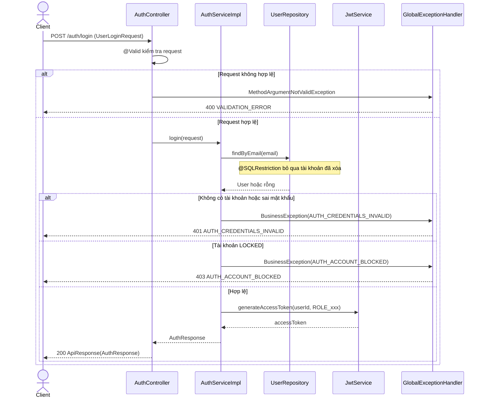
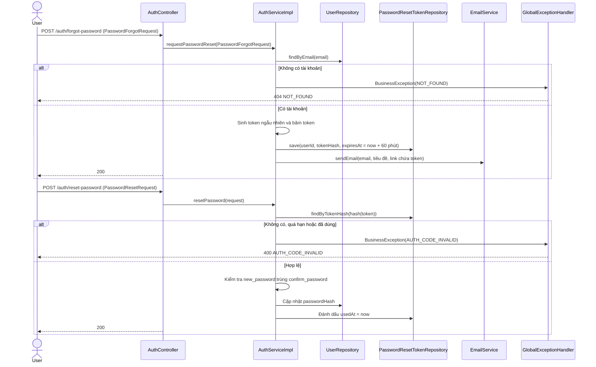

# Thiết kế API & Biểu đồ tuần tự: Xác thực & Tài khoản

Quy ước URL, response, phân trang và mã lỗi: xem [`../README.md`](../README.md).

## 1. Mô tả API Endpoints

| Method | URL | Vai trò | UC | Request | Response (`data`) |
|---|---|---|---|---|---|
| POST | `/auth/register` | Khách | UC004 | `UserRegisterRequest` | 201 `ProfileResponse` |
| POST | `/auth/login` | Khách | UC001 | `UserLoginRequest` | 200 `AuthResponse` |
| POST | `/auth/forgot-password` | Khách | UC003 | `PasswordForgotRequest` | 200 `null` |
| POST | `/auth/reset-password` | Khách | UC003 | `PasswordResetRequest` | 200 `null` |
| GET | `/users/me` | Đã đăng nhập | UC005 | — | 200 `ProfileResponse` |
| PUT | `/users/me` | Đã đăng nhập | UC005, UC002 (GV, QTV) | `ProfileUpdateRequest` | 200 `ProfileResponse` |
| PUT | `/users/me/avatar` | Đã đăng nhập | UC005 | multipart, field `file` | 200 `ProfileResponse` |
| PUT | `/users/me/password` | `STUDENT` | UC002 | `PasswordChangeRequest` | 200 `null` |

Ghi chú:

- Bốn endpoint `/auth/*` là công khai và đã được mở trong `SecurityConfig`. `forgot-password`, `reset-password` giữ dạng động
  từ cho khớp cấu hình đó.
- Link trong email có dạng `<frontend-url>/reset-password?token=<token>`. Frontend lấy `token` rồi gọi
  `POST /auth/reset-password`. `frontend-url` cấu hình bằng `@ConfigurationProperties`.

Ví dụ `POST /auth/login`:

```json
{ "email": "qndev@gmail.com", "password": "123456" }
```

```json
{
  "success": true,
  "data": { "access_token": "eyJ...", "user_id": "4f1c...", "email": "qndev@gmail.com", "role": "STUDENT" },
  "msg": ""
}
```

## 2. Biểu đồ Tuần tự (Sequence Diagram) - Đăng nhập (UC001)



## 3. Biểu đồ Tuần tự (Sequence Diagram) - Thiết lập lại mật khẩu (UC003)



Email gửi sau khi transaction commit, để không giữ kết nối DB trong lúc gọi SMTP.
