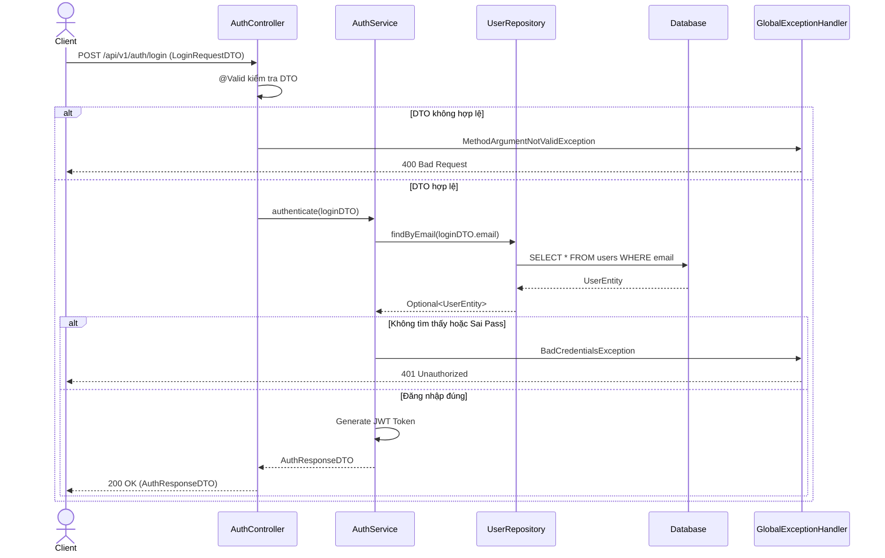

# Thiết kế API & Biểu đồ tuần tự: Xác thực & Tài khoản

## 1. Mô tả API Endpoints

- `POST /api/v1/auth/login`: Xác thực người dùng, trả về Access Token.
- `POST /api/v1/auth/register`: Đăng ký tài khoản học viên mới.
- `POST /api/v1/auth/forgot-password`: Gửi email reset mật khẩu.
- `PUT /api/v1/users/profile`: Cập nhật thông tin cá nhân (Cần Header Authorization).
- `PUT /api/v1/users/password`: Thay đổi mật khẩu (Cần Header Authorization).

## 2. Biểu đồ Tuần tự (Sequence Diagram) - Đăng nhập

