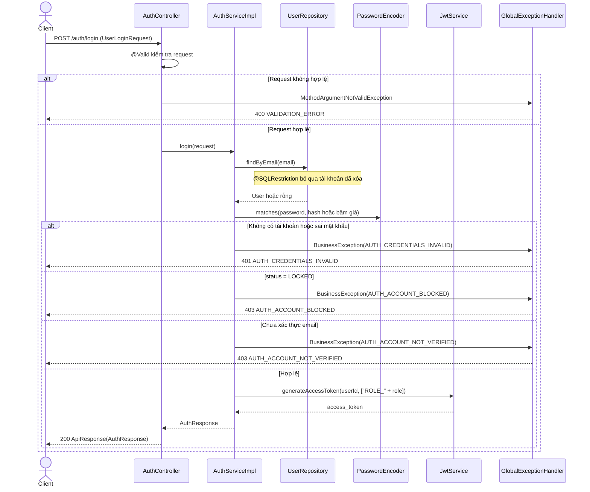
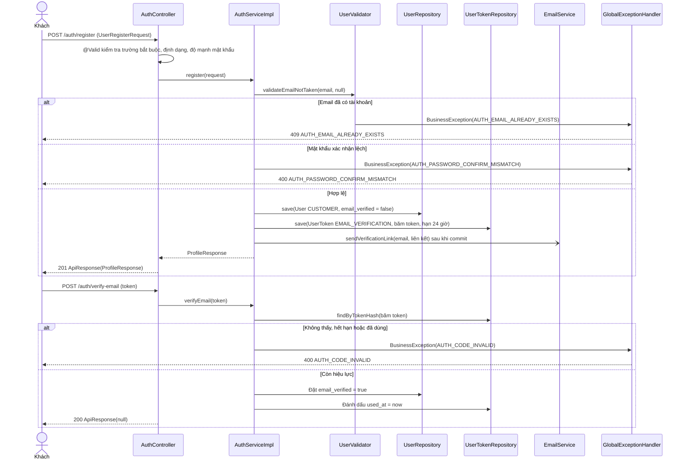
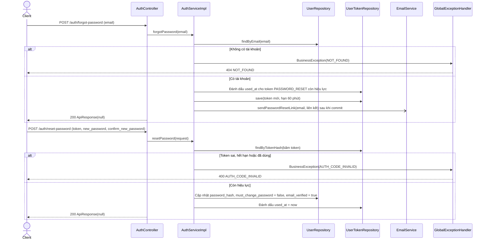

# Thiết kế API & Biểu đồ tuần tự: Xác thực & Tài khoản

Quy ước URL, response, phân trang và mã lỗi: xem [`../README.md`](../README.md).

## 1. Mô tả API Endpoints

| Method | URL | Vai trò | UC | Request | Response (`data`) |
|---|---|---|---|---|---|
| POST | `/auth/register` | Khách | UC002 | `UserRegisterRequest` | 201 `ProfileResponse` |
| POST | `/auth/verify-email` | Khách | UC002 | `EmailVerifyRequest` | 200 `null` |
| POST | `/auth/resend-verification` | Khách | UC002 | `EmailResendRequest` | 200 `null` |
| POST | `/auth/login` | Khách | UC001 | `UserLoginRequest` | 200 `AuthResponse` |
| POST | `/auth/forgot-password` | Khách | UC004 | `PasswordForgotRequest` | 200 `null` |
| POST | `/auth/reset-password` | Khách | UC004 | `PasswordResetRequest` | 200 `null` |
| GET | `/users/me` | Đã đăng nhập | UC005 | — | 200 `ProfileResponse` |
| PUT | `/users/me` | Đã đăng nhập | UC005 | `ProfileUpdateRequest` | 200 `ProfileResponse` |
| PUT | `/users/me/avatar` | Đã đăng nhập | UC005 | multipart, field `file` | 200 `ProfileResponse` |
| PUT | `/users/me/password` | Đã đăng nhập | UC003 | `PasswordChangeRequest` | 200 `null` |

Ghi chú:

- Sáu endpoint `/auth/*` là công khai và đã được mở trong `SecurityConfig`. Chúng nằm trong phạm vi `RateLimitFilter`
  (rule giới hạn theo IP) vì `forgot-password` và `resend-verification` phân biệt được email có tài khoản hay không.
- Không gắn `Idempotency-Key` lên `/auth/login` (xem javadoc `@Idempotent`).
- Liên kết trong email: `<frontend-url>/verify-email?token=<token>` và `<frontend-url>/reset-password?token=<token>`.
  `frontend-url` cấu hình ở `app.auth.frontend-url`. Client đọc `token` rồi gọi API tương ứng; token là chuỗi ngẫu nhiên 32 byte
  (Base64URL), server chỉ lưu băm SHA-256.
- `PUT /users/me` không nhận `role`, `status`, `password`; trường thừa bị bỏ qua.
- `access_token` là JWT HS256 (`JwtService`) chứa `sub` = id người dùng, `authorities` = `["ROLE_<role>"]`, `exp`.

Ví dụ `POST /auth/login`:

```json
{ "email": "bich.tran@nhahang.vn", "password": "Matkhau123" }
```

```json
{
  "success": true,
  "data": {
    "access_token": "eyJ...",
    "expires_in": 3600,
    "user": {
      "id": "4f1c0a52-6a0e-4d63-9a41-2e0f9b8d7c11",
      "email": "bich.tran@nhahang.vn",
      "full_name": "Trần Thị Bích",
      "role": "CASHIER",
      "must_change_password": true
    }
  },
  "msg": ""
}
```

Ví dụ lỗi xác thực trượt (`POST /auth/register` thiếu họ tên):

```json
{
  "success": false,
  "error": {
    "code": "VALIDATION_ERROR",
    "message": "Dữ liệu gửi lên không hợp lệ.",
    "fields": [{ "field": "full_name", "message": "Họ tên không được để trống" }],
    "detail": null
  }
}
```

## 2. Biểu đồ Tuần tự (Sequence Diagram) - Đăng nhập (UC001)



## 3. Biểu đồ Tuần tự (Sequence Diagram) - Đăng ký và xác thực email (UC002)



## 4. Biểu đồ Tuần tự (Sequence Diagram) - Quên và đặt lại mật khẩu (UC004)


