# Thiết kế Thực thể, DTO & Biểu đồ lớp: Xác thực & Tài khoản

Package `com.restaurant.modules.user`, dùng chung với `user-management`. Quy ước chung: xem [`../README.md`](../README.md).

## 1. Lớp Thực thể (Entity)

### 1.1 `User` (bảng `users`)

Kế thừa `AssignedIdEntity`; `@SQLRestriction("deleted_at IS NULL")` (README mục 2.5).

| Cột | Kiểu | Ghi chú |
|---|---|---|
| `id` | `uuid` PK | Sinh ở code |
| `email` | `varchar(255)` | Unique một phần: `CREATE UNIQUE INDEX uq_users_email ON users (lower(email)) WHERE deleted_at IS NULL`; service chuẩn hóa về chữ thường, bỏ khoảng trắng đầu/cuối trước khi lưu và tra |
| `password_hash` | `varchar(100)` | BCrypt (`PasswordEncoder` trong `SecurityConfig`) |
| `full_name` | `varchar(255)` | Bắt buộc |
| `phone` | `varchar(10)` | 10 chữ số, tùy chọn |
| `gender` | `varchar(10)` | `Gender`; `CHECK` |
| `date_of_birth` | `date` | Tùy chọn |
| `avatar_url` | `varchar(500)` | URL do `FileStorageService` trả về |
| `role` | `varchar(20)` | `Role`; `CHECK` |
| `status` | `varchar(20)` | `UserStatus`; `CHECK` |
| `email_verified` | `boolean` | `false` chỉ với khách hàng mới đăng ký |
| `must_change_password` | `boolean` | `true` khi Quản lý tạo nhân viên (A19) |
| `created_at`, `updated_at` | `timestamptz` | |
| `deleted_at` | `timestamptz` | Xóa mềm |

Index: `ix_users_role_created (role, created_at DESC) WHERE deleted_at IS NULL` cho danh sách của `user-management`.

### 1.2 `UserToken` (bảng `user_tokens`)

Token một lần cho xác thực email và đặt lại mật khẩu.

| Cột | Kiểu | Ghi chú |
|---|---|---|
| `id` | `uuid` PK | |
| `user_id` | `uuid` | Cùng module nhưng không đặt khóa ngoại (xóa mềm user vẫn giữ token) |
| `type` | `varchar(30)` | `UserTokenType`; `CHECK` |
| `token_hash` | `varchar(64)` | SHA-256 hex của token thô; `UNIQUE` |
| `expires_at` | `timestamptz` | +24 giờ (`EMAIL_VERIFICATION`) hoặc +60 phút (`PASSWORD_RESET`) |
| `used_at` | `timestamptz` | Có giá trị khi đã dùng hoặc bị vô hiệu |
| `created_at` | `timestamptz` | |

Index: `ix_user_tokens_user_type (user_id, type)`. Token còn hiệu lực = `used_at IS NULL AND expires_at > now`. Hàng quá hạn được
dọn bằng truy vấn xóa theo `expires_at` khi sinh token mới của cùng người (không cần job riêng).

## 2. Data Transfer Object (DTO)

Mật khẩu hợp lệ = `@Size(min = 8, max = 72)` và `@Pattern(regexp = "^(?=.*[A-Za-z])(?=.*\\d).+$")` (ít nhất 8 ký tự gồm chữ và
số; 72 là giới hạn byte của BCrypt). Hằng số `PASSWORD_PATTERN` đặt ở `user/dto/request/` để mọi request dùng chung.

### Request (`dto/request/`)

| DTO | Trường | Validate |
|---|---|---|
| `UserRegisterRequest` | `fullName` | `@NotBlank @Size(max = 255)` |
| | `email` | `@NotBlank @Email @Size(max = 255)` |
| | `phone` | `@Pattern(regexp = "\\d{10}")`, tùy chọn |
| | `password` | `@NotBlank` + quy tắc mật khẩu |
| | `confirmPassword` | `@NotBlank` |
| `EmailVerifyRequest` | `token` | `@NotBlank` |
| `EmailResendRequest` | `email` | `@NotBlank @Email` |
| `UserLoginRequest` | `email` | `@NotBlank @Email` |
| | `password` | `@NotBlank` (không kiểm tra độ mạnh khi đăng nhập) |
| `PasswordForgotRequest` | `email` | `@NotBlank @Email` |
| `PasswordResetRequest` | `token` | `@NotBlank` |
| | `newPassword` | `@NotBlank` + quy tắc mật khẩu |
| | `confirmNewPassword` | `@NotBlank` |
| `PasswordChangeRequest` | `oldPassword` | `@NotBlank` |
| | `newPassword` | `@NotBlank` + quy tắc mật khẩu |
| | `confirmNewPassword` | `@NotBlank` |
| `ProfileUpdateRequest` | `fullName` | `@NotBlank @Size(max = 255)` |
| | `email` | `@NotBlank @Email @Size(max = 255)` |
| | `dateOfBirth` | `@Past`, tùy chọn |
| | `phone` | `@Pattern(regexp = "\\d{10}")`, tùy chọn |
| | `gender` | `Gender`, tùy chọn |

Việc `confirm*` trùng khớp kiểm tra ở service (`AUTH_PASSWORD_CONFIRM_MISMATCH`), không viết custom annotation (rule 2.6).
Trùng email kiểm tra ở `UserValidator`.

### Response (`dto/response/`)

| DTO | Trường |
|---|---|
| `AuthResponse` | `accessToken`, `expiresIn` (giây), `user` (`AuthUserResponse`) |
| `AuthUserResponse` | `id`, `email`, `fullName`, `role`, `mustChangePassword` |
| `ProfileResponse` | `id`, `email`, `fullName`, `phone`, `gender`, `dateOfBirth`, `avatarUrl`, `role`, `status`, `emailVerified`, `mustChangePassword`, `createdAt` |
| `UserBriefResponse` | `id`, `fullName`, `email`, `phone`, `role` (module khác dùng để hiện tên người; xem mục 3) |

## 3. Biểu đồ Lớp (Class Diagram)

Mũi tên nét đứt từ service là phụ thuộc của lớp `*ServiceImpl` tương ứng. Phần quản trị tài khoản của `UserService` nằm ở
[`../user-management/lopthucthe.md`](../user-management/lopthucthe.md).

```mermaid
classDiagram
    class AuthController {
        +register(UserRegisterRequest) ApiResponse~ProfileResponse~
        +verifyEmail(EmailVerifyRequest) ApiResponse~Void~
        +resendVerification(EmailResendRequest) ApiResponse~Void~
        +login(UserLoginRequest) ApiResponse~AuthResponse~
        +forgotPassword(PasswordForgotRequest) ApiResponse~Void~
        +resetPassword(PasswordResetRequest) ApiResponse~Void~
    }

    class ProfileController {
        +getMe() ApiResponse~ProfileResponse~
        +updateMe(ProfileUpdateRequest) ApiResponse~ProfileResponse~
        +updateAvatar(MultipartFile) ApiResponse~ProfileResponse~
        +changePassword(PasswordChangeRequest) ApiResponse~Void~
    }

    class AuthService {
        <<interface>>
        +register(UserRegisterRequest) ProfileResponse
        +verifyEmail(String token) void
        +resendVerification(String email) void
        +login(UserLoginRequest) AuthResponse
        +forgotPassword(String email) void
        +resetPassword(PasswordResetRequest) void
    }

    class UserService {
        <<interface>>
        +getProfile(UUID userId) ProfileResponse
        +updateProfile(UUID userId, ProfileUpdateRequest) ProfileResponse
        +updateAvatar(UUID userId, MultipartFile) ProfileResponse
        +changePassword(UUID userId, PasswordChangeRequest) void
        +getUserBriefs(Collection~UUID~ ids) List~UserBriefResponse~
    }

    class UserValidator {
        +validateEmailNotTaken(String email, UUID excludeUserId) void
        +validatePasswordConfirmed(String password, String confirm) void
    }

    class UserRepository {
        <<interface>>
        +findByEmail(String) Optional~User~
        +existsByEmailAndIdNot(String email, UUID id) boolean
    }

    class UserTokenRepository {
        <<interface>>
        +findByTokenHash(String) Optional~UserToken~
        +invalidateActiveTokens(UUID userId, UserTokenType type, Instant now) int
    }

    class UserMapper {
        <<interface>>
        +toProfileResponse(User) ProfileResponse
        +toAuthUserResponse(User) AuthUserResponse
        +toBriefResponse(User) UserBriefResponse
        +updateFromRequest(ProfileUpdateRequest, User) void
    }

    class JwtService {
        +generateAccessToken(UUID, Collection~String~) String
    }

    class EmailService {
        <<interface>>
        +sendVerificationLink(String email, String link) void
        +sendPasswordResetLink(String email, String link) void
        +sendVerificationOtp(String email, String otpCode) void
        +sendPasswordResetCode(String email, String rawResetCode) void
        +sendEmail(String to, String subject, String content) void
    }

    class FileStorageService {
        <<interface>>
        +storeImage(MultipartFile, String directory) String
    }

    AuthController --> AuthService
    ProfileController --> UserService
    AuthService ..> UserRepository
    AuthService ..> UserTokenRepository
    AuthService ..> UserValidator
    AuthService ..> UserMapper
    AuthService ..> JwtService
    AuthService ..> EmailService
    UserService ..> UserRepository
    UserService ..> UserValidator
    UserService ..> UserMapper
    UserService ..> FileStorageService
```

Ghi chú:

- `AuthServiceImpl` và `UserServiceImpl` là hai lớp `*ServiceImpl` khác nhau cùng module. `UserService` còn có các hàm quản trị
  của `user-management`; mọi hàm công khai nhận `UUID userId` thuần, controller lấy từ `SecurityContextUtil.currentUserId()` (rule 2.9).
- Token thô sinh bằng `SecureRandom` 32 byte, mã hóa Base64URL; chỉ lưu `SHA-256` hex. Email gửi sau khi transaction commit
  (`@TransactionalEventListener(AFTER_COMMIT)`) để không gửi liên kết cho bản ghi bị rollback; lỗi gửi chỉ ghi log `WARN`.
- Gói `events/` chỉ có hai sự kiện: `UserRegisteredEvent` và `PasswordResetRequestedEvent`, nghe bởi một listener gửi email.
- `getUserBriefs` là API công khai cho module khác: `order` (tên nhân viên phục vụ, bếp), `billing` (tên thu ngân). Hàm này đọc cả
  tài khoản đã xóa bằng native query để vẫn hiện được tên.
- Quản lý tài khoản đầu tiên: bean `ManagerBootstrap` (`ApplicationRunner`) đọc `app.auth.bootstrap-admin-email`,
  `bootstrap-admin-password` (đã có trong `application.yaml`), tạo `MANAGER` với `email_verified = true`,
  `must_change_password = false` khi bảng chưa có `MANAGER` nào.
- Đăng nhập không cấp `refresh_token`; không có `AuthService.logout`.
- `EmailService` (đã có ở `common/mail/`, hai bản `SmtpEmailServiceImpl` và `LogEmailServiceImpl`): giữ nguyên `sendVerificationOtp`, `sendPasswordResetCode`; thêm
  `sendVerificationLink`, `sendPasswordResetLink` ở cả hai bản. Link do `AuthService` dựng từ `app.auth.frontend-url` + token thô, `EmailService` chỉ gửi nội dung.
  Bản `LogEmailServiceImpl` (profile `test`) ghi link ra log nên test không cần SMTP.
