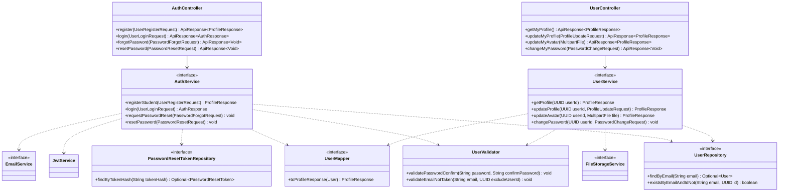

# Thiết kế Thực thể, DTO & Biểu đồ lớp: Xác thực & Tài khoản

Package `com.elearning.user`, dùng chung với `user-management`. Quy ước chung: xem [`../README.md`](../README.md).

## 1. Lớp Thực thể (Entity)

### `User` — bảng `users`

| Trường | Kiểu | Ràng buộc | Nguồn SRS |
|---|---|---|---|
| `id` | `UUID` | PK | |
| `email` | `String` | Bắt buộc, unique trong các bản ghi chưa xóa | Bảng 2-2, 2-6, 2-8 |
| `passwordHash` | `String` | Bắt buộc, BCrypt | Bảng 2-6 |
| `fullName` | `String` | ≤ 255 ký tự | Bảng 2-8, 2-17 |
| `phone` | `String` | Chỉ chữ số | Bảng 2-8 |
| `gender` | `Gender` | | Bảng 2-8 |
| `dateOfBirth` | `LocalDate` | | Bảng 2-8 |
| `avatarUrl` | `String` | URL do `FileStorageService` trả | Bảng 2-8 |
| `role` | `Role` | Bắt buộc | Mục 2.1 |
| `status` | `UserStatus` | Bắt buộc, mặc định `ACTIVE` | Bảng 2-17 |
| `createdAt`, `updatedAt` | `Instant` | | |
| `deletedAt` | `Instant` | `null` là chưa xóa | README mục 2.5 |

### `PasswordResetToken` — bảng `password_reset_tokens`

| Trường | Kiểu | Ràng buộc |
|---|---|---|
| `id` | `UUID` | PK |
| `userId` | `UUID` | Bắt buộc |
| `tokenHash` | `String` | Bắt buộc, unique; chỉ lưu bản băm, không lưu token gốc |
| `expiresAt` | `Instant` | Thời điểm tạo + 60 phút (UC003) |
| `usedAt` | `Instant` | `null` là chưa dùng |
| `createdAt` | `Instant` | |

## 2. Enum

`Role`, `Gender`, `UserStatus` đặt ở `user/enums/`, giá trị theo README mục 2.4.

## 3. Data Transfer Object (DTO)

### Request (`dto/request/`)

| DTO | Trường | Validate |
|---|---|---|
| `UserLoginRequest` | `email` | `@NotBlank @Email` |
| | `password` | `@NotBlank @Size(min = 6)` |
| `UserRegisterRequest` | `email` | `@NotBlank @Email` |
| | `password` | `@NotBlank @Size(min = 6)` |
| | `confirmPassword` | `@NotBlank` |
| `PasswordForgotRequest` | `email` | `@NotBlank @Email` |
| `PasswordResetRequest` | `token` | `@NotBlank` |
| | `newPassword` | `@NotBlank @Size(min = 6)` |
| | `confirmPassword` | `@NotBlank` |
| `PasswordChangeRequest` | `oldPassword` | `@NotBlank` |
| | `newPassword` | `@NotBlank @Size(min = 6)` |
| | `confirmPassword` | `@NotBlank` |
| `ProfileUpdateRequest` | `fullName` | `@Size(max = 255)` |
| | `email` | `@NotBlank @Email` |
| | `dateOfBirth` | `@Past` |
| | `phone` | `@Pattern(regexp = "\\d+")` |
| | `gender` | |
| | `password` | `@Size(min = 6)`, tùy chọn, chỉ `ADMIN`, `TEACHER` |
| | `confirmPassword` | Tùy chọn |

Kiểm tra ở `UserValidator` (rule 2.6), không viết annotation tự chế:

- Mật khẩu xác nhận phải trùng mật khẩu → `AUTH_PASSWORD_CONFIRM_MISMATCH`.
- `STUDENT` gửi `password` trong `ProfileUpdateRequest` → `VALIDATION_ERROR`.
- Email chưa được tài khoản khác dùng → `AUTH_EMAIL_ALREADY_EXISTS`.

Upload ảnh đại diện nhận `MultipartFile file`, không có DTO.

### Response (`dto/response/`)

| DTO | Trường |
|---|---|
| `AuthResponse` | `accessToken`, `userId`, `email`, `role` |
| `ProfileResponse` | `id`, `email`, `fullName`, `phone`, `gender`, `dateOfBirth`, `avatarUrl`, `role` |

## 4. Biểu đồ Lớp (Class Diagram)

Mũi tên nét đứt từ service là phụ thuộc của lớp `*ServiceImpl` tương ứng.

`UserService` cũng chứa các hàm quản lý người dùng của `user-management` và API công khai cho module khác (xem
[`../user-management/lopthucthe.md`](../user-management/lopthucthe.md)).
