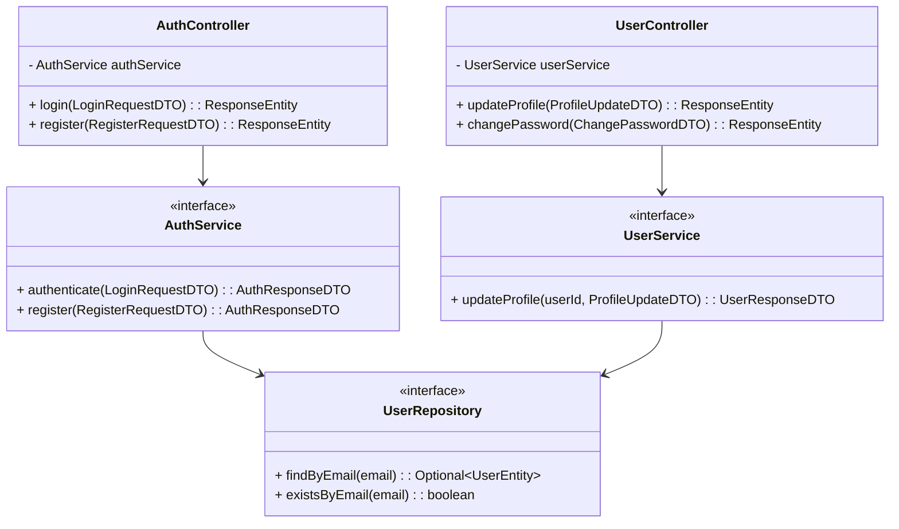

# Thiết kế Thực thể, DTO & Biểu đồ lớp: Xác thực & Tài khoản

## 1. Lớp Thực thể (Entity)
- **UserEntity** (Ánh xạ bảng `users`): 
  - `id` (String/UUID), `email` (String, unique), `password` (String)
  - `fullName` (String), `phone` (String), `gender` (Enum), `dob` (Date), `avatar` (String)
  - `role` (Enum: ADMIN, TEACHER, STUDENT), `status` (Enum: ACTIVE, LOCKED)

## 2. Data Transfer Object (DTO)
- **LoginRequestDTO**: `email` (@NotBlank, @Email), `password` (@NotBlank).
- **RegisterRequestDTO**: `email`, `password`, `confirmPassword`, `fullName`.
- **ProfileUpdateDTO**: `fullName`, `phone`, `gender`, `dob`.
- **AuthResponseDTO**: `token`, `userId`, `email`, `role`.

## 3. Biểu đồ Lớp (Class Diagram)

