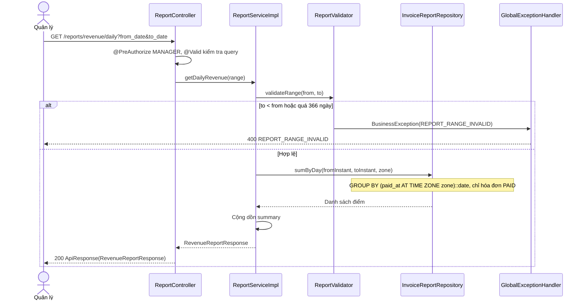

# Thiết kế API & Biểu đồ tuần tự: Thanh toán, Hóa đơn & Báo cáo

Quy ước URL, response, phân trang và mã lỗi: xem [`../README.md`](../README.md).

## 1. Mô tả API Endpoints

| Method | URL | Vai trò | UC | Request | Response (`data`) |
|---|---|---|---|---|---|
| GET | `/billing/orders/{orderId}` | `CASHIER` | UC018 | — | 200 `PaymentSummaryResponse` |
| POST | `/invoices` | `CASHIER` | UC018 | `InvoiceCreateRequest` (+ `Idempotency-Key`) | 201 `InvoiceResponse` |
| GET | `/invoices` | `CASHIER`, `MANAGER` | UC007, UC019 | Query `InvoiceSearchRequest` + phân trang | 200 `{items: InvoiceSummaryResponse[], meta}` |
| GET | `/invoices/{id}` | `CASHIER`, `MANAGER` | UC019 | — | 200 `InvoiceResponse` |
| POST | `/invoices/{id}/reprint` | `CASHIER`, `MANAGER` | UC019 | — | 200 `InvoiceResponse` (`reprint` = `true`) |
| GET | `/me/invoices` | `CUSTOMER` | UC017 | Phân trang | 200 `{items: InvoiceSummaryResponse[], meta}` |
| GET | `/me/invoices/{id}` | `CUSTOMER` | UC017 | — | 200 `InvoiceResponse` |
| GET | `/reports/revenue/daily` | `MANAGER` | UC020 | Query `ReportRangeRequest` | 200 `RevenueReportResponse` |
| GET | `/reports/revenue/monthly` | `MANAGER` | UC020 | Query `ReportRangeRequest` | 200 `RevenueReportResponse` |
| GET | `/reports/top-dishes` | `MANAGER` | UC020 | Query `TopDishesRequest` | 200 `TopDishesResponse` |

Ghi chú:

- `POST /invoices/{id}/reprint` dùng `POST` vì có tác dụng phụ (tăng `print_count`); không gắn `@Idempotent` (in hai lần là hai lần in).
- `sort_by` của `/invoices`: `paid_at` (mặc định), `total_amount`, `code`. `/me/invoices` luôn `paid_at` giảm dần.
- Ngày trong `from_date`, `to_date` hiểu theo `app.timezone`: `[00:00 from_date, 00:00 (to_date + 1 ngày))`.
- Thu ngân không lọc được sang ngày khác: `from_date`, `to_date` của họ bị ép về hôm nay (A15). Xem hoặc in lại hóa đơn ngoài hôm nay → 404.
- Hóa đơn tạo bởi `POST /invoices` trả ngay `InvoiceResponse` để client in luôn, không cần gọi thêm `GET`.
- Cần `CASHIER` cho `GET /orders?status=OPEN&table_id=...` của module `ordering` để tìm `orderId` (README mục 2.3).

Ví dụ `POST /invoices`:

```json
{
  "order_id": "9d1f3e44-6b0a-4a52-8f10-7a4c1b2d3e55",
  "payment_method": "CASH",
  "amount_received": 200000,
  "note": "Xuất hóa đơn công ty",
  "confirm_unserved": false
}
```

```json
{
  "success": true,
  "data": {
    "id": "5a2c7e10-2d9b-4e7a-b6c1-3f8a9d0e1b44",
    "code": "HD20261009-001",
    "status": "PAID",
    "table_name": "B05",
    "cashier_name": "Trần Thị Bích",
    "paid_at": "2026-10-09T12:30:00Z",
    "items": [
      { "dish_name": "Phở bò tái", "unit_price": 65000, "quantity": 2, "line_total": 130000 },
      { "dish_name": "Trà đá", "unit_price": 30000, "quantity": 1, "line_total": 30000 }
    ],
    "subtotal": 160000,
    "vat_rate": 0.08,
    "vat_amount": 12800,
    "total_amount": 172800,
    "payment_method": "CASH",
    "amount_received": 200000,
    "change_amount": 27200,
    "note": "Xuất hóa đơn công ty",
    "print_count": 0,
    "reprint": false
  },
  "msg": ""
}
```

Ví dụ `GET /reports/revenue/daily?from_date=2026-10-01&to_date=2026-10-09`:

```json
{
  "success": true,
  "data": {
    "points": [
      { "date": "2026-10-08", "invoice_count": 34, "subtotal": 8120000, "vat_amount": 649600, "total_amount": 8769600 },
      { "date": "2026-10-09", "invoice_count": 12, "subtotal": 2950000, "vat_amount": 236000, "total_amount": 3186000 }
    ],
    "summary": { "invoice_count": 46, "subtotal": 11070000, "vat_amount": 885600, "total_amount": 11955600 }
  },
  "msg": ""
}
```

## 2. Biểu đồ Tuần tự (Sequence Diagram) - Thanh toán và xuất hóa đơn (UC018)

```mermaid
sequenceDiagram
    actor Cashier as Thu ngân
    participant Ctrl as InvoiceController
    participant Svc as InvoiceServiceImpl
    participant Order as OrderService
    participant Table as TableService
    participant Code as DailyCodeGenerator
    participant Repo as InvoiceRepository
    participant Handler as GlobalExceptionHandler

    Cashier->>Ctrl: POST /invoices (InvoiceCreateRequest)
    Ctrl->>Ctrl: @PreAuthorize CASHIER, @Idempotent, @Valid kiểm tra request

    alt Request không hợp lệ
        Ctrl->>Handler: MethodArgumentNotValidException
        Handler-->>Cashier: 400 VALIDATION_ERROR
    else Request hợp lệ
        Ctrl->>Svc: createInvoice(cashierId, request)
        Svc->>Order: lockOrderForPayment(orderId)
        Note over Order: SELECT ... FOR UPDATE trên orders

        alt Không tìm thấy
            Order->>Handler: BusinessException(NOT_FOUND)
            Handler-->>Cashier: 404 NOT_FOUND
        else Đơn đã đóng
            Order->>Handler: BusinessException(ORDER_NOT_OPEN)
            Handler-->>Cashier: 409 ORDER_NOT_OPEN
        else Đơn OPEN
            Order-->>Svc: OrderPaymentView
            Svc->>Svc: Loại dòng CANCELLED; tính subtotal, VAT, tổng tiền

            alt Không có dòng nào
                Svc->>Handler: BusinessException(INVOICE_ORDER_EMPTY)
                Handler-->>Cashier: 400 INVOICE_ORDER_EMPTY
            else Còn dòng chưa SERVED và confirm_unserved = false
                Svc->>Handler: BusinessException(INVOICE_UNSERVED_ITEMS, detail.unserved_count)
                Handler-->>Cashier: 409 INVOICE_UNSERVED_ITEMS
            else CASH mà amount_received < tổng tiền
                Svc->>Handler: BusinessException(INVOICE_AMOUNT_INSUFFICIENT)
                Handler-->>Cashier: 400 INVOICE_AMOUNT_INSUFFICIENT
            else Hợp lệ
                Svc->>Table: getTableBriefs([tableId])
                Svc->>Code: next("HD", hôm nay)
                Svc->>Repo: save(invoice PAID + invoice_items chụp)
                Svc->>Order: closeOrder(orderId)
                Svc->>Table: transitionStatus(tableId, [OCCUPIED], AVAILABLE)
                Svc-->>Ctrl: InvoiceResponse
                Ctrl-->>Cashier: 201 ApiResponse(InvoiceResponse)
            end
        end
    end
```

Toàn bộ nằm trong một `@Transactional` của `InvoiceServiceImpl.createInvoice` (README mục 2.10): lỗi ở bất kỳ bước nào làm rollback, đơn giữ `OPEN`, bàn giữ `OCCUPIED`.
Thứ tự khóa: `orders` (qua `lockOrderForPayment`) rồi `dining_tables`. Unique `invoices.order_id` là lớp chặn cuối nếu có đường nào bỏ sót khóa. `Idempotency-Key` bảo vệ trường hợp client gửi lại
do mạng chậm. Không gọi I/O ngoài (email, máy in) trong transaction này.

## 3. Biểu đồ Tuần tự (Sequence Diagram) - Báo cáo doanh thu (UC020)


