# Thiết kế Thực thể, DTO & Biểu đồ lớp: Thanh toán, Hóa đơn & Báo cáo

Package `com.restaurant.modules.billing`. Quy ước chung: xem [`../README.md`](../README.md).

## 1. Lớp Thực thể (Entity)

### 1.1 `Invoice` (bảng `invoices`)

Kế thừa `AssignedIdEntity`. Không sửa, không xóa sau khi tạo (trừ `print_count`).

| Cột | Kiểu | Ghi chú |
|---|---|---|
| `id` | `uuid` PK | |
| `code` | `varchar(20)` | `HD20261009-015`, `UNIQUE` |
| `order_id` | `uuid` | `UNIQUE`: một đơn một hóa đơn. Không khóa ngoại (module `order`) |
| `table_id` | `uuid` | Không khóa ngoại |
| `table_name` | `varchar(20)` | Ảnh chụp tên bàn |
| `customer_id` | `uuid` | Sao chép từ đơn; `null` với khách vãng lai. Không khóa ngoại |
| `cashier_id` | `uuid` | Người lập. Không khóa ngoại |
| `cashier_name` | `varchar(255)` | Ảnh chụp tên thu ngân |
| `subtotal` | `bigint` | Tổng thành tiền, VND |
| `vat_rate` | `numeric(5,4)` | Tỷ lệ VAT tại thời điểm trả (vd `0.0800`) |
| `vat_amount` | `bigint` | |
| `total_amount` | `bigint` | `subtotal + vat_amount` |
| `payment_method` | `varchar(20)` | `PaymentMethod`; `CHECK` |
| `amount_received` | `bigint` | Tiền mặt: tiền khách đưa; thẻ/chuyển khoản: bằng `total_amount` |
| `change_amount` | `bigint` | `amount_received - total_amount` |
| `note` | `varchar(255)` | Tùy chọn |
| `status` | `varchar(20)` | `InvoiceStatus` (`PAID`); `CHECK` |
| `paid_at` | `timestamptz` | |
| `print_count` | `integer` | Số lần in lại, mặc định 0 |
| `created_at`, `updated_at` | `timestamptz` | |

Index và ràng buộc: `uq_invoices_code (code)`, `uq_invoices_order (order_id)`, `ix_invoices_paid_at (paid_at DESC)`, `ix_invoices_customer (customer_id, paid_at DESC) WHERE customer_id IS NOT NULL`,
`ix_invoices_cashier (cashier_id)`; `CHECK (total_amount = subtotal + vat_amount)`, `CHECK (change_amount >= 0)`.

### 1.2 `InvoiceItem` (bảng `invoice_items`)

Ảnh chụp từng dòng món lúc thanh toán (không phụ thuộc `menu` hay `order` về sau).

| Cột | Kiểu | Ghi chú |
|---|---|---|
| `id` | `uuid` PK | |
| `invoice_id` | `uuid` | `REFERENCES invoices (id)` (cùng module) |
| `position` | `integer` | Thứ tự dòng trong hóa đơn, bắt đầu từ 0 (giữ thứ tự gọi món khi in) |
| `dish_id` | `uuid` | Dùng cho báo cáo món bán chạy. Không khóa ngoại |
| `dish_name` | `varchar(255)` | |
| `unit_price` | `bigint` | |
| `quantity` | `integer` | |
| `line_total` | `bigint` | `unit_price × quantity` |

Index: `ix_invoice_items_invoice (invoice_id, position)`, `ix_invoice_items_dish (dish_id)`.

Mỗi dòng món không `CANCELLED` của đơn thành đúng một dòng hóa đơn (không gộp), nên báo cáo món bán chạy cộng theo `dish_id`.

## 2. Data Transfer Object (DTO)

### Request (`dto/request/`)

| DTO | Trường | Validate |
|---|---|---|
| `InvoiceCreateRequest` | `orderId` | `@NotNull` |
| | `paymentMethod` | `@NotNull` |
| | `amountReceived` | `@PositiveOrZero`; bắt buộc khi `CASH` (kiểm ở `InvoiceValidator`) |
| | `note` | `@Size(max = 255)` |
| | `confirmUnserved` | `boolean`, mặc định `false` |
| `InvoiceSearchRequest` (query param) | `code` | Tùy chọn, chứa chuỗi |
| | `fromDate`, `toDate` | `LocalDate`, tùy chọn; `fromDate ≤ toDate` kiểm ở service |
| | `table` | Tùy chọn, tên bàn chứa chuỗi |
| | `paymentMethod` | Tùy chọn |
| `ReportRangeRequest` (query param) | `fromDate`, `toDate` | `@NotNull` |
| `TopDishesRequest` (query param) | `fromDate`, `toDate` | `@NotNull` |
| | `topN` | `@Min(1) @Max(50)`, mặc định 10 |

### Response (`dto/response/`)

| DTO | Trường |
|---|---|
| `PaymentSummaryResponse` | `orderId`, `table` (`TableBriefResponse`), `openedAt`, `lines` (`PaymentLineResponse[]`), `subtotal`, `vatRate`, `vatAmount`, `totalAmount`, `unservedCount` |
| `PaymentLineResponse` | `dishName`, `unitPrice`, `quantity`, `lineTotal`, `status` (trạng thái dòng món) |
| `InvoiceSummaryResponse` | `id`, `code`, `tableName`, `paidAt`, `totalAmount`, `paymentMethod` |
| `InvoiceResponse` | `id`, `code`, `status`, `tableName`, `cashierName`, `paidAt`, `items` (`InvoiceItemResponse[]`), `subtotal`, `vatRate`, `vatAmount`, `totalAmount`, `paymentMethod`, `amountReceived`, `changeAmount`, `note`, `printCount`, `reprint` |
| `InvoiceItemResponse` | `dishName`, `unitPrice`, `quantity`, `lineTotal` |
| `RevenueReportResponse` | `points` (`RevenuePoint[]`), `summary` (`RevenueSummary`) |
| `RevenuePoint` | `date` (`yyyy-MM-dd`, báo cáo ngày) hoặc `month` (`yyyy-MM`, báo cáo tháng), `invoiceCount`, `subtotal`, `vatAmount`, `totalAmount` |
| `RevenueSummary` | `invoiceCount`, `subtotal`, `vatAmount`, `totalAmount` |
| `TopDishesResponse` | `items` (`TopDishItem[]`) |
| `TopDishItem` | `dishId`, `dishName`, `quantity`, `revenue` |

`reprint` chỉ có giá trị `true` ở response của `POST /invoices/{id}/reprint`; mọi response khác là `false`. `customerId`, `cashierId`, `orderId` không đưa ra `InvoiceResponse` (client không cần).

## 3. Biểu đồ Lớp (Class Diagram)

Mũi tên nét đứt từ service là phụ thuộc của lớp `*ServiceImpl` tương ứng.

```mermaid
classDiagram
    class BillingController {
        +getPaymentSummary(UUID orderId) ApiResponse~PaymentSummaryResponse~
    }

    class InvoiceController {
        +createInvoice(InvoiceCreateRequest) ApiResponse~InvoiceResponse~
        +searchInvoices(InvoiceSearchRequest, page, pageSize, sortBy, sortOrder) ApiResponse~PageResponse~InvoiceSummaryResponse~~
        +getInvoice(UUID id) ApiResponse~InvoiceResponse~
        +reprintInvoice(UUID id) ApiResponse~InvoiceResponse~
    }

    class MyInvoiceController {
        +listMine(page, pageSize) ApiResponse~PageResponse~InvoiceSummaryResponse~~
        +getMine(UUID id) ApiResponse~InvoiceResponse~
    }

    class ReportController {
        +getDailyRevenue(ReportRangeRequest) ApiResponse~RevenueReportResponse~
        +getMonthlyRevenue(ReportRangeRequest) ApiResponse~RevenueReportResponse~
        +getTopDishes(TopDishesRequest) ApiResponse~TopDishesResponse~
    }

    class InvoiceService {
        <<interface>>
        +getPaymentSummary(UUID orderId) PaymentSummaryResponse
        +createInvoice(UUID cashierId, InvoiceCreateRequest) InvoiceResponse
        +searchInvoices(Role viewerRole, InvoiceSearchRequest, PageRequestParams) Page~InvoiceSummaryResponse~
        +getInvoice(Role viewerRole, UUID id) InvoiceResponse
        +reprintInvoice(Role viewerRole, UUID id) InvoiceResponse
        +listMine(UUID customerId, PageRequestParams) Page~InvoiceSummaryResponse~
        +getMine(UUID customerId, UUID id) InvoiceResponse
    }

    class ReportService {
        <<interface>>
        +getDailyRevenue(ReportRangeRequest) RevenueReportResponse
        +getMonthlyRevenue(ReportRangeRequest) RevenueReportResponse
        +getTopDishes(TopDishesRequest) TopDishesResponse
    }

    class InvoiceValidator {
        +validatePayment(PaymentMethod, Long amountReceived, long totalAmount) void
        +validateOrderPayable(int chargeableCount, int unservedCount, boolean confirmUnserved) void
        +validateSearchRange(LocalDate from, LocalDate to) void
    }

    class ReportValidator {
        +validateRange(LocalDate from, LocalDate to) void
    }

    class InvoiceCalculator {
        +calculate(List~PaymentLine~ lines, BigDecimal vatRate) InvoiceAmounts
    }

    class InvoiceRepository {
        <<interface>>
        +findAll(Specification~Invoice~, Pageable) Page~Invoice~
        +findByIdAndCustomerId(UUID id, UUID customerId) Optional~Invoice~
        +existsByCashierId(UUID cashierId) boolean
        +incrementPrintCount(UUID id) int
    }

    class InvoiceItemRepository {
        <<interface>>
        +findByInvoiceIdOrderByPosition(UUID invoiceId) List~InvoiceItem~
    }

    class InvoiceReportRepository {
        <<interface>>
        +sumByDay(Instant from, Instant to, String zone) List~RevenueRow~
        +sumByMonth(Instant from, Instant to, String zone) List~RevenueRow~
        +findTopDishes(Instant from, Instant to, int limit) List~TopDishRow~
    }

    class InvoiceMapper {
        <<interface>>
        +toResponse(Invoice, List~InvoiceItem~, boolean reprint) InvoiceResponse
        +toSummaryResponse(Invoice) InvoiceSummaryResponse
        +toPaymentLineResponse(PaymentLine) PaymentLineResponse
    }

    class OrderService {
        <<interface>>
    }

    class TableService {
        <<interface>>
    }

    class UserService {
        <<interface>>
    }

    class RestaurantProperties {
        <<record>>
        +BigDecimal vatRate
        +int reportMaxDays
    }

    class BillingUserDeletionGuard

    BillingController --> InvoiceService
    InvoiceController --> InvoiceService
    MyInvoiceController --> InvoiceService
    ReportController --> ReportService
    InvoiceService ..> InvoiceRepository
    InvoiceService ..> InvoiceItemRepository
    InvoiceService ..> InvoiceValidator
    InvoiceService ..> InvoiceCalculator
    InvoiceService ..> InvoiceMapper
    InvoiceService ..> OrderService
    InvoiceService ..> TableService
    InvoiceService ..> UserService
    InvoiceService ..> DailyCodeGenerator
    InvoiceService ..> RestaurantProperties
    ReportService ..> InvoiceReportRepository
    ReportService ..> ReportValidator
    BillingUserDeletionGuard ..|> UserDeletionGuard
    BillingUserDeletionGuard ..> InvoiceRepository
```

Ghi chú:

- `InvoiceCalculator` là helper thuần (không Spring), unit test riêng: `subtotal = Σ unit_price × quantity` (bỏ dòng `CANCELLED`),
  `vat = subtotal × vatRate` làm tròn `HALF_UP` về số nguyên, `total = subtotal + vat`. Đặt ở `helper/` vì dùng ở cả `getPaymentSummary` và `createInvoice`.
- `searchInvoices`, `getInvoice`, `reprintInvoice` nhận vai trò người xem. Với `CASHIER`, service thêm điều kiện `paid_at` trong ngày hôm nay (theo `Clock`) vào `Specification`
  và `findById` + kiểm tra ngày, ngoài khoảng thì ném `NOT_FOUND` (A15). Quyền sở hữu của khách hàng dùng `findByIdAndCustomerId` (rule 2.9).
- `reprintInvoice` tăng `print_count` bằng `UPDATE invoices SET print_count = print_count + 1 WHERE id = ?` rồi đọc lại, nên hai lần in song song đều được tính.
- `createInvoice` không có tác dụng phụ ngoài DB (không email, không I/O ngoài). Tên thu ngân lấy qua `UserService.getUserBriefs`, tên bàn qua `TableService.getTableBriefs`.
- `InvoiceReportRepository` dùng `@Query(nativeQuery = true)` cho `GROUP BY` theo ngày/tháng địa phương; kiểm thử bằng `*RepositoryTest` (Testcontainers PostgreSQL, rule 2.13), đặc biệt
  hóa đơn lúc 23:50 và 00:10 giờ Việt Nam (TC_BILL_38).
- Không có `BillingProperties` riêng: dùng `RestaurantProperties` (`common/config/`, dùng chung với `reservation`), đọc `app.restaurant.vat-rate` và
  `app.restaurant.report-max-days`; `vat_rate` ghi vào hóa đơn lúc tạo. `ReportValidator` nhận số ngày tối đa từ `RestaurantProperties`.
- `InvoiceReportRepository` trả về projection `RevenueRow` / `TopDishRow` (interface, alias cột trong truy vấn native); `ReportServiceImpl` đổi sang
  `RevenuePoint` (đặt `date` hoặc `month` tùy loại báo cáo, trường kia là `null` và không xuất hiện trong JSON) và tự cộng `summary`.
- `reprintInvoice` gọi `incrementPrintCount` rồi đọc lại hóa đơn nên `print_count` trả về là số thật sau khi tăng.
- `getPaymentSummary` đọc đơn qua `OrderService.getOrder` (đơn phải `OPEN`, nếu không `ORDER_NOT_OPEN`) rồi tính bằng `InvoiceCalculator`; `createInvoice` dùng
  `OrderService.lockOrderForPayment` để lấy đơn đã khóa.
- `BillingUserDeletionGuard.hasBlockingData` = `existsByCashierId`.
