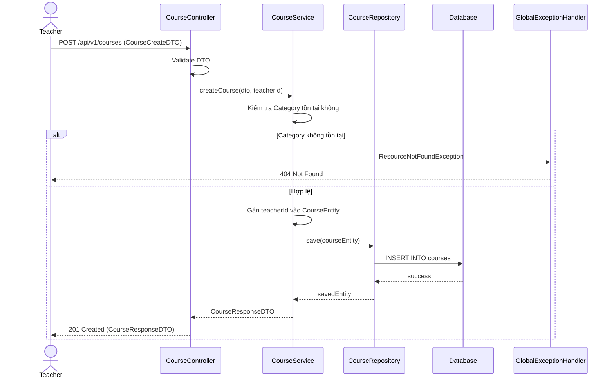

# Thiết kế API & Biểu đồ tuần tự: Quản lý Đào tạo

## 1. Mô tả API Endpoints

- `GET /api/v1/categories`: Lấy danh sách thể loại.
- `POST /api/v1/categories`: (GV) Tạo thể loại mới.
- `GET /api/v1/courses`: Lấy danh sách khóa học (dành cho Khách/Học viên tìm kiếm).
- `POST /api/v1/courses`: (GV) Tạo khóa học mới.
- `PUT /api/v1/courses/{id}`: (GV) Sửa khóa học.
- `POST /api/v1/courses/{courseId}/lectures`: (GV) Thêm bài giảng.
- `POST /api/v1/lectures/{lectureId}/exercises`: (GV) Thêm bài tập trắc nghiệm.

## 2. Biểu đồ Tuần tự (Sequence Diagram) - Tạo Khóa học

