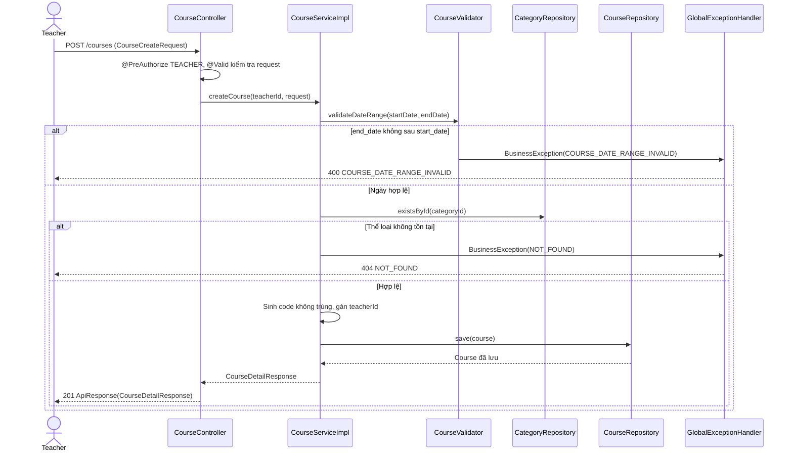
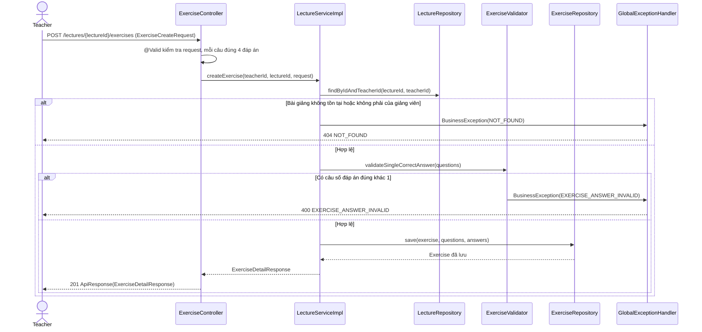

# Thiết kế API & Biểu đồ tuần tự: Quản lý Đào tạo

Quy ước URL, response, phân trang và mã lỗi: xem [`../README.md`](../README.md).

## 1. Mô tả API Endpoints

### Thể loại khóa học (UC015)

| Method | URL | Vai trò | Request | Response (`data`) |
|---|---|---|---|---|
| GET | `/categories?name=` | `TEACHER` | Query + phân trang | 200 `{items: CategoryResponse[], meta}` |
| POST | `/categories` | `TEACHER` | `CategoryCreateRequest` | 201 `CategoryResponse` |
| PUT | `/categories/{id}` | `TEACHER` người tạo | `CategoryUpdateRequest` | 200 `CategoryResponse` |
| DELETE | `/categories/{id}` | `TEACHER` người tạo | — | 200 `null` |

### Khóa học (UC007, UC009)

| Method | URL | Vai trò | Request | Response (`data`) |
|---|---|---|---|---|
| GET | `/courses` | Khách, `STUDENT` | Query `CourseSearchRequest` + phân trang | 200 `{items: CourseSummaryResponse[], meta}`, chỉ `PUBLIC` |
| GET | `/courses/{id}` | Khách, `STUDENT`, `TEACHER` chủ | — | 200 `CourseDetailResponse` |
| GET | `/teachers/me/courses` | `TEACHER` | Query `CourseSearchRequest` (có `status`) + phân trang | 200 `{items: CourseSummaryResponse[], meta}` |
| POST | `/courses` | `TEACHER` | `CourseCreateRequest` | 201 `CourseDetailResponse` |
| PUT | `/courses/{id}` | `TEACHER` chủ | `CourseUpdateRequest` | 200 `CourseDetailResponse` |
| PUT | `/courses/{id}/image` | `TEACHER` chủ | multipart, field `file` | 200 `CourseDetailResponse` |
| DELETE | `/courses/{id}` | `TEACHER` chủ | — | 200 `null` |

`GET /courses` và `GET /courses/{id}` cho Khách gọi không cần token, phải thêm `permitAll` cho hai đường dẫn này trong
`SecurityConfig` khi code. Ví dụ tìm kiếm: `GET /courses?name=math&start_date=2026-01-01&page=1&page_size=20`.

### Bài giảng và bài tập (UC011)

| Method | URL | Vai trò | Request | Response (`data`) |
|---|---|---|---|---|
| GET | `/courses/{courseId}/lectures?name=` | `TEACHER` chủ | Query + phân trang | 200 `{items: LectureSummaryResponse[], meta}` |
| GET | `/courses/{courseId}/lectures/{id}` | `TEACHER` chủ | — | 200 `LectureDetailResponse` |
| POST | `/courses/{courseId}/lectures` | `TEACHER` chủ | `LectureCreateRequest` | 201 `LectureDetailResponse` |
| PUT | `/courses/{courseId}/lectures/{id}` | `TEACHER` chủ | `LectureUpdateRequest` | 200 `LectureDetailResponse` |
| DELETE | `/courses/{courseId}/lectures/{id}` | `TEACHER` chủ | — | 200 `null` |
| POST | `/lectures/{lectureId}/exercises` | `TEACHER` chủ | `ExerciseCreateRequest` | 201 `ExerciseDetailResponse` |
| GET | `/lectures/{lectureId}/exercises/{id}` | `TEACHER` chủ | — | 200 `ExerciseDetailResponse` |
| PUT | `/lectures/{lectureId}/exercises/{id}` | `TEACHER` chủ | `ExerciseUpdateRequest` | 200 `ExerciseDetailResponse` |
| DELETE | `/lectures/{lectureId}/exercises/{id}` | `TEACHER` chủ | — | 200 `null` |

Học viên xem bài giảng, làm bài tập qua các endpoint của module `learning`, không gọi các endpoint ở bảng này.

Ví dụ `POST /lectures/{lectureId}/exercises`:

```json
{
  "title": "Bài tập 1: Hệ tuyến tính",
  "description": "Ôn tập chương 1",
  "questions": [
    {
      "content": "Hệ PT tuyến tính là gì?",
      "answers": [
        { "content": "Hệ PT tuyến tính là A", "is_correct": true },
        { "content": "Hệ PT tuyến tính là B", "is_correct": false },
        { "content": "Hệ PT tuyến tính là C", "is_correct": false },
        { "content": "Hệ PT tuyến tính là D", "is_correct": false }
      ]
    }
  ]
}
```

## 2. Biểu đồ Tuần tự (Sequence Diagram) - Tạo Khóa học (UC009)



## 3. Biểu đồ Tuần tự (Sequence Diagram) - Thêm Bài tập (UC011)



`LectureRepository.findByIdAndTeacherId` join sang `courses` để kiểm tra giảng viên là chủ khóa học chứa bài giảng.
