# Thiết kế Thực thể, DTO & Biểu đồ lớp: Quản lý Đào tạo

Package `com.elearning.course`. Quy ước chung: xem [`../README.md`](../README.md). Các trường `teacherId`, `createdBy` chỉ
lưu id người dùng, không có quan hệ ORM sang module `user` (rule 2.3).

## 1. Lớp Thực thể (Entity)

### `Category` — bảng `categories`

| Trường | Kiểu | Ràng buộc | Nguồn SRS |
|---|---|---|---|
| `id` | `UUID` | PK | |
| `name` | `String` | Bắt buộc, ≤ 255, unique không phân biệt hoa thường trong bản ghi chưa xóa | Bảng 2-32 |
| `createdBy` | `UUID` | Id giảng viên tạo, dùng để kiểm tra quyền sửa, xóa | Ghi chú UC015 |
| `createdAt`, `updatedAt`, `deletedAt` | `Instant` | | |

### `Course` — bảng `courses`

| Trường | Kiểu | Ràng buộc | Nguồn SRS |
|---|---|---|---|
| `id` | `UUID` | PK | |
| `code` | `String` | Hệ thống sinh `CO` + 6 chữ số, unique | Bảng 2-13, A1 |
| `title` | `String` | Bắt buộc, ≤ 255 | Bảng 2-19 |
| `description` | `String` (text) | Bắt buộc | Bảng 2-19 |
| `price` | `BigDecimal` | ≥ 0, mặc định 0, đơn vị VND | Bảng 2-13, A1 |
| `startDate` | `LocalDate` | Bắt buộc | Bảng 2-19 |
| `endDate` | `LocalDate` | Bắt buộc, sau `startDate` | Bảng 2-19 |
| `status` | `CourseStatus` | Bắt buộc | Bảng 2-19 |
| `imageUrl` | `String` | URL do `FileStorageService` trả | Bảng 2-19 |
| `referenceMaterials` | `String` (text) | Thông tin hoặc đường dẫn tài liệu tham khảo | Bảng 2-19 |
| `categoryId` | `UUID` | Bắt buộc | A1 |
| `teacherId` | `UUID` | Bắt buộc, giảng viên chủ khóa học | UC009 |
| `createdAt`, `updatedAt`, `deletedAt` | `Instant` | | |

### `Lecture` — bảng `lectures`

| Trường | Kiểu | Ràng buộc | Nguồn SRS |
|---|---|---|---|
| `id` | `UUID` | PK | |
| `courseId` | `UUID` | Bắt buộc | A2 |
| `title` | `String` | Bắt buộc, ≤ 255 | Bảng 2-22 |
| `description` | `String` (text) | Tùy chọn | Bảng 2-22 |
| `contentUrl` | `String` | Bắt buộc, URL | Bảng 2-22 |
| `createdBy` | `UUID` | Bắt buộc | Bảng 2-22 |
| `createdAt`, `updatedAt`, `deletedAt` | `Instant` | | |

### `Exercise` — bảng `exercises`

| Trường | Kiểu | Ràng buộc | Nguồn SRS |
|---|---|---|---|
| `id` | `UUID` | PK | |
| `lectureId` | `UUID` | Bắt buộc | Bảng 2-23 |
| `title` | `String` | Bắt buộc, ≤ 255 | Bảng 2-23 |
| `description` | `String` (text) | Bắt buộc | Bảng 2-23 |
| `createdBy` | `UUID` | Bắt buộc | Bảng 2-23 |
| `createdAt`, `updatedAt`, `deletedAt` | `Instant` | | |

### `Question` — bảng `questions`

| Trường | Kiểu | Ràng buộc | Nguồn SRS |
|---|---|---|---|
| `id` | `UUID` | PK | |
| `exerciseId` | `UUID` | Bắt buộc | Bảng 2-24 |
| `content` | `String` (text) | Bắt buộc | Bảng 2-24 |
| `position` | `int` | Thứ tự câu trong bài tập | |
| `deletedAt` | `Instant` | | |

### `Answer` — bảng `answers`

| Trường | Kiểu | Ràng buộc | Nguồn SRS |
|---|---|---|---|
| `id` | `UUID` | PK | |
| `questionId` | `UUID` | Bắt buộc | Bảng 2-25 |
| `content` | `String` (text) | Bắt buộc | Bảng 2-25 |
| `isCorrect` | `boolean` | Mỗi câu hỏi đúng 1 đáp án `true` | Bảng 2-25 |
| `position` | `int` | Thứ tự đáp án trong câu | |
| `deletedAt` | `Instant` | | |

## 2. Enum

`CourseStatus` (`PUBLIC`, `PRIVATE`) đặt ở `course/enums/`.

## 3. Data Transfer Object (DTO)

### Request (`dto/request/`)

| DTO | Trường | Validate |
|---|---|---|
| `CategoryCreateRequest`, `CategoryUpdateRequest` | `name` | `@NotBlank @Size(max = 255)` |
| `CourseSearchRequest` (query param) | `code`, `name`, `price`, `startDate`, `endDate` | Tùy chọn |
| | `status` | Tùy chọn, chỉ dùng ở `/teachers/me/courses` |
| `CourseCreateRequest`, `CourseUpdateRequest` | `title` | `@NotBlank @Size(max = 255)` |
| | `description` | `@NotBlank` |
| | `startDate`, `endDate` | `@NotNull` |
| | `status` | `@NotNull` |
| | `categoryId` | `@NotNull` |
| | `price` | `@PositiveOrZero`, tùy chọn |
| | `referenceMaterials` | Tùy chọn |
| `LectureCreateRequest`, `LectureUpdateRequest` | `title` | `@NotBlank @Size(max = 255)` |
| | `description` | Tùy chọn |
| | `contentUrl` | `@NotBlank @URL` |
| `ExerciseCreateRequest`, `ExerciseUpdateRequest` | `title` | `@NotBlank @Size(max = 255)` |
| | `description` | `@NotBlank` |
| | `questions` | `@NotEmpty @Valid List<ExerciseQuestionRequest>` |
| `ExerciseQuestionRequest` | `content` | `@NotBlank` |
| | `answers` | `@Size(min = 4, max = 4) @Valid List<ExerciseAnswerRequest>` |
| `ExerciseAnswerRequest` | `content` | `@NotBlank` |
| | `isCorrect` | `@NotNull` |

Kiểm tra nghiệp vụ ở `validator/` (rule 2.6):

- `CourseValidator`: `endDate` phải sau `startDate` → `COURSE_DATE_RANGE_INVALID`.
- `ExerciseValidator`: mỗi câu hỏi đúng 1 đáp án `isCorrect = true` → `EXERCISE_ANSWER_INVALID`.
- `CategoryValidator`: tên chưa dùng → `COURSE_CATEGORY_NAME_EXISTS`; còn khóa học thì không xóa được →
  `COURSE_CATEGORY_IN_USE`.

### Response (`dto/response/`)

| DTO | Trường |
|---|---|
| `CategoryResponse` | `id`, `name`, `createdBy`, `createdAt` |
| `CourseSummaryResponse` | `id`, `code`, `title`, `price`, `startDate`, `endDate`, `status`, `imageUrl`, `categoryName`, `teacherName` |
| `CourseDetailResponse` | Như `CourseSummaryResponse` + `description`, `referenceMaterials`, `category {id, name}`, `teacher {id, fullName}`, `lectures [{id, title}]` |
| `LectureSummaryResponse` | `id`, `title`, `createdAt` |
| `LectureDetailResponse` | `id`, `courseId`, `title`, `description`, `contentUrl`, `createdBy`, `exercises [{id, title}]` |
| `ExerciseDetailResponse` | `id`, `lectureId`, `title`, `description`, `questions [{id, content, answers [{id, content, isCorrect}]}]` |

DTO dùng cho module `learning` (không lộ đáp án đúng ra ngoài):

| DTO | Trường |
|---|---|
| `CourseBriefResponse` | `id`, `code`, `title`, `status`, `startDate`, `endDate`, `imageUrl`, `teacherId` |
| `LearningLectureResponse` | `id`, `courseId`, `title`, `description`, `contentUrl`, `exercises [{id, title, description, questions [{id, content, answers [{id, content}]}]}]` |
| `ExerciseAnswerKey` | `exerciseId`, `lectureId`, `courseId`, `questions [{questionId, answerIds, correctAnswerId}]` |

## 4. Biểu đồ Lớp (Class Diagram)

Mũi tên nét đứt từ service là phụ thuộc của lớp `*ServiceImpl` tương ứng.

```mermaid
classDiagram
    class CategoryController {
        +searchCategories(name, page, pageSize)
        +createCategory(CategoryCreateRequest)
        +updateCategory(UUID id, CategoryUpdateRequest)
        +deleteCategory(UUID id)
    }

    class CourseController {
        +searchPublicCourses(CourseSearchRequest, page, pageSize)
        +getCourse(UUID id)
        +searchMyCourses(CourseSearchRequest, page, pageSize)
        +createCourse(CourseCreateRequest)
        +updateCourse(UUID id, CourseUpdateRequest)
        +updateCourseImage(UUID id, MultipartFile)
        +deleteCourse(UUID id)
    }

    class LectureController {
        +searchLectures(UUID courseId, name, page, pageSize)
        +getLecture(UUID courseId, UUID id)
        +createLecture(UUID courseId, LectureCreateRequest)
        +updateLecture(UUID courseId, UUID id, LectureUpdateRequest)
        +deleteLecture(UUID courseId, UUID id)
    }

    class ExerciseController {
        +createExercise(UUID lectureId, ExerciseCreateRequest)
        +getExercise(UUID lectureId, UUID id)
        +updateExercise(UUID lectureId, UUID id, ExerciseUpdateRequest)
        +deleteExercise(UUID lectureId, UUID id)
    }

    class CategoryService {
        <<interface>>
        +searchCategories(String name, PageRequestParams) Page~CategoryResponse~
        +createCategory(UUID teacherId, CategoryCreateRequest) CategoryResponse
        +updateCategory(UUID teacherId, UUID id, CategoryUpdateRequest) CategoryResponse
        +deleteCategory(UUID teacherId, UUID id) void
    }

    class CourseService {
        <<interface>>
        +searchPublicCourses(CourseSearchRequest, PageRequestParams) Page~CourseSummaryResponse~
        +getCourse(UUID viewerId, boolean viewerIsAdmin, UUID id) CourseDetailResponse
        +searchTeacherCourses(UUID teacherId, CourseSearchRequest, PageRequestParams) Page~CourseSummaryResponse~
        +createCourse(UUID teacherId, CourseCreateRequest) CourseDetailResponse
        +updateCourse(UUID teacherId, UUID id, CourseUpdateRequest) CourseDetailResponse
        +updateCourseImage(UUID teacherId, UUID id, MultipartFile) CourseDetailResponse
        +deleteCourse(UUID teacherId, UUID id) void
        +getCourseBrief(UUID id) CourseBriefResponse
        +getCourseBriefs(Collection~UUID~ ids) List~CourseBriefResponse~
        +searchCourseBriefs(UUID teacherId, String name, String code, PageRequestParams) Page~CourseBriefResponse~
    }

    class LectureService {
        <<interface>>
        +searchLectures(UUID teacherId, UUID courseId, String name, PageRequestParams) Page~LectureSummaryResponse~
        +getLecture(UUID teacherId, UUID courseId, UUID id) LectureDetailResponse
        +createLecture(UUID teacherId, UUID courseId, LectureCreateRequest) LectureDetailResponse
        +updateLecture(UUID teacherId, UUID courseId, UUID id, LectureUpdateRequest) LectureDetailResponse
        +deleteLecture(UUID teacherId, UUID courseId, UUID id) void
        +createExercise(UUID teacherId, UUID lectureId, ExerciseCreateRequest) ExerciseDetailResponse
        +getExercise(UUID teacherId, UUID lectureId, UUID id) ExerciseDetailResponse
        +updateExercise(UUID teacherId, UUID lectureId, UUID id, ExerciseUpdateRequest) ExerciseDetailResponse
        +deleteExercise(UUID teacherId, UUID lectureId, UUID id) void
        +getLectureSummaries(UUID courseId) List~LectureSummaryResponse~
        +getCourseIdOfLecture(UUID lectureId) UUID
        +getLearningLecture(UUID lectureId) LearningLectureResponse
        +getExerciseAnswerKey(UUID exerciseId) ExerciseAnswerKey
        +getLectureIds(Collection~UUID~ courseIds) List~CourseLectureIds~
    }

    class CategoryRepository {
        <<interface>>
        +findByIdAndCreatedBy(UUID id, UUID teacherId) Optional~Category~
        +existsByNameIgnoreCaseAndIdNot(String name, UUID id) boolean
    }

    class CourseRepository {
        <<interface>>
        +findByIdAndTeacherId(UUID id, UUID teacherId) Optional~Course~
        +existsByCode(String code) boolean
        +existsByCategoryId(UUID categoryId) boolean
        +findAll(Specification~Course~, Pageable) Page~Course~
    }

    class LectureRepository {
        <<interface>>
        +findByIdAndCourseId(UUID id, UUID courseId) Optional~Lecture~
        +findByIdAndTeacherId(UUID id, UUID teacherId) Optional~Lecture~
    }

    class ExerciseRepository {
        <<interface>>
    }
    class QuestionRepository {
        <<interface>>
    }
    class AnswerRepository {
        <<interface>>
    }

    class CourseValidator
    class ExerciseValidator
    class CategoryValidator
    class UserService {
        <<interface>>
        +getUserBriefs(Collection~UUID~ ids) List~UserBriefResponse~
    }

    CategoryController --> CategoryService
    CourseController --> CourseService
    LectureController --> LectureService
    ExerciseController --> LectureService
    CategoryService ..> CategoryRepository
    CategoryService ..> CategoryValidator
    CourseService ..> CourseRepository
    CourseService ..> CourseValidator
    CourseService ..> UserService
    LectureService ..> LectureRepository
    LectureService ..> ExerciseRepository
    LectureService ..> QuestionRepository
    LectureService ..> AnswerRepository
    LectureService ..> ExerciseValidator
```

Ghi chú:

- Controller trả `ApiResponse` của DTO tương ứng ở `api.md`; diagram lược bớt kiểu trả về của controller cho gọn.
- `CourseService.getCourse` nhận `viewerId` có thể `null` (Khách). Khóa `PRIVATE` chỉ trả cho giảng viên chủ khóa học và
  Quản trị viên (`viewerIsAdmin`), còn lại là `NOT_FOUND` (QĐ1).
- `getCourseBrief`, `getCourseBriefs`, `searchCourseBriefs`, `getLectureSummaries`, `getLearningLecture`,
  `getExerciseAnswerKey`, `getLectureIds`, `getCourseIdOfLecture` là API công khai cho module `learning`. Các hàm này không kiểm tra ghi danh;
  `learning` tự kiểm tra trước khi gọi. `searchCourseBriefs` nhận `teacherId = null` để QTV xem mọi khóa học.
- `CourseLectureIds` là record nội bộ (`courseId`, `lectureIds`): id các bài giảng chưa xóa của từng khóa học, để `learning` tính tiến độ mà không đếm bài giảng đã xóa.
- `CategoryValidator` gọi `CourseRepository.existsByCategoryId`; `@SQLRestriction` bỏ qua khóa học đã xóa.
