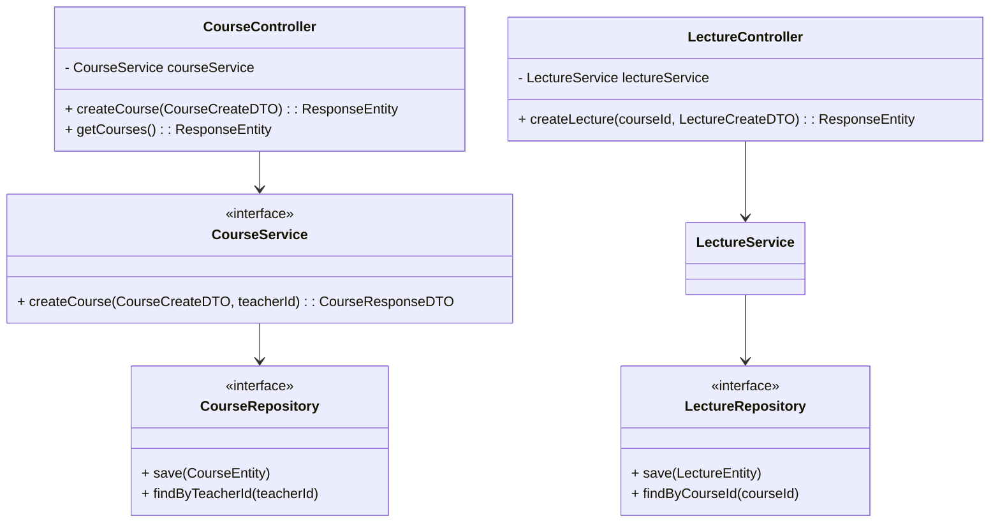

# Thiết kế Thực thể, DTO & Biểu đồ lớp: Quản lý Đào tạo

## 1. Lớp Thực thể (Entity)
- **CategoryEntity**: `id`, `name`, `description`.
- **CourseEntity**: `id`, `title`, `description`, `price`, `status`, `teacherId` (FK), `categoryId` (FK).
- **LectureEntity**: `id`, `title`, `contentUrl`, `courseId` (FK).
- **ExerciseEntity**: `id`, `question`, `correctAnswer`, `lectureId` (FK).

## 2. Data Transfer Object (DTO)
- **CourseCreateDTO**: `title`, `description`, `price`, `categoryId`.
- **CourseResponseDTO**: Thông tin chi tiết khóa học.
- **LectureCreateDTO**: `title`, `contentUrl`.
- **ExerciseCreateDTO**: `question`, `options` (nếu có), `correctAnswer`.

## 3. Biểu đồ Lớp (Class Diagram)

