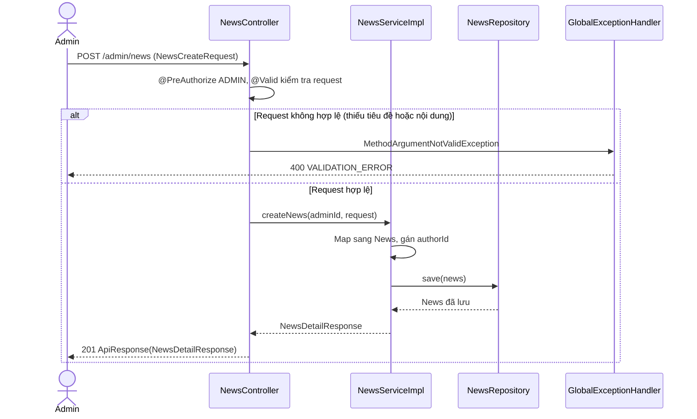
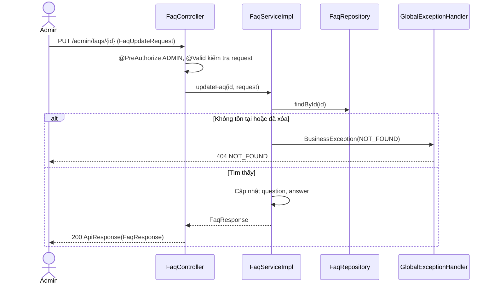

# Thiết kế API & Biểu đồ tuần tự: Quản lý Thông tin

Mọi endpoint chỉ dành cho `ADMIN` (QĐ2). Quy ước URL, response, phân trang và mã lỗi: xem [`../README.md`](../README.md).

## 1. Mô tả API Endpoints

### Tin tức (UC012)

| Method | URL | Request | Response (`data`) |
|---|---|---|---|
| GET | `/admin/news?title=` | Query + phân trang | 200 `{items: NewsSummaryResponse[], meta}` |
| GET | `/admin/news/{id}` | — | 200 `NewsDetailResponse` |
| POST | `/admin/news` | `NewsCreateRequest` | 201 `NewsDetailResponse` |
| PUT | `/admin/news/{id}` | `NewsUpdateRequest` | 200 `NewsDetailResponse` |
| DELETE | `/admin/news/{id}` | — | 200 `null` |

### Câu hỏi thường gặp (UC013)

| Method | URL | Request | Response (`data`) |
|---|---|---|---|
| GET | `/admin/faqs?question=` | Query + phân trang | 200 `{items: FaqResponse[], meta}` |
| GET | `/admin/faqs/{id}` | — | 200 `FaqResponse` |
| POST | `/admin/faqs` | `FaqCreateRequest` | 201 `FaqResponse` |
| PUT | `/admin/faqs/{id}` | `FaqUpdateRequest` | 200 `FaqResponse` |
| DELETE | `/admin/faqs/{id}` | — | 200 `null` |

## 2. Biểu đồ Tuần tự (Sequence Diagram) - Thêm Tin tức (UC012)

## 3. Biểu đồ Tuần tự (Sequence Diagram) - Sửa FAQ (UC013)

