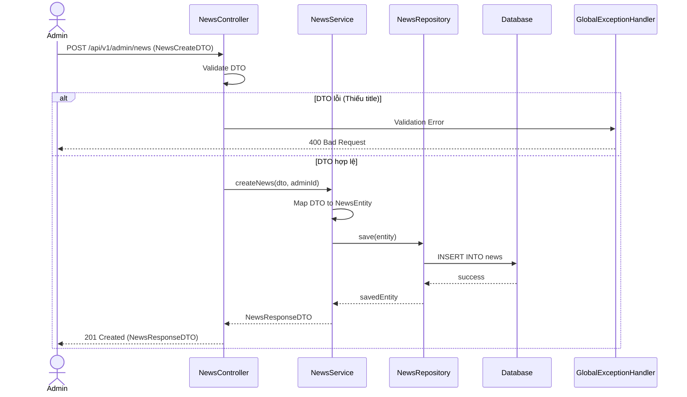

# Thiết kế API & Biểu đồ tuần tự: Quản lý Thông tin

## 1. Mô tả API Endpoints

- `GET /api/v1/news`: Lấy danh sách tin tức (Public).
- `POST /api/v1/admin/news`: QTV tạo tin tức mới.
- `PUT /api/v1/admin/news/{id}`: QTV sửa tin tức.
- `DELETE /api/v1/admin/news/{id}`: QTV xóa tin tức.
- `GET /api/v1/faqs`: Lấy danh sách FAQ (Public).
- `POST /api/v1/admin/faqs`: QTV tạo FAQ.

## 2. Biểu đồ Tuần tự (Sequence Diagram) - Thêm Tin tức

