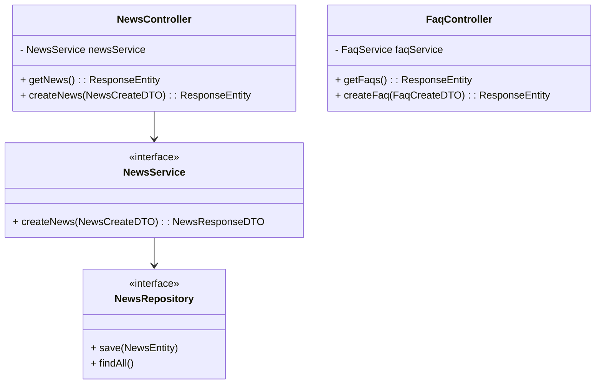

# Thiết kế Thực thể, DTO & Biểu đồ lớp: Quản lý Thông tin

## 1. Lớp Thực thể (Entity)
- **NewsEntity**: `id`, `title`, `content`, `thumbnail`, `authorId` (FK đến admin), `createdAt`.
- **FaqEntity**: `id`, `question`, `answer`, `createdAt`.

## 2. Data Transfer Object (DTO)
- **NewsCreateDTO**: `title` (@NotBlank), `content` (@NotBlank), `thumbnail`.
- **NewsResponseDTO**: `id`, `title`, `content`, `createdAt`.
- **FaqCreateDTO**: `question`, `answer`.

## 3. Biểu đồ Lớp (Class Diagram)

