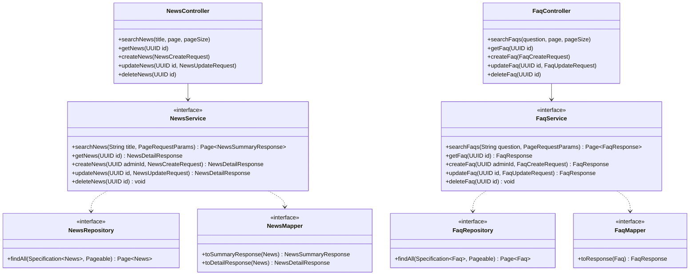

# Thiết kế Thực thể, DTO & Biểu đồ lớp: Quản lý Thông tin

Package `com.elearning.info`. Quy ước chung: xem [`../README.md`](../README.md). `authorId`, `createdBy` chỉ lưu id người
dùng, không có quan hệ ORM sang module `user` (rule 2.3).

## 1. Lớp Thực thể (Entity)

### `News` — bảng `news`

| Trường | Kiểu | Ràng buộc | Nguồn SRS |
|---|---|---|---|
| `id` | `UUID` | PK | |
| `title` | `String` | Bắt buộc, ≤ 255 | Bảng 2-27 |
| `content` | `String` (text) | Bắt buộc | Bảng 2-27 |
| `authorId` | `UUID` | QTV tạo tin | |
| `createdAt`, `updatedAt`, `deletedAt` | `Instant` | | |

### `Faq` — bảng `faqs`

| Trường | Kiểu | Ràng buộc | Nguồn SRS |
|---|---|---|---|
| `id` | `UUID` | PK | |
| `question` | `String` (text) | Bắt buộc | Bảng 2-29 |
| `answer` | `String` (text) | Bắt buộc | Bảng 2-29 |
| `createdBy` | `UUID` | QTV tạo FAQ | |
| `createdAt`, `updatedAt`, `deletedAt` | `Instant` | | |

## 2. Data Transfer Object (DTO)

### Request (`dto/request/`)

| DTO | Trường | Validate |
|---|---|---|
| `NewsCreateRequest`, `NewsUpdateRequest` | `title` | `@NotBlank @Size(max = 255)` |
| | `content` | `@NotBlank` |
| `FaqCreateRequest`, `FaqUpdateRequest` | `question` | `@NotBlank` |
| | `answer` | `@NotBlank` |

Tìm kiếm nhận trực tiếp query param `title` (tin tức) và `question` (FAQ).

### Response (`dto/response/`)

| DTO | Trường |
|---|---|
| `NewsSummaryResponse` | `id`, `title`, `createdAt` |
| `NewsDetailResponse` | `id`, `title`, `content`, `authorId`, `createdAt`, `updatedAt` |
| `FaqResponse` | `id`, `question`, `answer`, `createdAt`, `updatedAt` |

## 3. Biểu đồ Lớp (Class Diagram)

Mũi tên nét đứt từ service là phụ thuộc của lớp `*ServiceImpl` tương ứng.

Controller trả `ApiResponse` của DTO tương ứng ở `api.md`; diagram lược bớt kiểu trả về của controller cho gọn.
Tìm kiếm dùng `SpecificationUtils.containsIgnoreCase("title" / "question", chuỗi)` của `common/util/`.
