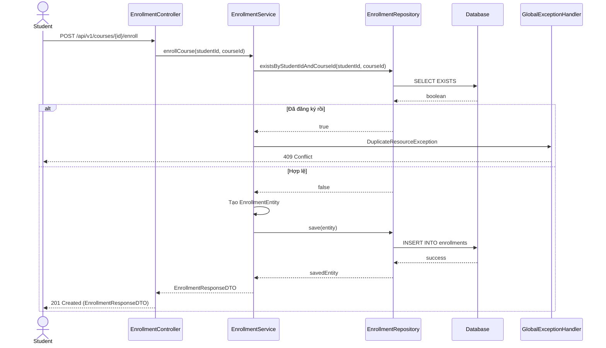

# Thiết kế API & Biểu đồ tuần tự: Module Học tập

## 1. Mô tả API Endpoints

- `POST /api/v1/courses/{courseId}/enroll`: Học viên ghi danh vào khóa học.
- `GET /api/v1/users/me/enrollments`: Lấy danh sách khóa học đang theo học.
- `POST /api/v1/lectures/{lectureId}/submit`: Nộp bài tập trắc nghiệm của bài giảng.
- `GET /api/v1/lectures/{lectureId}/comments`: Xem bình luận của bài giảng.
- `POST /api/v1/lectures/{lectureId}/comments`: Đăng bình luận.

## 2. Biểu đồ Tuần tự (Sequence Diagram) - Đăng ký Khóa học

