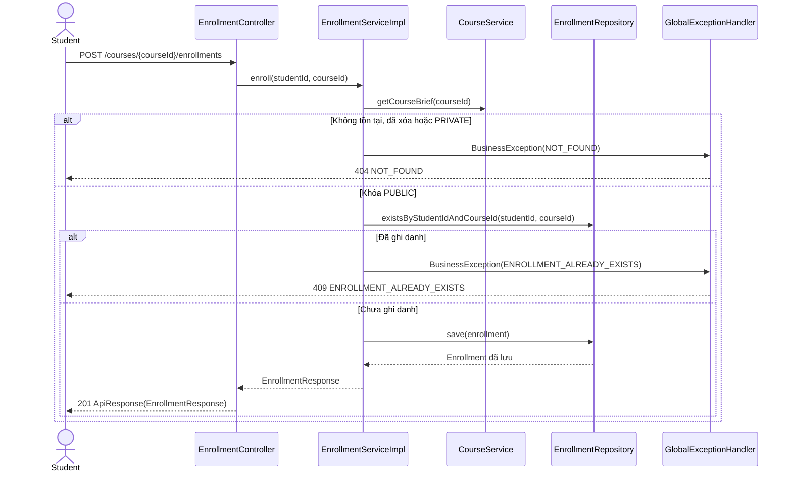
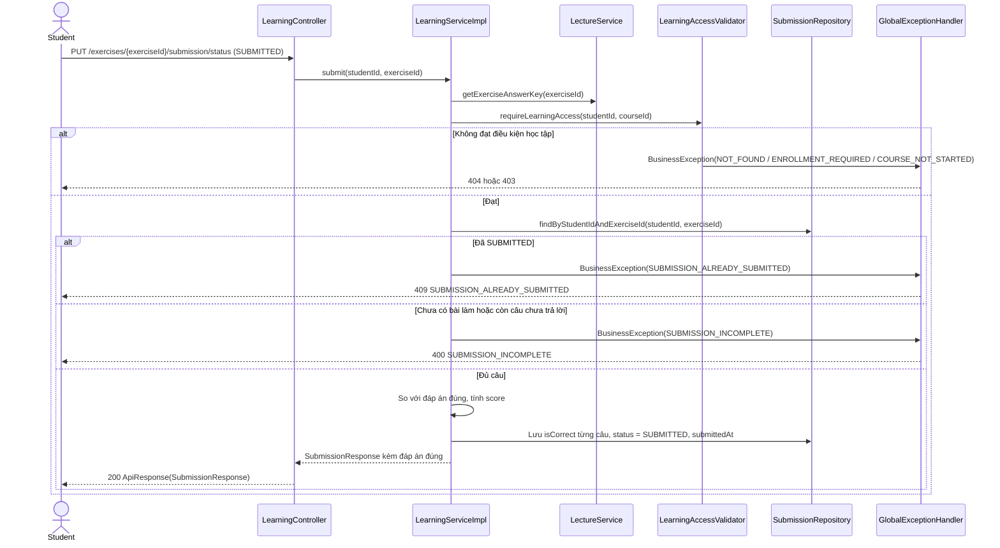

# Thiết kế API & Biểu đồ tuần tự: Module Học tập

Quy ước URL, response, phân trang và mã lỗi: xem [`../README.md`](../README.md). Điều kiện học tập (khóa `PUBLIC`, đã ghi
danh, đã tới ngày bắt đầu): xem [`use-case.md`](use-case.md).

## 1. Mô tả API Endpoints

### Học viên (UC016)

| Method | URL | Request | Response (`data`) |
|---|---|---|---|
| POST | `/courses/{courseId}/enrollments` | — | 201 `EnrollmentResponse` |
| GET | `/my-courses?name=&code=` | Query + phân trang | 200 `{items: EnrollmentResponse[], meta}` |
| GET | `/my-courses/{courseId}/lectures` | — | 200 `MyLectureSummaryResponse[]` |
| GET | `/my-courses/{courseId}/lectures/{id}` | — | 200 `MyLectureDetailResponse` |
| PUT | `/lectures/{lectureId}/completion` | — | 200 `null` |
| PUT | `/exercises/{exerciseId}/submission` | `SubmissionSaveRequest` | 200 `SubmissionResponse` |
| PUT | `/exercises/{exerciseId}/submission/status` | `SubmissionStatusUpdateRequest` | 200 `SubmissionResponse` |
| GET | `/exercises/{exerciseId}/submission` | — | 200 `SubmissionResponse` |
| GET | `/lectures/{lectureId}/comments` | Phân trang theo bình luận gốc | 200 `{items: CommentResponse[], meta}` |
| POST | `/lectures/{lectureId}/comments` | `CommentCreateRequest` | 201 `CommentResponse` |
| PUT | `/comments/{id}` | `CommentUpdateRequest` | 200 `CommentResponse` |
| DELETE | `/comments/{id}` | — | 200 `null` |

Mọi endpoint ở bảng trên chỉ dành cho `STUDENT`.

### Giảng viên, Quản trị viên (UC014)

| Method | URL | Vai trò | Request | Response (`data`) |
|---|---|---|---|---|
| GET | `/course-histories?name=&code=` | `TEACHER`, `ADMIN` | Query + phân trang | 200 `{items: CourseHistoryResponse[], meta}` |
| GET | `/course-histories/{courseId}/students` | `TEACHER` chủ khóa học, `ADMIN` | Phân trang | 200 `{items: EnrolledStudentResponse[], meta}` |

Ví dụ lưu tạm `PUT /exercises/{exerciseId}/submission`:

```json
{ "answers": [ { "question_id": "8b2e...", "answer_id": "c41a..." } ] }
```

Ví dụ nộp bài `PUT /exercises/{exerciseId}/submission/status`:

```json
{ "status": "SUBMITTED" }
```

## 2. Biểu đồ Tuần tự (Sequence Diagram) - Ghi danh Khóa học (UC016)



Hai request ghi danh cùng lúc được chặn bởi unique `(student_id, course_id)`. Lỗi trùng khóa từ DB cũng trả
`ENROLLMENT_ALREADY_EXISTS`.

## 3. Biểu đồ Tuần tự (Sequence Diagram) - Nộp bài tập (UC016)


