# Thiết kế Thực thể, DTO & Biểu đồ lớp: Module Học tập

Package `com.elearning.learning`. Quy ước chung: xem [`../README.md`](../README.md). Các trường `studentId`, `userId`,
`courseId`, `lectureId`, `exerciseId`, `questionId`, `answerId` chỉ lưu id, không có quan hệ ORM sang module `user` hay
`course` (rule 2.3).

## 1. Lớp Thực thể (Entity)

### `Enrollment` — bảng `enrollments`

| Trường | Kiểu | Ràng buộc |
|---|---|---|
| `id` | `UUID` | PK |
| `studentId` | `UUID` | Bắt buộc |
| `courseId` | `UUID` | Bắt buộc |
| `enrolledAt` | `Instant` | Bắt buộc |

Unique `(student_id, course_id)`. Không lưu tiến độ; tiến độ tính khi đọc (README mục 3).

### `LectureCompletion` — bảng `lecture_completions`

| Trường | Kiểu | Ràng buộc |
|---|---|---|
| `id` | `UUID` | PK |
| `studentId` | `UUID` | Bắt buộc |
| `courseId` | `UUID` | Bắt buộc, để đếm theo khóa học |
| `lectureId` | `UUID` | Bắt buộc |
| `completedAt` | `Instant` | Bắt buộc |

Unique `(student_id, lecture_id)`.

### `Submission` — bảng `submissions`

| Trường | Kiểu | Ràng buộc |
|---|---|---|
| `id` | `UUID` | PK |
| `studentId` | `UUID` | Bắt buộc |
| `exerciseId` | `UUID` | Bắt buộc |
| `status` | `SubmissionStatus` | Bắt buộc, mặc định `DRAFT` |
| `score` | `Integer` | Số câu đúng; `null` khi chưa nộp |
| `totalQuestions` | `Integer` | Số câu khi nộp; `null` khi chưa nộp |
| `submittedAt` | `Instant` | `null` khi chưa nộp |
| `createdAt`, `updatedAt` | `Instant` | |

Unique `(student_id, exercise_id)`.

### `SubmissionAnswer` — bảng `submission_answers`

| Trường | Kiểu | Ràng buộc |
|---|---|---|
| `id` | `UUID` | PK |
| `submissionId` | `UUID` | Bắt buộc |
| `questionId` | `UUID` | Bắt buộc |
| `answerId` | `UUID` | Bắt buộc |
| `isCorrect` | `Boolean` | Ghi khi nộp; `null` khi còn `DRAFT` |

Unique `(submission_id, question_id)`.

### `Comment` — bảng `comments`

| Trường | Kiểu | Ràng buộc |
|---|---|---|
| `id` | `UUID` | PK |
| `lectureId` | `UUID` | Bắt buộc |
| `userId` | `UUID` | Bắt buộc, tác giả |
| `parentId` | `UUID` | `null` là bình luận gốc; nếu có thì là id một bình luận gốc cùng bài giảng |
| `content` | `String` (text) | Bắt buộc |
| `createdAt`, `updatedAt`, `deletedAt` | `Instant` | |

## 2. Enum

`SubmissionStatus` (`DRAFT`, `SUBMITTED`) đặt ở `learning/enums/`.

## 3. Data Transfer Object (DTO)

### Request (`dto/request/`)

| DTO | Trường | Validate |
|---|---|---|
| `SubmissionSaveRequest` | `answers` | `@NotEmpty @Valid List<SubmissionAnswerRequest>` |
| `SubmissionAnswerRequest` | `questionId`, `answerId` | `@NotNull` |
| `SubmissionStatusUpdateRequest` | `status` | `@NotNull`; chỉ chấp nhận `SUBMITTED` |
| `CommentCreateRequest` | `content` | `@NotBlank` |
| | `parentId` | Tùy chọn |
| `CommentUpdateRequest` | `content` | `@NotBlank` |

`/my-courses` và `/course-histories` nhận trực tiếp query param `name`, `code`, không có DTO riêng.

### Response (`dto/response/`)

| DTO | Trường |
|---|---|
| `EnrollmentResponse` | `courseId`, `code`, `title`, `imageUrl`, `teacherName`, `startDate`, `endDate`, `progress` (0–100), `enrolledAt` |
| `MyLectureSummaryResponse` | `id`, `title`, `completed` |
| `MyLectureDetailResponse` | `id`, `courseId`, `title`, `description`, `contentUrl`, `completed`, `exercises [{id, title, description, submissionStatus, questions [{id, content, answers [{id, content}]}]}]` |
| `SubmissionResponse` | `exerciseId`, `status`, `score`, `totalQuestions`, `submittedAt`, `answers [{questionId, answerId, isCorrect, correctAnswerId}]`; `isCorrect`, `correctAnswerId` là `null` khi còn `DRAFT` |
| `CommentResponse` | `id`, `lectureId`, `parentId`, `content`, `author {id, fullName}`, `createdAt`, `updatedAt`, `replies [CommentResponse]` |
| `CourseHistoryResponse` | `courseId`, `code`, `title`, `status`, `startDate`, `endDate`, `studentCount` |
| `EnrolledStudentResponse` | `studentId`, `fullName`, `email`, `enrolledAt`, `progress` |

## 4. Biểu đồ Lớp (Class Diagram)

Mũi tên nét đứt từ service là phụ thuộc của lớp `*ServiceImpl` tương ứng.

```mermaid
classDiagram
    class EnrollmentController {
        +enroll(UUID courseId)
        +getMyCourses(name, code, page, pageSize)
    }

    class LearningController {
        +getMyLectures(UUID courseId)
        +getMyLecture(UUID courseId, UUID id)
        +completeLecture(UUID lectureId)
        +saveSubmission(UUID exerciseId, SubmissionSaveRequest)
        +updateSubmissionStatus(UUID exerciseId, SubmissionStatusUpdateRequest)
        +getSubmission(UUID exerciseId)
    }

    class CommentController {
        +getComments(UUID lectureId, page, pageSize)
        +createComment(UUID lectureId, CommentCreateRequest)
        +updateComment(UUID id, CommentUpdateRequest)
        +deleteComment(UUID id)
    }

    class CourseHistoryController {
        +getCourseHistories(name, code, page, pageSize)
        +getEnrolledStudents(UUID courseId, page, pageSize)
    }

    class EnrollmentService {
        <<interface>>
        +enroll(UUID studentId, UUID courseId) EnrollmentResponse
        +getMyCourses(UUID studentId, String name, String code, PageRequestParams) Page~EnrollmentResponse~
        +getCourseHistories(UUID viewerId, boolean isAdmin, String name, String code, PageRequestParams) Page~CourseHistoryResponse~
        +getEnrolledStudents(UUID viewerId, boolean isAdmin, UUID courseId, PageRequestParams) Page~EnrolledStudentResponse~
    }

    class LearningService {
        <<interface>>
        +getMyLectures(UUID studentId, UUID courseId) List~MyLectureSummaryResponse~
        +getMyLecture(UUID studentId, UUID courseId, UUID lectureId) MyLectureDetailResponse
        +completeLecture(UUID studentId, UUID lectureId) void
        +saveSubmission(UUID studentId, UUID exerciseId, SubmissionSaveRequest) SubmissionResponse
        +submit(UUID studentId, UUID exerciseId) SubmissionResponse
        +getSubmission(UUID studentId, UUID exerciseId) SubmissionResponse
    }

    class CommentService {
        <<interface>>
        +getComments(UUID studentId, UUID lectureId, PageRequestParams) Page~CommentResponse~
        +createComment(UUID studentId, UUID lectureId, CommentCreateRequest) CommentResponse
        +updateComment(UUID studentId, UUID id, CommentUpdateRequest) CommentResponse
        +deleteComment(UUID studentId, UUID id) void
    }

    class LearningAccessValidator {
        +requireLearningAccess(UUID studentId, UUID courseId) CourseBriefResponse
    }

    class ProgressCalculator {
        +calculate(UUID studentId, Collection~UUID~ courseIds) List~CourseProgress~
    }

    class EnrollmentRepository {
        <<interface>>
        +existsByStudentIdAndCourseId(UUID studentId, UUID courseId) boolean
        +findByStudentId(UUID studentId) List~Enrollment~
        +findByCourseId(UUID courseId, Pageable) Page~Enrollment~
        +countByCourseIdIn(Collection~UUID~ courseIds) List~CourseStudentCount~
    }

    class LectureCompletionRepository {
        <<interface>>
        +existsByStudentIdAndLectureId(UUID studentId, UUID lectureId) boolean
        +findByStudentIdAndCourseIdIn(UUID studentId, Collection~UUID~ courseIds) List~LectureCompletion~
    }

    class SubmissionRepository {
        <<interface>>
        +findByStudentIdAndExerciseId(UUID studentId, UUID exerciseId) Optional~Submission~
    }

    class CommentRepository {
        <<interface>>
        +findByIdAndUserId(UUID id, UUID userId) Optional~Comment~
        +findByLectureIdAndParentIdIsNull(UUID lectureId, Pageable) Page~Comment~
        +findByParentIdIn(Collection~UUID~ parentIds) List~Comment~
    }

    class CourseService {
        <<interface>>
    }
    class LectureService {
        <<interface>>
    }
    class UserService {
        <<interface>>
    }

    EnrollmentController --> EnrollmentService
    LearningController --> LearningService
    CommentController --> CommentService
    CourseHistoryController --> EnrollmentService
    EnrollmentService ..> EnrollmentRepository
    EnrollmentService ..> ProgressCalculator
    EnrollmentService ..> CourseService
    EnrollmentService ..> UserService
    LearningService ..> LearningAccessValidator
    LearningService ..> LectureCompletionRepository
    LearningService ..> SubmissionRepository
    LearningService ..> LectureService
    CommentService ..> LearningAccessValidator
    CommentService ..> CommentRepository
    CommentService ..> LectureService
    CommentService ..> UserService
    LearningAccessValidator ..> CourseService
    LearningAccessValidator ..> EnrollmentRepository
    ProgressCalculator ..> LectureCompletionRepository
    ProgressCalculator ..> LectureService
```

Ghi chú:

- Controller trả `ApiResponse` của DTO tương ứng ở `api.md`; diagram lược bớt kiểu trả về của controller cho gọn.
- `LearningAccessValidator` (thư mục `validator/`) kiểm tra điều kiện học tập theo thứ tự ở `use-case.md`, dùng chung cho học
  bài, nộp bài và bình luận.
- `ProgressCalculator` (thư mục `helper/`) lấy id bài giảng hiện có qua `LectureService.getLectureIds`, đếm
  `LectureCompletion` của học viên trong các id đó, nên bài giảng đã xóa không bị tính. `CourseProgress` (`courseId`,
  `progress`) là record nội bộ.
- `CourseStudentCount` (`courseId`, `studentCount`) là projection của `EnrollmentRepository`.
- Controller lấy `isAdmin` từ vai trò trong security context. Khi `isAdmin` = false, `getCourseHistories` gọi
  `CourseService.searchCourseBriefs` với `teacherId` của người xem; `getEnrolledStudents` kiểm tra khóa học thuộc giảng viên
  đó, không đạt thì trả `NOT_FOUND`.
