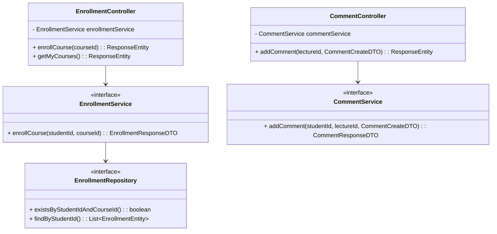

# Thiết kế Thực thể, DTO & Biểu đồ lớp: Module Học tập

## 1. Lớp Thực thể (Entity)
- **EnrollmentEntity**: `id`, `studentId` (FK), `courseId` (FK), `progress`, `enrolledAt`.
- **ExerciseResultEntity**: `id`, `studentId` (FK), `exerciseId` (FK), `isCorrect`, `submittedAt`.
- **CommentEntity**: `id`, `lectureId` (FK), `userId` (FK), `content`, `createdAt`.

## 2. Data Transfer Object (DTO)
- **EnrollmentResponseDTO**: `id`, `courseName`, `progress`.
- **ExerciseSubmitDTO**: `exerciseId`, `studentAnswer`.
- **CommentCreateDTO**: `content`.
- **CommentResponseDTO**: `id`, `content`, `authorName`, `createdAt`.

## 3. Biểu đồ Lớp (Class Diagram)

