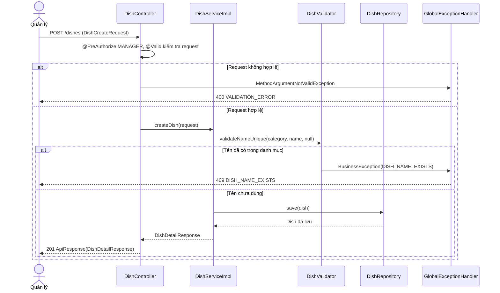
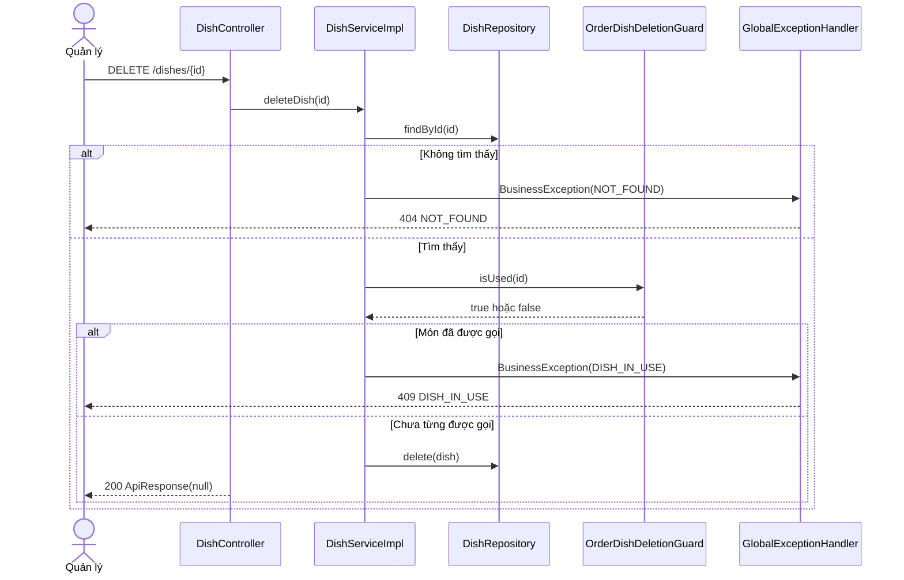

# Thiết kế API & Biểu đồ tuần tự: Quản lý Món ăn & Thực đơn

Quy ước URL, response, phân trang và mã lỗi: xem [`../README.md`](../README.md).

## 1. Mô tả API Endpoints

| Method | URL | Vai trò | UC | Request | Response (`data`) |
|---|---|---|---|---|---|
| GET | `/menu/categories` | Công khai | UC012 | — | 200 `MenuCategoryResponse[]` |
| GET | `/menu/dishes` | Công khai | UC007, UC012 | Query `DishSearchRequest` + phân trang | 200 `{items: DishSummaryResponse[], meta}` |
| GET | `/menu/dishes/{id}` | Công khai | UC012 | — | 200 `DishDetailResponse` |
| GET | `/dishes` | `MANAGER` | UC007, UC010 | Query `DishSearchRequest` + phân trang | 200 `{items: DishSummaryResponse[], meta}` |
| GET | `/dishes/{id}` | `MANAGER` | UC010 | — | 200 `DishDetailResponse` |
| POST | `/dishes` | `MANAGER` | UC010 | `DishCreateRequest` | 201 `DishDetailResponse` |
| PUT | `/dishes/{id}` | `MANAGER` | UC010 | `DishUpdateRequest` | 200 `DishDetailResponse` |
| PUT | `/dishes/{id}/image` | `MANAGER` | UC010 | multipart, field `file` | 200 `DishDetailResponse` |
| DELETE | `/dishes/{id}` | `MANAGER` | UC010 | — | 200 `null` |

Ghi chú:

- Ba endpoint `/menu/**` là `GET` công khai và đã được mở trong `SecurityConfig`; ảnh món phục vụ qua `/files/dishes/...` (cũng công khai).
- `sort_by` nhận `name` (mặc định), `price`, `category`, `created_at`. Client thực đơn nên gửi `sort_order=asc` vì mặc định của
  `PageRequestParams` là `desc`.
- `/menu/dishes` luôn thêm điều kiện `status IN (AVAILABLE, OUT_OF_STOCK)` ở service, không tin tham số client.
- Hàm nội bộ cho module khác: `DishService.getDishesForOrdering(Collection<UUID> ids)` trả `DishOrderingView(id, name, price, status)`;
  id không tồn tại → 404 `NOT_FOUND`. `ordering` tự kiểm `status == AVAILABLE`.

Ví dụ `GET /menu/dishes?category=MAIN_COURSE&sort_by=name&sort_order=asc`:

```json
{
  "success": true,
  "data": {
    "items": [
      {
        "id": "7b0c2d9e-2f0b-4d6e-8d63-0c3f6a0f2a11",
        "name": "Phở bò tái",
        "category": "MAIN_COURSE",
        "price": 65000,
        "unit": "Tô",
        "image_url": "/files/dishes/3f2a9c.jpg",
        "status": "AVAILABLE"
      }
    ],
    "meta": { "page": 1, "page_size": 20, "total_items": 1, "total_pages": 1 }
  },
  "msg": ""
}
```

## 2. Biểu đồ Tuần tự (Sequence Diagram) - Thêm món ăn (UC010)



Hai request thêm cùng tên chạy song song cùng qua `validateNameUnique`; unique index `uq_dishes_category_name` bắt lỗi ở lần `save`
thứ hai và `DataIntegrityViolationException` được đổi thành `DISH_NAME_EXISTS`.

## 3. Biểu đồ Tuần tự (Sequence Diagram) - Xóa món ăn (UC010)



Race giữa xóa món và gửi bếp có món đó: `order_items.dish_id` không có khóa ngoại (khác module) nên `ordering` kiểm `status` và tồn
tại món khi gọi (`getDishesForOrdering` trả 404 nếu món vừa bị xóa). Không dùng khóa bi quan vì hiếm gặp.
