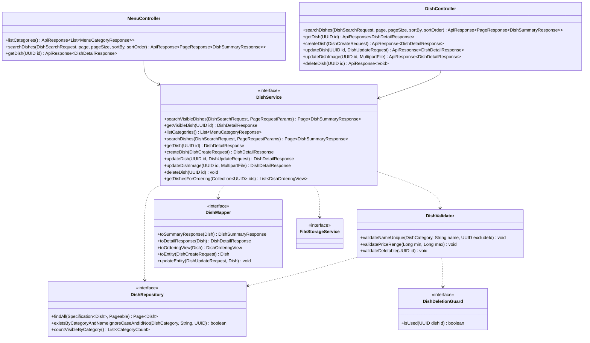

# Thiết kế Thực thể, DTO & Biểu đồ lớp: Quản lý Món ăn & Thực đơn

Package `com.restaurant.modules.menu`. Quy ước chung: xem [`../README.md`](../README.md).

## 1. Lớp Thực thể (Entity)

### `Dish` (bảng `dishes`)

Kế thừa `AssignedIdEntity`. Xóa cứng, không `@SQLRestriction`.

| Cột | Kiểu | Ghi chú |
|---|---|---|
| `id` | `uuid` PK | |
| `name` | `varchar(255)` | Bắt buộc |
| `category` | `varchar(20)` | `DishCategory`; `CHECK` |
| `price` | `bigint` | VND, `CHECK (price > 0)` |
| `unit` | `varchar(20)` | Đơn vị tính (Tô, Đĩa, Ly...) |
| `description` | `varchar(1000)` | Tùy chọn |
| `prep_time_minutes` | `integer` | Tùy chọn, `CHECK (prep_time_minutes > 0)` |
| `image_url` | `varchar(500)` | URL do `FileStorageService` trả về |
| `status` | `varchar(20)` | `DishStatus`; `CHECK` |
| `created_at`, `updated_at` | `timestamptz` | |

Index và ràng buộc:

- `uq_dishes_category_name`: `UNIQUE (category, lower(name))`.
- `ix_dishes_status_category`: `(status, category)` cho `/menu/dishes`.

Không dùng `@Version`: hai Quản lý sửa cùng lúc là hiếm, giá trị cuối thắng.

## 2. Data Transfer Object (DTO)

### Request (`dto/request/`)

| DTO | Trường | Validate |
|---|---|---|
| `DishSearchRequest` (query param) | `name` | Tùy chọn, tìm theo chuỗi con |
| | `category` | Tùy chọn, `DishCategory` |
| | `minPrice`, `maxPrice` | Tùy chọn, `@PositiveOrZero`; `minPrice ≤ maxPrice` kiểm ở service |
| | `status` | Tùy chọn, `DishStatus`; `/menu/dishes` từ chối `DISCONTINUED` |
| `DishCreateRequest` | `name` | `@NotBlank @Size(max = 255)` |
| | `category` | `@NotNull` |
| | `price` | `@NotNull @Positive` |
| | `unit` | `@NotBlank @Size(max = 20)` |
| | `description` | `@Size(max = 1000)` |
| | `prepTimeMinutes` | `@Positive`, tùy chọn |
| | `status` | `@NotNull` |
| `DishUpdateRequest` | Như `DishCreateRequest` | Hai DTO tách nhau dù trùng trường (rule 2.4) để sau này khác nhau không ảnh hưởng nhau |

`price` kiểu `Long`. Ảnh không nằm trong request JSON mà qua `PUT /dishes/{id}/image`. Trùng tên trong danh mục kiểm tra ở
`DishValidator`.

### Response (`dto/response/`)

| DTO | Trường |
|---|---|
| `DishSummaryResponse` | `id`, `name`, `category`, `price`, `unit`, `imageUrl`, `status` |
| `DishDetailResponse` | `id`, `name`, `category`, `price`, `unit`, `description`, `prepTimeMinutes`, `imageUrl`, `status`, `createdAt`, `updatedAt` |
| `MenuCategoryResponse` | `category`, `dishCount` (số món `AVAILABLE`/`OUT_OF_STOCK`); tên tiếng Việt do client ánh xạ từ `category` |
| `DishOrderingView` | `id`, `name`, `price`, `status` (record nội bộ cho `ordering`, không có endpoint) |

## 3. Biểu đồ Lớp (Class Diagram)

Mũi tên nét đứt từ service là phụ thuộc của lớp `*ServiceImpl` tương ứng.

Ghi chú:

- `searchVisibleDishes`, `getVisibleDish`, `listCategories` dành cho `MenuController` công khai và luôn lọc `status IN (AVAILABLE, OUT_OF_STOCK)`;
  `searchDishes`, `getDish` dành cho Quản lý, thấy mọi trạng thái.
- `DishDeletionGuard` do `menu` định nghĩa, `order` implement (`OrderDishDeletionGuard`: tồn tại `order_items` với `dish_id`). Hóa đơn
  luôn có đơn tương ứng nên không cần guard riêng của `billing`.
- `unitPrice` của dòng món là ảnh chụp từ `DishOrderingView.price` lúc gửi bếp, nên sửa giá món không đụng đơn đang mở.
- `getDishesForOrdering` chỉ đọc, `@Transactional(readOnly = true)`.
