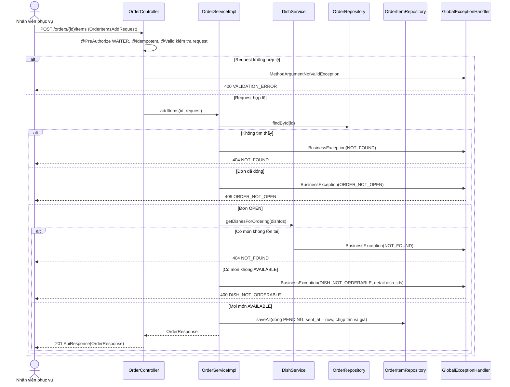
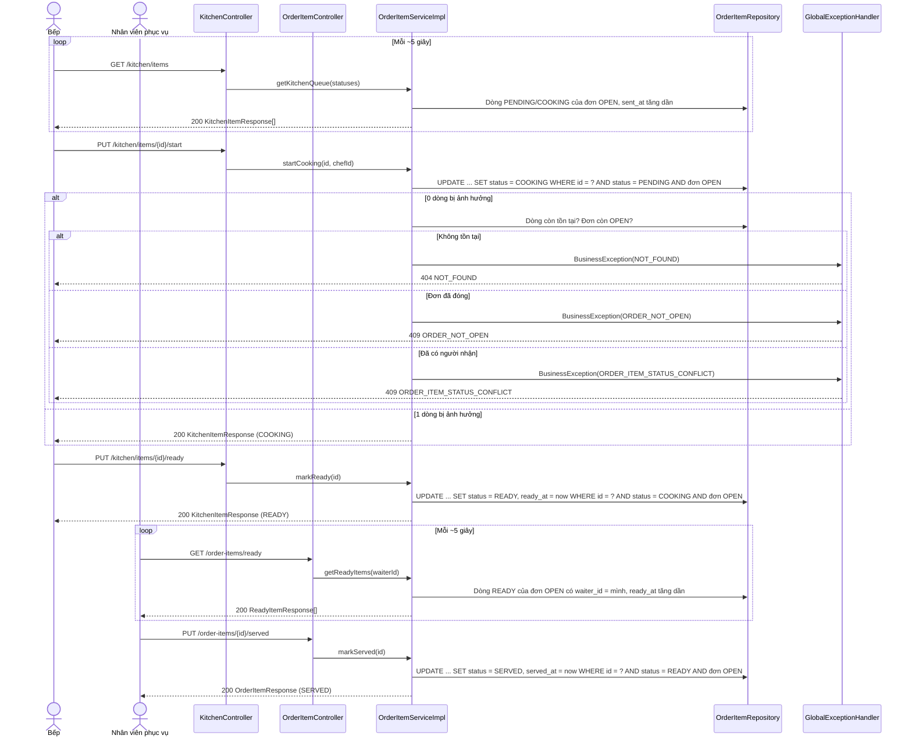

# Thiết kế API & Biểu đồ tuần tự: Gọi món & Chế biến

Quy ước URL, response, phân trang và mã lỗi: xem [`../README.md`](../README.md).

## 1. Mô tả API Endpoints

| Method | URL | Vai trò | UC | Request | Response (`data`) |
|---|---|---|---|---|---|
| POST | `/orders` | `WAITER` | UC015 | `OrderOpenRequest` (+ `Idempotency-Key`) | 201 `OrderResponse` |
| GET | `/orders` | `WAITER`, `CASHIER` | UC015, UC018 | Query `OrderSearchRequest` + phân trang | 200 `{items: OrderSummaryResponse[], meta}` |
| GET | `/orders/{id}` | `WAITER`, `CASHIER` | UC015 | — | 200 `OrderResponse` |
| POST | `/orders/{id}/items` | `WAITER` | UC015 | `OrderItemsAddRequest` (+ `Idempotency-Key`) | 201 `OrderResponse` |
| DELETE | `/orders/{id}` | `WAITER` | UC015 | — | 200 `null` |
| GET | `/order-items/ready` | `WAITER` | UC015 | — | 200 `ReadyItemResponse[]` |
| PUT | `/order-items/{id}/served` | `WAITER` | UC015 | — | 200 `OrderItemResponse` |
| GET | `/kitchen/items` | `CHEF` | UC016 | Query `status` (tùy chọn) | 200 `KitchenItemResponse[]` |
| PUT | `/kitchen/items/{id}/start` | `CHEF` | UC016 | — | 200 `KitchenItemResponse` |
| PUT | `/kitchen/items/{id}/ready` | `CHEF` | UC016 | — | 200 `KitchenItemResponse` |

Ghi chú:

- `GET /orders` mặc định `status=OPEN`; `table_id` lọc theo bàn. `sort_by`: `opened_at` (mặc định), `closed_at`. Thu ngân dùng endpoint này để tìm đơn của bàn cần thanh toán.
- `GET /kitchen/items` và `GET /order-items/ready` là hàng đợi giới hạn (tối đa 200 dòng), trả mảng thường, không có `meta`. Cả hai sắp cũ nhất trước (`sent_at`, `ready_at`).
  Client gọi lại mỗi ~5 giây; response nhỏ, không cần `ETag` ở bản này.
- Các hàm đổi trạng thái dòng món là `PUT .../start`, `.../ready`, `.../served`; không nhận body. Dùng `PUT` vì idempotent về kết quả cuối; gọi lại khi đã qua trạng thái đó trả 409
  `ORDER_ITEM_STATUS_CONFLICT` để client biết thao tác đã có người làm.
- `POST /orders`, `POST /orders/{id}/items` gắn `@Idempotent`; `DELETE /orders/{id}` thì tự an toàn khi gọi lại (lần hai trả 404).
- `OrderItemsAddRequest` gồm `items` tối đa 50 dòng. Dòng món lưu `dish_name`, `unit_price` tại thời điểm gửi.
- Hàm nội bộ cho module khác (không có endpoint), chi tiết ở `lopthucthe.md`: `openOrder` (cho `reservation`), `lockOrderForPayment`, `closeOrder` (cho `billing`).

Ví dụ `POST /orders/{id}/items`:

```json
{
  "items": [
    { "dish_id": "7b0c2d9e-2f0b-4d6e-8d63-0c3f6a0f2a11", "quantity": 2, "note": "Không hành, ít cay" },
    { "dish_id": "2e4f8a10-5d12-4c8b-9a77-5a1d3e9b7c02", "quantity": 1 }
  ]
}
```

Ví dụ lỗi món không gọi được:

```json
{
  "success": false,
  "error": {
    "code": "DISH_NOT_ORDERABLE",
    "message": "Có món đang hết hoặc ngừng bán.",
    "fields": [],
    "detail": { "dish_ids": ["2e4f8a10-5d12-4c8b-9a77-5a1d3e9b7c02"] }
  }
}
```

## 2. Biểu đồ Tuần tự (Sequence Diagram) - Gọi món và gửi bếp (UC015)



## 3. Biểu đồ Tuần tự (Sequence Diagram) - Bếp chế biến và phục vụ món (UC016, UC015)



Ba hàm `startCooking`, `markReady`, `markServed` dùng chung cách xử lý 0 dòng bị ảnh hưởng: phân biệt `NOT_FOUND`, `ORDER_NOT_OPEN`, `ORDER_ITEM_STATUS_CONFLICT`.
