# Thiết kế Thực thể, DTO & Biểu đồ lớp: Gọi món & Chế biến

Package `com.restaurant.modules.order`. Quy ước chung: xem [`../README.md`](../README.md).

## 1. Lớp Thực thể (Entity)

### 1.1 `Order` (bảng `orders`)

Kế thừa `AssignedIdEntity`. Hai thực thể `Order` và `OrderItem` cùng module nên được phép dùng khóa ngoại và id (không dùng `@OneToMany`, `ArchitectureTest` cấm);
`OrderItem` giữ `orderId` thuần.

| Cột | Kiểu | Ghi chú |
|---|---|---|
| `id` | `uuid` PK | |
| `table_id` | `uuid` | Bàn của đơn. Không khóa ngoại (module `table`) |
| `reservation_id` | `uuid` | Có khi đơn mở lúc nhận bàn. Không khóa ngoại |
| `customer_id` | `uuid` | Sao chép từ đặt bàn lúc nhận bàn để hóa đơn gắn tài khoản khách hàng (A23). Không khóa ngoại |
| `waiter_id` | `uuid` | Người mở đơn / nhận bàn (A11). Không khóa ngoại |
| `status` | `varchar(20)` | `OrderStatus`; `CHECK` |
| `opened_at` | `timestamptz` | |
| `closed_at` | `timestamptz` | Có khi `CLOSED` |
| `created_at`, `updated_at` | `timestamptz` | |

Index và ràng buộc:

- `uq_orders_open_table`: `UNIQUE (table_id) WHERE status = 'OPEN'`; mỗi bàn một đơn `OPEN`.
- `ix_orders_status_opened (status, opened_at DESC)`.
- `ix_orders_waiter (waiter_id)`: `GET /order-items/ready` và guard xóa nhân viên.

### 1.2 `OrderItem` (bảng `order_items`)

| Cột | Kiểu | Ghi chú |
|---|---|---|
| `id` | `uuid` PK | |
| `order_id` | `uuid` | `REFERENCES orders (id)` (cùng module) |
| `dish_id` | `uuid` | Tham chiếu `dishes`, không khóa ngoại (module `menu`) |
| `dish_name` | `varchar(255)` | Ảnh chụp tên món lúc gửi bếp |
| `unit_price` | `bigint` | Ảnh chụp giá lúc gửi bếp, VND, `CHECK (unit_price > 0)` |
| `quantity` | `integer` | `CHECK (quantity BETWEEN 1 AND 99)` |
| `note` | `varchar(255)` | Tùy chọn |
| `status` | `varchar(20)` | `OrderItemStatus`; `CHECK` |
| `sent_at` | `timestamptz` | Lúc gửi bếp |
| `started_at` | `timestamptz` | Lúc Bếp nhận chế biến |
| `ready_at` | `timestamptz` | Lúc Bếp hoàn thành |
| `served_at` | `timestamptz` | Lúc phục vụ xác nhận |
| `chef_id` | `uuid` | Bếp nhận chế biến. Không khóa ngoại |
| `created_at`, `updated_at` | `timestamptz` | |

Index: `ix_order_items_order (order_id)`; `ix_order_items_queue (sent_at) WHERE status IN ('PENDING', 'COOKING')`; `ix_order_items_ready (ready_at) WHERE status = 'READY'`;
`ix_order_items_dish (dish_id)` cho `DishDeletionGuard`.

Dòng món không được sửa `dish_id`, `dish_name`, `unit_price`, `quantity`, `note` sau khi tạo; chỉ chuyển trạng thái. Đơn `CLOSED` và `OPEN` đều giữ nguyên dòng món để làm căn cứ
hóa đơn (hóa đơn chụp lại riêng, xem `billing`).

## 2. Data Transfer Object (DTO)

### Request (`dto/request/`)

| DTO | Trường | Validate |
|---|---|---|
| `OrderOpenRequest` | `tableId` | `@NotNull` |
| `OrderSearchRequest` (query param) | `status` | `OrderStatus`, mặc định `OPEN` |
| | `tableId` | Tùy chọn |
| `OrderItemsAddRequest` | `items` | `@NotEmpty @Size(max = 50) @Valid` |
| `OrderItemLineRequest` | `dishId` | `@NotNull` |
| | `quantity` | `@NotNull @Min(1) @Max(99)` |
| | `note` | `@Size(max = 255)` |
| (không có DTO riêng) `GET /kitchen/items` | `status` | `@RequestParam OrderItemStatus status`, tùy chọn, `PENDING` hoặc `COOKING`; bỏ trống = cả hai |

### Response (`dto/response/`)

| DTO | Trường |
|---|---|
| `OrderSummaryResponse` | `id`, `table` (`TableBriefResponse`), `status`, `waiterName`, `openedAt`, `itemCount`, `subtotal` |
| `OrderResponse` | `id`, `table`, `status`, `reservationId`, `waiter` (`UserBriefResponse`), `openedAt`, `closedAt`, `items` (`OrderItemResponse[]`), `subtotal`, `unservedCount` |
| `OrderItemResponse` | `id`, `dishId`, `dishName`, `unitPrice`, `quantity`, `lineTotal`, `note`, `status`, `sentAt`, `startedAt`, `readyAt`, `servedAt` |
| `KitchenItemResponse` | `id`, `orderId`, `tableName`, `dishName`, `quantity`, `note`, `status`, `sentAt`, `startedAt` |
| `ReadyItemResponse` | `id`, `orderId`, `tableName`, `dishName`, `quantity`, `note`, `readyAt` |
| `OpenOrderCommand` (record nội bộ) | `tableId`, `reservationId`, `customerId`, `waiterId`, `allowReservedTable` |
| `OrderPaymentView` (record nội bộ cho `billing`) | `orderId`, `tableId`, `reservationId`, `customerId`, `waiterId`, `openedAt`, `lines` (`PaymentLine[]`), `unservedCount` |
| `PaymentLine` | `dishId`, `dishName`, `unitPrice`, `quantity`, `status` |

`subtotal` = tổng `unit_price × quantity` của các dòng không `CANCELLED`; `unservedCount` = số dòng ở `PENDING`, `COOKING`, `READY` (dòng `CANCELLED` không tính). `lineTotal` tính khi đọc, không lưu.

## 3. Biểu đồ Lớp (Class Diagram)

Mũi tên nét đứt từ service là phụ thuộc của lớp `*ServiceImpl` tương ứng.

```mermaid
classDiagram
    class OrderController {
        +openOrder(OrderOpenRequest) ApiResponse~OrderResponse~
        +searchOrders(OrderSearchRequest, page, pageSize, sortBy, sortOrder) ApiResponse~PageResponse~OrderSummaryResponse~~
        +getOrder(UUID id) ApiResponse~OrderResponse~
        +addItems(UUID id, OrderItemsAddRequest) ApiResponse~OrderResponse~
        +cancelEmptyOrder(UUID id) ApiResponse~Void~
    }

    class OrderItemController {
        +getReadyItems() ApiResponse~List~ReadyItemResponse~~
        +markServed(UUID id) ApiResponse~OrderItemResponse~
    }

    class KitchenController {
        +getQueue(OrderItemStatus status) ApiResponse~List~KitchenItemResponse~~
        +startCooking(UUID id) ApiResponse~KitchenItemResponse~
        +markReady(UUID id) ApiResponse~KitchenItemResponse~
    }

    class OrderService {
        <<interface>>
        +openOrder(OpenOrderCommand) UUID
        +openOrderForWalkIn(UUID waiterId, OrderOpenRequest) OrderResponse
        +searchOrders(OrderSearchRequest, PageRequestParams) Page~OrderSummaryResponse~
        +getOrder(UUID id) OrderResponse
        +addItems(UUID id, OrderItemsAddRequest) OrderResponse
        +cancelEmptyOrder(UUID id) void
        +lockOrderForPayment(UUID id) OrderPaymentView
        +closeOrder(UUID id) void
    }

    class OrderItemService {
        <<interface>>
        +getKitchenQueue(Collection~OrderItemStatus~) List~KitchenItemResponse~
        +startCooking(UUID itemId, UUID chefId) KitchenItemResponse
        +markReady(UUID itemId) KitchenItemResponse
        +getReadyItems(UUID waiterId) List~ReadyItemResponse~
        +markServed(UUID itemId) OrderItemResponse
    }

    class OrderValidator {
        +validateOpen(Order) void
        +validateDishesOrderable(List~DishOrderingView~) void
        +validateCancellable(Order, boolean hasItems) void
    }

    class OrderRepository {
        <<interface>>
        +findAll(Specification~Order~, Pageable) Page~Order~
        +findByIdForUpdate(UUID id) Optional~Order~
        +existsOpenByTableId(UUID tableId) boolean
        +existsByWaiterId(UUID waiterId) boolean
    }

    class OrderItemRepository {
        <<interface>>
        +findByOrderIdOrderBySentAt(UUID orderId) List~OrderItem~
        +findQueue(Collection~OrderItemStatus~, Pageable) List~KitchenRow~
        +findReadyForWaiter(UUID waiterId, Pageable) List~ReadyRow~
        +markCooking(UUID id, UUID chefId, Instant now) int
        +markReady(UUID id, Instant now) int
        +markServed(UUID id, Instant now) int
        +existsByDishId(UUID dishId) boolean
        +existsByChefId(UUID chefId) boolean
    }

    class OrderMapper {
        <<interface>>
        +toOrderResponse(Order, List~OrderItem~, TableBriefResponse, UserBriefResponse) OrderResponse
        +toItemResponse(OrderItem) OrderItemResponse
        +toPaymentLine(OrderItem) PaymentLine
    }

    class TableService {
        <<interface>>
    }

    class DishService {
        <<interface>>
    }

    class UserService {
        <<interface>>
    }

    class OrderDishDeletionGuard
    class OrderTableDeletionGuard
    class OrderUserDeletionGuard

    OrderController --> OrderService
    OrderItemController --> OrderItemService
    KitchenController --> OrderItemService
    OrderService ..> OrderRepository
    OrderService ..> OrderItemRepository
    OrderService ..> OrderValidator
    OrderService ..> OrderMapper
    OrderService ..> TableService
    OrderService ..> DishService
    OrderService ..> UserService
    OrderItemService ..> OrderItemRepository
    OrderItemService ..> OrderRepository
    OrderItemService ..> TableService
    OrderDishDeletionGuard ..|> DishDeletionGuard
    OrderTableDeletionGuard ..|> TableDeletionGuard
    OrderUserDeletionGuard ..|> UserDeletionGuard
```

Ghi chú:

- `openOrder(OpenOrderCommand)` là API công khai cho `reservation`; `openOrderForWalkIn` dùng cho `POST /orders`. Cả hai gọi chung một hàm riêng chuyển bàn bằng
  `TableService.transitionStatus(tableId, allowReservedTable ? [AVAILABLE, RESERVED] : [AVAILABLE], OCCUPIED)`; trả `false` thì ném `ORDER_TABLE_NOT_OPENABLE`, rồi insert đơn
  (unique `uq_orders_open_table` là lớp chặn cuối).
- `lockOrderForPayment(id)` (`SELECT ... FOR UPDATE` trên `orders`, ném `ORDER_NOT_OPEN` nếu `CLOSED`) và `closeOrder(id)` dành cho `billing`. `billing` gọi cả hai trong
  một transaction duy nhất cùng với tạo hóa đơn và trả bàn (README mục 2.10); `closeOrder` chỉ đặt `status = CLOSED`, `closed_at = now`, không đụng bàn.
- `OrderItemRepository` có ba câu UPDATE có điều kiện `markCooking` (`PENDING` → `COOKING`, ghi `chef_id`, `started_at`), `markReady` (`COOKING` → `READY`, ghi `ready_at`) và
  `markServed` (`READY` → `SERVED`, ghi `served_at`); mỗi câu có dạng `UPDATE order_items SET status = :to, ... WHERE id = :id AND status = :from AND order_id IN (SELECT id FROM orders WHERE status = 'OPEN')`
  và trả số dòng bị ảnh hưởng.
- `findQueue` và `findReadyForWaiter` trả projection (`KitchenRow`, `ReadyRow`) đã join `orders` để lấy `table_id`; tên bàn lấy bằng một lần gọi `TableService.getTableBriefs`
  cho cả danh sách (không gọi từng dòng). `OrderItemService` cần `OrderRepository` để phân biệt lý do các câu UPDATE trên trả 0.
- Tên người phục vụ lấy qua `UserService.getUserBriefs` (một lần cho cả danh sách).
- Hàm đọc `@Transactional(readOnly = true)`; mọi hàm ghi `@Transactional`.
- Ba guard: `OrderDishDeletionGuard` = `existsByDishId`; `OrderTableDeletionGuard` = `existsOpenByTableId`; `OrderUserDeletionGuard` = `existsByWaiterId` hoặc `existsByChefId`.
