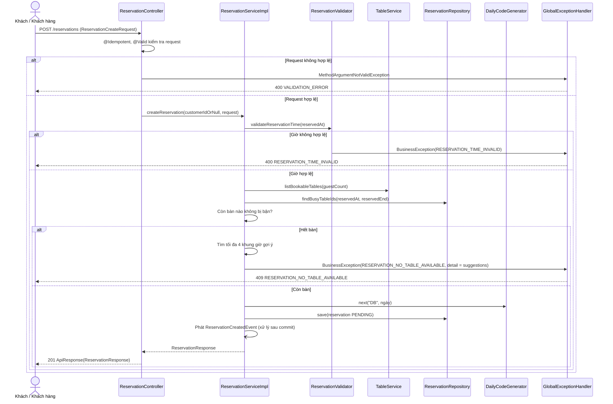
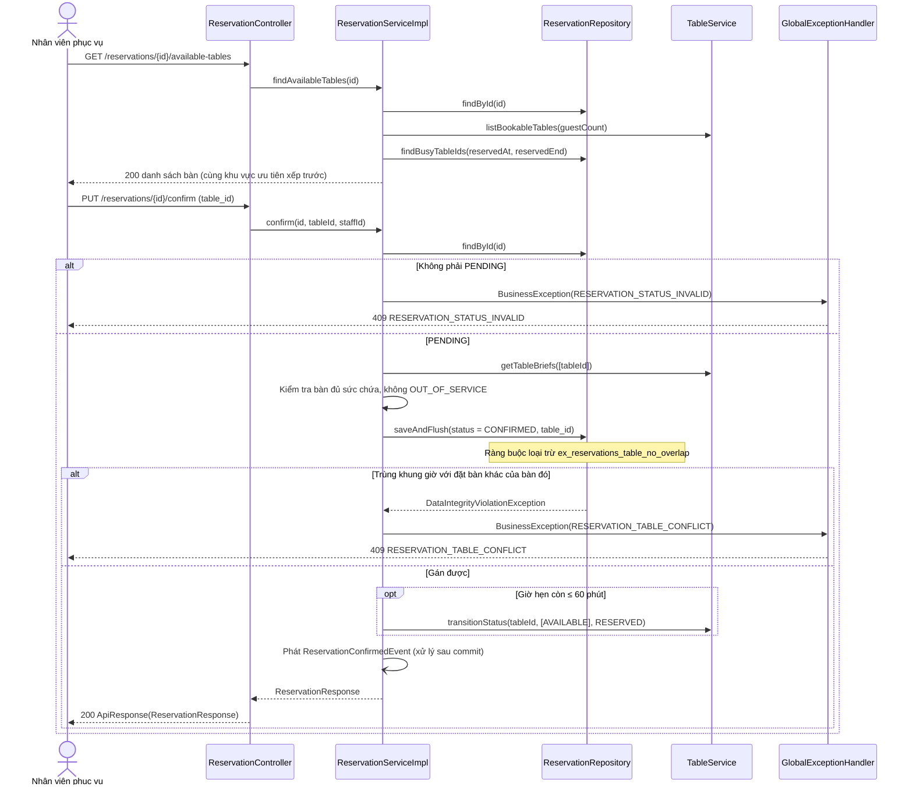

# Thiết kế API & Biểu đồ tuần tự: Đặt bàn

Quy ước URL, response, phân trang và mã lỗi: xem [`../README.md`](../README.md).

## 1. Mô tả API Endpoints

| Method | URL | Vai trò | UC | Request | Response (`data`) |
|---|---|---|---|---|---|
| GET | `/reservations/availability` | Công khai | UC013 | Query `AvailabilityRequest` | 200 `AvailabilityResponse` |
| POST | `/reservations` | Công khai (token tùy chọn) | UC013 | `ReservationCreateRequest` (+ `Idempotency-Key`) | 201 `ReservationResponse` |
| GET | `/reservations` | `WAITER`, `MANAGER` | UC007, UC014 | Query `ReservationSearchRequest` + phân trang | 200 `{items: ReservationSummaryResponse[], meta}` |
| GET | `/reservations/{id}` | `WAITER`, `MANAGER` | UC014 | — | 200 `ReservationResponse` |
| GET | `/reservations/{id}/available-tables` | `WAITER`, `MANAGER` | UC014 | — | 200 `TableBriefResponse[]` |
| PUT | `/reservations/{id}/confirm` | `WAITER`, `MANAGER` | UC014 | `ReservationConfirmRequest` | 200 `ReservationResponse` |
| PUT | `/reservations/{id}/reject-or-cancel` | `WAITER`, `MANAGER` | UC014 | `ReservationCancelRequest` | 200 `ReservationResponse` |
| PUT | `/reservations/{id}/check-in` | `WAITER`, `MANAGER` | UC014 | `ReservationCheckInRequest` (body tùy chọn) | 200 `ReservationCheckInResponse` |
| GET | `/me/reservations` | `CUSTOMER` | UC017 | Phân trang | 200 `{items: ReservationSummaryResponse[], meta}` |
| GET | `/me/reservations/{id}` | `CUSTOMER` | UC017 | — | 200 `ReservationResponse` |
| PUT | `/me/reservations/{id}/cancel` | `CUSTOMER` | UC017 | — | 200 `ReservationResponse` |

Ghi chú:

- `GET /reservations/availability` và `POST /reservations` đã được mở trong `SecurityConfig`. `POST` đọc `SecurityContextUtil.currentUserIdOrNull()`
  để gắn `customer_id`; token sai/hết hạn vẫn bị `JwtAuthFilter` từ chối như mọi endpoint, nên client chỉ gửi token khi đang đăng nhập.
- `sort_by` của `/reservations`: `reserved_at` (mặc định), `created_at`, `guest_count`. Client gửi `sort_order=asc` cho danh sách theo giờ hẹn; mặc
  định của `/me/reservations` là `created_at` giảm dần (mới nhất trước).
- Mọi trường thời gian dạng ISO-8601 có offset. Các tiêu chí `date` của `ReservationSearchRequest` là `yyyy-MM-dd` theo múi giờ nhà hàng.
- `ReservationResponse` có `table` (`id`, `name`, `zone`, `capacity`, `status`) khi đã gán bàn; tên bàn lấy từ `TableService.getTableBriefs`.

Ví dụ `POST /reservations`:

```json
{
  "guest_name": "Nguyễn Văn An",
  "phone": "0989123456",
  "email": "an.nguyen@gmail.com",
  "reserved_at": "2026-10-12T19:00:00+07:00",
  "guest_count": 4,
  "preferred_zone": "INDOOR",
  "note": "Tiệc sinh nhật, cần ghế trẻ em"
}
```

```json
{
  "success": true,
  "data": {
    "id": "c1d94a58-3a4e-4a0e-9f4f-0c2f4a6a8b12",
    "code": "DB20261009-001",
    "status": "PENDING",
    "guest_name": "Nguyễn Văn An",
    "phone": "0989123456",
    "email": "an.nguyen@gmail.com",
    "reserved_at": "2026-10-12T12:00:00Z",
    "reserved_end": "2026-10-12T14:00:00Z",
    "guest_count": 4,
    "preferred_zone": "INDOOR",
    "note": "Tiệc sinh nhật, cần ghế trẻ em",
    "table": null,
    "cancel_reason": null,
    "created_at": "2026-10-09T02:15:00Z"
  },
  "msg": ""
}
```

Ví dụ lỗi hết bàn (có gợi ý khung giờ):

```json
{
  "success": false,
  "error": {
    "code": "RESERVATION_NO_TABLE_AVAILABLE",
    "message": "Khung giờ này đã hết bàn phù hợp.",
    "fields": [],
    "detail": { "suggestions": ["2026-10-12T18:30:00+07:00", "2026-10-12T19:30:00+07:00", "2026-10-12T18:00:00+07:00", "2026-10-12T20:00:00+07:00"] }
  }
}
```

## 2. Biểu đồ Tuần tự (Sequence Diagram) - Đặt bàn trực tuyến (UC013)



Sự kiện `ReservationCreatedEvent` được `ReservationNotificationListener` (`@TransactionalEventListener(AFTER_COMMIT)`) nhận, gửi email
"đã nhận yêu cầu" nếu `email` khác null; lỗi gửi mail chỉ ghi log `WARN`.

## 3. Biểu đồ Tuần tự (Sequence Diagram) - Xác nhận đặt bàn (UC014)



## 4. Biểu đồ Tuần tự (Sequence Diagram) - Nhận bàn (UC014)

```mermaid
sequenceDiagram
    actor Waiter as Nhân viên phục vụ
    participant Ctrl as ReservationController
    participant Svc as ReservationServiceImpl
    participant Repo as ReservationRepository
    participant Order as OrderService
    participant Table as TableService
    participant Handler as GlobalExceptionHandler

    Waiter->>Ctrl: PUT /reservations/{id}/check-in ({table_id?})
    Ctrl->>Svc: checkIn(id, tableIdOrNull, waiterId)
    Svc->>Repo: findByIdForUpdate(id)

    alt Không phải CONFIRMED
        Svc->>Handler: BusinessException(RESERVATION_STATUS_INVALID)
        Handler-->>Waiter: 409 RESERVATION_STATUS_INVALID
    else CONFIRMED
        opt Có table_id khác bàn đã gán
            Svc->>Repo: Đổi table_id (kiểm sức chứa; ràng buộc loại trừ bắt trùng giờ)
        end
        Svc->>Order: openOrder(tableId, reservationId, customerId, waiterId, allowReserved = (tableId là bàn đã gán))
        Order->>Table: transitionStatus(tableId, [AVAILABLE, RESERVED], OCCUPIED)

        alt Bàn không chuyển được (đang OCCUPIED, OUT_OF_SERVICE hoặc RESERVED cho đặt bàn khác)
            Order->>Handler: BusinessException(ORDER_TABLE_NOT_OPENABLE)
            Svc->>Handler: Đổi thành RESERVATION_TABLE_NOT_READY
            Handler-->>Waiter: 409 RESERVATION_TABLE_NOT_READY
        else Mở đơn thành công
            Order-->>Svc: orderId
            Svc->>Repo: status = CHECKED_IN
            opt Đã đổi bàn và bàn cũ đang RESERVED
                Svc->>Table: transitionStatus(bàn cũ, [RESERVED], AVAILABLE)
            end
            Svc-->>Ctrl: ReservationCheckInResponse(reservation, orderId)
            Ctrl-->>Waiter: 200 ApiResponse(ReservationCheckInResponse)
        end
    end
```

Cả `checkIn` là một transaction: nếu mở đơn hoặc đổi trạng thái bàn lỗi thì đặt bàn vẫn là `CONFIRMED`. Khóa theo thứ tự `reservations` rồi
`orders`/`dining_tables` (README mục 2.10). `allowReserved = true` chỉ khi bàn mở đơn là bàn đã gán cho chính đặt bàn này (bàn đang `RESERVED` vì nó); bàn thay thế phải đang
`AVAILABLE`, nên bàn thay thế đang `RESERVED` cho đặt bàn khác bị từ chối với `RESERVATION_TABLE_NOT_READY` (TC_RES_39).
