# Thiết kế Thực thể, DTO & Biểu đồ lớp: Đặt bàn

Package `com.restaurant.modules.reservation`. Quy ước chung: xem [`../README.md`](../README.md).

## 1. Lớp Thực thể (Entity)

### `Reservation` (bảng `reservations`)

Kế thừa `AssignedIdEntity`. Không xóa; vòng đời kết thúc ở `CHECKED_IN`, `CANCELLED` hoặc `NO_SHOW`.

| Cột | Kiểu | Ghi chú |
|---|---|---|
| `id` | `uuid` PK | |
| `code` | `varchar(20)` | `DB20261009-001`, `UNIQUE` |
| `customer_id` | `uuid` | Tài khoản khách hàng khi đặt lúc đã đăng nhập; `null` với khách vãng lai. Không khóa ngoại (module `user`) |
| `guest_name` | `varchar(255)` | Bắt buộc |
| `phone` | `varchar(10)` | Bắt buộc, 10 chữ số |
| `email` | `varchar(255)` | Tùy chọn |
| `reserved_at` | `timestamptz` | Giờ hẹn |
| `reserved_end` | `timestamptz` | = `reserved_at + reservation-duration`; lưu cột riêng để dùng trong ràng buộc loại trừ |
| `guest_count` | `integer` | `CHECK (guest_count BETWEEN 1 AND 50)` |
| `preferred_zone` | `varchar(20)` | `TableZone`, tùy chọn; `CHECK` |
| `note` | `varchar(255)` | Tùy chọn |
| `status` | `varchar(20)` | `ReservationStatus`; `CHECK` |
| `table_id` | `uuid` | Bàn được gán khi xác nhận; `null` khi `PENDING` (và với đặt bàn bị hủy trước khi xác nhận). Không khóa ngoại (module `table`) |
| `cancel_reason` | `varchar(255)` | Có khi `CANCELLED` |
| `confirmed_by` | `uuid` | Nhân viên xác nhận |
| `created_at`, `updated_at` | `timestamptz` | |

Index và ràng buộc:

- `uq_reservations_code`: `UNIQUE (code)`.
- `ix_reservations_reserved_at (reserved_at, status)`: danh sách theo ngày và job nền.
- `ix_reservations_customer (customer_id, created_at DESC) WHERE customer_id IS NOT NULL`: `/me/reservations`.
- `ex_reservations_table_no_overlap`: ràng buộc loại trừ chống gán trùng bàn, định nghĩa ở README mục 4.2. Khoảng thời gian là `[reserved_at, reserved_end)`
  (nửa mở) nên hai đặt bàn nối tiếp đúng giờ (19:00 và 21:00) không đụng nhau. `PENDING` không có `table_id` nên không bị ràng buộc này kiểm.
- `ck_reservations_time`: `CHECK (reserved_end > reserved_at)`.

Không dùng `@Version`: các thao tác ghi khóa dòng bằng `findByIdForUpdate` (`PESSIMISTIC_WRITE`).

### `daily_code_counters` (bảng, không có entity)

Dùng chung với `billing`, truy cập bằng `DailyCodeGenerator` ở `common/code/` (README mục 2.9) bằng `JdbcTemplate`, nên không có entity JPA.

## 2. Data Transfer Object (DTO)

### Request (`dto/request/`)

| DTO | Trường | Validate |
|---|---|---|
| `AvailabilityRequest` (query param) | `reservedAt` | `@NotNull` |
| | `guestCount` | `@NotNull @Min(1) @Max(50)` |
| `ReservationCreateRequest` | `guestName` | `@NotBlank @Size(max = 255)` |
| | `phone` | `@NotBlank @Pattern(regexp = "\\d{10}")` |
| | `email` | `@Email @Size(max = 255)`, tùy chọn |
| | `reservedAt` | `@NotNull`; hợp lệ theo giờ mở cửa/2 giờ/30 ngày kiểm ở `ReservationValidator` |
| | `guestCount` | `@NotNull @Min(1) @Max(50)` |
| | `preferredZone` | `TableZone`, tùy chọn |
| | `note` | `@Size(max = 255)` |
| `ReservationSearchRequest` (query param) | `keyword` | Tên khách hoặc số điện thoại chứa chuỗi |
| | `code` | Khớp chính xác mã đặt bàn, không phân biệt hoa thường |
| | `date` | `LocalDate`, tùy chọn |
| | `status` | `ReservationStatus`, tùy chọn |
| `ReservationConfirmRequest` | `tableId` | `@NotNull` |
| `ReservationCancelRequest` | `reason` | `@NotBlank @Size(max = 255)` |
| `ReservationCheckInRequest` | `tableId` | Tùy chọn; có thì đổi sang bàn này |

### Response (`dto/response/`)

| DTO | Trường |
|---|---|
| `AvailabilityResponse` | `available`, `suggestions` (`Instant[]`, ≤ 4, rỗng khi `available = true`) |
| `ReservationSummaryResponse` | `id`, `code`, `guestName`, `phone`, `reservedAt`, `guestCount`, `status`, `tableName` |
| `ReservationResponse` | `id`, `code`, `status`, `guestName`, `phone`, `email`, `reservedAt`, `reservedEnd`, `guestCount`, `preferredZone`, `note`, `table` (`TableBriefResponse`), `cancelReason`, `createdAt` |
| `ReservationCheckInResponse` | `reservation` (`ReservationResponse`), `orderId` |

Danh sách của khách hàng (`/me/reservations`) trả cùng `ReservationSummaryResponse`. `customerId`, `confirmedBy` không đưa ra response.

## 3. Biểu đồ Lớp (Class Diagram)

Mũi tên nét đứt từ service là phụ thuộc của lớp `*ServiceImpl` tương ứng.

```mermaid
classDiagram
    class ReservationController {
        +checkAvailability(AvailabilityRequest) ApiResponse~AvailabilityResponse~
        +createReservation(ReservationCreateRequest) ApiResponse~ReservationResponse~
        +searchReservations(ReservationSearchRequest, page, pageSize, sortBy, sortOrder) ApiResponse~PageResponse~ReservationSummaryResponse~~
        +getReservation(UUID id) ApiResponse~ReservationResponse~
        +findAvailableTables(UUID id) ApiResponse~List~TableBriefResponse~~
        +confirm(UUID id, ReservationConfirmRequest) ApiResponse~ReservationResponse~
        +rejectOrCancel(UUID id, ReservationCancelRequest) ApiResponse~ReservationResponse~
        +checkIn(UUID id, ReservationCheckInRequest) ApiResponse~ReservationCheckInResponse~
    }

    class MyReservationController {
        +listMine(page, pageSize) ApiResponse~PageResponse~ReservationSummaryResponse~~
        +getMine(UUID id) ApiResponse~ReservationResponse~
        +cancelMine(UUID id) ApiResponse~ReservationResponse~
    }

    class ReservationService {
        <<interface>>
        +checkAvailability(AvailabilityRequest) AvailabilityResponse
        +createReservation(UUID customerIdOrNull, ReservationCreateRequest) ReservationResponse
        +searchReservations(ReservationSearchRequest, PageRequestParams) Page~ReservationSummaryResponse~
        +getReservation(UUID id) ReservationResponse
        +findAvailableTables(UUID id) List~TableBriefResponse~
        +confirm(UUID id, UUID staffId, ReservationConfirmRequest) ReservationResponse
        +rejectOrCancel(UUID id, ReservationCancelRequest) ReservationResponse
        +checkIn(UUID id, UUID waiterId, ReservationCheckInRequest) ReservationCheckInResponse
        +listMine(UUID customerId, PageRequestParams) Page~ReservationSummaryResponse~
        +getMine(UUID customerId, UUID id) ReservationResponse
        +cancelMine(UUID customerId, UUID id) ReservationResponse
    }

    class ReservationValidator {
        +validateReservationTime(Instant reservedAt) void
        +validateTableForReservation(Reservation, TableBriefResponse) void
        +validateCustomerCanCancel(Reservation) void
        +validateStatus(Reservation, Set~ReservationStatus~ allowed) void
    }

    class ReservationMaintenanceService {
        +holdUpcomingTables() int
        +markNoShows() int
    }

    class ReservationScheduler {
        +run() void
    }

    class ReservationRepository {
        <<interface>>
        +findAll(Specification~Reservation~, Pageable) Page~Reservation~
        +findByIdForUpdate(UUID id) Optional~Reservation~
        +findByIdAndCustomerId(UUID id, UUID customerId) Optional~Reservation~
        +findBusyTableIds(Instant from, Instant to) Set~UUID~
        +findDueForHold(Instant holdUntil, Instant noShowCutoff, Pageable) List~Reservation~
        +findDueForNoShow(Instant cutoff, Pageable) List~Reservation~
        +existsOpenForCustomer(UUID customerId) boolean
        +existsConfirmedUnfinishedForTable(UUID tableId, Instant now) boolean
        +maxGuestCountConfirmedForTable(UUID tableId, Instant now) int
    }

    class ReservationMapper {
        <<interface>>
        +toResponse(Reservation, TableBriefResponse) ReservationResponse
        +toSummaryResponse(Reservation, String tableName) ReservationSummaryResponse
        +toEntity(ReservationCreateRequest) Reservation
    }

    class ReservationNotificationListener {
        +onCreated(ReservationCreatedEvent) void
        +onConfirmed(ReservationConfirmedEvent) void
        +onCancelled(ReservationCancelledEvent) void
    }

    class ReservationUserDeletionGuard
    class ReservationTableDeletionGuard

    class TableService {
        <<interface>>
    }

    class OrderService {
        <<interface>>
    }

    class DailyCodeGenerator {
        +next(String prefix, LocalDate day) String
    }

    class UserDeletionGuard {
        <<interface>>
    }

    class TableDeletionGuard {
        <<interface>>
    }

    ReservationController --> ReservationService
    MyReservationController --> ReservationService
    ReservationService ..> ReservationRepository
    ReservationService ..> ReservationValidator
    ReservationService ..> ReservationMapper
    ReservationService ..> TableService
    ReservationService ..> OrderService
    ReservationService ..> DailyCodeGenerator
    ReservationScheduler --> ReservationMaintenanceService
    ReservationMaintenanceService ..> ReservationRepository
    ReservationMaintenanceService ..> TableService
    ReservationNotificationListener ..> EmailService
    ReservationUserDeletionGuard ..|> UserDeletionGuard
    ReservationTableDeletionGuard ..|> TableDeletionGuard
    ReservationUserDeletionGuard ..> ReservationRepository
    ReservationTableDeletionGuard ..> ReservationRepository
```

Ghi chú:

- `findBusyTableIds(from, to)` là truy vấn trung tâm: id bàn có đặt bàn `CONFIRMED`/`CHECKED_IN` mà `reserved_at < to AND reserved_end > from`. Việc còn bàn
  = `TableService.listBookableTables(guestCount)` trừ tập này. Cùng truy vấn dùng cho kiểm tra còn bàn, gợi ý khung giờ và `available-tables`.
- Gợi ý khung giờ (A5): từ `reserved_at` yêu cầu, thử lần lượt `±30, ±60, ±90...` phút (xen kẽ trước/sau) trong cùng ngày địa phương, bỏ khung ngoài giờ mở cửa hoặc
  cách hiện tại dưới 2 giờ, dừng khi đủ 4 khung còn bàn hoặc hết ngày. Mỗi khung chạy lại `findBusyTableIds` (tối đa khoảng 24 lần truy vấn nhẹ; chấp nhận được vì chỉ chạy
  khi hết bàn).
- `ReservationServiceImpl` phụ thuộc `OrderService` (chỉ `openOrder`) và `TableService`; `order` không được phụ thuộc ngược lại `reservation` (`ArchitectureTest`).
- `createReservation` chạy trong `@Transactional`; kiểm tra còn bàn có thể lệch nếu hai đặt bàn `CONFIRMED` xuất hiện sau đó, nhưng `PENDING` không chiếm chỗ (A3) nên không cần khóa ở bước
  tạo. Khóa thật nằm ở `confirm` qua ràng buộc loại trừ.
- Email gửi qua sự kiện sau commit (`ReservationCreatedEvent`, `ReservationConfirmedEvent`, `ReservationCancelledEvent`); nội dung gồm mã đặt bàn, giờ hẹn, số khách, và lý do hủy hoặc tên bàn.
  Gói `events/` được tạo vì có ba sự kiện này.
- `ReservationScheduler` chỉ gọi `ReservationMaintenanceService` (README mục 2.11, `use-case.md` mục 3); `@Transactional` đặt ở các hàm public của `ReservationMaintenanceServiceImpl`.
  Vị trí lớp để không tạo layer mới (rule 2.1): `ReservationMaintenanceService` ở `service/`, `ReservationMaintenanceServiceImpl` và `ReservationScheduler` ở `service/impl/`
  (`ReservationScheduler` không có `@Transactional`), `ReservationNotificationListener` và các sự kiện ở `events/`, hai `*DeletionGuard` ở `service/impl/`.
