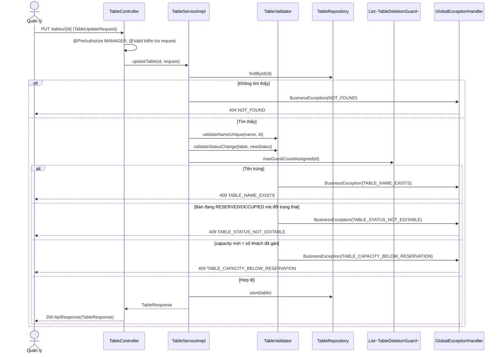
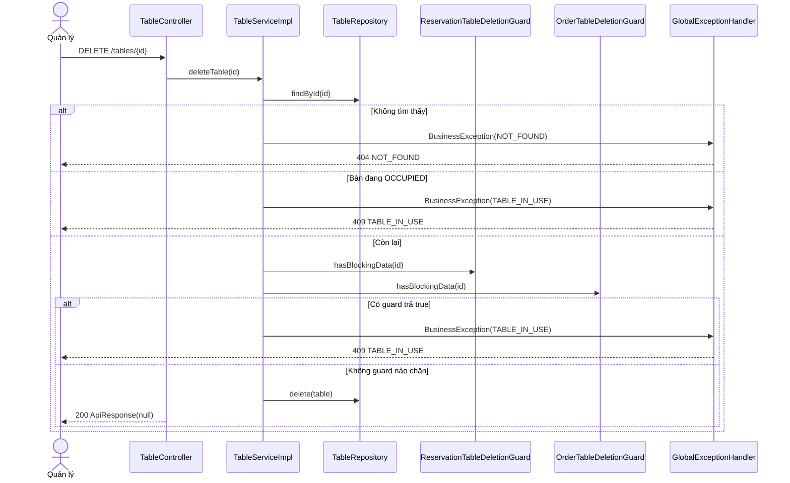

# Thiết kế API & Biểu đồ tuần tự: Quản lý Bàn

Quy ước URL, response, phân trang và mã lỗi: xem [`../README.md`](../README.md).

## 1. Mô tả API Endpoints

| Method | URL | Vai trò | UC | Request | Response (`data`) |
|---|---|---|---|---|---|
| GET | `/tables` | `WAITER`, `CASHIER`, `MANAGER` | UC007, UC011 | Query `TableSearchRequest` + phân trang | 200 `{items: TableResponse[], meta}` |
| GET | `/tables/{id}` | `WAITER`, `CASHIER`, `MANAGER` | UC011 | — | 200 `TableResponse` |
| POST | `/tables` | `MANAGER` | UC011 | `TableCreateRequest` | 201 `TableResponse` |
| PUT | `/tables/{id}` | `MANAGER` | UC011 | `TableUpdateRequest` | 200 `TableResponse` |
| DELETE | `/tables/{id}` | `MANAGER` | UC011 | — | 200 `null` |

Ghi chú:

- `sort_by` nhận `name` (mặc định), `capacity`, `zone`, `status`. Chuỗi tên bàn so sánh theo thứ tự chữ; muốn `B2` đứng trước `B10`
  thì đặt tên có số 0 đệm (`B02`, `B10`).
- Hàm nội bộ cho module khác (không có endpoint), chi tiết ở `lopthucthe.md`: `listBookableTables`, `getTableBriefs`,
  `transitionStatus`.

Ví dụ `GET /tables?zone=VIP_ROOM&min_capacity=6`:

```json
{
  "success": true,
  "data": {
    "items": [
      { "id": "0b3f5c2e-9a77-4b51-b3a1-5f8d1c2a9e10", "name": "V01", "zone": "VIP_ROOM", "capacity": 8, "status": "AVAILABLE", "note": "Có máy chiếu" }
    ],
    "meta": { "page": 1, "page_size": 20, "total_items": 1, "total_pages": 1 }
  },
  "msg": ""
}
```

## 2. Biểu đồ Tuần tự (Sequence Diagram) - Sửa bàn (UC011)



## 3. Biểu đồ Tuần tự (Sequence Diagram) - Xóa bàn (UC011)


