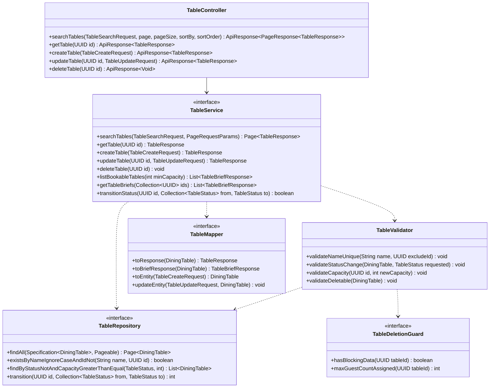

# Thiết kế Thực thể, DTO & Biểu đồ lớp: Quản lý Bàn

Package `com.restaurant.modules.table`. Quy ước chung: xem [`../README.md`](../README.md).

## 1. Lớp Thực thể (Entity)

### `DiningTable` (bảng `dining_tables`)

Tên bảng là `dining_tables` vì `table` là từ khóa của SQL. Kế thừa `AssignedIdEntity`. Xóa cứng.

| Cột | Kiểu | Ghi chú |
|---|---|---|
| `id` | `uuid` PK | |
| `name` | `varchar(20)` | Tên/số bàn, duy nhất không phân biệt hoa thường |
| `zone` | `varchar(20)` | `TableZone`; `CHECK` |
| `capacity` | `integer` | `CHECK (capacity BETWEEN 1 AND 50)` |
| `status` | `varchar(20)` | `TableStatus`; `CHECK`; mặc định `AVAILABLE` |
| `note` | `varchar(255)` | Tùy chọn |
| `created_at`, `updated_at` | `timestamptz` | |

Index và ràng buộc: `uq_dining_tables_name` = `UNIQUE (lower(name))`; `ix_dining_tables_zone_status (zone, status)`.

`status` do hai bên cùng ghi: Quản lý (`AVAILABLE`/`OUT_OF_SERVICE`) qua `updateTable`, hệ thống (`RESERVED`/`OCCUPIED` và về
`AVAILABLE`) qua `transitionStatus`. Entity có `@Version` để hai đường ghi này không đè lên nhau; đường hệ thống dùng câu
`UPDATE ... WHERE status IN (...)` trực tiếp (bỏ qua `@Version`, tự tăng cột `version`).

## 2. Data Transfer Object (DTO)

### Request (`dto/request/`)

| DTO | Trường | Validate |
|---|---|---|
| `TableSearchRequest` (query param) | `name` | Tùy chọn, tìm theo chuỗi con |
| | `zone` | Tùy chọn, `TableZone` |
| | `minCapacity` | Tùy chọn, `@Positive` |
| | `status` | Tùy chọn, `TableStatus` |
| `TableCreateRequest` | `name` | `@NotBlank @Size(max = 20)` |
| | `zone` | `@NotNull` |
| | `capacity` | `@NotNull @Min(1) @Max(50)` |
| | `note` | `@Size(max = 255)` |
| `TableUpdateRequest` | `name`, `zone`, `capacity`, `note` | Như `TableCreateRequest` |
| | `status` | Tùy chọn, chỉ `AVAILABLE` hoặc `OUT_OF_SERVICE` (kiểm ở `TableValidator`, `RESERVED`/`OCCUPIED` → `VALIDATION_ERROR`) |

### Response (`dto/response/`)

| DTO | Trường |
|---|---|
| `TableResponse` | `id`, `name`, `zone`, `capacity`, `status`, `note` |
| `TableBriefResponse` | `id`, `name`, `zone`, `capacity`, `status` (module khác dùng; xem mục 3) |

## 3. Biểu đồ Lớp (Class Diagram)

Mũi tên nét đứt từ service là phụ thuộc của lớp `*ServiceImpl` tương ứng.

Ghi chú:

- `listBookableTables(minCapacity)` trả bàn không `OUT_OF_SERVICE` có `capacity ≥ minCapacity`, sắp theo `capacity` tăng dần rồi `name`
  (bàn vừa khít xếp trước). `reservation` dùng để tìm bàn khả dụng theo khung giờ; việc loại bàn trùng giờ là của `reservation`.
- `transitionStatus` chạy một câu `UPDATE dining_tables SET status = :to WHERE id = :id AND status IN (:from)` và trả `true` nếu có đúng
  một dòng bị ảnh hưởng. Là hàm công khai duy nhất để module khác đổi `status`.
- `TableDeletionGuard` do `table` định nghĩa, `reservation` và `order` implement. `hasBlockingData` đúng khi: có đặt bàn `CONFIRMED` với
  `reserved_end > now` gán cho bàn (`reservation`), hoặc có đơn `OPEN` của bàn (`order`). `maxGuestCountAssigned` trả số khách lớn nhất trong
  các đặt bàn `CONFIRMED` chưa hết khung giờ gán cho bàn (0 nếu không có).
- `deleteTable` và `updateTable` có `@Transactional`; guard chỉ đọc nên không mở transaction riêng.
