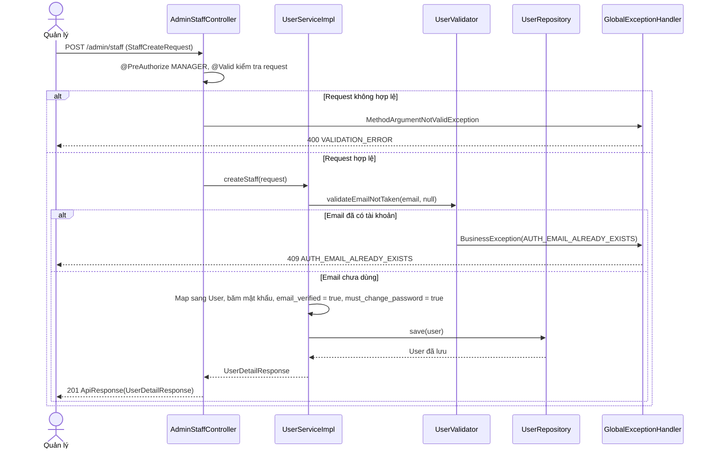
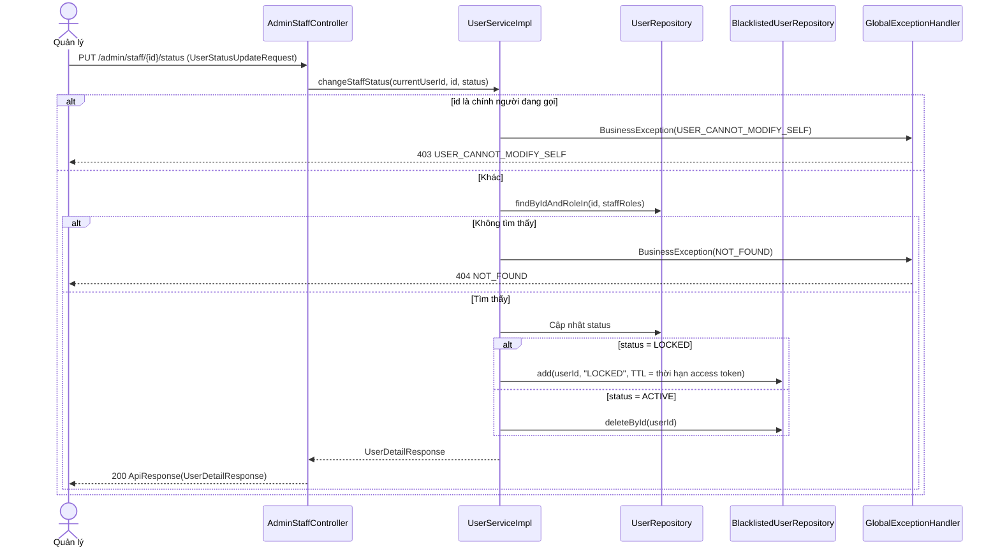
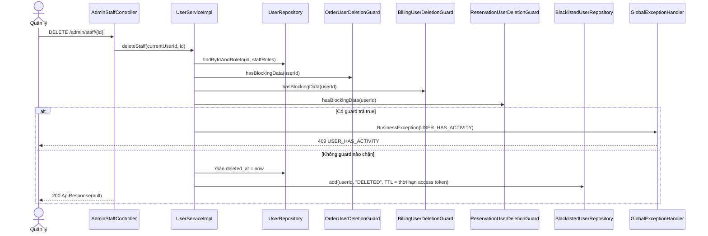

# Thiết kế API & Biểu đồ tuần tự: Quản lý Người dùng

Mọi endpoint chỉ dành cho `MANAGER`. Quy ước URL, response, phân trang và mã lỗi: xem [`../README.md`](../README.md).

## 1. Mô tả API Endpoints

| Method | URL | UC | Request | Response (`data`) |
|---|---|---|---|---|
| GET | `/admin/staff` | UC006, UC008 | Query `UserSearchRequest` + phân trang | 200 `{items: UserSummaryResponse[], meta}` |
| GET | `/admin/staff/{id}` | UC008 | — | 200 `UserDetailResponse` |
| POST | `/admin/staff` | UC008 | `StaffCreateRequest` | 201 `UserDetailResponse` |
| PUT | `/admin/staff/{id}` | UC008 | `StaffUpdateRequest` | 200 `UserDetailResponse` |
| PUT | `/admin/staff/{id}/avatar` | UC008 | multipart, field `file` | 200 `UserDetailResponse` |
| PUT | `/admin/staff/{id}/status` | UC008 | `UserStatusUpdateRequest` | 200 `UserDetailResponse` |
| DELETE | `/admin/staff/{id}` | UC008 | — | 200 `null` |
| GET | `/admin/customers` | UC006, UC009 | Query `UserSearchRequest` + phân trang | 200 `{items: UserSummaryResponse[], meta}` |
| GET | `/admin/customers/{id}` | UC009 | — | 200 `UserDetailResponse` |
| PUT | `/admin/customers/{id}/status` | UC009 | `UserStatusUpdateRequest` | 200 `UserDetailResponse` |
| DELETE | `/admin/customers/{id}` | UC009 | — | 200 `null` |

Ví dụ tìm kiếm (UC006): `GET /admin/staff?name=tran&role=CASHIER&status=ACTIVE&page=1&page_size=20`.

Sắp xếp: `sort_by` nhận `created_at` (mặc định, giảm dần), `full_name`, `email`; giá trị khác rơi về mặc định
(`PageRequestParams.toPageable`).

`UserSearchRequest` ở `/admin/customers` bỏ qua `role`; ở `/admin/staff` bỏ qua `email_verified`.

## 2. Biểu đồ Tuần tự (Sequence Diagram) - Thêm nhân viên (UC008)

## 3. Biểu đồ Tuần tự (Sequence Diagram) - Khóa nhân viên (UC008)

## 4. Biểu đồ Tuần tự (Sequence Diagram) - Xóa nhân viên với guard (UC008)

