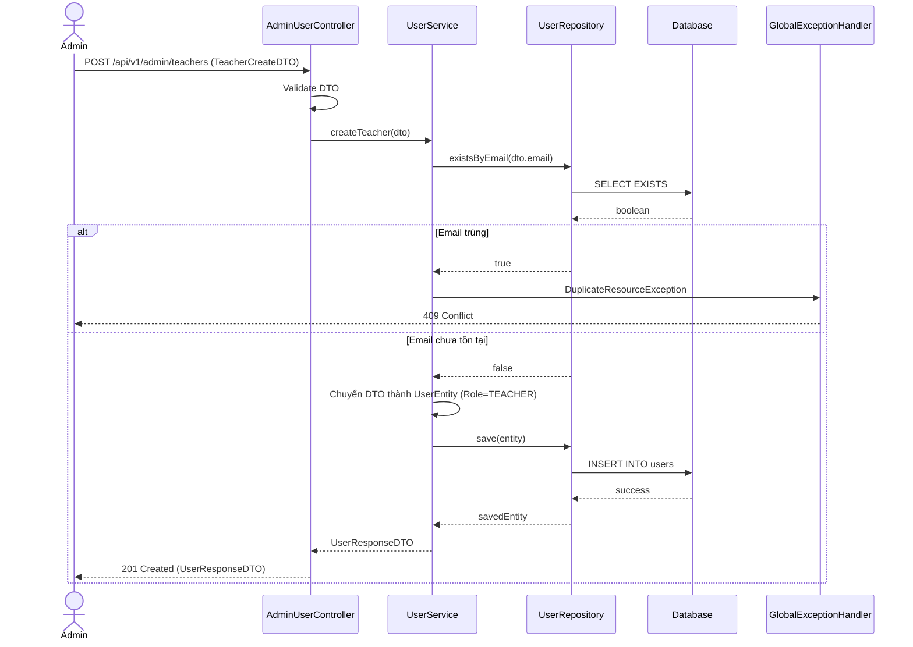

# Thiết kế API & Biểu đồ tuần tự: Quản lý Người dùng

## 1. Mô tả API Endpoints

- `GET /api/v1/admin/teachers`: Lấy danh sách giảng viên (có phân trang và tìm kiếm).
- `POST /api/v1/admin/teachers`: Thêm mới tài khoản giảng viên.
- `PUT /api/v1/admin/teachers/{id}`: Cập nhật thông tin giảng viên.
- `PUT /api/v1/admin/users/{id}/status`: Khóa / Mở khóa tài khoản (Giảng viên/Học viên).
- `GET /api/v1/admin/students`: Lấy danh sách học viên.

## 2. Biểu đồ Tuần tự (Sequence Diagram) - Thêm Giảng viên mới

