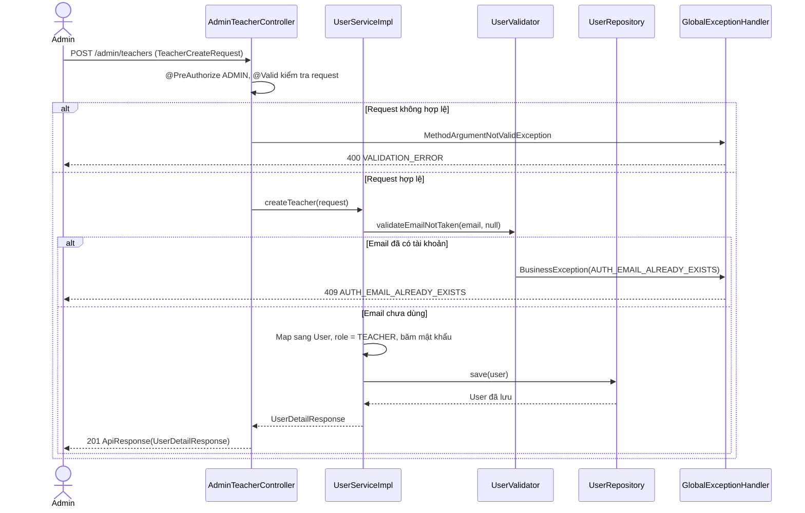
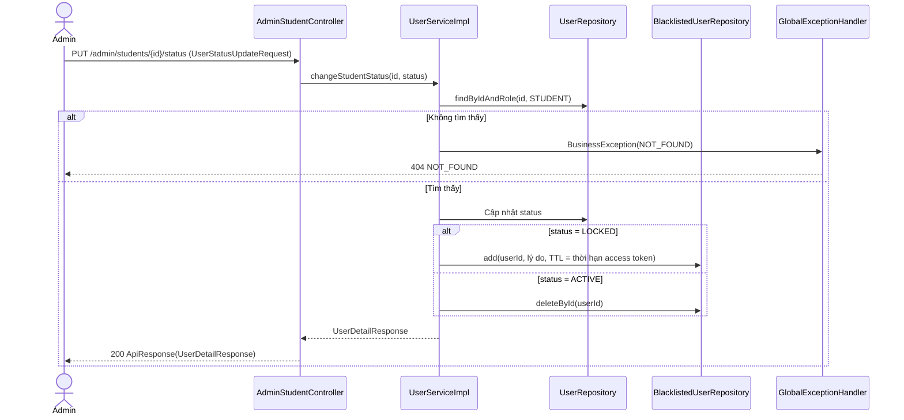

# Thiết kế API & Biểu đồ tuần tự: Quản lý Người dùng

Mọi endpoint chỉ dành cho `ADMIN`. Quy ước URL, response, phân trang và mã lỗi: xem [`../README.md`](../README.md).

## 1. Mô tả API Endpoints

| Method | URL | UC | Request | Response (`data`) |
|---|---|---|---|---|
| GET | `/admin/teachers` | UC006, UC008 | Query `UserSearchRequest` + phân trang | 200 `{items: UserSummaryResponse[], meta}` |
| GET | `/admin/teachers/{id}` | UC008 | — | 200 `UserDetailResponse` |
| POST | `/admin/teachers` | UC008 | `TeacherCreateRequest` | 201 `UserDetailResponse` |
| PUT | `/admin/teachers/{id}` | UC008 | `TeacherUpdateRequest` | 200 `UserDetailResponse` |
| PUT | `/admin/teachers/{id}/avatar` | UC008 | multipart, field `file` | 200 `UserDetailResponse` |
| DELETE | `/admin/teachers/{id}` | UC008 | — | 200 `null` |
| GET | `/admin/students` | UC006, UC010 | Query `UserSearchRequest` + phân trang | 200 `{items: UserSummaryResponse[], meta}` |
| GET | `/admin/students/{id}` | UC010 | — | 200 `UserDetailResponse` |
| PUT | `/admin/students/{id}/status` | UC010 | `UserStatusUpdateRequest` | 200 `UserDetailResponse` |
| DELETE | `/admin/students/{id}` | UC010 | — | 200 `null` |

Ví dụ tìm kiếm (UC006): `GET /admin/teachers?name=nguyen&gender=FEMALE&page=1&page_size=20`.

## 2. Biểu đồ Tuần tự (Sequence Diagram) - Thêm Giảng viên mới (UC008)

## 3. Biểu đồ Tuần tự (Sequence Diagram) - Khóa học viên (UC010)

