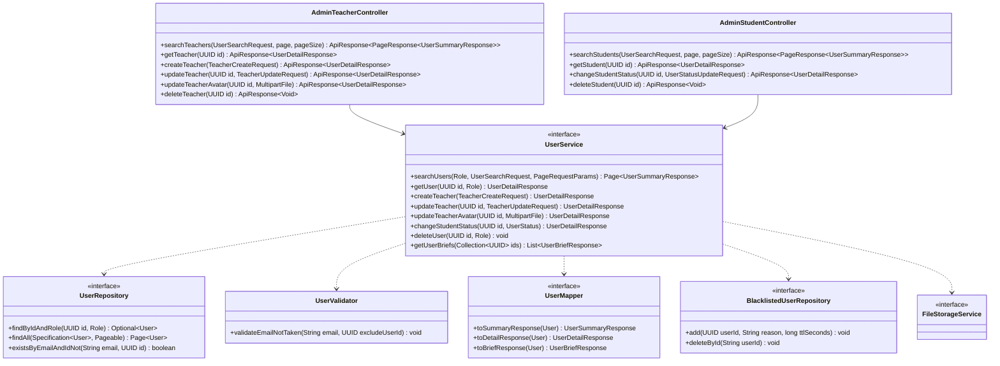

# Thiết kế Thực thể, DTO & Biểu đồ lớp: Quản lý Người dùng

Package `com.elearning.user`, dùng chung với `auth-profile`. Quy ước chung: xem [`../README.md`](../README.md).

## 1. Lớp Thực thể (Entity)

Dùng entity `User` (bảng `users`) đã mô tả ở [`../auth-profile/lopthucthe.md`](../auth-profile/lopthucthe.md). Các trường
quan trọng cho quản lý:

- `role`: phân biệt `TEACHER` (UC008) và `STUDENT` (UC010).
- `status`: `ACTIVE` hoặc `LOCKED`, là trạng thái Khóa/Mở khóa của SRS.
- `deletedAt`: xóa mềm (README mục 2.5).

## 2. Data Transfer Object (DTO)

### Request (`dto/request/`)

| DTO | Trường | Validate |
|---|---|---|
| `UserSearchRequest` (query param) | `name`, `email`, `phone` | Tùy chọn, tìm theo chuỗi con |
| | `gender` | Tùy chọn, `Gender` |
| `TeacherCreateRequest` | `fullName` | `@NotBlank @Size(max = 255)` |
| | `email` | `@NotBlank @Email` |
| | `password` | `@NotBlank @Size(min = 6)` |
| | `status` | `@NotNull` |
| | `dateOfBirth` | `@Past` |
| | `phone` | `@Pattern(regexp = "\\d+")` |
| | `gender` | |
| `TeacherUpdateRequest` | `fullName`, `email`, `status`, `dateOfBirth`, `phone`, `gender` | Như `TeacherCreateRequest` |
| | `password` | `@Size(min = 6)`, tùy chọn (A4) |
| `UserStatusUpdateRequest` | `status` | `@NotNull` |

`TeacherCreateRequest` không có trường role; service luôn gán `TEACHER` (A3). Trùng email kiểm tra ở `UserValidator`.

### Response (`dto/response/`)

| DTO | Trường |
|---|---|
| `UserSummaryResponse` | `id`, `email`, `fullName`, `phone`, `gender`, `status` |
| `UserDetailResponse` | `id`, `email`, `fullName`, `phone`, `gender`, `dateOfBirth`, `avatarUrl`, `role`, `status`, `createdAt` |
| `UserBriefResponse` | `id`, `fullName`, `email` (dùng cho module khác hiển thị tên người dùng) |

## 3. Biểu đồ Lớp (Class Diagram)

Mũi tên nét đứt từ service là phụ thuộc của lớp `*ServiceImpl` tương ứng.

Ghi chú:

- `searchUsers` dựng `Specification` từ các tiêu chí của `UserSearchRequest`, luôn lọc theo role.
- `getUser`, `deleteUser` nhận role để id của role khác trả `NOT_FOUND`.
- `getUserBriefs` là API công khai cho `course` và `learning`. Hàm này đọc cả tài khoản đã xóa (native query) để vẫn hiển
  thị được tên giảng viên, học viên cũ.
