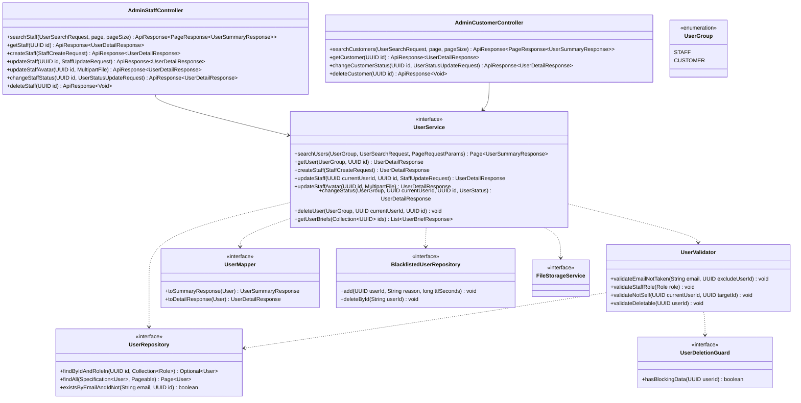

# Thiết kế Thực thể, DTO & Biểu đồ lớp: Quản lý Người dùng

Package `com.restaurant.modules.user`, dùng chung với `auth-profile`. Quy ước chung: xem [`../README.md`](../README.md).

## 1. Lớp Thực thể (Entity)

Dùng entity `User` (bảng `users`) đã mô tả ở [`../auth-profile/lopthucthe.md`](../auth-profile/lopthucthe.md). Các trường quan trọng
cho quản lý:

- `role`: phân biệt nhân viên (`WAITER`, `CASHIER`, `CHEF`, `MANAGER`, UC008) và khách hàng (`CUSTOMER`, UC009).
- `status`: `ACTIVE` hoặc `LOCKED`, là trạng thái Khóa/Mở khóa của SRS.
- `emailVerified`: lọc khách hàng chưa xác thực.
- `deletedAt`: xóa mềm (README mục 2.5).

Hằng số `Role.STAFF_ROLES = {WAITER, CASHIER, CHEF, MANAGER}` dùng chung cho truy vấn nhóm nhân viên.

## 2. Data Transfer Object (DTO)

### Request (`dto/request/`)

| DTO | Trường | Validate |
|---|---|---|
| `UserSearchRequest` (query param) | `name`, `email`, `phone` | Tùy chọn, tìm theo chuỗi con (`SpecificationUtils.containsIgnoreCase`) |
| | `role` | Tùy chọn, `Role`; chỉ dùng ở `/admin/staff`, `CUSTOMER` bị từ chối |
| | `status` | Tùy chọn, `UserStatus` |
| | `emailVerified` | Tùy chọn, `Boolean`; chỉ dùng ở `/admin/customers` |
| `StaffCreateRequest` | `fullName` | `@NotBlank @Size(max = 255)` |
| | `email` | `@NotBlank @Email @Size(max = 255)` |
| | `role` | `@NotNull`, một trong `STAFF_ROLES` |
| | `password` | `@NotBlank` + quy tắc mật khẩu (xem `auth-profile`) |
| | `status` | `@NotNull` |
| | `dateOfBirth` | `@Past`, tùy chọn |
| | `phone` | `@Pattern(regexp = "\\d{10}")`, tùy chọn |
| | `gender` | `Gender`, tùy chọn |
| `StaffUpdateRequest` | `fullName`, `email`, `role`, `dateOfBirth`, `phone`, `gender` | Như `StaffCreateRequest`; không có `password`, `status` (A20) |
| `UserStatusUpdateRequest` | `status` | `@NotNull` |

`role` thuộc `STAFF_ROLES` kiểm tra ở `UserValidator.validateStaffRole` (ném `VALIDATION_ERROR` kèm `fields`), vì `@NotNull` không
đủ biểu diễn "không phải `CUSTOMER`". Trùng email kiểm tra ở `UserValidator.validateEmailNotTaken`. Không được đổi `role` của chính
mình kiểm tra ở service so sánh `id` với `currentUserId`.

### Response (`dto/response/`)

| DTO | Trường |
|---|---|
| `UserSummaryResponse` | `id`, `email`, `fullName`, `phone`, `role`, `status`, `emailVerified` |
| `UserDetailResponse` | `id`, `email`, `fullName`, `phone`, `gender`, `dateOfBirth`, `avatarUrl`, `role`, `status`, `emailVerified`, `mustChangePassword`, `createdAt` |
| `UserBriefResponse` | `id`, `fullName`, `email`, `phone`, `role` (xem `auth-profile`) |

## 3. Biểu đồ Lớp (Class Diagram)

Mũi tên nét đứt từ service là phụ thuộc của lớp `*ServiceImpl` tương ứng.

Ghi chú:

- `UserGroup` (`STAFF` / `CUSTOMER`) quy đổi sang tập `Role` để mọi hàm dùng chung cho hai nhóm. `getUser`, `deleteUser`, `changeStatus`
  tra theo nhóm nên id của nhóm kia trả `NOT_FOUND`.
- `searchUsers` dựng `Specification` từ `UserSearchRequest`, luôn lọc theo nhóm; chuỗi con dùng `SpecificationUtils.containsIgnoreCase`.
- `UserValidator.validateDeletable` gọi mọi bean `UserDeletionGuard` (`UserValidator` inject `ObjectProvider<UserDeletionGuard>` và duyệt `orderedStream()`, để vẫn khởi động được khi chưa có bean nào); guard nào trả `true` thì
  ném `USER_HAS_ACTIVITY`. Mỗi guard chỉ tra dữ liệu của module mình theo `userId`: `reservation` (có đặt bàn `PENDING`/`CONFIRMED` với
  `customer_id = userId`), `order` (có đơn với `waiter_id = userId` hoặc dòng món với `chef_id = userId`), `billing` (có hóa đơn với
  `cashier_id = userId`). Khách hàng không bao giờ là `waiter_id`/`cashier_id` nên hai guard sau trả `false` với họ; hóa đơn có
  `customer_id` không chặn xóa khách hàng.
- `deleteUser` và `changeStatus` ghi `BlacklistedUserRepository` trong cùng hàm; `@Transactional` của JPA không bao Redis nên ghi
  Redis đặt cuối, sau khi `save` thành công.
- Tên guard trong sơ đồ tuần tự (`OrderUserDeletionGuard`...) là tên lớp implement trong từng module.
