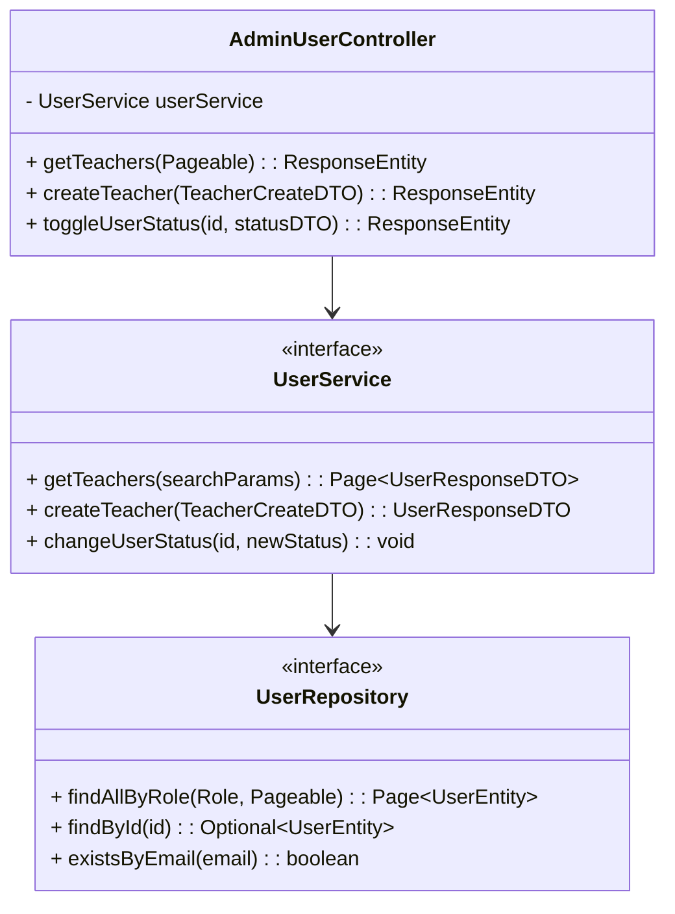

# Thiết kế Thực thể, DTO & Biểu đồ lớp: Quản lý Người dùng

## 1. Lớp Thực thể (Entity)
Sử dụng chung bảng `users` với module Auth. Chú ý các trường quan trọng cho quản lý:
- `role`: Phân biệt TEACHER, STUDENT.
- `status`: Quản lý trạng thái khóa/mở khóa (ACTIVE, LOCKED).

## 2. Data Transfer Object (DTO)
- **TeacherCreateDTO**: `email`, `fullName`, `phone`, `password` (tùy chọn hoặc sinh ngẫu nhiên).
- **TeacherUpdateDTO**: `fullName`, `phone`, `status`.
- **UserResponseDTO**: Dùng để trả về thông tin user trong danh sách. Gồm `id`, `email`, `fullName`, `role`, `status`.
- **UserStatusUpdateDTO**: `status` (để truyền trạng thái khóa/mở khóa).

## 3. Biểu đồ Lớp (Class Diagram)

