

 

<h1>TÀI LIỆU ĐẶC TẢ YÊU CẦU PHẦN MỀM</h1>

<h3>(Software Requirement Specification – SRS)</h3>

   

<h1>HỆ THỐNG QUẢN LÝ NHÀ HÀNG</h1>

 

**Phiên bản 1.0.0**

 

Ngày tạo: 09/10/2026

---

# Mục lục

- [Danh mục hình ảnh, bảng biểu](#danh-mục-hình-ảnh-bảng-biểu)
- [1 Giới thiệu](#1-giới-thiệu)
  - [1.1 Mục đích](#11-mục-đích)
  - [1.2 Phạm vi](#12-phạm-vi)
  - [1.3 Từ điển thuật ngữ](#13-từ-điển-thuật-ngữ)
  - [1.4 Tài liệu tham khảo](#14-tài-liệu-tham-khảo)
  - [1.5 Tổng quát](#15-tổng-quát)
- [2 Các yêu cầu chức năng](#2-các-yêu-cầu-chức-năng)
  - [2.1 Các tác nhân](#21-các-tác-nhân)
  - [2.2 Các chức năng của hệ thống](#22-các-chức-năng-của-hệ-thống)
  - [2.3 Biểu đồ use case tổng quan](#23-biểu-đồ-use-case-tổng-quan)
  - [2.4 Biểu đồ use case phân rã](#24-biểu-đồ-use-case-phân-rã)
    - [2.4.1 Phân rã use case “Quản lý”](#241-phân-rã-use-case-quản-lý)
    - [2.4.2 Phân rã use case “Nhân viên phục vụ”](#242-phân-rã-use-case-nhân-viên-phục-vụ)
    - [2.4.3 Phân rã use case “Bếp” và “Thu ngân”](#243-phân-rã-use-case-bếp-và-thu-ngân)
  - [2.5 Quy trình nghiệp vụ](#25-quy-trình-nghiệp-vụ)
    - [2.5.1 Quy trình sử dụng phần mềm](#251-quy-trình-sử-dụng-phần-mềm)
    - [2.5.2 Quy trình quản lý nhân viên](#252-quy-trình-quản-lý-nhân-viên)
    - [2.5.3 Quy trình quản lý thực đơn](#253-quy-trình-quản-lý-thực-đơn)
    - [2.5.4 Quy trình đặt bàn](#254-quy-trình-đặt-bàn)
    - [2.5.5 Quy trình gọi món và chế biến](#255-quy-trình-gọi-món-và-chế-biến)
    - [2.5.6 Quy trình thanh toán và xuất hóa đơn](#256-quy-trình-thanh-toán-và-xuất-hóa-đơn)
    - [2.5.7 Quy trình quản lý kho](#257-quy-trình-quản-lý-kho)
    - [2.5.8 Quy trình sử dụng phần mềm của khách hàng](#258-quy-trình-sử-dụng-phần-mềm-của-khách-hàng)
  - [2.6 Đặc tả các use case](#26-đặc-tả-các-use-case)
    - [2.6.1 Đăng nhập](#261-đăng-nhập)
    - [2.6.2 Đăng ký](#262-đăng-ký)
    - [2.6.3 Thay đổi mật khẩu](#263-thay-đổi-mật-khẩu)
    - [2.6.4 Thiết lập lại mật khẩu](#264-thiết-lập-lại-mật-khẩu)
    - [2.6.5 Cập nhật thông tin cá nhân](#265-cập-nhật-thông-tin-cá-nhân)
    - [2.6.6 Tìm kiếm nhân viên, khách hàng](#266-tìm-kiếm-nhân-viên-khách-hàng)
    - [2.6.7 Tìm kiếm món ăn, bàn, đặt bàn, hóa đơn, nguyên liệu, nhà cung cấp, khuyến mãi, tin tức, câu hỏi thường gặp](#267-tìm-kiếm-món-ăn-bàn-đặt-bàn-hóa-đơn-nguyên-liệu-nhà-cung-cấp-khuyến-mãi-tin-tức-câu-hỏi-thường-gặp)
    - [2.6.8 Quản lý nhân viên](#268-quản-lý-nhân-viên)
    - [2.6.9 Quản lý khách hàng](#269-quản-lý-khách-hàng)
    - [2.6.10 Quản lý danh mục món](#2610-quản-lý-danh-mục-món)
    - [2.6.11 Quản lý món ăn](#2611-quản-lý-món-ăn)
    - [2.6.12 Quản lý bàn](#2612-quản-lý-bàn)
    - [2.6.13 Xem thực đơn](#2613-xem-thực-đơn)
    - [2.6.14 Đặt bàn trực tuyến](#2614-đặt-bàn-trực-tuyến)
    - [2.6.15 Quản lý đặt bàn](#2615-quản-lý-đặt-bàn)
    - [2.6.16 Gọi món](#2616-gọi-món)
    - [2.6.17 Xử lý món ăn](#2617-xử-lý-món-ăn)
    - [2.6.18 Xem lịch sử đặt bàn và hóa đơn](#2618-xem-lịch-sử-đặt-bàn-và-hóa-đơn)
    - [2.6.19 Thanh toán và xuất hóa đơn](#2619-thanh-toán-và-xuất-hóa-đơn)
    - [2.6.20 Quản lý khuyến mãi](#2620-quản-lý-khuyến-mãi)
    - [2.6.21 Xem lịch sử hóa đơn](#2621-xem-lịch-sử-hóa-đơn)
    - [2.6.22 Quản lý nguyên liệu](#2622-quản-lý-nguyên-liệu)
    - [2.6.23 Quản lý nhà cung cấp](#2623-quản-lý-nhà-cung-cấp)
    - [2.6.24 Quản lý nhập, xuất kho](#2624-quản-lý-nhập-xuất-kho)
    - [2.6.25 Xem báo cáo thống kê](#2625-xem-báo-cáo-thống-kê)
    - [2.6.26 Quản lý tin tức](#2626-quản-lý-tin-tức)
    - [2.6.27 Quản lý câu hỏi thường gặp](#2627-quản-lý-câu-hỏi-thường-gặp)
- [3 Các yêu cầu phi chức năng](#3-các-yêu-cầu-phi-chức-năng)
  - [3.1 Giao diện người dùng](#31-giao-diện-người-dùng)
  - [3.2 Tính bảo mật](#32-tính-bảo-mật)
  - [3.3 Ràng buộc](#33-ràng-buộc)

---

# Danh mục hình ảnh, bảng biểu

- [Hình 2-1: Biểu đồ use case tổng quan](#hinh-2-1)
- [Hình 2-2: Biểu đồ use case Quản lý](#hinh-2-2)
- [Hình 2-3: Biểu đồ use case Nhân viên phục vụ](#hinh-2-3)
- [Hình 2-4: Biểu đồ use case Bếp và Thu ngân](#hinh-2-4)
- [Hình 2-5: Biểu đồ hoạt động quy trình sử dụng phần mềm](#hinh-2-5)
- [Hình 2-6: Biểu đồ hoạt động quy trình quản lý nhân viên](#hinh-2-6)
- [Hình 2-7: Biểu đồ hoạt động quy trình quản lý thực đơn](#hinh-2-7)
- [Hình 2-8: Biểu đồ hoạt động quy trình đặt bàn](#hinh-2-8)
- [Hình 2-9: Biểu đồ hoạt động quy trình gọi món và chế biến](#hinh-2-9)
- [Hình 2-10: Biểu đồ hoạt động quy trình thanh toán và xuất hóa đơn](#hinh-2-10)
- [Hình 2-11: Biểu đồ hoạt động quy trình quản lý kho](#hinh-2-11)
- [Hình 2-12: Biểu đồ hoạt động quy trình sử dụng phần mềm của khách hàng](#hinh-2-12)

- [Bảng 1-1: Từ điển thuật ngữ](#bang-1-1)
- [Bảng 2-1: Đặc tả chức năng “Đăng nhập”](#bang-2-1)
- [Bảng 2-2: Dữ liệu chức năng “Đăng nhập”](#bang-2-2)
- [Bảng 2-3: Đặc tả chức năng “Đăng ký”](#bang-2-3)
- [Bảng 2-4: Dữ liệu chức năng “Đăng ký”](#bang-2-4)
- [Bảng 2-5: Đặc tả chức năng “Thay đổi mật khẩu”](#bang-2-5)
- [Bảng 2-6: Dữ liệu chức năng “Thay đổi mật khẩu”](#bang-2-6)
- [Bảng 2-7: Đặc tả chức năng “Thiết lập lại mật khẩu”](#bang-2-7)
- [Bảng 2-8: Dữ liệu chức năng “Thiết lập lại mật khẩu”](#bang-2-8)
- [Bảng 2-9: Đặc tả chức năng “Cập nhật thông tin cá nhân”](#bang-2-9)
- [Bảng 2-10: Dữ liệu chức năng “Cập nhật thông tin cá nhân”](#bang-2-10)
- [Bảng 2-11: Đặc tả chức năng “Tìm kiếm nhân viên, khách hàng”](#bang-2-11)
- [Bảng 2-12: Dữ liệu đầu vào chức năng Tìm kiếm nhân viên, khách hàng](#bang-2-12)
- [Bảng 2-13: Đặc tả chức năng “Tìm kiếm dữ liệu nghiệp vụ”](#bang-2-13)
- [Bảng 2-14: Dữ liệu tìm kiếm món ăn](#bang-2-14)
- [Bảng 2-15: Dữ liệu tìm kiếm bàn](#bang-2-15)
- [Bảng 2-16: Dữ liệu tìm kiếm đặt bàn](#bang-2-16)
- [Bảng 2-17: Dữ liệu tìm kiếm hóa đơn](#bang-2-17)
- [Bảng 2-18: Dữ liệu tìm kiếm nguyên liệu](#bang-2-18)
- [Bảng 2-19: Dữ liệu tìm kiếm nhà cung cấp](#bang-2-19)
- [Bảng 2-20: Dữ liệu tìm kiếm khuyến mãi](#bang-2-20)
- [Bảng 2-21: Dữ liệu tìm kiếm tin tức](#bang-2-21)
- [Bảng 2-22: Dữ liệu tìm kiếm FAQ](#bang-2-22)
- [Bảng 2-23: Đặc tả chức năng “Quản lý nhân viên”](#bang-2-23)
- [Bảng 2-24: Dữ liệu đầu vào chức năng “Quản lý nhân viên”](#bang-2-24)
- [Bảng 2-25: Đặc tả chức năng “Quản lý khách hàng”](#bang-2-25)
- [Bảng 2-26: Đặc tả chức năng “Quản lý danh mục món”](#bang-2-26)
- [Bảng 2-27: Dữ liệu đầu vào chức năng “Quản lý danh mục món”](#bang-2-27)
- [Bảng 2-28: Đặc tả chức năng “Quản lý món ăn”](#bang-2-28)
- [Bảng 2-29: Dữ liệu đầu vào chức năng “Quản lý món ăn”](#bang-2-29)
- [Bảng 2-30: Đặc tả chức năng “Quản lý bàn”](#bang-2-30)
- [Bảng 2-31: Dữ liệu đầu vào chức năng “Quản lý bàn”](#bang-2-31)
- [Bảng 2-32: Đặc tả chức năng “Xem thực đơn”](#bang-2-32)
- [Bảng 2-33: Đặc tả chức năng “Đặt bàn trực tuyến”](#bang-2-33)
- [Bảng 2-34: Dữ liệu chức năng “Đặt bàn trực tuyến”](#bang-2-34)
- [Bảng 2-35: Đặc tả chức năng “Quản lý đặt bàn”](#bang-2-35)
- [Bảng 2-36: Dữ liệu chức năng “Quản lý đặt bàn”](#bang-2-36)
- [Bảng 2-37: Đặc tả chức năng “Gọi món”](#bang-2-37)
- [Bảng 2-38: Dữ liệu chức năng “Gọi món”](#bang-2-38)
- [Bảng 2-39: Đặc tả chức năng “Xử lý món ăn”](#bang-2-39)
- [Bảng 2-40: Đặc tả chức năng “Xem lịch sử đặt bàn và hóa đơn”](#bang-2-40)
- [Bảng 2-41: Đặc tả chức năng “Thanh toán và xuất hóa đơn”](#bang-2-41)
- [Bảng 2-42: Dữ liệu chức năng “Thanh toán và xuất hóa đơn”](#bang-2-42)
- [Bảng 2-43: Đặc tả chức năng “Quản lý khuyến mãi”](#bang-2-43)
- [Bảng 2-44: Dữ liệu đầu vào chức năng “Quản lý khuyến mãi”](#bang-2-44)
- [Bảng 2-45: Đặc tả chức năng “Xem lịch sử hóa đơn”](#bang-2-45)
- [Bảng 2-46: Đặc tả chức năng “Quản lý nguyên liệu”](#bang-2-46)
- [Bảng 2-47: Dữ liệu đầu vào chức năng “Quản lý nguyên liệu”](#bang-2-47)
- [Bảng 2-48: Đặc tả chức năng “Quản lý nhà cung cấp”](#bang-2-48)
- [Bảng 2-49: Dữ liệu đầu vào chức năng “Quản lý nhà cung cấp”](#bang-2-49)
- [Bảng 2-50: Đặc tả chức năng “Quản lý nhập, xuất kho”](#bang-2-50)
- [Bảng 2-51: Dữ liệu phiếu nhập kho](#bang-2-51)
- [Bảng 2-52: Dữ liệu phiếu xuất kho](#bang-2-52)
- [Bảng 2-53: Đặc tả chức năng “Xem báo cáo thống kê”](#bang-2-53)
- [Bảng 2-54: Dữ liệu chức năng “Xem báo cáo thống kê”](#bang-2-54)
- [Bảng 2-55: Đặc tả chức năng “Quản lý tin tức”](#bang-2-55)
- [Bảng 2-56: Dữ liệu đầu vào khi thêm, sửa tin tức](#bang-2-56)
- [Bảng 2-57: Đặc tả chức năng “Quản lý câu hỏi thường gặp”](#bang-2-57)
- [Bảng 2-58: Dữ liệu đầu vào khi thêm, sửa câu hỏi thường gặp](#bang-2-58)
- [Bảng 3-1: Phân quyền chức năng theo vai trò](#bang-3-1)

---

# 1 Giới thiệu

## 1.1 Mục đích

Mục đích của tài liệu đặc tả yêu cầu phần mềm này là cung cấp một cái nhìn tổng quan, dễ hiểu về các yêu cầu và thành phần của dự án Hệ thống quản lý nhà hàng.

Tài liệu này được cung cấp như một tài liệu tham khảo cho sinh viên trực tiếp tham gia phát triển dự án phục vụ cho việc hoàn thành đồ án tốt nghiệp. Ngoài ra, trong môi trường thực tế bên ngoài, tài liệu này còn phục vụ cho những nhà phát triển phần mềm, kiểm thử viên, nhà quản lý dự án, chủ nhà hàng cũng như các bên liên quan.

## 1.2 Phạm vi

Tài liệu đặc tả yêu cầu phần mềm này được xây dựng nhằm phục vụ cho dự án Phát triển hệ thống quản lý nhà hàng (RMS – Restaurant Management System) phục vụ công việc vận hành một nhà hàng gọi món tại bàn.

Hệ thống số hóa các nghiệp vụ chính của nhà hàng: quản lý tài khoản và phân quyền nhân viên, quản lý thực đơn, bàn và đặt bàn, gọi món và chế biến, thanh toán và xuất hóa đơn, quản lý khuyến mãi, quản lý kho nguyên liệu và nhà cung cấp, thống kê báo cáo. Nhờ đó giảm sai sót khi ghi chép thủ công, rút ngắn thời gian từ lúc gọi món đến lúc phục vụ, đồng thời giúp chủ nhà hàng theo dõi doanh thu và tồn kho kịp thời.

Hệ thống được thiết kế cho **một nhà hàng** (một cơ sở kinh doanh). Các nội dung sau **chưa nằm trong phạm vi** của phiên bản này: gọi món qua mã QR tại bàn, bán mang đi và giao hàng, tích điểm và hạng thành viên, chấm công và tính lương, quản lý nhiều chi nhánh.

## 1.3 Từ điển thuật ngữ

| Thuật ngữ | Giải thích |
|---|---|
| SRS | Software Requirements Specifications – Đặc tả yêu cầu phần mềm |
| RMS | Restaurant Management System – Hệ thống quản lý nhà hàng |
| Use Case(s) | Biểu đồ mô tả những yêu cầu của hệ thống |
| POS | Point of Sale – Điểm bán hàng, màn hình gọi món và thanh toán tại nhà hàng |
| KDS | Kitchen Display System – Màn hình hiển thị hàng đợi món ăn trong bếp |
| CRUD | Create, Read, Update, Delete – Thêm, xem, sửa, xóa |
| VAT | Value Added Tax – Thuế giá trị gia tăng, tính trên hóa đơn thanh toán |
| Web server | Phần mềm máy chủ cung cấp các chức năng, tài nguyên cho máy khách |
| JavaScript | Ngôn ngữ lập trình sử dụng trên các trình duyệt web |
| Hypertext Markup Language (HTML) | Ngôn ngữ đánh dấu siêu văn bản |
| PV – TN – QL | Nhân viên phục vụ, Thu ngân, Quản lý |
| Dòng món | Một món ăn kèm số lượng và ghi chú trong đơn hàng của một bàn |

*Bảng 1-1: Từ điển thuật ngữ*

## 1.4 Tài liệu tham khảo

- IEEE Recommended Practice for Software Requirements Specifications, in IEEE Std 830-1998, 20 Oct. 1998.
- IEEE Guide for Developing System Requirements Specifications, in IEEE Std 1233-1996, 22 Dec. 1996.
- Tài liệu đặc tả yêu cầu phần mềm mẫu: `docs/srs.pdf`, dùng làm khung trình bày cho tài liệu này.

## 1.5 Tổng quát

Tài liệu này được viết dựa theo chuẩn của Tài liệu đặc tả yêu cầu phần mềm (Software Requirements Specifications – SRS) được giải thích trong "IEEE Recommended Practice for Software Requirements Specifications" và "IEEE Guide for Developing System Requirements Specifications".

Cấu trúc được chia làm ba phần:

1. Phần 1: Cung cấp cái nhìn tổng quan về các thành phần của SRS.
2. Phần 2: Mô tả tổng quan các nhân tố, ràng buộc, đặc điểm người dùng, môi trường thực thi tác động lên hệ thống và các yêu cầu của nó. Cung cấp thông tin chi tiết các yêu cầu chức năng, cung cấp cho các nhà phát triển phần mềm thông tin để phát triển phần mềm đáp ứng được các yêu cầu đó.
3. Phần 3: Các yêu cầu phi chức năng.

# 2 Các yêu cầu chức năng

## 2.1 Các tác nhân

Hệ thống gồm có các tác nhân là Khách, Khách hàng, Nhân viên phục vụ, Thu ngân, Bếp và Quản lý.

- **Khách:** người dùng chưa đăng nhập vào hệ thống (khách vãng lai). Khách có thể xem thực đơn, đặt bàn trực tuyến mà không cần tài khoản, hoặc đăng ký tài khoản để trở thành Khách hàng.
- **Khách hàng:** Khách đã đăng ký tài khoản và đăng nhập vào hệ thống. Ngoài các chức năng của Khách, Khách hàng được xem lịch sử đặt bàn, hóa đơn và quản lý thông tin cá nhân.
- **Nhân viên phục vụ:** tiếp nhận đặt bàn, nhận bàn, gọi món cho khách tại bàn và xác nhận đã phục vụ món.
- **Thu ngân:** tính tiền, áp dụng khuyến mãi, ghi nhận thanh toán và xuất hóa đơn.
- **Bếp:** nhận các món cần chế biến, cập nhật tiến độ chế biến và báo hết món.
- **Quản lý:** quản trị hoạt động của nhà hàng gồm nhân viên, thực đơn, bàn, khuyến mãi, kho, nội dung và xem báo cáo thống kê. Tài khoản Nhân viên phục vụ, Thu ngân, Bếp, Quản lý do Quản lý cấp, không tự đăng ký.

## 2.2 Các chức năng của hệ thống

1. **Đăng nhập:** Xác thực người dùng khi tương tác với hệ thống nhằm cung cấp quyền cũng như phạm vi truy cập hệ thống.
2. **Đăng ký:** Khách đăng ký tài khoản để trở thành Khách hàng và sử dụng các chức năng dành riêng cho Khách hàng.
3. **Quản trị người dùng:** Quản lý tạo tài khoản nhân viên, phân quyền, khóa/mở khóa tài khoản nhân viên và khách hàng.
4. **Quản lý thực đơn và bàn:** Quản lý danh mục món, món ăn, bàn của nhà hàng.
5. **Đặt bàn:** Khách đặt bàn trực tuyến; Nhân viên phục vụ xác nhận, nhận bàn hoặc tạo đặt bàn tại quầy.
6. **Gọi món và chế biến:** Nhân viên phục vụ gọi món cho bàn, gửi bếp; Bếp chế biến và cập nhật trạng thái món.
7. **Thanh toán, hóa đơn và khuyến mãi:** Thu ngân thanh toán, tách/gộp hóa đơn, áp mã khuyến mãi; Quản lý quản lý chương trình khuyến mãi.
8. **Quản lý kho:** Quản lý nguyên liệu, nhà cung cấp, phiếu nhập/xuất kho và cảnh báo tồn kho thấp.
9. **Báo cáo thống kê:** Quản lý xem doanh thu, món bán chạy, tồn kho, số lượt đặt bàn.
10. **Quản lý nội dung:** Quản lý tin tức và câu hỏi thường gặp hiển thị cho khách.

Để hình dung rõ hơn về các tác nhân cũng như yêu cầu chức năng của hệ thống, các yêu cầu được mô hình hóa dưới các sơ đồ use case, trình bày ở các mục sau.

> **Lưu ý về cách vẽ sơ đồ:** Mermaid không có loại biểu đồ use case riêng, nên các sơ đồ use case dưới đây dùng biểu đồ luồng (flowchart): tác nhân là hình chữ nhật, use case là hình oval, quan hệ `«extend»`/`«include»` là mũi tên nét đứt có nhãn.

## 2.3 Biểu đồ use case tổng quan

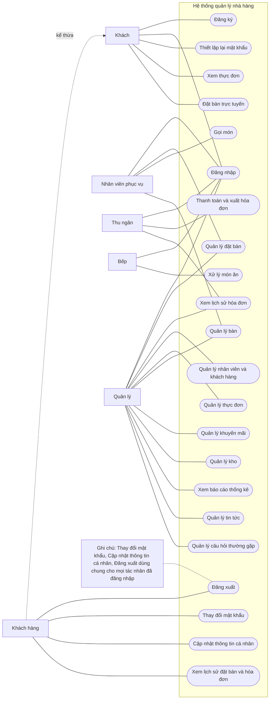

*Hình 2-1: Biểu đồ use case tổng quan*

## 2.4 Biểu đồ use case phân rã

### 2.4.1 Phân rã use case “Quản lý”

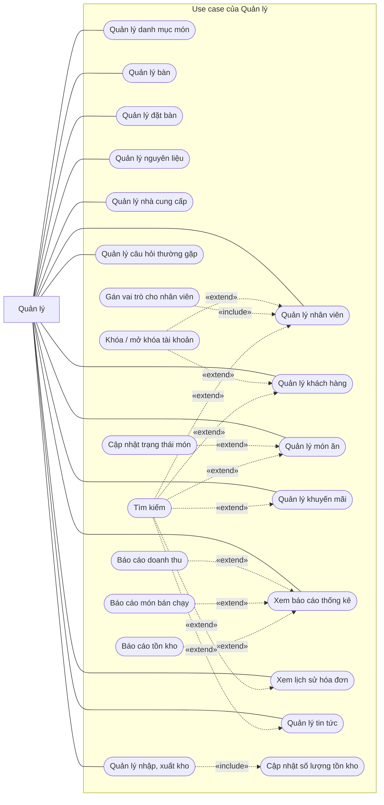

*Hình 2-2: Biểu đồ use case Quản lý*

### 2.4.2 Phân rã use case “Nhân viên phục vụ”

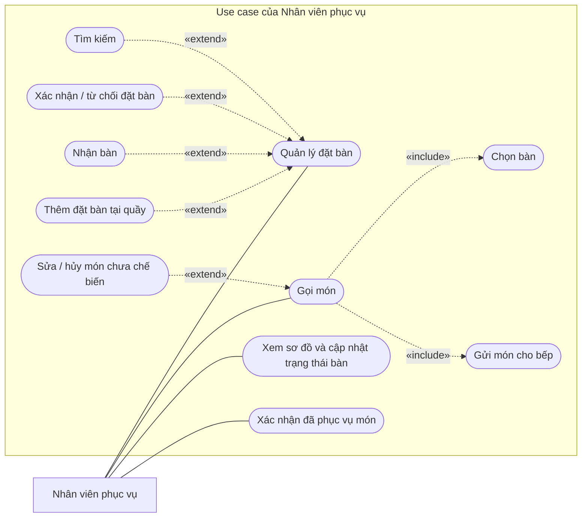

*Hình 2-3: Biểu đồ use case Nhân viên phục vụ*

### 2.4.3 Phân rã use case “Bếp” và “Thu ngân”

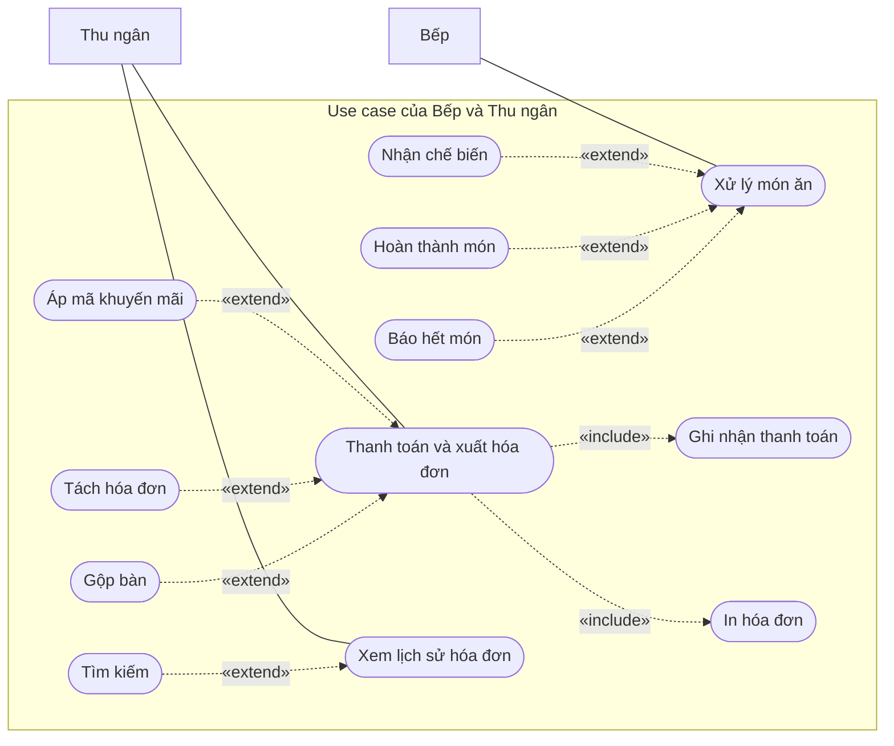

*Hình 2-4: Biểu đồ use case Bếp và Thu ngân*

## 2.5 Quy trình nghiệp vụ

### 2.5.1 Quy trình sử dụng phần mềm

Khách có thể đăng ký để tạo tài khoản khách hàng cho mình, sau đó xác thực email và đăng nhập để sử dụng các chức năng. Nhân viên và Quản lý không tự đăng ký mà dùng tài khoản do Quản lý cấp. Nếu quên mật khẩu, người dùng có thể yêu cầu hệ thống thiết lập lại mật khẩu; hệ thống gửi liên kết qua email đã đăng ký và người dùng vào liên kết đó để đặt mật khẩu mới.

Sau khi đăng nhập thành công, người dùng có thể xem và cập nhật thông tin cá nhân, thay đổi mật khẩu và sử dụng các chức năng trong phạm vi vai trò mà hệ thống đã cấp.

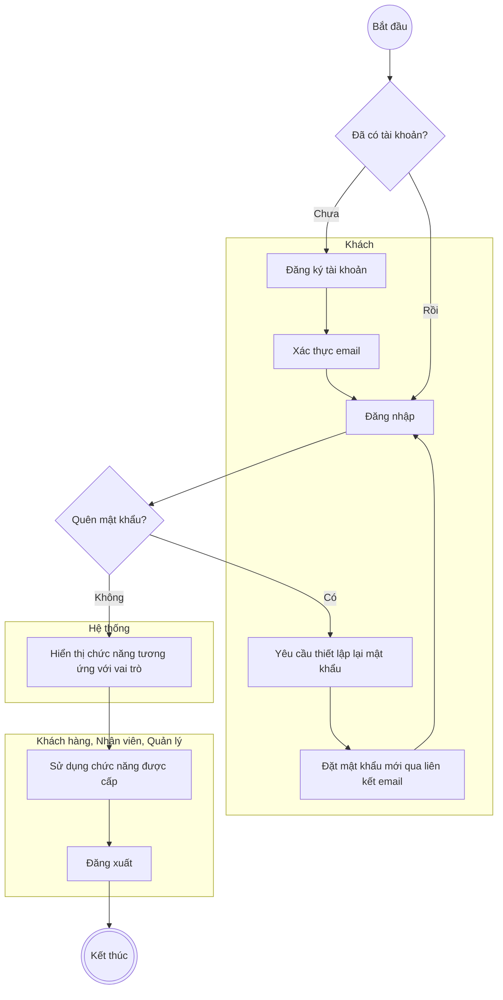

*Hình 2-5: Biểu đồ hoạt động quy trình sử dụng phần mềm*

### 2.5.2 Quy trình quản lý nhân viên

Quản lý có thể quản lý nhân viên theo các bước: tìm kiếm nhân viên, cung cấp thông tin tìm kiếm và xem thông tin nhân viên đó. Quản lý có thể thêm mới tài khoản nhân viên (chọn vai trò Nhân viên phục vụ, Thu ngân, Bếp hoặc Quản lý), sửa thông tin, khóa/mở khóa tài khoản và xóa nhân viên chưa phát sinh dữ liệu nghiệp vụ.

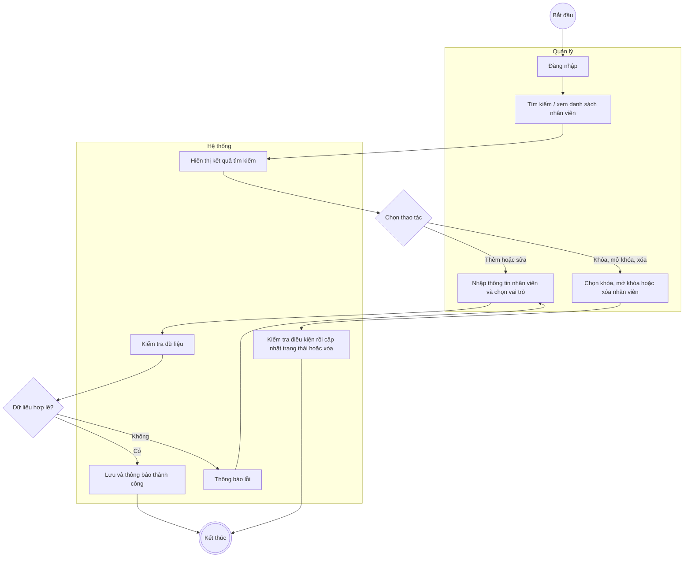

*Hình 2-6: Biểu đồ hoạt động quy trình quản lý nhân viên*

### 2.5.3 Quy trình quản lý thực đơn

Quản lý trước tiên đăng nhập để xác thực. Sau đó Quản lý tạo danh mục món, rồi thêm món ăn vào danh mục kèm giá bán, ảnh và thời gian chế biến dự kiến. Quản lý có thể cập nhật trạng thái món (Đang bán, Hết món, Ngừng bán). Các quy trình sửa, xóa danh mục và món ăn có các bước thực hiện tương tự.

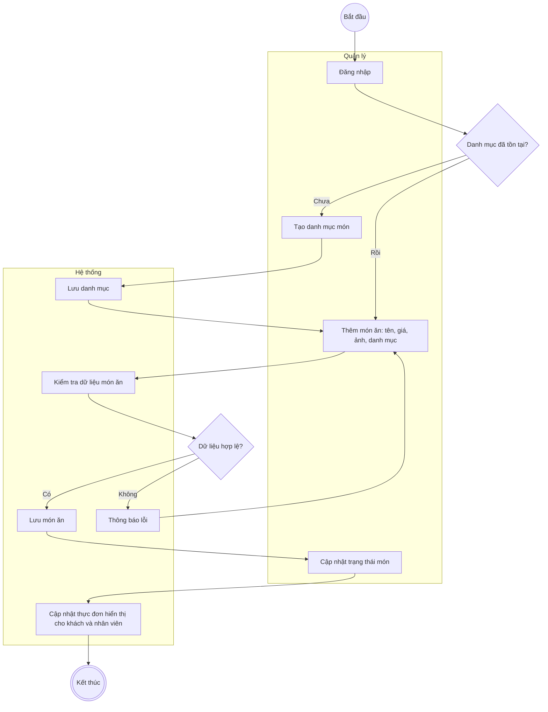

*Hình 2-7: Biểu đồ hoạt động quy trình quản lý thực đơn*

### 2.5.4 Quy trình đặt bàn

Khách (hoặc Khách hàng) chọn ngày, giờ và số khách; hệ thống kiểm tra còn bàn phù hợp hay không. Nếu còn, khách nhập thông tin liên hệ và gửi yêu cầu; đặt bàn được tạo ở trạng thái Chờ xác nhận. Nhân viên phục vụ xác nhận hoặc từ chối, khách nhận thông báo kết quả. Khi khách đến, Nhân viên phục vụ nhận bàn để chuyển bàn sang Đang phục vụ. Nếu khách không đến sau 15 phút so với giờ hẹn, đặt bàn chuyển sang Không đến và bàn được giải phóng.

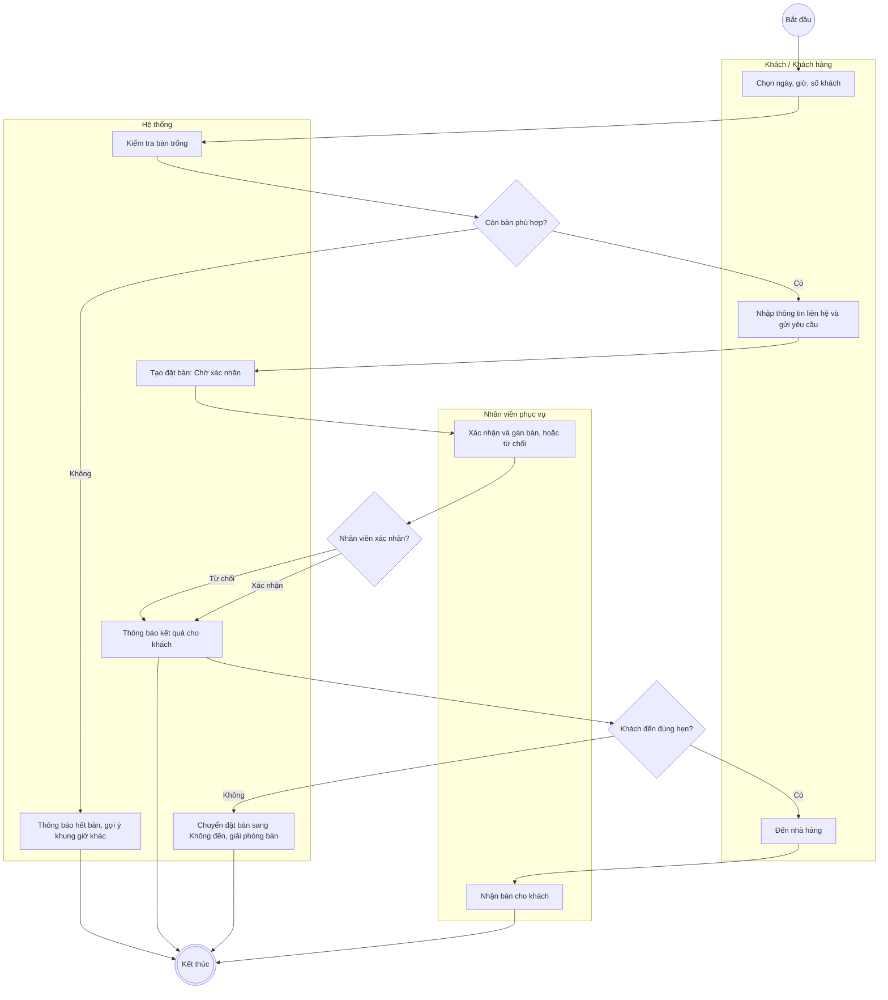

*Hình 2-8: Biểu đồ hoạt động quy trình đặt bàn*

### 2.5.5 Quy trình gọi món và chế biến

Nhân viên phục vụ chọn bàn đang phục vụ (hoặc mở bàn mới cho khách vãng lai), chọn món, số lượng và ghi chú rồi gửi bếp. Món xuất hiện trong hàng đợi của Bếp ở trạng thái Chờ chế biến. Bếp nhận chế biến, hoàn thành món; hệ thống thông báo cho Nhân viên phục vụ để mang món ra và xác nhận đã phục vụ. Nếu nguyên liệu hết, Bếp báo hết món; món chuyển sang Hết món và các dòng món chưa chế biến bị hủy kèm thông báo cho Nhân viên phục vụ.

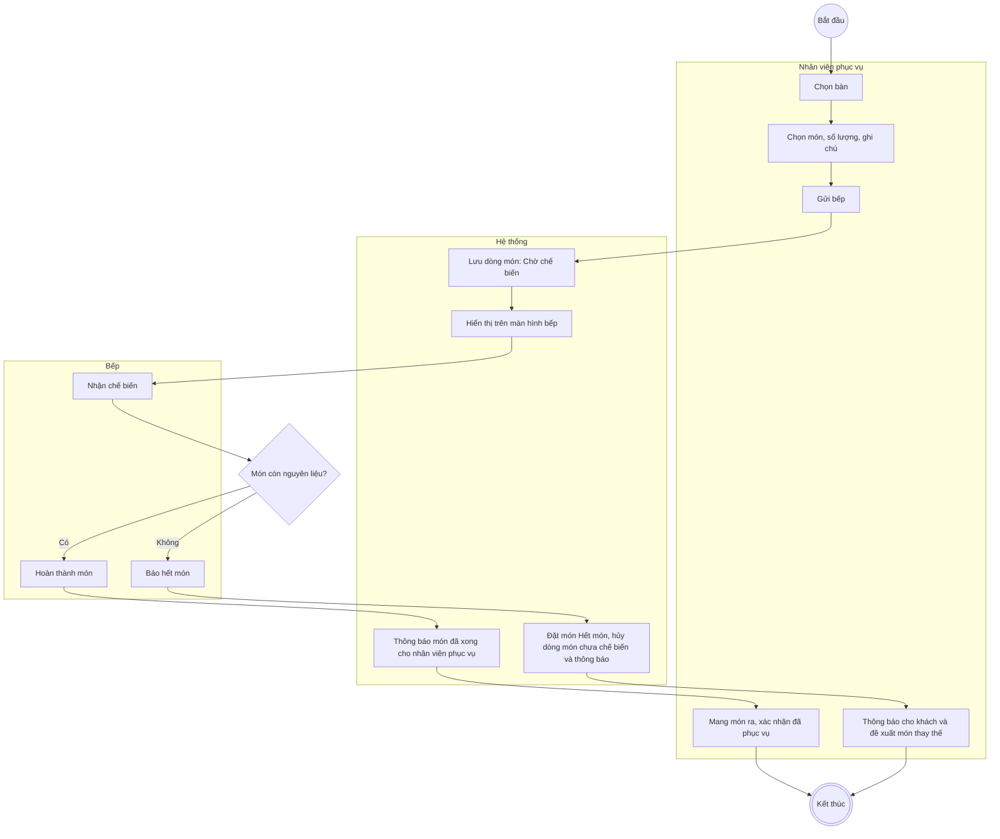

*Hình 2-9: Biểu đồ hoạt động quy trình gọi món và chế biến*

### 2.5.6 Quy trình thanh toán và xuất hóa đơn

Thu ngân chọn bàn cần thanh toán, hệ thống hiển thị đơn hàng với các dòng món chưa bị hủy. Thu ngân có thể gộp đơn của nhiều bàn hoặc tách hóa đơn, nhập mã khuyến mãi (nếu có), chọn phương thức thanh toán và xác nhận. Hệ thống tính tổng tiền, giảm giá, VAT, lưu hóa đơn ở trạng thái Đã thanh toán, đóng đơn hàng, chuyển bàn về Trống và in hóa đơn.

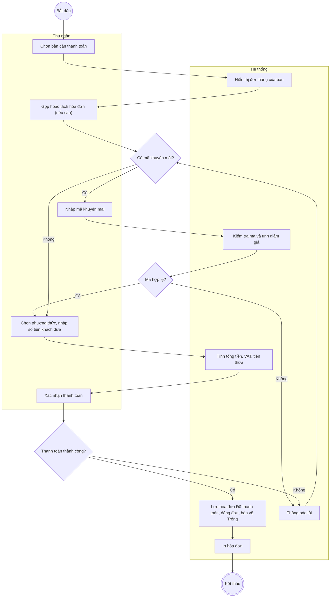

*Hình 2-10: Biểu đồ hoạt động quy trình thanh toán và xuất hóa đơn*

### 2.5.7 Quy trình quản lý kho

Quản lý khai báo nguyên liệu (đơn vị tính, ngưỡng tồn tối thiểu) và nhà cung cấp. Khi nhận hàng, Quản lý tạo phiếu nhập chọn nhà cung cấp, nguyên liệu, số lượng, đơn giá; hệ thống cộng số lượng tồn kho. Khi dùng hoặc hư hỏng nguyên liệu, Quản lý tạo phiếu xuất và hệ thống trừ tồn kho. Hệ thống cảnh báo khi số lượng tồn của nguyên liệu thấp hơn ngưỡng tối thiểu.

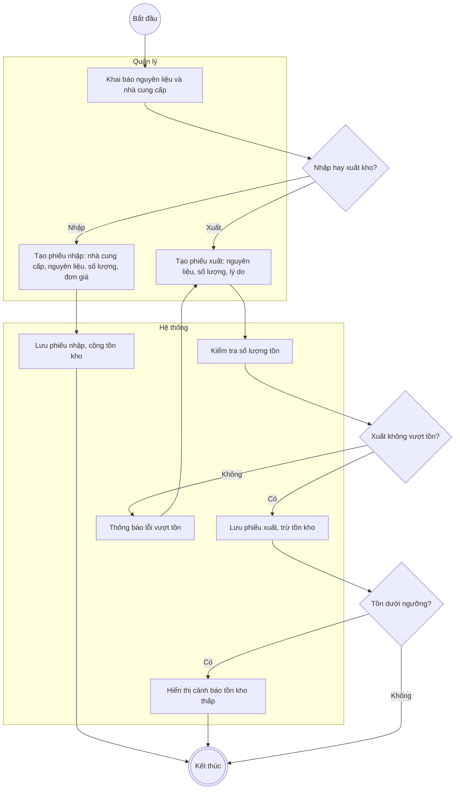

*Hình 2-11: Biểu đồ hoạt động quy trình quản lý kho*

### 2.5.8 Quy trình sử dụng phần mềm của khách hàng

Khách xem thực đơn mà không cần đăng nhập. Muốn đặt bàn, Khách có thể nhập thông tin liên hệ để đặt như khách vãng lai, hoặc đăng nhập để thông tin được điền sẵn. Sau khi đặt, khách nhận mã đặt bàn. Khách hàng có thể vào lịch sử để theo dõi trạng thái đặt bàn, hủy đặt bàn (nếu còn đủ thời gian) và xem các hóa đơn đã thanh toán.

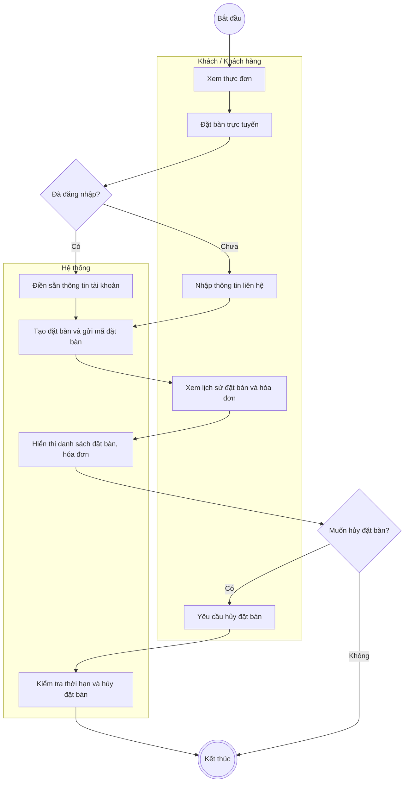

*Hình 2-12: Biểu đồ hoạt động quy trình sử dụng phần mềm của khách hàng*

## 2.6 Đặc tả các use case

### 2.6.1 Đăng nhập

**Mô tả:** Tác nhân đăng nhập vào hệ thống để sử dụng các chức năng theo vai trò được cấp.

| Mã Use case | UC001 | Tên Use case | Đăng nhập |
|---|---|---|---|
| Tác nhân | Khách hàng, Nhân viên phục vụ, Thu ngân, Bếp, Quản lý (gọi chung là Người dùng) | Sự kiện kích hoạt | Click vào nút “Đăng nhập” trên giao diện website |
| Tiền điều kiện | Tác nhân đã có tài khoản đã kích hoạt trên hệ thống và tài khoản không bị khóa | Hậu điều kiện | Tác nhân đăng nhập được vào hệ thống, hệ thống hiển thị chức năng đúng vai trò |

*Luồng chính (Thành công)*

| STT | Thực hiện bởi | Hành động |
|---|---|---|
| 1 | Người dùng | Chọn chức năng Đăng nhập |
| 2 | Hệ thống | Hiển thị giao diện đăng nhập |
| 3 | Người dùng | Nhập email và mật khẩu (mô tả ở bảng dữ liệu bên dưới) |
| 4 | Người dùng | Yêu cầu đăng nhập |
| 5 | Hệ thống | Kiểm tra người dùng đã nhập các trường bắt buộc hay chưa |
| 6 | Hệ thống | Kiểm tra email và mật khẩu có khớp với tài khoản trong hệ thống hay không, tài khoản có bị khóa không |
| 7 | Hệ thống | Hiển thị chức năng tương ứng với vai trò của người dùng |

*Luồng thay thế*

| STT | Thực hiện bởi | Hành động |
|---|---|---|
| 5a | Hệ thống | Thông báo lỗi: Cần nhập các trường bắt buộc nếu người dùng nhập thiếu |
| 6a | Hệ thống | Thông báo lỗi: Email và/hoặc mật khẩu chưa đúng nếu không tìm thấy email và mật khẩu trong hệ thống |
| 6b | Hệ thống | Thông báo lỗi: Tài khoản đã bị khóa hoặc chưa xác thực email |

*Bảng 2-1: Đặc tả chức năng “Đăng nhập”*

**Dữ liệu đầu vào gồm các trường dữ liệu sau:**

| STT | Trường dữ liệu | Mô tả | Bắt buộc? | Điều kiện hợp lệ | Ví dụ |
|---|---|---|---|---|---|
| 1 | Email | Input email field | Có | Đúng định dạng email | khach@gmail.com |
| 2 | Mật khẩu | Password field | Có | Tối thiểu 8 ký tự | Matkhau123 |

*Bảng 2-2: Dữ liệu chức năng “Đăng nhập”*

### 2.6.2 Đăng ký

**Mô tả:** Khách đăng ký tài khoản để trở thành Khách hàng và sử dụng các chức năng dành riêng cho Khách hàng.

| Mã Use case | UC002 | Tên Use case | Đăng ký |
|---|---|---|---|
| Tác nhân | Khách | Sự kiện kích hoạt | Click vào nút “Đăng ký” trên thanh tiêu đề |
| Tiền điều kiện | Không | Hậu điều kiện | Tài khoản Khách hàng được tạo và lưu trữ vào hệ thống ở trạng thái chờ xác thực email; sau khi xác thực, tài khoản được kích hoạt |

*Luồng chính (Thành công)*

| STT | Thực hiện bởi | Hành động |
|---|---|---|
| 1 | Khách | Chọn chức năng Đăng ký |
| 2 | Hệ thống | Hiển thị giao diện đăng ký |
| 3 | Khách | Nhập các thông tin tài khoản (mô tả ở bảng dữ liệu bên dưới) |
| 4 | Khách | Yêu cầu đăng ký |
| 5 | Hệ thống | Kiểm tra khách đã nhập các trường bắt buộc hay chưa |
| 6 | Hệ thống | Kiểm tra địa chỉ email có hợp lệ và chưa được đăng ký hay không |
| 7 | Hệ thống | Kiểm tra mật khẩu nhập lại có trùng với mật khẩu hay không |
| 8 | Hệ thống | Kiểm tra mật khẩu có đủ mức độ an toàn hay không |
| 9 | Hệ thống | Lưu thông tin tài khoản, gửi liên kết xác thực email (có hiệu lực 24 giờ) và thông báo đăng ký thành công |
| 10 | Khách | Mở liên kết trong email để xác thực |
| 11 | Hệ thống | Kích hoạt tài khoản |

*Luồng thay thế*

| STT | Thực hiện bởi | Hành động |
|---|---|---|
| 5a | Hệ thống | Thông báo lỗi: Cần nhập các trường bắt buộc nếu khách nhập thiếu |
| 6a | Hệ thống | Thông báo lỗi: Địa chỉ email không hợp lệ hoặc đã được sử dụng |
| 7a | Hệ thống | Thông báo lỗi: Mật khẩu xác nhận không trùng với mật khẩu nếu hai mật khẩu không trùng nhau |
| 8a | Hệ thống | Thông báo lỗi: Mật khẩu cần đảm bảo độ an toàn nếu mật khẩu không đạt quy định (ít nhất 8 ký tự gồm chữ và số) |
| 11a | Hệ thống | Thông báo liên kết xác thực đã hết hạn và cho phép gửi lại liên kết nếu khách mở liên kết quá 24 giờ |

*Bảng 2-3: Đặc tả chức năng “Đăng ký”*

**Dữ liệu đầu vào của chức năng Đăng ký gồm các trường dữ liệu sau:**

| STT | Trường dữ liệu | Mô tả | Bắt buộc? | Điều kiện hợp lệ | Ví dụ |
|---|---|---|---|---|---|
| 1 | Họ tên | Input text field | Có | Không quá 255 ký tự | Nguyễn Văn An |
| 2 | Email | Input email field | Có | Địa chỉ email hợp lệ, chưa được đăng ký | an.nguyen@gmail.com |
| 3 | Số điện thoại | Input text field | Không | Ký tự số, 10 chữ số | 0989123456 |
| 4 | Mật khẩu | Password field | Có | Ít nhất 8 ký tự gồm chữ và số | Matkhau123 |
| 5 | Xác nhận mật khẩu | Password field | Có | Trùng với Mật khẩu | Matkhau123 |

*Bảng 2-4: Dữ liệu chức năng “Đăng ký”*

### 2.6.3 Thay đổi mật khẩu

**Mô tả:** Tác nhân muốn thay đổi mật khẩu để bảo vệ tài khoản.

| Mã Use case | UC003 | Tên Use case | Thay đổi mật khẩu |
|---|---|---|---|
| Tác nhân | Khách hàng, Nhân viên phục vụ, Thu ngân, Bếp, Quản lý (Người dùng) | Sự kiện kích hoạt | Click vào mục “Đổi mật khẩu” trong menu tài khoản trên phần đầu trang |
| Tiền điều kiện | Tác nhân đăng nhập thành công vào hệ thống | Hậu điều kiện | Mật khẩu mới được cập nhật vào hệ thống |

*Luồng chính (Thành công)*

| STT | Thực hiện bởi | Hành động |
|---|---|---|
| 1 | Người dùng | Chọn chức năng Thay đổi mật khẩu |
| 2 | Hệ thống | Hiển thị giao diện chức năng thay đổi mật khẩu |
| 3 | Người dùng | Điền mật khẩu cũ để xác minh, mật khẩu mới và xác nhận lại mật khẩu mới |
| 4 | Người dùng | Yêu cầu thay đổi mật khẩu |
| 5 | Hệ thống | Kiểm tra mật khẩu cũ, mức độ an toàn của mật khẩu mới và việc xác nhận mật khẩu mới có trùng khớp hay không, sau đó tiến hành thay đổi mật khẩu |

*Luồng thay thế*

| STT | Thực hiện bởi | Hành động |
|---|---|---|
| 5a | Hệ thống | Thông báo lỗi nếu mật khẩu cũ không đúng, mật khẩu mới không đủ an toàn hoặc không trùng khớp với xác nhận mật khẩu |

*Bảng 2-5: Đặc tả chức năng “Thay đổi mật khẩu”*

**Dữ liệu đầu vào:**

| STT | Trường dữ liệu | Mô tả | Bắt buộc? | Điều kiện hợp lệ | Ví dụ |
|---|---|---|---|---|---|
| 1 | Mật khẩu cũ | Password field | Có | Đúng với mật khẩu hiện tại | Matkhau123 |
| 2 | Mật khẩu mới | Password field | Có | Ít nhất 8 ký tự gồm chữ và số, khác mật khẩu cũ | Matkhau456 |
| 3 | Xác nhận mật khẩu mới | Password field | Có | Trùng với Mật khẩu mới | Matkhau456 |

*Bảng 2-6: Dữ liệu chức năng “Thay đổi mật khẩu”*

### 2.6.4 Thiết lập lại mật khẩu

**Mô tả:** Tác nhân muốn thiết lập lại mật khẩu khi quên mật khẩu.

| Mã Use case | UC004 | Tên Use case | Thiết lập lại mật khẩu |
|---|---|---|---|
| Tác nhân | Khách hàng, Nhân viên phục vụ, Thu ngân, Bếp, Quản lý (Người dùng) | Sự kiện kích hoạt | Click vào liên kết “Quên mật khẩu?” tại trang đăng nhập |
| Tiền điều kiện | Tồn tại tài khoản cần thiết lập lại mật khẩu trên hệ thống | Hậu điều kiện | Hệ thống gửi được liên kết thiết lập lại mật khẩu đến email người yêu cầu (liên kết chỉ tồn tại trong vòng 60 phút) |

*Luồng chính (Thành công)*

| STT | Thực hiện bởi | Hành động |
|---|---|---|
| 1 | Người dùng | Chọn chức năng Thiết lập lại mật khẩu (sự kiện kích hoạt ở trên) |
| 2 | Hệ thống | Hiển thị giao diện chức năng thiết lập lại mật khẩu |
| 3 | Người dùng | Nhập email tương ứng với tài khoản cần thiết lập lại mật khẩu |
| 4 | Người dùng | Yêu cầu thiết lập lại mật khẩu (submit nút để gửi yêu cầu) |
| 5 | Hệ thống | Kiểm tra định dạng email và sự tồn tại của tài khoản ứng với email; nếu thỏa mãn, gửi liên kết thiết lập lại mật khẩu đến email của người dùng |
| 6 | Người dùng | Mở liên kết trong email và nhập mật khẩu mới cùng xác nhận mật khẩu |
| 7 | Hệ thống | Kiểm tra liên kết còn hiệu lực, mật khẩu mới đủ an toàn và cập nhật mật khẩu |

*Luồng thay thế*

| STT | Thực hiện bởi | Hành động |
|---|---|---|
| 5a | Hệ thống | Thông báo lỗi nếu email không đúng định dạng hoặc không tồn tại tài khoản ứng với email |
| 5b | Hệ thống | Thông báo thành công nếu gửi được liên kết đến cho người dùng |
| 7a | Hệ thống | Thông báo lỗi nếu liên kết đã hết hạn 60 phút hoặc mật khẩu mới không đạt yêu cầu |

*Bảng 2-7: Đặc tả chức năng “Thiết lập lại mật khẩu”*

**Dữ liệu đầu vào:**

| STT | Trường dữ liệu | Mô tả | Bắt buộc? | Điều kiện hợp lệ | Ví dụ |
|---|---|---|---|---|---|
| 1 | Email | Input email field | Có | Đúng định dạng email, tồn tại tài khoản | an.nguyen@gmail.com |
| 2 | Mật khẩu mới | Password field | Có | Ít nhất 8 ký tự gồm chữ và số | Matkhau789 |
| 3 | Xác nhận mật khẩu mới | Password field | Có | Trùng với Mật khẩu mới | Matkhau789 |

*Bảng 2-8: Dữ liệu chức năng “Thiết lập lại mật khẩu”*

### 2.6.5 Cập nhật thông tin cá nhân

**Mô tả:** Tác nhân cập nhật thông tin cá nhân của mình.

| Mã Use case | UC005 | Tên Use case | Cập nhật thông tin cá nhân |
|---|---|---|---|
| Tác nhân | Khách hàng, Nhân viên phục vụ, Thu ngân, Bếp, Quản lý (Người dùng) | Sự kiện kích hoạt | Click vào mục “Thông tin cá nhân” trong menu tài khoản trên phần đầu trang |
| Tiền điều kiện | Tác nhân đăng nhập thành công | Hậu điều kiện | Cập nhật thành công, thông tin mới được lưu trữ vào hệ thống |

*Luồng chính (Thành công)*

| STT | Thực hiện bởi | Hành động |
|---|---|---|
| 1 | Người dùng | Chọn chức năng Cập nhật thông tin cá nhân |
| 2 | Hệ thống | Hiển thị giao diện cập nhật thông tin cá nhân |
| 3 | Người dùng | Điền thông tin cần cập nhật (mô tả ở bảng dữ liệu bên dưới) |
| 4 | Người dùng | Yêu cầu cập nhật |
| 5 | Hệ thống | Kiểm tra thông tin nhập liệu của người dùng |
| 6 | Hệ thống | Cập nhật và thông báo thành công |

*Luồng thay thế*

| STT | Thực hiện bởi | Hành động |
|---|---|---|
| 5a | Hệ thống | Thông báo lỗi nếu thông tin nhập liệu không đúng định dạng hoặc email đã được tài khoản khác sử dụng |
| 6a | Hệ thống | Thông báo lỗi nếu hệ thống không thể cập nhật thông tin |

*Bảng 2-9: Đặc tả chức năng “Cập nhật thông tin cá nhân”*

**Dữ liệu đầu vào chức năng Cập nhật thông tin cá nhân:**

| STT | Trường dữ liệu | Mô tả | Bắt buộc? | Điều kiện hợp lệ | Ví dụ |
|---|---|---|---|---|---|
| 1 | Họ tên | Input text field | Có | Không quá 255 ký tự | Nguyễn Văn An |
| 2 | Email | Input email field | Có | Đúng định dạng email | an.nguyen@gmail.com |
| 3 | Ngày sinh | DatePicker | Không | Ngày tháng hợp lệ, không ở tương lai | 15/04/1996 |
| 4 | Điện thoại | Input text field | Không | Ký tự số, 10 chữ số | 0989123456 |
| 5 | Giới tính | Chọn Nam, Nữ, Khác | Không | Chọn một trong các giá trị | Nam |
| 6 | Ảnh đại diện | Tệp ảnh | Không | Định dạng png, gif, jpeg, jpg | avatar.png |

*Bảng 2-10: Dữ liệu chức năng “Cập nhật thông tin cá nhân”*

### 2.6.6 Tìm kiếm nhân viên, khách hàng

**Mô tả:** Tìm kiếm tài khoản nhân viên hoặc khách hàng có trên hệ thống.

| Mã Use case | UC006 | Tên Use case | Tìm kiếm nhân viên, khách hàng |
|---|---|---|---|
| Tác nhân | Quản lý | Sự kiện kích hoạt | Click vào ô tìm kiếm hoặc chọn các điều kiện lọc trong màn hình danh sách nhân viên, khách hàng |
| Tiền điều kiện | Đăng nhập thành công vào hệ thống | Hậu điều kiện | Hiển thị những tài khoản tương ứng với thông tin cần tìm kiếm |

*Luồng chính (Thành công)*

| STT | Thực hiện bởi | Hành động |
|---|---|---|
| 1 | Quản lý | Chọn chức năng Tìm kiếm |
| 2 | Hệ thống | Hiển thị giao diện chức năng tìm kiếm |
| 3 | Quản lý | Nhập tên, email, số điện thoại, vai trò hoặc trạng thái tài khoản muốn tìm (mô tả ở bảng dữ liệu bên dưới) |
| 4 | Quản lý | Yêu cầu tìm kiếm |
| 5 | Hệ thống | Tìm và lấy về thông tin những tài khoản thỏa mãn các tiêu chí tìm kiếm |
| 6 | Hệ thống | Hiển thị danh sách tài khoản thỏa mãn điều kiện nếu có ít nhất một tài khoản được tìm thấy |

*Luồng thay thế*

| STT | Thực hiện bởi | Hành động |
|---|---|---|
| 6a | Hệ thống | Thông báo: Không tìm thấy tài khoản nào thỏa mãn tiêu chí tìm kiếm nếu danh sách trả về rỗng |

*Bảng 2-11: Đặc tả chức năng “Tìm kiếm nhân viên, khách hàng”*

**Dữ liệu đầu vào khi tìm kiếm:**

| STT | Trường dữ liệu | Mô tả | Bắt buộc? | Điều kiện hợp lệ | Ví dụ |
|---|---|---|---|---|---|
| 1 | Tên | Input text field | Không | Chuỗi ký tự | Nguyễn Văn An |
| 2 | Email | Input text field | Không | Chuỗi ký tự, một phần của email | an.nguyen@gmail.com |
| 3 | Điện thoại | Input text field | Không | Ký tự số | 0989123456 |
| 4 | Vai trò (chỉ với nhân viên) | Select box | Không | Nhân viên phục vụ / Thu ngân / Bếp / Quản lý / Tất cả | Thu ngân |
| 5 | Trạng thái | Select box | Không | Locked / Unlocked / Tất cả | Unlocked |

*Bảng 2-12: Dữ liệu đầu vào chức năng Tìm kiếm nhân viên, khách hàng*

### 2.6.7 Tìm kiếm món ăn, bàn, đặt bàn, hóa đơn, nguyên liệu, nhà cung cấp, khuyến mãi, tin tức, câu hỏi thường gặp

**Mô tả:** Tìm kiếm dữ liệu theo từng đối tượng trong phạm vi quyền của tác nhân.

| Mã Use case | UC007 | Tên Use case | Tìm kiếm món ăn, bàn, đặt bàn, hóa đơn, nguyên liệu, nhà cung cấp, khuyến mãi, tin tức, câu hỏi thường gặp |
|---|---|---|---|
| Tác nhân | Khách (chỉ món ăn, tin tức, FAQ), Nhân viên phục vụ (món ăn, bàn, đặt bàn), Thu ngân (hóa đơn, món ăn), Bếp (món ăn), Quản lý (tất cả) | Sự kiện kích hoạt | Click vào ô tìm kiếm hoặc chọn các điều kiện lọc trong màn hình danh sách tương ứng |
| Tiền điều kiện | Khách tìm món ăn, tin tức, FAQ không cần đăng nhập; các tác nhân khác đăng nhập thành công | Hậu điều kiện | Hiển thị những dữ liệu tương ứng với thông tin cần tìm kiếm |

Tương tự đặc tả use case “Tìm kiếm nhân viên, khách hàng” (UC006), luồng sự kiện tìm kiếm giữa tác nhân với hệ thống như sau; dữ liệu tìm kiếm ở từng đối tượng được mô tả ở các bảng bên dưới.

*Luồng chính (Thành công)*

| STT | Thực hiện bởi | Hành động |
|---|---|---|
| 1 | Tác nhân | Chọn chức năng Tìm kiếm tại màn hình danh sách của đối tượng cần tìm |
| 2 | Hệ thống | Hiển thị giao diện chức năng tìm kiếm |
| 3 | Tác nhân | Nhập điều kiện tìm kiếm và yêu cầu tìm kiếm |
| 4 | Hệ thống | Tìm và lấy về những bản ghi thỏa mãn các tiêu chí tìm kiếm trong phạm vi quyền của tác nhân |
| 5 | Hệ thống | Hiển thị danh sách kết quả nếu có ít nhất một bản ghi được tìm thấy |

*Luồng thay thế*

| STT | Thực hiện bởi | Hành động |
|---|---|---|
| 5a | Hệ thống | Thông báo: Không tìm thấy kết quả nào thỏa mãn tiêu chí tìm kiếm nếu danh sách trả về rỗng |

*Bảng 2-13: Đặc tả chức năng “Tìm kiếm dữ liệu nghiệp vụ”*

**Dữ liệu đầu vào khi tìm kiếm món ăn:**

| STT | Trường dữ liệu | Mô tả | Bắt buộc? | Điều kiện hợp lệ | Ví dụ |
|---|---|---|---|---|---|
| 1 | Tên món | Input text field | Không | Chuỗi ký tự | Phở bò |
| 2 | Danh mục | Select box | Không | Danh mục có trong hệ thống | Món chính |
| 3 | Khoảng giá | Hai ô số (từ – đến) | Không | Ký tự số, VND, từ ≤ đến | 30000 – 80000 |
| 4 | Trạng thái | Select box | Không | Đang bán / Hết món / Ngừng bán | Đang bán |

*Bảng 2-14: Dữ liệu tìm kiếm món ăn*

**Dữ liệu đầu vào khi tìm kiếm bàn:**

| STT | Trường dữ liệu | Mô tả | Bắt buộc? | Điều kiện hợp lệ | Ví dụ |
|---|---|---|---|---|---|
| 1 | Tên/số bàn | Input text field | Không | Chuỗi ký tự | B05 |
| 2 | Khu vực | Select box | Không | Khu vực có trong hệ thống | Phòng VIP |
| 3 | Sức chứa tối thiểu | Input text field | Không | Số nguyên dương | 4 |
| 4 | Trạng thái | Select box | Không | Trống / Đã đặt / Đang phục vụ / Tạm khóa | Trống |

*Bảng 2-15: Dữ liệu tìm kiếm bàn*

**Dữ liệu đầu vào khi tìm kiếm đặt bàn:**

| STT | Trường dữ liệu | Mô tả | Bắt buộc? | Điều kiện hợp lệ | Ví dụ |
|---|---|---|---|---|---|
| 1 | Tên khách hoặc số điện thoại | Input text field | Không | Chuỗi ký tự | 0989123456 |
| 2 | Mã đặt bàn | Input text field | Không | Chuỗi ký tự | DB20261009-001 |
| 3 | Ngày đặt | DatePicker | Không | Ngày tháng hợp lệ | 09/10/2026 |
| 4 | Trạng thái | Select box | Không | Chờ xác nhận / Đã xác nhận / Đã nhận bàn / Đã hủy / Không đến | Chờ xác nhận |

*Bảng 2-16: Dữ liệu tìm kiếm đặt bàn*

**Dữ liệu đầu vào khi tìm kiếm hóa đơn:**

| STT | Trường dữ liệu | Mô tả | Bắt buộc? | Điều kiện hợp lệ | Ví dụ |
|---|---|---|---|---|---|
| 1 | Mã hóa đơn | Input text field | Không | Chuỗi ký tự | HD20261009-015 |
| 2 | Từ ngày – Đến ngày | Hai DatePicker | Không | Ngày tháng hợp lệ, từ ngày ≤ đến ngày | 01/10/2026 – 09/10/2026 |
| 3 | Bàn | Input text field | Không | Chuỗi ký tự | B05 |
| 4 | Phương thức thanh toán | Select box | Không | Tiền mặt / Thẻ / Chuyển khoản | Tiền mặt |

*Bảng 2-17: Dữ liệu tìm kiếm hóa đơn*

**Dữ liệu đầu vào khi tìm kiếm nguyên liệu:**

| STT | Trường dữ liệu | Mô tả | Bắt buộc? | Điều kiện hợp lệ | Ví dụ |
|---|---|---|---|---|---|
| 1 | Tên nguyên liệu | Input text field | Không | Chuỗi ký tự | Thịt bò |
| 2 | Tình trạng tồn kho | Select box | Không | Đủ / Dưới ngưỡng tối thiểu / Hết | Dưới ngưỡng tối thiểu |

*Bảng 2-18: Dữ liệu tìm kiếm nguyên liệu*

**Dữ liệu đầu vào khi tìm kiếm nhà cung cấp:**

| STT | Trường dữ liệu | Mô tả | Bắt buộc? | Điều kiện hợp lệ | Ví dụ |
|---|---|---|---|---|---|
| 1 | Tên nhà cung cấp | Input text field | Không | Chuỗi ký tự | Công ty Thực phẩm Sạch |
| 2 | Điện thoại | Input text field | Không | Ký tự số | 0243123456 |

*Bảng 2-19: Dữ liệu tìm kiếm nhà cung cấp*

**Dữ liệu đầu vào khi tìm kiếm khuyến mãi:**

| STT | Trường dữ liệu | Mô tả | Bắt buộc? | Điều kiện hợp lệ | Ví dụ |
|---|---|---|---|---|---|
| 1 | Mã khuyến mãi | Input text field | Không | Chuỗi ký tự | GIAM10 |
| 2 | Trạng thái | Select box | Không | Hoạt động / Tạm dừng / Hết hạn | Hoạt động |

*Bảng 2-20: Dữ liệu tìm kiếm khuyến mãi*

**Dữ liệu đầu vào khi tìm kiếm tin tức:**

| STT | Trường dữ liệu | Mô tả | Bắt buộc? | Điều kiện hợp lệ | Ví dụ |
|---|---|---|---|---|---|
| 1 | Tiêu đề | Input text field | Không | Chuỗi ký tự | Thực đơn mùa thu |

*Bảng 2-21: Dữ liệu tìm kiếm tin tức*

**Dữ liệu đầu vào khi tìm kiếm câu hỏi thường gặp (FAQ):**

| STT | Trường dữ liệu | Mô tả | Bắt buộc? | Điều kiện hợp lệ | Ví dụ |
|---|---|---|---|---|---|
| 1 | Nội dung câu hỏi | Input text field | Không | Chuỗi ký tự | Nhà hàng có nhận đặt bàn trước không? |

*Bảng 2-22: Dữ liệu tìm kiếm FAQ*

### 2.6.8 Quản lý nhân viên

**Mô tả:** Thực hiện các tác vụ như thêm, sửa, xóa, xem, tìm kiếm nhân viên.

| Mã Use case | UC008 | Tên Use case | Quản lý nhân viên |
|---|---|---|---|
| Tác nhân | Quản lý | Sự kiện kích hoạt | Click nút “Thêm nhân viên”, “Xóa”, “Danh sách nhân viên”, “Chi tiết nhân viên”, “Sửa nhân viên”, “Khóa tài khoản”, “Mở khóa tài khoản” tương ứng với các sự kiện thêm mới, xóa, xem danh sách, xem chi tiết, thay đổi thông tin, khóa, mở khóa nhân viên |
| Tiền điều kiện | Đăng nhập thành công | Hậu điều kiện | Hiển thị danh sách tương ứng với thông tin cần tìm kiếm; cập nhật thành công thì thông tin mới được lưu trữ vào hệ thống; xóa thành công nhân viên; nhân viên khi tạo mới được lưu trữ trong cơ sở dữ liệu kèm vai trò và trạng thái (Locked hoặc Unlocked) tương ứng với chức năng Khóa hay Mở khóa tài khoản |

**Tìm kiếm (S - Search):** xem UC006.

**Xem (R - Read)**

*Luồng chính (Thành công)*

| STT | Thực hiện bởi | Hành động |
|---|---|---|
| 1 | Quản lý | Yêu cầu xem danh sách nhân viên |
| 2 | Hệ thống | Hiển thị danh sách nhân viên |
| 3 | Quản lý | Yêu cầu xem chi tiết nhân viên |
| 4 | Hệ thống | Hiển thị chi tiết nhân viên |

*Luồng thay thế*

| STT | Thực hiện bởi | Hành động |
|---|---|---|
| 2a | Hệ thống | Thông báo nếu chưa có nhân viên nào |

**Sửa (U - Update)**

*Luồng chính (Thành công)*

| STT | Thực hiện bởi | Hành động |
|---|---|---|
| 1 | Quản lý | Chọn xem chi tiết nhân viên và yêu cầu sửa |
| 2 | Hệ thống | Lấy thông tin chi tiết nhân viên và hiển thị lên giao diện chức năng sửa |
| 3 | Quản lý | Chỉnh sửa thông tin nhân viên (mô tả ở bảng dữ liệu bên dưới) và yêu cầu sửa |
| 4 | Hệ thống | Kiểm tra các trường nhập liệu |
| 5 | Hệ thống | Cập nhật thông tin và thông báo sửa thành công |

*Luồng thay thế*

| STT | Thực hiện bởi | Hành động |
|---|---|---|
| 4a | Hệ thống | Thông báo lỗi nếu các trường nhập liệu không đúng định dạng |
| 4b | Hệ thống | Thông báo lỗi nếu email đã được tài khoản khác sử dụng hoặc Quản lý tự đổi vai trò của chính mình |
| 5a | Hệ thống | Thông báo lỗi nếu cập nhật không thành công |

**Xóa (D - Delete)**

*Luồng chính (Thành công)*

| STT | Thực hiện bởi | Hành động |
|---|---|---|
| 1 | Quản lý | Chọn nhân viên cần xóa và yêu cầu xóa |
| 2 | Hệ thống | Hiển thị thông báo yêu cầu xác nhận việc xóa |
| 3 | Quản lý | Xác nhận xóa nhân viên |
| 4 | Hệ thống | Kiểm tra điều kiện được phép xóa |
| 5 | Hệ thống | Xóa và thông báo xóa thành công |

*Luồng thay thế*

| STT | Thực hiện bởi | Hành động |
|---|---|---|
| 4a | Hệ thống | Thông báo không thể xóa nếu nhân viên đã phát sinh đơn hàng, hóa đơn hoặc phiếu kho (khi đó chỉ được khóa tài khoản), hoặc Quản lý đang xóa chính tài khoản của mình |
| 5a | Hệ thống | Thông báo lỗi nếu xóa không thành công |

**Thêm (C - Create)**

*Luồng chính (Thành công)*

| STT | Thực hiện bởi | Hành động |
|---|---|---|
| 1 | Quản lý | Yêu cầu chức năng thêm mới nhân viên |
| 2 | Hệ thống | Hiển thị giao diện thêm mới nhân viên |
| 3 | Quản lý | Nhập thông tin nhân viên (mô tả ở bảng dữ liệu bên dưới) và yêu cầu thêm mới |
| 4 | Hệ thống | Kiểm tra các trường nhập liệu |
| 5 | Hệ thống | Thêm mới nhân viên vào hệ thống và thông báo thành công |

*Luồng thay thế*

| STT | Thực hiện bởi | Hành động |
|---|---|---|
| 4a | Hệ thống | Thông báo lỗi nếu dữ liệu nhập vào không đúng định dạng |
| 4b | Hệ thống | Thông báo lỗi nếu email đã được tài khoản khác sử dụng |
| 5a | Hệ thống | Thông báo lỗi nếu thêm mới không thành công |

**Khóa / Mở khóa tài khoản**

*Luồng chính (Thành công)*

| STT | Thực hiện bởi | Hành động |
|---|---|---|
| 1 | Quản lý | Chọn nhân viên và yêu cầu khóa hoặc mở khóa tài khoản |
| 2 | Hệ thống | Hiển thị thông báo yêu cầu xác nhận |
| 3 | Quản lý | Xác nhận |
| 4 | Hệ thống | Cập nhật trạng thái tài khoản thành Locked hoặc Unlocked; nhân viên bị khóa không thể đăng nhập và các phiên đang đăng nhập bị chấm dứt |

*Luồng thay thế*

| STT | Thực hiện bởi | Hành động |
|---|---|---|
| 4a | Hệ thống | Thông báo lỗi nếu Quản lý khóa chính tài khoản của mình hoặc cập nhật không thành công |

*Bảng 2-23: Đặc tả chức năng “Quản lý nhân viên”*

**Dữ liệu đầu vào khi thêm/sửa:**

| STT | Trường dữ liệu | Mô tả | Bắt buộc? | Điều kiện hợp lệ | Ví dụ |
|---|---|---|---|---|---|
| 1 | Họ tên | Input text field | Có | Tối đa 255 ký tự | Trần Thị Bích |
| 2 | Email | Email đăng nhập của nhân viên | Có | Định dạng email, duy nhất | bich.tran@nhahang.vn |
| 3 | Vai trò | Chọn Nhân viên phục vụ, Thu ngân, Bếp hoặc Quản lý | Có | Chọn một trong các vai trò | Thu ngân |
| 4 | Ngày sinh | DatePicker | Không | Định dạng ngày, không ở tương lai | 20/05/1995 |
| 5 | Điện thoại | Input text field | Không | Ký tự số, 10 chữ số | 0912345678 |
| 6 | Giới tính | Chọn Nam, Nữ hoặc Khác | Không | Chọn một trong các giá trị | Nữ |
| 7 | Ảnh đại diện | Tệp ảnh | Không | Định dạng ảnh: png, jpeg, jpg, gif | bich.png |
| 8 | Mật khẩu | Mật khẩu ban đầu (chỉ khi thêm mới); nhân viên được yêu cầu đổi ở lần đăng nhập đầu | Có (khi thêm) | Ít nhất 8 ký tự gồm chữ và số | Matkhau123 |
| 9 | Trạng thái | Tài khoản bị khóa hay không | Có | Đã chọn trạng thái | Unlocked (không bị khóa) |

*Bảng 2-24: Dữ liệu đầu vào chức năng “Quản lý nhân viên”*

> **Ghi chú:** Mật khẩu chỉ được nhập khi thêm mới; khi sửa, Quản lý không xem hay đổi mật khẩu của nhân viên mà nhân viên dùng UC003/UC004.

### 2.6.9 Quản lý khách hàng

**Mô tả:** Thực hiện các tác vụ như xem, tìm kiếm, khóa, mở khóa, xóa tài khoản khách hàng. Khách hàng tự đăng ký và tự cập nhật thông tin nên Quản lý không thêm hay sửa.

| Mã Use case | UC009 | Tên Use case | Quản lý khách hàng |
|---|---|---|---|
| Tác nhân | Quản lý | Sự kiện kích hoạt | Click nút “Xóa”, “Danh sách khách hàng”, “Chi tiết khách hàng”, “Khóa tài khoản”, “Mở khóa tài khoản” tương ứng với các sự kiện xóa, xem danh sách, xem chi tiết, khóa, mở khóa khách hàng |
| Tiền điều kiện | Đăng nhập thành công | Hậu điều kiện | Hiển thị danh sách tương ứng với thông tin cần tìm kiếm; xóa thành công khách hàng khỏi hệ thống; mở khóa cho khách hàng sử dụng chức năng hệ thống hay khi khóa khách hàng, tài khoản sẽ không thể đăng nhập được nữa |

**Tìm kiếm (S - Search):** xem UC006.

**Xem (R - Read)**

*Luồng chính (Thành công)*

| STT | Thực hiện bởi | Hành động |
|---|---|---|
| 1 | Quản lý | Yêu cầu xem danh sách khách hàng |
| 2 | Hệ thống | Hiển thị danh sách khách hàng |
| 3 | Quản lý | Yêu cầu xem chi tiết khách hàng |
| 4 | Hệ thống | Hiển thị chi tiết khách hàng |

*Luồng thay thế*

| STT | Thực hiện bởi | Hành động |
|---|---|---|
| 2a | Hệ thống | Thông báo nếu chưa có khách hàng nào |

**Xóa (D - Delete)**

*Luồng chính (Thành công)*

| STT | Thực hiện bởi | Hành động |
|---|---|---|
| 1 | Quản lý | Chọn khách hàng cần xóa và yêu cầu xóa |
| 2 | Hệ thống | Hiển thị thông báo yêu cầu xác nhận việc xóa |
| 3 | Quản lý | Xác nhận xóa khách hàng |
| 4 | Hệ thống | Kiểm tra điều kiện được phép xóa |
| 5 | Hệ thống | Xóa và thông báo xóa thành công |

*Luồng thay thế*

| STT | Thực hiện bởi | Hành động |
|---|---|---|
| 4a | Hệ thống | Thông báo không thể xóa nếu khách hàng còn đặt bàn đang ở trạng thái Chờ xác nhận hoặc Đã xác nhận |
| 5a | Hệ thống | Thông báo lỗi nếu xóa không thành công |

**Khóa / Mở khóa tài khoản**

*Luồng chính (Thành công)*

| STT | Thực hiện bởi | Hành động |
|---|---|---|
| 1 | Quản lý | Chọn khách hàng và yêu cầu khóa hoặc mở khóa tài khoản |
| 2 | Hệ thống | Hiển thị thông báo yêu cầu xác nhận |
| 3 | Quản lý | Xác nhận |
| 4 | Hệ thống | Cập nhật trạng thái tài khoản thành Locked hoặc Unlocked |

*Luồng thay thế*

| STT | Thực hiện bởi | Hành động |
|---|---|---|
| 4a | Hệ thống | Thông báo lỗi nếu cập nhật không thành công |

*Bảng 2-25: Đặc tả chức năng “Quản lý khách hàng”*

### 2.6.10 Quản lý danh mục món

**Mô tả:** Thực hiện các tác vụ như thêm, sửa, xóa, xem, tìm kiếm danh mục món.

| Mã Use case | UC010 | Tên Use case | Quản lý danh mục món |
|---|---|---|---|
| Tác nhân | Quản lý | Sự kiện kích hoạt | Click nút “Thêm danh mục”, “Xóa”, “Danh sách danh mục”, “Sửa danh mục” tương ứng với các sự kiện thêm mới, xóa, xem danh sách, thay đổi danh mục món |
| Tiền điều kiện | Đăng nhập thành công | Hậu điều kiện | Hiển thị danh sách tương ứng với thông tin cần tìm kiếm; cập nhật thành công thì thông tin mới được lưu trữ vào hệ thống; xóa thành công danh mục khi không còn món nào thuộc về; danh mục khi tạo mới được lưu trữ trong cơ sở dữ liệu của hệ thống |

**Tìm kiếm (S - Search):** xem UC007.

**Xem (R - Read)**

*Luồng chính (Thành công)*

| STT | Thực hiện bởi | Hành động |
|---|---|---|
| 1 | Quản lý | Yêu cầu xem danh sách danh mục món |
| 2 | Hệ thống | Hiển thị danh sách danh mục món |
| 3 | Quản lý | Yêu cầu xem chi tiết danh mục món |
| 4 | Hệ thống | Hiển thị chi tiết danh mục món |

*Luồng thay thế*

| STT | Thực hiện bởi | Hành động |
|---|---|---|
| 2a | Hệ thống | Thông báo nếu chưa có danh mục món nào |

**Sửa (U - Update)**

*Luồng chính (Thành công)*

| STT | Thực hiện bởi | Hành động |
|---|---|---|
| 1 | Quản lý | Chọn xem chi tiết danh mục món và yêu cầu sửa |
| 2 | Hệ thống | Lấy thông tin chi tiết danh mục món và hiển thị lên giao diện chức năng sửa |
| 3 | Quản lý | Chỉnh sửa thông tin danh mục món (mô tả ở bảng dữ liệu bên dưới) và yêu cầu sửa |
| 4 | Hệ thống | Kiểm tra các trường nhập liệu |
| 5 | Hệ thống | Cập nhật thông tin và thông báo sửa thành công |

*Luồng thay thế*

| STT | Thực hiện bởi | Hành động |
|---|---|---|
| 4a | Hệ thống | Thông báo lỗi nếu các trường nhập liệu không đúng định dạng |
| 4b | Hệ thống | Thông báo lỗi nếu tên danh mục đã tồn tại |
| 5a | Hệ thống | Thông báo lỗi nếu cập nhật không thành công |

**Xóa (D - Delete)**

*Luồng chính (Thành công)*

| STT | Thực hiện bởi | Hành động |
|---|---|---|
| 1 | Quản lý | Chọn danh mục món cần xóa và yêu cầu xóa |
| 2 | Hệ thống | Hiển thị thông báo yêu cầu xác nhận việc xóa |
| 3 | Quản lý | Xác nhận xóa danh mục món |
| 4 | Hệ thống | Kiểm tra điều kiện được phép xóa |
| 5 | Hệ thống | Xóa và thông báo xóa thành công |

*Luồng thay thế*

| STT | Thực hiện bởi | Hành động |
|---|---|---|
| 4a | Hệ thống | Thông báo không thể xóa nếu vẫn còn món ăn thuộc danh mục |
| 5a | Hệ thống | Thông báo lỗi nếu xóa không thành công |

**Thêm (C - Create)**

*Luồng chính (Thành công)*

| STT | Thực hiện bởi | Hành động |
|---|---|---|
| 1 | Quản lý | Yêu cầu chức năng thêm mới danh mục món |
| 2 | Hệ thống | Hiển thị giao diện thêm mới danh mục món |
| 3 | Quản lý | Nhập thông tin danh mục món (mô tả ở bảng dữ liệu bên dưới) và yêu cầu thêm mới |
| 4 | Hệ thống | Kiểm tra các trường nhập liệu |
| 5 | Hệ thống | Thêm mới danh mục món vào hệ thống và thông báo thành công |

*Luồng thay thế*

| STT | Thực hiện bởi | Hành động |
|---|---|---|
| 4a | Hệ thống | Thông báo lỗi nếu dữ liệu nhập vào không đúng định dạng |
| 4b | Hệ thống | Thông báo lỗi nếu tên danh mục đã tồn tại |
| 5a | Hệ thống | Thông báo lỗi nếu thêm mới không thành công |

*Bảng 2-26: Đặc tả chức năng “Quản lý danh mục món”*

**Dữ liệu đầu vào khi thêm/sửa:**

| STT | Trường dữ liệu | Mô tả | Bắt buộc? | Điều kiện hợp lệ | Ví dụ |
|---|---|---|---|---|---|
| 1 | Tên danh mục | Input text field | Có | Tối đa 100 ký tự, duy nhất | Món chính |
| 2 | Mô tả | Text field | Không | Tối đa 500 ký tự | Các món ăn chính dùng với cơm |
| 3 | Thứ tự hiển thị | Input number | Không | Số nguyên không âm | 1 |

*Bảng 2-27: Dữ liệu đầu vào chức năng “Quản lý danh mục món”*

> **Ghi chú:** Danh mục chỉ xóa được khi không còn món ăn nào thuộc về; muốn xóa Quản lý cần chuyển hoặc xóa các món trước.

### 2.6.11 Quản lý món ăn

**Mô tả:** Thực hiện các tác vụ như thêm, sửa, xóa, xem, tìm kiếm món ăn.

| Mã Use case | UC011 | Tên Use case | Quản lý món ăn |
|---|---|---|---|
| Tác nhân | Quản lý | Sự kiện kích hoạt | Click nút “Thêm món”, “Xóa”, “Danh sách món”, “Chi tiết món”, “Sửa món” tương ứng với các sự kiện thêm mới, xóa, xem danh sách, xem chi tiết, thay đổi món ăn |
| Tiền điều kiện | Đăng nhập thành công | Hậu điều kiện | Hiển thị danh sách tương ứng với thông tin cần tìm kiếm; cập nhật thành công thì thông tin mới được lưu trữ vào hệ thống; món chưa từng được gọi thì xóa được khỏi hệ thống; món khi tạo mới được lưu kèm trạng thái (Đang bán, Hết món, Ngừng bán) |

**Tìm kiếm (S - Search):** xem UC007.

**Xem (R - Read)**

*Luồng chính (Thành công)*

| STT | Thực hiện bởi | Hành động |
|---|---|---|
| 1 | Quản lý | Yêu cầu xem danh sách món ăn |
| 2 | Hệ thống | Hiển thị danh sách món ăn |
| 3 | Quản lý | Yêu cầu xem chi tiết món ăn |
| 4 | Hệ thống | Hiển thị chi tiết món ăn |

*Luồng thay thế*

| STT | Thực hiện bởi | Hành động |
|---|---|---|
| 2a | Hệ thống | Thông báo nếu chưa có món ăn nào |

**Sửa (U - Update)**

*Luồng chính (Thành công)*

| STT | Thực hiện bởi | Hành động |
|---|---|---|
| 1 | Quản lý | Chọn xem chi tiết món ăn và yêu cầu sửa |
| 2 | Hệ thống | Lấy thông tin chi tiết món ăn và hiển thị lên giao diện chức năng sửa |
| 3 | Quản lý | Chỉnh sửa thông tin món ăn (mô tả ở bảng dữ liệu bên dưới) và yêu cầu sửa |
| 4 | Hệ thống | Kiểm tra các trường nhập liệu |
| 5 | Hệ thống | Cập nhật thông tin và thông báo sửa thành công |

*Luồng thay thế*

| STT | Thực hiện bởi | Hành động |
|---|---|---|
| 4a | Hệ thống | Thông báo lỗi nếu các trường nhập liệu không đúng định dạng |
| 4b | Hệ thống | Thông báo lỗi nếu tên món đã tồn tại trong danh mục |
| 5a | Hệ thống | Thông báo lỗi nếu cập nhật không thành công |

**Xóa (D - Delete)**

*Luồng chính (Thành công)*

| STT | Thực hiện bởi | Hành động |
|---|---|---|
| 1 | Quản lý | Chọn món ăn cần xóa và yêu cầu xóa |
| 2 | Hệ thống | Hiển thị thông báo yêu cầu xác nhận việc xóa |
| 3 | Quản lý | Xác nhận xóa món ăn |
| 4 | Hệ thống | Kiểm tra điều kiện được phép xóa |
| 5 | Hệ thống | Xóa và thông báo xóa thành công |

*Luồng thay thế*

| STT | Thực hiện bởi | Hành động |
|---|---|---|
| 4a | Hệ thống | Thông báo không thể xóa nếu món ăn đã xuất hiện trong đơn hàng hoặc hóa đơn (khi đó chỉ được chuyển sang Ngừng bán) |
| 5a | Hệ thống | Thông báo lỗi nếu xóa không thành công |

**Thêm (C - Create)**

*Luồng chính (Thành công)*

| STT | Thực hiện bởi | Hành động |
|---|---|---|
| 1 | Quản lý | Yêu cầu chức năng thêm mới món ăn |
| 2 | Hệ thống | Hiển thị giao diện thêm mới món ăn |
| 3 | Quản lý | Nhập thông tin món ăn (mô tả ở bảng dữ liệu bên dưới) và yêu cầu thêm mới |
| 4 | Hệ thống | Kiểm tra các trường nhập liệu |
| 5 | Hệ thống | Thêm mới món ăn vào hệ thống và thông báo thành công |

*Luồng thay thế*

| STT | Thực hiện bởi | Hành động |
|---|---|---|
| 4a | Hệ thống | Thông báo lỗi nếu dữ liệu nhập vào không đúng định dạng |
| 4b | Hệ thống | Thông báo lỗi nếu tên món đã tồn tại trong danh mục |
| 5a | Hệ thống | Thông báo lỗi nếu thêm mới không thành công |

*Bảng 2-28: Đặc tả chức năng “Quản lý món ăn”*

**Dữ liệu đầu vào khi thêm/sửa:**

| STT | Trường dữ liệu | Mô tả | Bắt buộc? | Điều kiện hợp lệ | Ví dụ |
|---|---|---|---|---|---|
| 1 | Tên món | Input text field | Có | Tối đa 255 ký tự, duy nhất trong cùng danh mục | Phở bò tái |
| 2 | Danh mục | Select box | Có | Danh mục có trong hệ thống | Món chính |
| 3 | Giá bán | Input number (VND) | Có | Số nguyên dương | 65000 |
| 4 | Đơn vị tính | Input text field | Có | Tối đa 20 ký tự | Tô |
| 5 | Mô tả | Text field | Không | Tối đa 1000 ký tự | Phở bò truyền thống, nước dùng hầm 12 giờ |
| 6 | Thời gian chế biến dự kiến | Input number (phút) | Không | Số nguyên dương | 10 |
| 7 | Ảnh | Ảnh minh họa | Không | Định dạng ảnh: png, gif, jpg, jpeg | pho-bo.jpg |
| 8 | Trạng thái | Radio button | Có | Đang bán, Hết món hoặc Ngừng bán | Đang bán |

*Bảng 2-29: Dữ liệu đầu vào chức năng “Quản lý món ăn”*

> **Ghi chú:** Món ở trạng thái Hết món vẫn hiển thị trong thực đơn nhưng Nhân viên phục vụ không thể chọn gọi; món Ngừng bán không hiển thị cho Khách.

### 2.6.12 Quản lý bàn

**Mô tả:** Thực hiện các tác vụ như thêm, sửa, xóa, xem, tìm kiếm bàn.

| Mã Use case | UC012 | Tên Use case | Quản lý bàn |
|---|---|---|---|
| Tác nhân | Quản lý (đầy đủ); Nhân viên phục vụ (xem sơ đồ bàn, cập nhật trạng thái bàn) | Sự kiện kích hoạt | Click nút “Thêm bàn”, “Xóa”, “Sơ đồ bàn”, “Chi tiết bàn”, “Sửa bàn” tương ứng với các sự kiện thêm mới, xóa, xem sơ đồ, xem chi tiết, thay đổi thông tin bàn |
| Tiền điều kiện | Đăng nhập thành công | Hậu điều kiện | Hiển thị danh sách tương ứng với thông tin cần tìm kiếm; cập nhật thành công thì thông tin mới được lưu trữ vào hệ thống; xóa thành công bàn khi không còn dữ liệu liên quan; bàn khi tạo mới có trạng thái Trống |

**Tìm kiếm (S - Search):** xem UC007.

**Xem (R - Read)**

*Luồng chính (Thành công)*

| STT | Thực hiện bởi | Hành động |
|---|---|---|
| 1 | Quản lý | Yêu cầu xem danh sách bàn |
| 2 | Hệ thống | Hiển thị danh sách bàn |
| 3 | Quản lý | Yêu cầu xem chi tiết bàn |
| 4 | Hệ thống | Hiển thị chi tiết bàn |

*Luồng thay thế*

| STT | Thực hiện bởi | Hành động |
|---|---|---|
| 2a | Hệ thống | Thông báo nếu chưa có bàn nào |

**Sửa (U - Update)**

*Luồng chính (Thành công)*

| STT | Thực hiện bởi | Hành động |
|---|---|---|
| 1 | Quản lý | Chọn xem chi tiết bàn và yêu cầu sửa |
| 2 | Hệ thống | Lấy thông tin chi tiết bàn và hiển thị lên giao diện chức năng sửa |
| 3 | Quản lý | Chỉnh sửa thông tin bàn (mô tả ở bảng dữ liệu bên dưới) và yêu cầu sửa |
| 4 | Hệ thống | Kiểm tra các trường nhập liệu |
| 5 | Hệ thống | Cập nhật thông tin và thông báo sửa thành công |

*Luồng thay thế*

| STT | Thực hiện bởi | Hành động |
|---|---|---|
| 4a | Hệ thống | Thông báo lỗi nếu các trường nhập liệu không đúng định dạng |
| 4b | Hệ thống | Thông báo lỗi nếu tên/số bàn đã tồn tại hoặc giảm sức chứa thấp hơn số khách của đặt bàn đang gán cho bàn |
| 5a | Hệ thống | Thông báo lỗi nếu cập nhật không thành công |

**Xóa (D - Delete)**

*Luồng chính (Thành công)*

| STT | Thực hiện bởi | Hành động |
|---|---|---|
| 1 | Quản lý | Chọn bàn cần xóa và yêu cầu xóa |
| 2 | Hệ thống | Hiển thị thông báo yêu cầu xác nhận việc xóa |
| 3 | Quản lý | Xác nhận xóa bàn |
| 4 | Hệ thống | Kiểm tra điều kiện được phép xóa |
| 5 | Hệ thống | Xóa và thông báo xóa thành công |

*Luồng thay thế*

| STT | Thực hiện bởi | Hành động |
|---|---|---|
| 4a | Hệ thống | Thông báo không thể xóa nếu bàn đang ở trạng thái Đang phục vụ hoặc còn đặt bàn chưa hoàn tất |
| 5a | Hệ thống | Thông báo lỗi nếu xóa không thành công |

**Thêm (C - Create)**

*Luồng chính (Thành công)*

| STT | Thực hiện bởi | Hành động |
|---|---|---|
| 1 | Quản lý | Yêu cầu chức năng thêm mới bàn |
| 2 | Hệ thống | Hiển thị giao diện thêm mới bàn |
| 3 | Quản lý | Nhập thông tin bàn (mô tả ở bảng dữ liệu bên dưới) và yêu cầu thêm mới |
| 4 | Hệ thống | Kiểm tra các trường nhập liệu |
| 5 | Hệ thống | Thêm mới bàn vào hệ thống và thông báo thành công |

*Luồng thay thế*

| STT | Thực hiện bởi | Hành động |
|---|---|---|
| 4a | Hệ thống | Thông báo lỗi nếu dữ liệu nhập vào không đúng định dạng |
| 4b | Hệ thống | Thông báo lỗi nếu tên/số bàn đã tồn tại |
| 5a | Hệ thống | Thông báo lỗi nếu thêm mới không thành công |

**Cập nhật trạng thái bàn (Quản lý, Nhân viên phục vụ)**

*Luồng chính (Thành công)*

| STT | Thực hiện bởi | Hành động |
|---|---|---|
| 1 | Nhân viên phục vụ | Chọn chức năng Sơ đồ bàn |
| 2 | Hệ thống | Hiển thị sơ đồ bàn kèm trạng thái từng bàn |
| 3 | Nhân viên phục vụ | Chọn một bàn và yêu cầu đổi trạng thái (ví dụ: bàn đã dọn xong chuyển sang Trống, bàn hỏng chuyển sang Tạm khóa) |
| 4 | Hệ thống | Kiểm tra việc chuyển trạng thái có hợp lệ và cập nhật trạng thái bàn |

*Luồng thay thế*

| STT | Thực hiện bởi | Hành động |
|---|---|---|
| 4a | Hệ thống | Thông báo lỗi nếu bàn đang có đơn hàng chưa thanh toán mà bị chuyển sang Trống hoặc Tạm khóa |

*Bảng 2-30: Đặc tả chức năng “Quản lý bàn”*

**Dữ liệu đầu vào khi thêm/sửa:**

| STT | Trường dữ liệu | Mô tả | Bắt buộc? | Điều kiện hợp lệ | Ví dụ |
|---|---|---|---|---|---|
| 1 | Tên/số bàn | Input text field | Có | Tối đa 20 ký tự, duy nhất | B05 |
| 2 | Khu vực | Select box | Có | Trong nhà, Ngoài trời, Phòng VIP, Tầng 2 | Phòng VIP |
| 3 | Sức chứa | Input number (người) | Có | Số nguyên từ 1 đến 50 | 6 |
| 4 | Trạng thái | Select box | Có | Trống, Đã đặt, Đang phục vụ, Tạm khóa | Trống |
| 5 | Ghi chú | Text field | Không | Tối đa 255 ký tự | Gần cửa sổ |

*Bảng 2-31: Dữ liệu đầu vào chức năng “Quản lý bàn”*

> **Ghi chú:** Trạng thái bàn Đã đặt, Đang phục vụ do hệ thống tự cập nhật khi xác nhận đặt bàn, nhận bàn và thanh toán; Nhân viên phục vụ chỉ được đổi giữa Trống và Tạm khóa.

### 2.6.13 Xem thực đơn

**Mô tả:** Tác nhân xem danh sách món ăn của nhà hàng theo danh mục, không cần đăng nhập.

| Mã Use case | UC013 | Tên Use case | Xem thực đơn |
|---|---|---|---|
| Tác nhân | Khách, Khách hàng | Sự kiện kích hoạt | Click vào mục “Thực đơn” trên thanh tiêu đề |
| Tiền điều kiện | Không | Hậu điều kiện | Hệ thống hiển thị thực đơn gồm các món Đang bán và Hết món theo từng danh mục |

*Luồng chính (Thành công)*

| STT | Thực hiện bởi | Hành động |
|---|---|---|
| 1 | Khách | Chọn chức năng Thực đơn |
| 2 | Hệ thống | Hiển thị danh sách danh mục món và các món ăn của danh mục đầu tiên |
| 3 | Khách | Chọn một danh mục hoặc nhập tên món để tìm kiếm (UC007) |
| 4 | Hệ thống | Hiển thị danh sách món thuộc danh mục hoặc thỏa mãn điều kiện tìm kiếm, gồm tên món, ảnh, giá và trạng thái |
| 5 | Khách | Chọn một món để xem chi tiết |
| 6 | Hệ thống | Hiển thị chi tiết món: mô tả, đơn vị tính, giá bán, thời gian chế biến dự kiến |

*Luồng thay thế*

| STT | Thực hiện bởi | Hành động |
|---|---|---|
| 2a | Hệ thống | Thông báo thực đơn đang cập nhật nếu chưa có món nào ở trạng thái Đang bán hoặc Hết món |
| 4a | Hệ thống | Thông báo không tìm thấy món nào nếu danh mục hoặc điều kiện tìm kiếm không có kết quả |

*Bảng 2-32: Đặc tả chức năng “Xem thực đơn”*

### 2.6.14 Đặt bàn trực tuyến

**Mô tả:** Tác nhân đặt bàn trước tại nhà hàng. Khách vãng lai nhập thông tin liên hệ, Khách hàng được điền sẵn thông tin từ tài khoản.

| Mã Use case | UC014 | Tên Use case | Đặt bàn trực tuyến |
|---|---|---|---|
| Tác nhân | Khách, Khách hàng | Sự kiện kích hoạt | Click vào nút “Đặt bàn” trên giao diện website |
| Tiền điều kiện | Không (Khách hàng cần đăng nhập nếu muốn lưu lịch sử đặt bàn) | Hậu điều kiện | Đặt bàn được tạo ở trạng thái Chờ xác nhận kèm mã đặt bàn; Khách hàng xem được đặt bàn trong lịch sử |

*Luồng chính (Thành công)*

| STT | Thực hiện bởi | Hành động |
|---|---|---|
| 1 | Khách | Chọn chức năng Đặt bàn |
| 2 | Hệ thống | Hiển thị giao diện đặt bàn |
| 3 | Khách | Chọn ngày, giờ, số khách và khu vực ưu tiên (mô tả ở bảng dữ liệu bên dưới) |
| 4 | Hệ thống | Kiểm tra thời điểm đặt có hợp lệ và còn bàn trống phù hợp với số khách hay không |
| 5 | Khách | Nhập thông tin liên hệ (hoặc dùng thông tin điền sẵn của Khách hàng) và yêu cầu đặt bàn |
| 6 | Hệ thống | Kiểm tra các trường nhập liệu |
| 7 | Hệ thống | Tạo đặt bàn ở trạng thái Chờ xác nhận, hiển thị mã đặt bàn và gửi email xác nhận đã nhận yêu cầu nếu khách có nhập email |

*Luồng thay thế*

| STT | Thực hiện bởi | Hành động |
|---|---|---|
| 4a | Hệ thống | Thông báo lỗi nếu thời điểm đặt đã qua, ngoài giờ mở cửa hoặc quá 30 ngày kể từ hiện tại |
| 4b | Hệ thống | Thông báo hết bàn phù hợp ở khung giờ đã chọn và gợi ý các khung giờ gần nhất còn bàn |
| 6a | Hệ thống | Thông báo lỗi nếu các trường bắt buộc bị bỏ trống hoặc không đúng định dạng |
| 7a | Hệ thống | Thông báo lỗi nếu không thể tạo đặt bàn |

*Bảng 2-33: Đặc tả chức năng “Đặt bàn trực tuyến”*

**Dữ liệu đầu vào:**

| STT | Trường dữ liệu | Mô tả | Bắt buộc? | Điều kiện hợp lệ | Ví dụ |
|---|---|---|---|---|---|
| 1 | Họ tên | Input text field | Có | Tối đa 255 ký tự | Nguyễn Văn An |
| 2 | Số điện thoại | Input text field | Có | Ký tự số, 10 chữ số | 0989123456 |
| 3 | Email | Input email field | Không | Đúng định dạng email | an.nguyen@gmail.com |
| 4 | Ngày | DatePicker | Có | Từ hôm nay đến tối đa 30 ngày sau | 12/10/2026 |
| 5 | Giờ | TimePicker | Có | Trong giờ mở cửa; đặt trước tối thiểu 2 giờ | 19:00 |
| 6 | Số khách | Input number | Có | Số nguyên từ 1 đến 50 | 4 |
| 7 | Khu vực ưu tiên | Select box | Không | Khu vực có trong hệ thống | Trong nhà |
| 8 | Ghi chú | Text field | Không | Tối đa 255 ký tự | Tiệc sinh nhật, cần ghế trẻ em |

*Bảng 2-34: Dữ liệu chức năng “Đặt bàn trực tuyến”*

### 2.6.15 Quản lý đặt bàn

**Mô tả:** Thực hiện các tác vụ xem, xác nhận, từ chối/hủy, nhận bàn và tạo đặt bàn tại quầy (khách gọi điện hoặc đến trực tiếp).

| Mã Use case | UC015 | Tên Use case | Quản lý đặt bàn |
|---|---|---|---|
| Tác nhân | Nhân viên phục vụ, Quản lý | Sự kiện kích hoạt | Click nút “Đặt bàn”, “Xác nhận”, “Từ chối”, “Nhận bàn”, “Thêm đặt bàn” trong màn hình danh sách đặt bàn |
| Tiền điều kiện | Đăng nhập thành công | Hậu điều kiện | Trạng thái đặt bàn và bàn được cập nhật tương ứng; Khách nhận thông báo kết quả qua email nếu có email |

**Tìm kiếm (S - Search):** xem UC007.

**Xem (R - Read)**

*Luồng chính (Thành công)*

| STT | Thực hiện bởi | Hành động |
|---|---|---|
| 1 | Nhân viên phục vụ | Yêu cầu xem danh sách đặt bàn (mặc định theo ngày hôm nay, sắp theo giờ hẹn) |
| 2 | Hệ thống | Hiển thị danh sách đặt bàn kèm trạng thái |
| 3 | Nhân viên phục vụ | Yêu cầu xem chi tiết một đặt bàn |
| 4 | Hệ thống | Hiển thị chi tiết đặt bàn: thông tin khách, thời gian, số khách, bàn được gán, ghi chú |

*Luồng thay thế*

| STT | Thực hiện bởi | Hành động |
|---|---|---|
| 2a | Hệ thống | Thông báo nếu chưa có đặt bàn nào |

**Xác nhận đặt bàn**

*Luồng chính (Thành công)*

| STT | Thực hiện bởi | Hành động |
|---|---|---|
| 1 | Nhân viên phục vụ | Chọn đặt bàn ở trạng thái Chờ xác nhận và yêu cầu xác nhận |
| 2 | Hệ thống | Hiển thị danh sách bàn trống phù hợp ở khung giờ hẹn |
| 3 | Nhân viên phục vụ | Chọn bàn để gán cho đặt bàn và xác nhận |
| 4 | Hệ thống | Chuyển đặt bàn sang Đã xác nhận, giữ bàn ở khung giờ hẹn và gửi thông báo cho khách |

*Luồng thay thế*

| STT | Thực hiện bởi | Hành động |
|---|---|---|
| 2a | Hệ thống | Thông báo không còn bàn phù hợp nếu không có bàn trống; Nhân viên chọn khung giờ khác hoặc từ chối |
| 4a | Hệ thống | Thông báo lỗi nếu bàn vừa được gán cho đặt bàn khác |

**Từ chối / Hủy đặt bàn**

*Luồng chính (Thành công)*

| STT | Thực hiện bởi | Hành động |
|---|---|---|
| 1 | Nhân viên phục vụ | Chọn đặt bàn ở trạng thái Chờ xác nhận hoặc Đã xác nhận và yêu cầu từ chối/hủy |
| 2 | Hệ thống | Yêu cầu nhập lý do và xác nhận |
| 3 | Nhân viên phục vụ | Nhập lý do và xác nhận |
| 4 | Hệ thống | Chuyển đặt bàn sang Đã hủy, giải phóng bàn đã giữ và gửi thông báo cho khách |

*Luồng thay thế*

| STT | Thực hiện bởi | Hành động |
|---|---|---|
| 4a | Hệ thống | Thông báo lỗi nếu đặt bàn đã ở trạng thái Đã nhận bàn |

**Nhận bàn (check-in)**

*Luồng chính (Thành công)*

| STT | Thực hiện bởi | Hành động |
|---|---|---|
| 1 | Nhân viên phục vụ | Chọn đặt bàn ở trạng thái Đã xác nhận khi khách đến và yêu cầu nhận bàn |
| 2 | Hệ thống | Chuyển đặt bàn sang Đã nhận bàn, chuyển bàn được gán sang Đang phục vụ và mở đơn hàng cho bàn |

*Luồng thay thế*

| STT | Thực hiện bởi | Hành động |
|---|---|---|
| 2a | Hệ thống | Thông báo lỗi nếu bàn được gán chưa dọn xong (chưa ở trạng thái Trống); Nhân viên chọn bàn khác |
| 2b | Hệ thống | Tự động chuyển đặt bàn sang Không đến và giải phóng bàn nếu quá 15 phút kể từ giờ hẹn mà khách chưa được nhận bàn |

**Thêm đặt bàn tại quầy (C - Create)**

*Luồng chính (Thành công)*

| STT | Thực hiện bởi | Hành động |
|---|---|---|
| 1 | Nhân viên phục vụ | Yêu cầu chức năng thêm đặt bàn |
| 2 | Hệ thống | Hiển thị giao diện thêm đặt bàn |
| 3 | Nhân viên phục vụ | Nhập thông tin đặt bàn (tương tự UC014) và chọn bàn trống phù hợp |
| 4 | Hệ thống | Kiểm tra các trường nhập liệu |
| 5 | Hệ thống | Tạo đặt bàn ở trạng thái Đã xác nhận và gán bàn đã chọn |

*Luồng thay thế*

| STT | Thực hiện bởi | Hành động |
|---|---|---|
| 4a | Hệ thống | Thông báo lỗi nếu dữ liệu nhập vào không đúng định dạng |
| 5a | Hệ thống | Thông báo lỗi nếu bàn đã được gán cho đặt bàn khác ở khung giờ này hoặc không thể tạo đặt bàn |

*Bảng 2-35: Đặc tả chức năng “Quản lý đặt bàn”*

**Dữ liệu đầu vào khi xác nhận, hủy đặt bàn:**

| STT | Trường dữ liệu | Mô tả | Bắt buộc? | Điều kiện hợp lệ | Ví dụ |
|---|---|---|---|---|---|
| 1 | Bàn được gán | Select box các bàn trống phù hợp | Có (khi xác nhận, thêm đặt bàn) | Bàn có sức chứa ≥ số khách và còn trống ở khung giờ hẹn | B05 |
| 2 | Lý do hủy | Text field | Có (khi từ chối, hủy) | Tối đa 255 ký tự | Khách báo bận |

*Bảng 2-36: Dữ liệu chức năng “Quản lý đặt bàn”*

### 2.6.16 Gọi món

**Mô tả:** Nhân viên phục vụ tạo và cập nhật đơn hàng cho bàn: chọn món, số lượng, ghi chú, gửi bếp và xác nhận đã phục vụ món.

| Mã Use case | UC016 | Tên Use case | Gọi món |
|---|---|---|---|
| Tác nhân | Nhân viên phục vụ | Sự kiện kích hoạt | Click nút “Gọi món” tại bàn trong sơ đồ bàn, nút “Gửi bếp”, “Hủy món”, “Đã phục vụ” |
| Tiền điều kiện | Đăng nhập thành công; bàn ở trạng thái Đang phục vụ, hoặc Trống (khi mở bàn cho khách vãng lai) | Hậu điều kiện | Dòng món được lưu trong đơn hàng của bàn và hiển thị trong hàng đợi của Bếp; trạng thái dòng món được cập nhật theo tiến độ |

**Gọi món và gửi bếp**

*Luồng chính (Thành công)*

| STT | Thực hiện bởi | Hành động |
|---|---|---|
| 1 | Nhân viên phục vụ | Chọn bàn trên sơ đồ bàn và yêu cầu gọi món |
| 2 | Hệ thống | Hiển thị đơn hàng hiện tại của bàn (mở đơn mới và chuyển bàn sang Đang phục vụ nếu bàn đang Trống) cùng thực đơn |
| 3 | Nhân viên phục vụ | Chọn món, nhập số lượng và ghi chú (mô tả ở bảng dữ liệu bên dưới) |
| 4 | Hệ thống | Kiểm tra món còn bán và số lượng hợp lệ, thêm vào đơn hàng tạm |
| 5 | Nhân viên phục vụ | Yêu cầu Gửi bếp |
| 6 | Hệ thống | Lưu các dòng món ở trạng thái Chờ chế biến và đẩy lên màn hình bếp |

*Luồng thay thế*

| STT | Thực hiện bởi | Hành động |
|---|---|---|
| 4a | Hệ thống | Thông báo lỗi nếu món đang ở trạng thái Hết món hoặc Ngừng bán, hoặc số lượng không hợp lệ |
| 6a | Hệ thống | Thông báo lỗi nếu không lưu được đơn hàng; các món vẫn giữ trong đơn tạm để gửi lại |

**Sửa / Hủy món chưa chế biến**

*Luồng chính (Thành công)*

| STT | Thực hiện bởi | Hành động |
|---|---|---|
| 1 | Nhân viên phục vụ | Chọn dòng món đang ở trạng thái Chờ chế biến và yêu cầu sửa số lượng, ghi chú hoặc hủy |
| 2 | Hệ thống | Hiển thị giao diện sửa hoặc yêu cầu xác nhận hủy |
| 3 | Nhân viên phục vụ | Nhập thay đổi hoặc xác nhận hủy |
| 4 | Hệ thống | Cập nhật dòng món (hoặc chuyển sang Đã hủy) và cập nhật hàng đợi của Bếp |

*Luồng thay thế*

| STT | Thực hiện bởi | Hành động |
|---|---|---|
| 4a | Hệ thống | Thông báo lỗi nếu dòng món đã chuyển sang Đang chế biến; không cho sửa hay hủy, Nhân viên báo Quản lý xử lý |

**Xác nhận đã phục vụ món**

*Luồng chính (Thành công)*

| STT | Thực hiện bởi | Hành động |
|---|---|---|
| 1 | Hệ thống | Thông báo cho Nhân viên phục vụ khi Bếp hoàn thành món (dòng món chuyển sang Đã xong) |
| 2 | Nhân viên phục vụ | Mang món ra bàn và chọn Đã phục vụ cho dòng món |
| 3 | Hệ thống | Chuyển dòng món sang Đã phục vụ |

*Luồng thay thế*

| STT | Thực hiện bởi | Hành động |
|---|---|---|
| 3a | Hệ thống | Thông báo lỗi nếu không lưu được trạng thái xác nhận |

*Bảng 2-37: Đặc tả chức năng “Gọi món”*

**Dữ liệu dòng món khi gọi món:**

| STT | Trường dữ liệu | Mô tả | Bắt buộc? | Điều kiện hợp lệ | Ví dụ |
|---|---|---|---|---|---|
| 1 | Bàn | Bàn được chọn trên sơ đồ bàn | Có | Bàn ở trạng thái Đang phục vụ hoặc Trống | B05 |
| 2 | Món | Món chọn từ thực đơn | Có | Món ở trạng thái Đang bán | Phở bò tái |
| 3 | Số lượng | Input number | Có | Số nguyên từ 1 đến 99 | 2 |
| 4 | Ghi chú | Text field | Không | Tối đa 255 ký tự | Không hành, ít cay |

*Bảng 2-38: Dữ liệu chức năng “Gọi món”*

### 2.6.17 Xử lý món ăn

**Mô tả:** Bếp xem hàng đợi món cần chế biến, cập nhật tiến độ chế biến và báo hết món.

| Mã Use case | UC017 | Tên Use case | Xử lý món ăn |
|---|---|---|---|
| Tác nhân | Bếp | Sự kiện kích hoạt | Click vào màn hình “Hàng đợi món”, nút “Nhận chế biến”, “Hoàn thành”, “Báo hết món” |
| Tiền điều kiện | Đăng nhập thành công với vai trò Bếp | Hậu điều kiện | Trạng thái dòng món và món ăn được cập nhật; Nhân viên phục vụ nhận thông báo khi món xong hoặc hết món |

**Xem hàng đợi và chế biến**

*Luồng chính (Thành công)*

| STT | Thực hiện bởi | Hành động |
|---|---|---|
| 1 | Bếp | Mở màn hình Hàng đợi món |
| 2 | Hệ thống | Hiển thị các dòng món ở trạng thái Chờ chế biến và Đang chế biến, sắp theo thời điểm gửi, kèm bàn, số lượng, ghi chú |
| 3 | Bếp | Chọn dòng món và yêu cầu Nhận chế biến |
| 4 | Hệ thống | Chuyển dòng món sang Đang chế biến |
| 5 | Bếp | Chế biến xong và chọn Hoàn thành |
| 6 | Hệ thống | Chuyển dòng món sang Đã xong và thông báo cho Nhân viên phục vụ phụ trách bàn |

*Luồng thay thế*

| STT | Thực hiện bởi | Hành động |
|---|---|---|
| 2a | Hệ thống | Hiển thị thông báo không có món cần chế biến nếu hàng đợi rỗng |
| 4a | Hệ thống | Thông báo lỗi nếu dòng món vừa bị Nhân viên phục vụ hủy; dòng món được gỡ khỏi hàng đợi |
| 6a | Hệ thống | Thông báo lỗi nếu không lưu được trạng thái; Bếp thực hiện lại |

**Báo hết món**

*Luồng chính (Thành công)*

| STT | Thực hiện bởi | Hành động |
|---|---|---|
| 1 | Bếp | Chọn món không đủ nguyên liệu và yêu cầu Báo hết món |
| 2 | Hệ thống | Hiển thị thông báo yêu cầu xác nhận |
| 3 | Bếp | Xác nhận |
| 4 | Hệ thống | Chuyển món sang Hết món, hủy các dòng món còn Chờ chế biến của món đó và thông báo cho các Nhân viên phục vụ liên quan |

*Luồng thay thế*

| STT | Thực hiện bởi | Hành động |
|---|---|---|
| 4a | Hệ thống | Thông báo lỗi nếu không cập nhật được trạng thái món |

*Bảng 2-39: Đặc tả chức năng “Xử lý món ăn”*

> **Ghi chú:** Món bị Bếp báo Hết món được Quản lý chuyển lại sang Đang bán khi có nguyên liệu (UC011). Dòng món đang Đang chế biến không bị hủy tự động.

### 2.6.18 Xem lịch sử đặt bàn và hóa đơn

**Mô tả:** Khách hàng xem lại các lần đặt bàn, hủy đặt bàn chưa đến và xem hóa đơn đã thanh toán của chính mình.

| Mã Use case | UC018 | Tên Use case | Xem lịch sử đặt bàn và hóa đơn |
|---|---|---|---|
| Tác nhân | Khách hàng | Sự kiện kích hoạt | Click vào mục “Lịch sử đặt bàn” hoặc “Hóa đơn của tôi” trong menu tài khoản |
| Tiền điều kiện | Khách hàng đăng nhập thành công | Hậu điều kiện | Hiển thị danh sách đặt bàn, hóa đơn của Khách hàng; đặt bàn được hủy thì chuyển sang Đã hủy |

**Xem lịch sử đặt bàn**

*Luồng chính (Thành công)*

| STT | Thực hiện bởi | Hành động |
|---|---|---|
| 1 | Khách hàng | Chọn chức năng Lịch sử đặt bàn |
| 2 | Hệ thống | Hiển thị danh sách đặt bàn của Khách hàng kèm trạng thái, sắp theo thời gian mới nhất |
| 3 | Khách hàng | Chọn một đặt bàn để xem chi tiết |
| 4 | Hệ thống | Hiển thị chi tiết đặt bàn |

*Luồng thay thế*

| STT | Thực hiện bởi | Hành động |
|---|---|---|
| 2a | Hệ thống | Thông báo nếu Khách hàng chưa có đặt bàn nào |

**Hủy đặt bàn**

*Luồng chính (Thành công)*

| STT | Thực hiện bởi | Hành động |
|---|---|---|
| 1 | Khách hàng | Chọn đặt bàn ở trạng thái Chờ xác nhận hoặc Đã xác nhận và yêu cầu hủy |
| 2 | Hệ thống | Hiển thị thông báo yêu cầu xác nhận việc hủy |
| 3 | Khách hàng | Xác nhận hủy |
| 4 | Hệ thống | Chuyển đặt bàn sang Đã hủy, giải phóng bàn đã giữ (nếu có) và thông báo hủy thành công |

*Luồng thay thế*

| STT | Thực hiện bởi | Hành động |
|---|---|---|
| 4a | Hệ thống | Thông báo lỗi nếu còn dưới 2 giờ đến giờ hẹn; Khách hàng liên hệ nhà hàng để hủy |

**Xem hóa đơn đã thanh toán**

*Luồng chính (Thành công)*

| STT | Thực hiện bởi | Hành động |
|---|---|---|
| 1 | Khách hàng | Chọn chức năng Hóa đơn của tôi |
| 2 | Hệ thống | Hiển thị danh sách hóa đơn đã thanh toán gắn với tài khoản (đơn hàng của các đặt bàn do Khách hàng đặt khi đăng nhập) |
| 3 | Khách hàng | Chọn một hóa đơn để xem chi tiết |
| 4 | Hệ thống | Hiển thị chi tiết hóa đơn: các món, số lượng, giảm giá, VAT, tổng tiền, phương thức thanh toán |

*Luồng thay thế*

| STT | Thực hiện bởi | Hành động |
|---|---|---|
| 2a | Hệ thống | Thông báo nếu Khách hàng chưa có hóa đơn nào |

*Bảng 2-40: Đặc tả chức năng “Xem lịch sử đặt bàn và hóa đơn”*

> **Ghi chú:** Khách hàng chỉ xem được dữ liệu của chính mình. Khách vãng lai không có chức năng này.

### 2.6.19 Thanh toán và xuất hóa đơn

**Mô tả:** Thu ngân tính tiền cho bàn: kiểm tra đơn hàng, gộp hoặc tách hóa đơn, áp mã khuyến mãi, ghi nhận thanh toán và in hóa đơn.

| Mã Use case | UC019 | Tên Use case | Thanh toán và xuất hóa đơn |
|---|---|---|---|
| Tác nhân | Thu ngân | Sự kiện kích hoạt | Click nút “Thanh toán” tại bàn đang phục vụ, nút “Gộp bàn”, “Tách hóa đơn”, “Áp mã”, “Xác nhận thanh toán”, “In hóa đơn” |
| Tiền điều kiện | Đăng nhập thành công; bàn có đơn hàng ở trạng thái Đang phục vụ | Hậu điều kiện | Hóa đơn được lưu ở trạng thái Đã thanh toán; đơn hàng đóng; bàn chuyển sang Trống; số lượt dùng của mã khuyến mãi (nếu có) được tăng thêm |

**Thanh toán và xuất hóa đơn**

*Luồng chính (Thành công)*

| STT | Thực hiện bởi | Hành động |
|---|---|---|
| 1 | Thu ngân | Chọn bàn cần thanh toán và yêu cầu Thanh toán |
| 2 | Hệ thống | Hiển thị đơn hàng của bàn gồm các dòng món chưa bị hủy, đơn giá, số lượng, thành tiền và tổng tạm tính |
| 3 | Thu ngân | Nhập mã khuyến mãi (nếu có) và yêu cầu áp mã |
| 4 | Hệ thống | Kiểm tra mã và tính số tiền giảm |
| 5 | Thu ngân | Chọn phương thức thanh toán (Tiền mặt, Thẻ, Chuyển khoản) và nhập số tiền khách đưa nếu thanh toán tiền mặt (mô tả ở bảng dữ liệu bên dưới) |
| 6 | Hệ thống | Tính tổng tiền = tổng thành tiền − giảm giá + VAT và tiền thừa trả khách |
| 7 | Thu ngân | Xác nhận thanh toán |
| 8 | Hệ thống | Lưu hóa đơn ở trạng thái Đã thanh toán, đóng đơn hàng, chuyển bàn sang Trống và tăng số lượt dùng của mã khuyến mãi |
| 9 | Thu ngân | Yêu cầu In hóa đơn |
| 10 | Hệ thống | In hóa đơn hoặc hiển thị hóa đơn trên màn hình |

*Luồng thay thế*

| STT | Thực hiện bởi | Hành động |
|---|---|---|
| 2a | Hệ thống | Cảnh báo nếu còn dòng món chưa phục vụ (Chờ chế biến, Đang chế biến, Đã xong); Thu ngân xác nhận tiếp tục hoặc quay lại xử lý |
| 4a | Hệ thống | Thông báo lỗi nếu mã khuyến mãi không tồn tại, hết hạn, hết lượt hoặc đơn hàng chưa đạt giá trị tối thiểu; Thu ngân nhập mã khác hoặc bỏ qua |
| 6a | Hệ thống | Thông báo lỗi nếu số tiền khách đưa nhỏ hơn tổng tiền khi thanh toán tiền mặt |
| 8a | Hệ thống | Thông báo lỗi nếu giao dịch thẻ hoặc chuyển khoản thất bại; đơn hàng giữ nguyên trạng thái, Thu ngân chọn lại phương thức |
| 10a | Hệ thống | Thông báo lỗi nếu máy in không sẵn sàng; hóa đơn đã lưu và Thu ngân in lại ở UC021 |

**Gộp bàn**

*Luồng chính (Thành công)*

| STT | Thực hiện bởi | Hành động |
|---|---|---|
| 1 | Thu ngân | Chọn bàn đang thanh toán và yêu cầu Gộp bàn |
| 2 | Hệ thống | Hiển thị danh sách các bàn khác đang phục vụ |
| 3 | Thu ngân | Chọn một hoặc nhiều bàn cần gộp và xác nhận |
| 4 | Hệ thống | Gộp các dòng món của các bàn đã chọn vào một đơn hàng để thanh toán chung |

*Luồng thay thế*

| STT | Thực hiện bởi | Hành động |
|---|---|---|
| 4a | Hệ thống | Thông báo lỗi nếu bàn được chọn không có đơn hàng đang mở |

**Tách hóa đơn**

*Luồng chính (Thành công)*

| STT | Thực hiện bởi | Hành động |
|---|---|---|
| 1 | Thu ngân | Chọn đơn hàng và yêu cầu Tách hóa đơn |
| 2 | Hệ thống | Hiển thị danh sách dòng món để chọn |
| 3 | Thu ngân | Chọn các dòng món (hoặc số lượng của dòng món) thuộc hóa đơn thứ nhất và xác nhận |
| 4 | Hệ thống | Tạo hóa đơn thứ nhất từ các dòng món đã chọn; phần còn lại giữ trong đơn hàng để thanh toán tiếp |

*Luồng thay thế*

| STT | Thực hiện bởi | Hành động |
|---|---|---|
| 4a | Hệ thống | Thông báo lỗi nếu không chọn dòng món nào hoặc chọn toàn bộ dòng món (khi đó không cần tách) |

*Bảng 2-41: Đặc tả chức năng “Thanh toán và xuất hóa đơn”*

**Dữ liệu đầu vào chức năng Thanh toán:**

| STT | Trường dữ liệu | Mô tả | Bắt buộc? | Điều kiện hợp lệ | Ví dụ |
|---|---|---|---|---|---|
| 1 | Mã khuyến mãi | Input text field | Không | Mã còn hạn, còn lượt, đạt giá trị đơn tối thiểu | GIAM10 |
| 2 | Phương thức thanh toán | Select box | Có | Tiền mặt, Thẻ hoặc Chuyển khoản | Tiền mặt |
| 3 | Số tiền khách đưa | Input number (VND) | Có (khi thanh toán tiền mặt) | Số nguyên, ≥ tổng tiền phải trả | 500000 |
| 4 | Ghi chú hóa đơn | Text field | Không | Tối đa 255 ký tự | Xuất hóa đơn công ty |

*Bảng 2-42: Dữ liệu chức năng “Thanh toán và xuất hóa đơn”*

> **Ghi chú:** Tổng tiền phải trả = tổng thành tiền các dòng món chưa hủy − số tiền giảm + VAT. Tỷ lệ VAT do hệ thống cấu hình. Số tiền tính bằng VND và làm tròn đến đồng.

### 2.6.20 Quản lý khuyến mãi

**Mô tả:** Thực hiện các tác vụ như thêm, sửa, xóa, xem, tìm kiếm khuyến mãi.

| Mã Use case | UC020 | Tên Use case | Quản lý khuyến mãi |
|---|---|---|---|
| Tác nhân | Quản lý | Sự kiện kích hoạt | Click nút “Thêm khuyến mãi”, “Xóa”, “Danh sách khuyến mãi”, “Chi tiết khuyến mãi”, “Sửa khuyến mãi” tương ứng với các sự kiện thêm mới, xóa, xem danh sách, xem chi tiết, thay đổi chương trình khuyến mãi |
| Tiền điều kiện | Đăng nhập thành công | Hậu điều kiện | Hiển thị danh sách tương ứng với thông tin cần tìm kiếm; cập nhật thành công thì thông tin mới được lưu trữ vào hệ thống; xóa thành công mã chưa từng được sử dụng; mã khi tạo mới được lưu kèm trạng thái (Hoạt động hoặc Tạm dừng) |

**Tìm kiếm (S - Search):** xem UC007.

**Xem (R - Read)**

*Luồng chính (Thành công)*

| STT | Thực hiện bởi | Hành động |
|---|---|---|
| 1 | Quản lý | Yêu cầu xem danh sách khuyến mãi |
| 2 | Hệ thống | Hiển thị danh sách khuyến mãi |
| 3 | Quản lý | Yêu cầu xem chi tiết khuyến mãi |
| 4 | Hệ thống | Hiển thị chi tiết khuyến mãi |

*Luồng thay thế*

| STT | Thực hiện bởi | Hành động |
|---|---|---|
| 2a | Hệ thống | Thông báo nếu chưa có khuyến mãi nào |

**Sửa (U - Update)**

*Luồng chính (Thành công)*

| STT | Thực hiện bởi | Hành động |
|---|---|---|
| 1 | Quản lý | Chọn xem chi tiết khuyến mãi và yêu cầu sửa |
| 2 | Hệ thống | Lấy thông tin chi tiết khuyến mãi và hiển thị lên giao diện chức năng sửa |
| 3 | Quản lý | Chỉnh sửa thông tin khuyến mãi (mô tả ở bảng dữ liệu bên dưới) và yêu cầu sửa |
| 4 | Hệ thống | Kiểm tra các trường nhập liệu |
| 5 | Hệ thống | Cập nhật thông tin và thông báo sửa thành công |

*Luồng thay thế*

| STT | Thực hiện bởi | Hành động |
|---|---|---|
| 4a | Hệ thống | Thông báo lỗi nếu các trường nhập liệu không đúng định dạng |
| 4b | Hệ thống | Thông báo lỗi nếu ngày kết thúc trước ngày bắt đầu |
| 5a | Hệ thống | Thông báo lỗi nếu cập nhật không thành công |

**Xóa (D - Delete)**

*Luồng chính (Thành công)*

| STT | Thực hiện bởi | Hành động |
|---|---|---|
| 1 | Quản lý | Chọn khuyến mãi cần xóa và yêu cầu xóa |
| 2 | Hệ thống | Hiển thị thông báo yêu cầu xác nhận việc xóa |
| 3 | Quản lý | Xác nhận xóa khuyến mãi |
| 4 | Hệ thống | Kiểm tra điều kiện được phép xóa |
| 5 | Hệ thống | Xóa và thông báo xóa thành công |

*Luồng thay thế*

| STT | Thực hiện bởi | Hành động |
|---|---|---|
| 4a | Hệ thống | Thông báo không thể xóa nếu mã khuyến mãi đã được sử dụng trong hóa đơn (khi đó chỉ được chuyển sang Tạm dừng) |
| 5a | Hệ thống | Thông báo lỗi nếu xóa không thành công |

**Thêm (C - Create)**

*Luồng chính (Thành công)*

| STT | Thực hiện bởi | Hành động |
|---|---|---|
| 1 | Quản lý | Yêu cầu chức năng thêm mới khuyến mãi |
| 2 | Hệ thống | Hiển thị giao diện thêm mới khuyến mãi |
| 3 | Quản lý | Nhập thông tin khuyến mãi (mô tả ở bảng dữ liệu bên dưới) và yêu cầu thêm mới |
| 4 | Hệ thống | Kiểm tra các trường nhập liệu |
| 5 | Hệ thống | Thêm mới khuyến mãi vào hệ thống và thông báo thành công |

*Luồng thay thế*

| STT | Thực hiện bởi | Hành động |
|---|---|---|
| 4a | Hệ thống | Thông báo lỗi nếu dữ liệu nhập vào không đúng định dạng |
| 4b | Hệ thống | Thông báo lỗi nếu mã khuyến mãi đã tồn tại hoặc ngày kết thúc trước ngày bắt đầu |
| 5a | Hệ thống | Thông báo lỗi nếu thêm mới không thành công |

*Bảng 2-43: Đặc tả chức năng “Quản lý khuyến mãi”*

**Dữ liệu đầu vào khi thêm/sửa:**

| STT | Trường dữ liệu | Mô tả | Bắt buộc? | Điều kiện hợp lệ | Ví dụ |
|---|---|---|---|---|---|
| 1 | Mã khuyến mãi | Input text field | Có | 4–20 ký tự chữ in hoa và số, duy nhất | GIAM10 |
| 2 | Tên chương trình | Input text field | Có | Tối đa 255 ký tự | Giảm 10% mùa thu |
| 3 | Loại giảm | Radio button | Có | Phần trăm hoặc Số tiền cố định | Phần trăm |
| 4 | Giá trị giảm | Input number | Có | Phần trăm từ 1 đến 100 hoặc số tiền VND > 0 | 10 |
| 5 | Giá trị đơn hàng tối thiểu | Input number (VND) | Không | Số nguyên không âm | 200000 |
| 6 | Ngày bắt đầu | DatePicker | Có | Đúng ngày | 01/10/2026 |
| 7 | Ngày kết thúc | DatePicker | Có | Đúng ngày, sau hoặc cùng ngày bắt đầu | 31/10/2026 |
| 8 | Số lượt sử dụng tối đa | Input number | Không | Số nguyên dương; để trống là không giới hạn | 100 |
| 9 | Trạng thái | Radio button | Có | Hoạt động hoặc Tạm dừng | Hoạt động |

*Bảng 2-44: Dữ liệu đầu vào chức năng “Quản lý khuyến mãi”*

### 2.6.21 Xem lịch sử hóa đơn

**Mô tả:** Xem danh sách hóa đơn đã thanh toán, xem chi tiết và in lại hóa đơn. Thu ngân chỉ xem hóa đơn trong ngày làm việc, Quản lý xem toàn bộ.

| Mã Use case | UC021 | Tên Use case | Xem lịch sử hóa đơn |
|---|---|---|---|
| Tác nhân | Thu ngân, Quản lý | Sự kiện kích hoạt | Click menu “Hóa đơn”, nút “Chi tiết”, “In lại” |
| Tiền điều kiện | Đăng nhập thành công | Hậu điều kiện | Hiển thị danh sách, chi tiết hóa đơn tương ứng; hóa đơn được in lại khi có yêu cầu |

**Tìm kiếm (S - Search):** xem UC007.

**Xem (R - Read) và in lại**

*Luồng chính (Thành công)*

| STT | Thực hiện bởi | Hành động |
|---|---|---|
| 1 | Thu ngân | Yêu cầu xem danh sách hóa đơn |
| 2 | Hệ thống | Hiển thị danh sách hóa đơn đã thanh toán (Thu ngân: trong ngày làm việc; Quản lý: toàn bộ), sắp theo thời gian mới nhất |
| 3 | Thu ngân | Yêu cầu xem chi tiết một hóa đơn |
| 4 | Hệ thống | Hiển thị chi tiết hóa đơn: bàn, thời gian, các dòng món, giảm giá, VAT, tổng tiền, phương thức thanh toán, người lập |
| 5 | Thu ngân | Yêu cầu In lại hóa đơn |
| 6 | Hệ thống | In hóa đơn kèm dấu “Bản in lại” |

*Luồng thay thế*

| STT | Thực hiện bởi | Hành động |
|---|---|---|
| 2a | Hệ thống | Thông báo nếu chưa có hóa đơn nào |
| 6a | Hệ thống | Thông báo lỗi nếu máy in không sẵn sàng |

*Bảng 2-45: Đặc tả chức năng “Xem lịch sử hóa đơn”*

### 2.6.22 Quản lý nguyên liệu

**Mô tả:** Thực hiện các tác vụ như thêm, sửa, xóa, xem, tìm kiếm nguyên liệu.

| Mã Use case | UC022 | Tên Use case | Quản lý nguyên liệu |
|---|---|---|---|
| Tác nhân | Quản lý | Sự kiện kích hoạt | Click nút “Thêm nguyên liệu”, “Xóa”, “Danh sách nguyên liệu”, “Chi tiết nguyên liệu”, “Sửa nguyên liệu” tương ứng với các sự kiện thêm mới, xóa, xem danh sách, xem chi tiết, thay đổi nguyên liệu |
| Tiền điều kiện | Đăng nhập thành công | Hậu điều kiện | Hiển thị danh sách tương ứng với thông tin cần tìm kiếm; cập nhật thành công thì thông tin mới được lưu trữ vào hệ thống; xóa thành công nguyên liệu chưa phát sinh phiếu kho; nguyên liệu khi tạo mới có số lượng tồn bằng 0 |

**Tìm kiếm (S - Search):** xem UC007.

**Xem (R - Read)**

*Luồng chính (Thành công)*

| STT | Thực hiện bởi | Hành động |
|---|---|---|
| 1 | Quản lý | Yêu cầu xem danh sách nguyên liệu |
| 2 | Hệ thống | Hiển thị danh sách nguyên liệu |
| 3 | Quản lý | Yêu cầu xem chi tiết nguyên liệu |
| 4 | Hệ thống | Hiển thị chi tiết nguyên liệu |

*Luồng thay thế*

| STT | Thực hiện bởi | Hành động |
|---|---|---|
| 2a | Hệ thống | Thông báo nếu chưa có nguyên liệu nào |
| 4a | Hệ thống | Hiển thị cảnh báo nổi bật cho nguyên liệu có số lượng tồn thấp hơn ngưỡng tối thiểu |

**Sửa (U - Update)**

*Luồng chính (Thành công)*

| STT | Thực hiện bởi | Hành động |
|---|---|---|
| 1 | Quản lý | Chọn xem chi tiết nguyên liệu và yêu cầu sửa |
| 2 | Hệ thống | Lấy thông tin chi tiết nguyên liệu và hiển thị lên giao diện chức năng sửa |
| 3 | Quản lý | Chỉnh sửa thông tin nguyên liệu (mô tả ở bảng dữ liệu bên dưới) và yêu cầu sửa |
| 4 | Hệ thống | Kiểm tra các trường nhập liệu |
| 5 | Hệ thống | Cập nhật thông tin và thông báo sửa thành công |

*Luồng thay thế*

| STT | Thực hiện bởi | Hành động |
|---|---|---|
| 4a | Hệ thống | Thông báo lỗi nếu các trường nhập liệu không đúng định dạng |
| 4b | Hệ thống | Thông báo lỗi nếu tên nguyên liệu đã tồn tại |
| 5a | Hệ thống | Thông báo lỗi nếu cập nhật không thành công |

**Xóa (D - Delete)**

*Luồng chính (Thành công)*

| STT | Thực hiện bởi | Hành động |
|---|---|---|
| 1 | Quản lý | Chọn nguyên liệu cần xóa và yêu cầu xóa |
| 2 | Hệ thống | Hiển thị thông báo yêu cầu xác nhận việc xóa |
| 3 | Quản lý | Xác nhận xóa nguyên liệu |
| 4 | Hệ thống | Kiểm tra điều kiện được phép xóa |
| 5 | Hệ thống | Xóa và thông báo xóa thành công |

*Luồng thay thế*

| STT | Thực hiện bởi | Hành động |
|---|---|---|
| 4a | Hệ thống | Thông báo không thể xóa nếu nguyên liệu đã phát sinh phiếu nhập hoặc phiếu xuất kho |
| 5a | Hệ thống | Thông báo lỗi nếu xóa không thành công |

**Thêm (C - Create)**

*Luồng chính (Thành công)*

| STT | Thực hiện bởi | Hành động |
|---|---|---|
| 1 | Quản lý | Yêu cầu chức năng thêm mới nguyên liệu |
| 2 | Hệ thống | Hiển thị giao diện thêm mới nguyên liệu |
| 3 | Quản lý | Nhập thông tin nguyên liệu (mô tả ở bảng dữ liệu bên dưới) và yêu cầu thêm mới |
| 4 | Hệ thống | Kiểm tra các trường nhập liệu |
| 5 | Hệ thống | Thêm mới nguyên liệu vào hệ thống và thông báo thành công |

*Luồng thay thế*

| STT | Thực hiện bởi | Hành động |
|---|---|---|
| 4a | Hệ thống | Thông báo lỗi nếu dữ liệu nhập vào không đúng định dạng |
| 4b | Hệ thống | Thông báo lỗi nếu tên nguyên liệu đã tồn tại |
| 5a | Hệ thống | Thông báo lỗi nếu thêm mới không thành công |

*Bảng 2-46: Đặc tả chức năng “Quản lý nguyên liệu”*

**Dữ liệu đầu vào khi thêm/sửa:**

| STT | Trường dữ liệu | Mô tả | Bắt buộc? | Điều kiện hợp lệ | Ví dụ |
|---|---|---|---|---|---|
| 1 | Tên nguyên liệu | Input text field | Có | Tối đa 255 ký tự, duy nhất | Thịt bò |
| 2 | Đơn vị tính | Input text field | Có | Tối đa 20 ký tự | kg |
| 3 | Ngưỡng tồn tối thiểu | Input number | Có | Số không âm; hệ thống cảnh báo khi tồn thấp hơn ngưỡng | 5 |
| 4 | Số lượng tồn | Hiển thị, chỉ đọc | Không | Chỉ thay đổi qua phiếu nhập, xuất kho (UC024) | 12.5 |
| 5 | Ghi chú | Text field | Không | Tối đa 255 ký tự | Bảo quản ngăn mát |

*Bảng 2-47: Dữ liệu đầu vào chức năng “Quản lý nguyên liệu”*

### 2.6.23 Quản lý nhà cung cấp

**Mô tả:** Thực hiện các tác vụ như thêm, sửa, xóa, xem, tìm kiếm nhà cung cấp.

| Mã Use case | UC023 | Tên Use case | Quản lý nhà cung cấp |
|---|---|---|---|
| Tác nhân | Quản lý | Sự kiện kích hoạt | Click nút “Thêm nhà cung cấp”, “Xóa”, “Danh sách nhà cung cấp”, “Chi tiết nhà cung cấp”, “Sửa nhà cung cấp” tương ứng với các sự kiện thêm mới, xóa, xem danh sách, xem chi tiết, thay đổi nhà cung cấp |
| Tiền điều kiện | Đăng nhập thành công | Hậu điều kiện | Hiển thị danh sách tương ứng với thông tin cần tìm kiếm; cập nhật thành công thì thông tin mới được lưu trữ vào hệ thống; xóa thành công nhà cung cấp chưa có phiếu nhập; nhà cung cấp khi tạo mới được lưu trữ trong cơ sở dữ liệu của hệ thống |

**Tìm kiếm (S - Search):** xem UC007.

**Xem (R - Read)**

*Luồng chính (Thành công)*

| STT | Thực hiện bởi | Hành động |
|---|---|---|
| 1 | Quản lý | Yêu cầu xem danh sách nhà cung cấp |
| 2 | Hệ thống | Hiển thị danh sách nhà cung cấp |
| 3 | Quản lý | Yêu cầu xem chi tiết nhà cung cấp |
| 4 | Hệ thống | Hiển thị chi tiết nhà cung cấp |

*Luồng thay thế*

| STT | Thực hiện bởi | Hành động |
|---|---|---|
| 2a | Hệ thống | Thông báo nếu chưa có nhà cung cấp nào |

**Sửa (U - Update)**

*Luồng chính (Thành công)*

| STT | Thực hiện bởi | Hành động |
|---|---|---|
| 1 | Quản lý | Chọn xem chi tiết nhà cung cấp và yêu cầu sửa |
| 2 | Hệ thống | Lấy thông tin chi tiết nhà cung cấp và hiển thị lên giao diện chức năng sửa |
| 3 | Quản lý | Chỉnh sửa thông tin nhà cung cấp (mô tả ở bảng dữ liệu bên dưới) và yêu cầu sửa |
| 4 | Hệ thống | Kiểm tra các trường nhập liệu |
| 5 | Hệ thống | Cập nhật thông tin và thông báo sửa thành công |

*Luồng thay thế*

| STT | Thực hiện bởi | Hành động |
|---|---|---|
| 4a | Hệ thống | Thông báo lỗi nếu các trường nhập liệu không đúng định dạng |
| 4b | Hệ thống | Thông báo lỗi nếu tên nhà cung cấp đã tồn tại |
| 5a | Hệ thống | Thông báo lỗi nếu cập nhật không thành công |

**Xóa (D - Delete)**

*Luồng chính (Thành công)*

| STT | Thực hiện bởi | Hành động |
|---|---|---|
| 1 | Quản lý | Chọn nhà cung cấp cần xóa và yêu cầu xóa |
| 2 | Hệ thống | Hiển thị thông báo yêu cầu xác nhận việc xóa |
| 3 | Quản lý | Xác nhận xóa nhà cung cấp |
| 4 | Hệ thống | Kiểm tra điều kiện được phép xóa |
| 5 | Hệ thống | Xóa và thông báo xóa thành công |

*Luồng thay thế*

| STT | Thực hiện bởi | Hành động |
|---|---|---|
| 4a | Hệ thống | Thông báo không thể xóa nếu nhà cung cấp đã có phiếu nhập kho |
| 5a | Hệ thống | Thông báo lỗi nếu xóa không thành công |

**Thêm (C - Create)**

*Luồng chính (Thành công)*

| STT | Thực hiện bởi | Hành động |
|---|---|---|
| 1 | Quản lý | Yêu cầu chức năng thêm mới nhà cung cấp |
| 2 | Hệ thống | Hiển thị giao diện thêm mới nhà cung cấp |
| 3 | Quản lý | Nhập thông tin nhà cung cấp (mô tả ở bảng dữ liệu bên dưới) và yêu cầu thêm mới |
| 4 | Hệ thống | Kiểm tra các trường nhập liệu |
| 5 | Hệ thống | Thêm mới nhà cung cấp vào hệ thống và thông báo thành công |

*Luồng thay thế*

| STT | Thực hiện bởi | Hành động |
|---|---|---|
| 4a | Hệ thống | Thông báo lỗi nếu dữ liệu nhập vào không đúng định dạng |
| 4b | Hệ thống | Thông báo lỗi nếu tên nhà cung cấp đã tồn tại |
| 5a | Hệ thống | Thông báo lỗi nếu thêm mới không thành công |

*Bảng 2-48: Đặc tả chức năng “Quản lý nhà cung cấp”*

**Dữ liệu đầu vào khi thêm/sửa:**

| STT | Trường dữ liệu | Mô tả | Bắt buộc? | Điều kiện hợp lệ | Ví dụ |
|---|---|---|---|---|---|
| 1 | Tên nhà cung cấp | Input text field | Có | Tối đa 255 ký tự, duy nhất | Công ty Thực phẩm Sạch |
| 2 | Người liên hệ | Input text field | Không | Tối đa 255 ký tự | Lê Văn Hùng |
| 3 | Điện thoại | Input text field | Có | Ký tự số, 10–11 chữ số | 0243123456 |
| 4 | Email | Input email field | Không | Đúng định dạng email | lienhe@thucphamsach.vn |
| 5 | Địa chỉ | Text field | Không | Tối đa 500 ký tự | 12 Nguyễn Trãi, Hà Nội |
| 6 | Mã số thuế | Input text field | Không | 10 hoặc 13 chữ số | 0101234567 |

*Bảng 2-49: Dữ liệu đầu vào chức năng “Quản lý nhà cung cấp”*

### 2.6.24 Quản lý nhập, xuất kho

**Mô tả:** Lập phiếu nhập kho khi nhận hàng từ nhà cung cấp, phiếu xuất kho khi sử dụng, hư hỏng hoặc điều chỉnh kiểm kê; xem danh sách phiếu và tồn kho.

| Mã Use case | UC024 | Tên Use case | Quản lý nhập, xuất kho |
|---|---|---|---|
| Tác nhân | Quản lý | Sự kiện kích hoạt | Click nút “Tạo phiếu nhập”, “Tạo phiếu xuất”, “Danh sách phiếu kho”, “Chi tiết phiếu” |
| Tiền điều kiện | Đăng nhập thành công; đã có nguyên liệu (UC022) và nhà cung cấp (UC023) cho phiếu nhập | Hậu điều kiện | Phiếu được lưu vào hệ thống và số lượng tồn kho của các nguyên liệu trong phiếu được cập nhật; hệ thống cảnh báo nếu tồn kho thấp hơn ngưỡng tối thiểu |

**Tìm kiếm (S - Search):** xem UC007 (nguyên liệu).

**Xem (R - Read)**

*Luồng chính (Thành công)*

| STT | Thực hiện bởi | Hành động |
|---|---|---|
| 1 | Quản lý | Yêu cầu xem danh sách phiếu nhập, xuất kho |
| 2 | Hệ thống | Hiển thị danh sách phiếu theo thời gian mới nhất kèm loại phiếu, ngày, tổng giá trị |
| 3 | Quản lý | Yêu cầu xem chi tiết một phiếu |
| 4 | Hệ thống | Hiển thị chi tiết phiếu: nhà cung cấp hoặc lý do, các dòng nguyên liệu, số lượng, đơn giá, người lập |

*Luồng thay thế*

| STT | Thực hiện bởi | Hành động |
|---|---|---|
| 2a | Hệ thống | Thông báo nếu chưa có phiếu nào |

**Tạo phiếu nhập (C - Create)**

*Luồng chính (Thành công)*

| STT | Thực hiện bởi | Hành động |
|---|---|---|
| 1 | Quản lý | Yêu cầu chức năng tạo phiếu nhập |
| 2 | Hệ thống | Hiển thị giao diện tạo phiếu nhập |
| 3 | Quản lý | Chọn nhà cung cấp, ngày nhập, thêm các dòng nguyên liệu kèm số lượng và đơn giá (mô tả ở bảng dữ liệu bên dưới) và yêu cầu lưu |
| 4 | Hệ thống | Kiểm tra các trường nhập liệu |
| 5 | Hệ thống | Lưu phiếu nhập và cộng số lượng vào tồn kho của từng nguyên liệu |

*Luồng thay thế*

| STT | Thực hiện bởi | Hành động |
|---|---|---|
| 4a | Hệ thống | Thông báo lỗi nếu phiếu không có dòng nguyên liệu nào, số lượng hoặc đơn giá không hợp lệ |
| 5a | Hệ thống | Thông báo lỗi nếu lưu không thành công; tồn kho không thay đổi |

**Tạo phiếu xuất (C - Create)**

*Luồng chính (Thành công)*

| STT | Thực hiện bởi | Hành động |
|---|---|---|
| 1 | Quản lý | Yêu cầu chức năng tạo phiếu xuất |
| 2 | Hệ thống | Hiển thị giao diện tạo phiếu xuất |
| 3 | Quản lý | Chọn lý do xuất, thêm các dòng nguyên liệu kèm số lượng (mô tả ở bảng dữ liệu bên dưới) và yêu cầu lưu |
| 4 | Hệ thống | Kiểm tra các trường nhập liệu và số lượng xuất không vượt số lượng tồn |
| 5 | Hệ thống | Lưu phiếu xuất và trừ số lượng khỏi tồn kho; hiển thị cảnh báo nếu nguyên liệu thấp hơn ngưỡng tối thiểu |

*Luồng thay thế*

| STT | Thực hiện bởi | Hành động |
|---|---|---|
| 4a | Hệ thống | Thông báo lỗi nếu dữ liệu không đúng định dạng |
| 4b | Hệ thống | Thông báo lỗi nếu số lượng xuất vượt số lượng tồn của một nguyên liệu |
| 5a | Hệ thống | Thông báo lỗi nếu lưu không thành công; tồn kho không thay đổi |

*Bảng 2-50: Đặc tả chức năng “Quản lý nhập, xuất kho”*

**Dữ liệu đầu vào phiếu nhập kho:**

| STT | Trường dữ liệu | Mô tả | Bắt buộc? | Điều kiện hợp lệ | Ví dụ |
|---|---|---|---|---|---|
| 1 | Nhà cung cấp | Select box | Có | Nhà cung cấp có trong hệ thống | Công ty Thực phẩm Sạch |
| 2 | Ngày nhập | DatePicker | Có | Ngày hợp lệ, không ở tương lai | 09/10/2026 |
| 3 | Nguyên liệu (từng dòng) | Select box | Có | Nguyên liệu có trong hệ thống | Thịt bò |
| 4 | Số lượng (từng dòng) | Input number | Có | Số dương | 20 |
| 5 | Đơn giá (từng dòng) | Input number (VND) | Có | Số nguyên không âm | 250000 |
| 6 | Ghi chú | Text field | Không | Tối đa 255 ký tự | Giao buổi sáng |

*Bảng 2-51: Dữ liệu phiếu nhập kho*

**Dữ liệu đầu vào phiếu xuất kho:**

| STT | Trường dữ liệu | Mô tả | Bắt buộc? | Điều kiện hợp lệ | Ví dụ |
|---|---|---|---|---|---|
| 1 | Lý do xuất | Select box | Có | Chế biến, Hư hỏng, Điều chỉnh kiểm kê | Hư hỏng |
| 2 | Nguyên liệu (từng dòng) | Select box | Có | Nguyên liệu có trong hệ thống | Rau thơm |
| 3 | Số lượng (từng dòng) | Input number | Có | Số dương, không vượt số lượng tồn | 2 |
| 4 | Ghi chú | Text field | Không | Tối đa 255 ký tự | Hỏng do bảo quản |

*Bảng 2-52: Dữ liệu phiếu xuất kho*

> **Ghi chú:** Phiếu đã lưu không sửa, không xóa để đảm bảo đối soát; sai sót được điều chỉnh bằng phiếu xuất với lý do Điều chỉnh kiểm kê.

### 2.6.25 Xem báo cáo thống kê

**Mô tả:** Quản lý xem các báo cáo doanh thu, món bán chạy, hóa đơn theo phương thức thanh toán, tồn kho và đặt bàn trong một khoảng thời gian.

| Mã Use case | UC025 | Tên Use case | Xem báo cáo thống kê |
|---|---|---|---|
| Tác nhân | Quản lý | Sự kiện kích hoạt | Click menu “Báo cáo”, chọn loại báo cáo và nút “Xem báo cáo”, “Xuất tệp” |
| Tiền điều kiện | Đăng nhập thành công | Hậu điều kiện | Hiển thị báo cáo tương ứng với loại báo cáo và khoảng thời gian đã chọn |

*Luồng chính (Thành công)*

| STT | Thực hiện bởi | Hành động |
|---|---|---|
| 1 | Quản lý | Chọn chức năng Báo cáo thống kê |
| 2 | Hệ thống | Hiển thị giao diện chọn loại báo cáo |
| 3 | Quản lý | Chọn loại báo cáo và khoảng thời gian (mô tả ở bảng dữ liệu bên dưới), yêu cầu xem báo cáo |
| 4 | Hệ thống | Kiểm tra điều kiện nhập liệu |
| 5 | Hệ thống | Tổng hợp dữ liệu từ hóa đơn, đơn hàng, đặt bàn và kho trong khoảng thời gian đã chọn |
| 6 | Hệ thống | Hiển thị báo cáo dạng bảng và biểu đồ |
| 7 | Quản lý | Yêu cầu xuất báo cáo ra tệp (nếu cần) |
| 8 | Hệ thống | Tạo tệp báo cáo (.xlsx) để tải về |

*Luồng thay thế*

| STT | Thực hiện bởi | Hành động |
|---|---|---|
| 4a | Hệ thống | Thông báo lỗi nếu khoảng thời gian không hợp lệ (đến ngày trước từ ngày) |
| 6a | Hệ thống | Thông báo: Không có dữ liệu trong khoảng thời gian đã chọn nếu kết quả rỗng |
| 8a | Hệ thống | Thông báo lỗi nếu không tạo được tệp báo cáo |

*Bảng 2-53: Đặc tả chức năng “Xem báo cáo thống kê”*

**Dữ liệu đầu vào:**

| STT | Trường dữ liệu | Mô tả | Bắt buộc? | Điều kiện hợp lệ | Ví dụ |
|---|---|---|---|---|---|
| 1 | Loại báo cáo | Select box | Có | Doanh thu theo ngày/tháng; Món bán chạy; Hóa đơn theo phương thức thanh toán; Tồn kho dưới ngưỡng; Đặt bàn theo trạng thái | Doanh thu theo ngày |
| 2 | Từ ngày | DatePicker | Có (trừ báo cáo Tồn kho) | Ngày hợp lệ | 01/10/2026 |
| 3 | Đến ngày | DatePicker | Có (trừ báo cáo Tồn kho) | Ngày hợp lệ, không trước Từ ngày | 09/10/2026 |
| 4 | Số món hiển thị (Top N) | Input number | Không (chỉ báo cáo Món bán chạy) | Số nguyên từ 1 đến 50, mặc định 10 | 10 |

*Bảng 2-54: Dữ liệu chức năng “Xem báo cáo thống kê”*

### 2.6.26 Quản lý tin tức

**Mô tả:** Thực hiện các tác vụ như thêm, sửa, xóa, xem, tìm kiếm tin tức.

| Mã Use case | UC026 | Tên Use case | Quản lý tin tức |
|---|---|---|---|
| Tác nhân | Quản lý | Sự kiện kích hoạt | Click nút “Thêm tin tức”, “Xóa”, “Chi tiết tin tức”, “Sửa tin tức”, nút tìm kiếm, menu “Tin tức” tương ứng với các sự kiện thêm mới, xóa, xem chi tiết, thay đổi, tìm kiếm, xem danh sách tin tức |
| Tiền điều kiện | Đăng nhập thành công | Hậu điều kiện | Hiển thị danh sách tương ứng với thông tin cần tìm kiếm; cập nhật thành công thì thông tin mới được lưu trữ vào hệ thống; xóa thành công tin tức; tin tức khi tạo mới được lưu trữ trong cơ sở dữ liệu và hiển thị cho Khách; thông báo lỗi khi thực hiện các chức năng không thành công |

**Tìm kiếm (S - Search):** xem UC007.

**Xem (R - Read)**

*Luồng chính (Thành công)*

| STT | Thực hiện bởi | Hành động |
|---|---|---|
| 1 | Quản lý | Yêu cầu xem danh sách tin tức |
| 2 | Hệ thống | Hiển thị danh sách tin tức |
| 3 | Quản lý | Yêu cầu xem chi tiết tin tức |
| 4 | Hệ thống | Hiển thị chi tiết tin tức |

*Luồng thay thế*

| STT | Thực hiện bởi | Hành động |
|---|---|---|
| 2a | Hệ thống | Thông báo nếu chưa có tin tức nào |

**Sửa (U - Update)**

*Luồng chính (Thành công)*

| STT | Thực hiện bởi | Hành động |
|---|---|---|
| 1 | Quản lý | Chọn xem chi tiết tin tức và yêu cầu sửa |
| 2 | Hệ thống | Lấy thông tin chi tiết tin tức và hiển thị lên giao diện chức năng sửa |
| 3 | Quản lý | Chỉnh sửa thông tin tin tức (mô tả ở bảng dữ liệu bên dưới) và yêu cầu sửa |
| 4 | Hệ thống | Kiểm tra các trường nhập liệu |
| 5 | Hệ thống | Cập nhật thông tin và thông báo sửa thành công |

*Luồng thay thế*

| STT | Thực hiện bởi | Hành động |
|---|---|---|
| 4a | Hệ thống | Thông báo lỗi nếu các trường nhập liệu không đúng định dạng |
| 5a | Hệ thống | Thông báo lỗi nếu cập nhật không thành công |

**Xóa (D - Delete)**

*Luồng chính (Thành công)*

| STT | Thực hiện bởi | Hành động |
|---|---|---|
| 1 | Quản lý | Chọn tin tức cần xóa và yêu cầu xóa |
| 2 | Hệ thống | Hiển thị thông báo yêu cầu xác nhận việc xóa |
| 3 | Quản lý | Xác nhận xóa tin tức |
| 4 | Hệ thống | Xóa và thông báo xóa thành công |

*Luồng thay thế*

| STT | Thực hiện bởi | Hành động |
|---|---|---|
| 4a | Hệ thống | Thông báo lỗi nếu xóa không thành công |

**Thêm (C - Create)**

*Luồng chính (Thành công)*

| STT | Thực hiện bởi | Hành động |
|---|---|---|
| 1 | Quản lý | Yêu cầu chức năng thêm mới tin tức |
| 2 | Hệ thống | Hiển thị giao diện thêm mới tin tức |
| 3 | Quản lý | Nhập thông tin tin tức (mô tả ở bảng dữ liệu bên dưới) và yêu cầu thêm mới |
| 4 | Hệ thống | Kiểm tra các trường nhập liệu |
| 5 | Hệ thống | Thêm mới tin tức vào hệ thống và thông báo thành công |

*Luồng thay thế*

| STT | Thực hiện bởi | Hành động |
|---|---|---|
| 4a | Hệ thống | Thông báo lỗi nếu dữ liệu nhập vào không đúng định dạng |
| 5a | Hệ thống | Thông báo lỗi nếu thêm mới không thành công |

*Bảng 2-55: Đặc tả chức năng “Quản lý tin tức”*

**Dữ liệu đầu vào khi thêm/sửa:**

| STT | Trường dữ liệu | Mô tả | Bắt buộc? | Điều kiện hợp lệ | Ví dụ |
|---|---|---|---|---|---|
| 1 | Tiêu đề | Tiêu đề tin tức (input field) | Có | Chuỗi ký tự, tối đa 255 ký tự | Thực đơn mùa thu |
| 2 | Nội dung | Nội dung tin tức (textarea) | Có | Văn bản | Nhà hàng ra mắt 10 món mới từ ngày 01/10 |
| 3 | Ảnh minh họa | Tệp ảnh | Không | Định dạng ảnh: png, gif, jpg, jpeg | thuc-don-thu.jpg |

*Bảng 2-56: Dữ liệu đầu vào khi thêm, sửa tin tức*

### 2.6.27 Quản lý câu hỏi thường gặp

**Mô tả:** Thực hiện các tác vụ như thêm, sửa, xóa, xem, tìm kiếm câu hỏi thường gặp.

| Mã Use case | UC027 | Tên Use case | Quản lý câu hỏi thường gặp |
|---|---|---|---|
| Tác nhân | Quản lý | Sự kiện kích hoạt | Click nút “Thêm câu hỏi”, “Xóa”, “Chi tiết câu hỏi”, “Sửa câu hỏi”, nút tìm kiếm, menu “Câu hỏi thường gặp” tương ứng với các sự kiện thêm mới, xóa, xem chi tiết, thay đổi, tìm kiếm, xem danh sách câu hỏi thường gặp (FAQ) |
| Tiền điều kiện | Đăng nhập thành công | Hậu điều kiện | Hiển thị danh sách tương ứng với thông tin cần tìm kiếm; cập nhật thành công thì thông tin mới được lưu trữ vào hệ thống; xóa thành công câu hỏi; câu hỏi khi tạo mới được lưu trữ trong cơ sở dữ liệu và hiển thị cho Khách; thông báo lỗi khi thực hiện các chức năng không thành công |

**Tìm kiếm (S - Search):** xem UC007.

**Xem (R - Read)**

*Luồng chính (Thành công)*

| STT | Thực hiện bởi | Hành động |
|---|---|---|
| 1 | Quản lý | Yêu cầu xem danh sách câu hỏi thường gặp |
| 2 | Hệ thống | Hiển thị danh sách câu hỏi thường gặp |
| 3 | Quản lý | Yêu cầu xem chi tiết câu hỏi thường gặp |
| 4 | Hệ thống | Hiển thị chi tiết câu hỏi thường gặp |

*Luồng thay thế*

| STT | Thực hiện bởi | Hành động |
|---|---|---|
| 2a | Hệ thống | Thông báo nếu chưa có câu hỏi thường gặp nào |

**Sửa (U - Update)**

*Luồng chính (Thành công)*

| STT | Thực hiện bởi | Hành động |
|---|---|---|
| 1 | Quản lý | Chọn xem chi tiết câu hỏi thường gặp và yêu cầu sửa |
| 2 | Hệ thống | Lấy thông tin chi tiết câu hỏi thường gặp và hiển thị lên giao diện chức năng sửa |
| 3 | Quản lý | Chỉnh sửa thông tin câu hỏi thường gặp (mô tả ở bảng dữ liệu bên dưới) và yêu cầu sửa |
| 4 | Hệ thống | Kiểm tra các trường nhập liệu |
| 5 | Hệ thống | Cập nhật thông tin và thông báo sửa thành công |

*Luồng thay thế*

| STT | Thực hiện bởi | Hành động |
|---|---|---|
| 4a | Hệ thống | Thông báo lỗi nếu các trường nhập liệu không đúng định dạng |
| 5a | Hệ thống | Thông báo lỗi nếu cập nhật không thành công |

**Xóa (D - Delete)**

*Luồng chính (Thành công)*

| STT | Thực hiện bởi | Hành động |
|---|---|---|
| 1 | Quản lý | Chọn câu hỏi thường gặp cần xóa và yêu cầu xóa |
| 2 | Hệ thống | Hiển thị thông báo yêu cầu xác nhận việc xóa |
| 3 | Quản lý | Xác nhận xóa câu hỏi thường gặp |
| 4 | Hệ thống | Xóa và thông báo xóa thành công |

*Luồng thay thế*

| STT | Thực hiện bởi | Hành động |
|---|---|---|
| 4a | Hệ thống | Thông báo lỗi nếu xóa không thành công |

**Thêm (C - Create)**

*Luồng chính (Thành công)*

| STT | Thực hiện bởi | Hành động |
|---|---|---|
| 1 | Quản lý | Yêu cầu chức năng thêm mới câu hỏi thường gặp |
| 2 | Hệ thống | Hiển thị giao diện thêm mới câu hỏi thường gặp |
| 3 | Quản lý | Nhập thông tin câu hỏi thường gặp (mô tả ở bảng dữ liệu bên dưới) và yêu cầu thêm mới |
| 4 | Hệ thống | Kiểm tra các trường nhập liệu |
| 5 | Hệ thống | Thêm mới câu hỏi thường gặp vào hệ thống và thông báo thành công |

*Luồng thay thế*

| STT | Thực hiện bởi | Hành động |
|---|---|---|
| 4a | Hệ thống | Thông báo lỗi nếu dữ liệu nhập vào không đúng định dạng |
| 5a | Hệ thống | Thông báo lỗi nếu thêm mới không thành công |

*Bảng 2-57: Đặc tả chức năng “Quản lý câu hỏi thường gặp”*

**Dữ liệu đầu vào khi thêm/sửa:**

| STT | Trường dữ liệu | Mô tả | Bắt buộc? | Điều kiện hợp lệ | Ví dụ |
|---|---|---|---|---|---|
| 1 | Câu hỏi | Nội dung câu hỏi (input field) | Có | Chuỗi ký tự, tối đa 500 ký tự | Nhà hàng có nhận đặt bàn trước không? |
| 2 | Câu trả lời | Nội dung câu trả lời (textarea) | Có | Văn bản | Nhà hàng nhận đặt bàn qua website hoặc điện thoại, đặt trước tối thiểu 2 giờ. |

*Bảng 2-58: Dữ liệu đầu vào khi thêm, sửa câu hỏi thường gặp*

# 3 Các yêu cầu phi chức năng

## 3.1 Giao diện người dùng

Giao diện hiển thị tốt trên các thiết bị khác nhau (máy tính, máy tính bảng, điện thoại). Màn hình gọi món của Nhân viên phục vụ ưu tiên máy tính bảng, màn hình bếp (KDS) tối ưu cho màn hình lớn đặt trong bếp.

Đối với Khách, khi truy cập hệ thống thông qua trình duyệt web, hệ thống nhận yêu cầu từ phía máy khách và gửi trả về cho trình duyệt các menu chức năng tương ứng với phạm vi của từng người dùng. Khách tương tác với hệ thống thông qua cửa sổ trình duyệt với cấu trúc trang gồm có:

- Phần tiêu đề trang cung cấp tên nhà hàng, nút đăng nhập và đăng ký.
- Phần thân trang cung cấp thông tin về thực đơn theo danh mục, tin tức, nút đặt bàn.
- Thông tin món ăn bao gồm tên món, ảnh, giá, mô tả và trạng thái.
- Phần cuối trang cung cấp thông tin liên quan đến nhà hàng (địa chỉ, giờ mở cửa, điện thoại).

Khi nhân viên và Quản lý đăng nhập, phần thân trang được chia hai phần trái – phải theo cấu trúc sidebar menu: bên trái là các nhóm chức năng theo vai trò, bên phải là nội dung chức năng đang dùng. Riêng Bếp sử dụng màn hình hàng đợi món ăn chiếm toàn bộ vùng làm việc.

## 3.2 Tính bảo mật

Người dùng chỉ có thể sử dụng các chức năng và truy cập các dữ liệu phù hợp với vai trò của mình. Mật khẩu được lưu dưới dạng mã hóa một chiều; liên kết thiết lập lại mật khẩu chỉ tồn tại trong 60 phút. Khách hàng chỉ xem được dữ liệu đặt bàn và hóa đơn của chính mình. Phân quyền theo vai trò như sau:

| Nhóm chức năng | Khách | Khách hàng | Nhân viên phục vụ | Thu ngân | Bếp | Quản lý |
|---|---|---|---|---|---|---|
| Xem thực đơn, tin tức, câu hỏi thường gặp | Có | Có | Có | Có | Có | Có |
| Đặt bàn trực tuyến | Có | Có | Không | Không | Không | Không |
| Xem lịch sử đặt bàn và hóa đơn của mình | Không | Có | Không | Không | Không | Không |
| Thay đổi mật khẩu, cập nhật thông tin cá nhân | Không | Có | Có | Có | Có | Có |
| Quản lý đặt bàn | Không | Không | Có | Không | Không | Có |
| Xem sơ đồ bàn, cập nhật trạng thái bàn | Không | Không | Có | Không | Không | Có |
| Gọi món, xác nhận đã phục vụ món | Không | Không | Có | Không | Không | Không |
| Xử lý món ăn, báo hết món | Không | Không | Không | Không | Có | Không |
| Thanh toán và xuất hóa đơn | Không | Không | Không | Có | Không | Không |
| Xem lịch sử hóa đơn | Không | Không | Không | Có (trong ngày) | Không | Có (toàn bộ) |
| Quản lý nhân viên, khách hàng, thực đơn, bàn | Không | Không | Không | Không | Không | Có |
| Quản lý khuyến mãi, kho, nhà cung cấp, tin tức, FAQ | Không | Không | Không | Không | Không | Có |
| Xem báo cáo thống kê | Không | Không | Không | Không | Không | Có |

*Bảng 3-1: Phân quyền chức năng theo vai trò*

## 3.3 Ràng buộc

- Hệ thống là hệ thống dựa trên Web, do vậy người dùng cần có thiết bị có kết nối internet (máy tính, máy tính bảng, điện thoại) và dịch vụ thư điện tử để nhận thông báo đặt bàn, liên kết xác thực email và thiết lập lại mật khẩu.
- Bên phía máy khách, người dùng cần có phần mềm duyệt Web như Google Chrome, Microsoft Edge, Mozilla Firefox, Safari với phiên bản mới nhất có hỗ trợ JavaScript.
- Thu ngân cần máy in hóa đơn kết nối với thiết bị thanh toán để in hóa đơn; trường hợp không có máy in, hóa đơn được hiển thị trên màn hình.
- Các thời điểm trong hệ thống (đặt bàn, hóa đơn, phiếu kho) tính theo múi giờ Việt Nam; số tiền tính bằng đồng Việt Nam (VND), không có phần thập phân.
